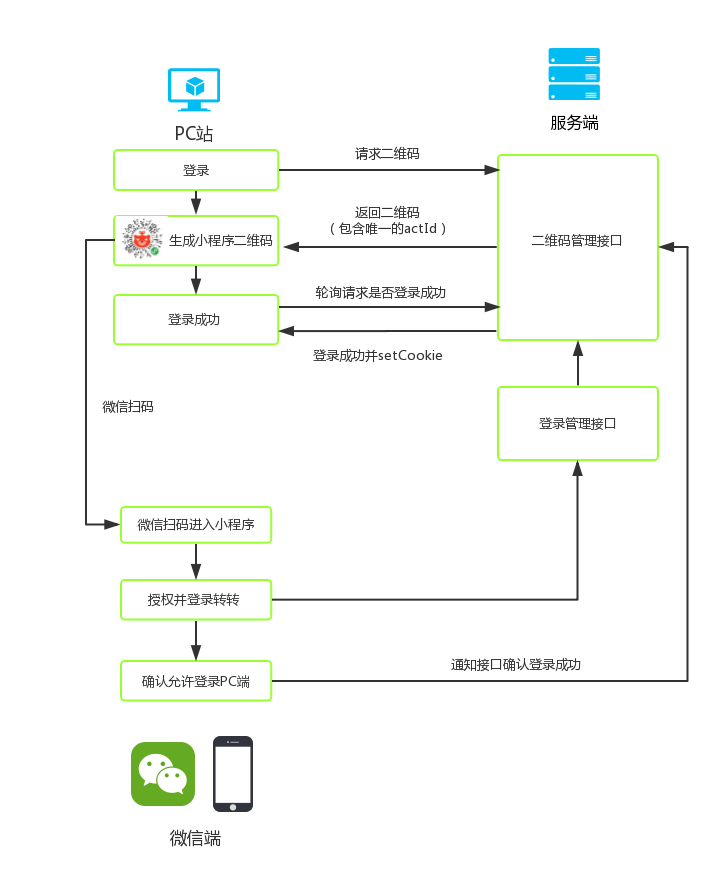

# 微信小程序使用场景延伸：扫码登录、扫码支付 #
> 小程序最适合的使用场景有哪些？相比大家能列举出来很多，但这个场景，大家可能多数没想到^_^

笔者团队近期接到了一个PC项目：转转游戏租号PC官网，该项目要求在PC端实现整个交易流程，问题来了，我司（转转）一直深耕于移动端，在PC端几乎啥都没有，甚至都没有个像样的登录流程、购买流程...当大家在探讨如何接入微信授权登录、微信扫码支付等一大套流程之际，笔者力排众议，机智的提出：为什么不用小程序来实现这些功能！

> 备注：『转转官方』是我司开发的一款小程序，实现了APP80%的功能和体验，有完善的交易流程。

使用了小程序来替代微信官方的授权登录和扫码支付模式，极大程度降低了开发成本，又能将小程序的服务场景得以延伸，何乐而不为呢？
## 体验网址 ##
http://game.zhuanzhuan.com （VUESSR实现）

## 扫码登录 ##
**注意：是用微信扫小程序码，直接打开小程序，而不是用小程序来扫码**

实现方案：

效果演示：

【视频】

## 扫码支付 ##
**注意：是用微信扫小程序码，直接打开小程序，而不是用小程序来扫码**

实现方案：

支付效果请到我司网站体验：http://game.zhuanzhuan.com

##值得一提##
### 1、生成小程序二维码 ###
微信提供了三个接口来生成小程序码，其中只有一个接口可以生成大量二维getwxacodeunlimit，但该接口的问题是携带的参数只能编码32个可见字符，很多情况下，携带的参数都会超过限制。

**解决策略：**
前端调用后台接口的时候，接口会把参数存储起来，并生成一个18位的ID，将这个ID编码到二维码里，进入小程序后，在从另一个接口通过ID把参数换回来

###2、多种扫码操作能力提供 ###
后端接口给每个二维码生成一个actId，不同的扫码操作完成后小程序端会调用不同逻辑，最终各个逻辑都会汇总完成状态关联到actId上，PC端上只需要轮询请求扫码结果接口判断是否操作成功即可，因此该业务可用于各种扫码操作上，比如现在已经实现的扫码管理订单、扫码联系卖家等（我司深入践行MVP模式，因此在尝试阶段不想在PC端上造一大堆交易流程、IM等的轮子）

###3、不足###
PC端验证扫码操作是否成功,由于后端不支持socket方式目前使用的是轮询的方式，从性能角度来看并不好，未来实现socket方式就更赞了

##总结：##
可以看出PC结合小程序还是比较流畅的，体验上和微信扫码授权登录、微信扫码支付基本一致，但通过对接小程序，节省了团队大量开发成本，同时又给小程序提高了单量~~

虽然业界当前并不看好小程序发展，但从开发者的角度来讲，小程序越来越完善，微信提供的能力和支持越来越多，小程序未来会有更广阔的空间~
