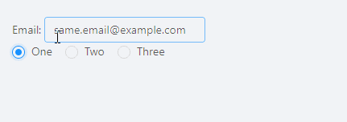
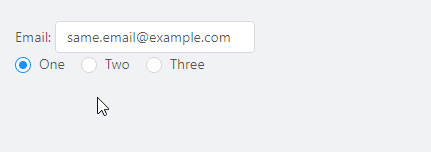
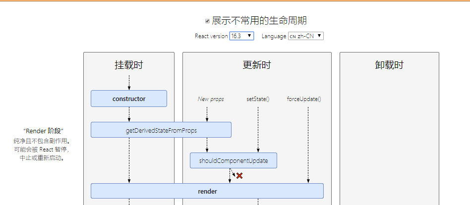
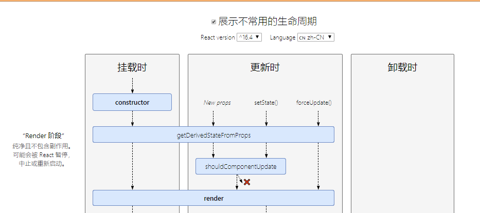

因为最近在做一个逻辑较为复杂的需求，在封装组件时经常遇到父组件props更新来触发子组件的state这种情景。在使用[componentWillReceiveProps](https://zh-hans.reactjs.org/docs/react-component.html#unsafe_componentwillreceiveprops)时，发现React官网已经把componentWillReceiveProps重名为UNSAFE_componentWillReceiveProps，但是我发现了[getDerivedStateFromProps](https://reactjs.org/docs/react-component.html#static-getderivedstatefromprops)可以替代，却又被一篇[博客](https://reactjs.org/blog/2018/06/07/you-probably-dont-need-derived-state.html)告知这个也尽量别使用。因为组件一旦使用派生状态，很有可能因为没有明确的数据来源导致出现一些bug和不一致性。既然提倡避免使用，肯定也会有相应的解决方案。

本文会介绍以上两种生命周期的使用方法、误区和替代升级方案。
### componentWillReceiveProps
#### 1.介绍   
componentWillReceiveProps是React生命周期函数之一，在初始props不会被调用，它会在组件接受到新的props时调用。一般用于父组件更新状态时子组件的重新渲染。  
在react16.3之前，componentWillReceiveProps是在不进行额外render的前提下，响应props中的改变并更新state的唯一方式。
#### 2.使用方法  
```javascript
  componentWillReceiveProps(nextProps) {
    //通过this.props来获取旧的外部状态,初始 props 不会被调用 
    //通过对比新旧状态，来判断是否执行如this.setState及其他方法
  }
```
主要在以下两种情景使用：
> 1. 从上传的props无条件的更新state  
> 2. 当props和state不匹配时候更新state  
#### 3.常见误区
无条件的更新state

```
class EmailInput extends Component {
  state = { email: this.props.email };

  componentWillReceiveProps(nextProps) {
    // 这样会覆盖内部 email的更新!
    this.setState({ email: nextProps.email });
  }

  handleChange = event => {
    this.setState({ email: event.target.value });
  };

  render() {
    return <input onChange={this.handleChange} value={this.state.email} />;
  }
}

```
从上述例子可以发现子组件的更新会被父组件的更新覆盖。并且大家在使用过程没有必要这样无条件更新，完全可以写成一个完全受控组件。
```javascript
<input onChange={this.props.onChange} value={this.props.email} />
```
也可以对比新旧props状态:
```javascript
  componentWillReceiveProps(nextProps) {
    if (nextProps.email !== this.props.email) {
      this.setState({ email: nextProps.email });
    }
  }
```
现在该组件只会在props改变时候覆盖之前的修改了，但是仍然存在一个小问题。  
例如一个密码管理网站使用了如上的输入组件。当切换两个不同的账号的时候，如果这两个账号的邮箱相同，那么我们的重置就会失效。因为对于这两个账户传入的email属性是一样的，即数据源相同。效果如下：  


```javascript
父组件：
import React, { Component, Fragment } from 'react';
import { Radio } from 'antd';
import UncontrolledInput from './UncontrolledInput';
const accounts = [
  {
    id: 1,
    name: 'One',
    email: 'same.email@example.com',
  },
  {
    id: 2,
    name: 'Two',
    email: 'same.email@example.com',
  },
  {
    id: 3,
    name: 'Three',
    email: 'other.fake.email@example.com',
  }
];
export default class AccountList extends Component {
  state = {
    selectedIndex: 0
  };

  render() {
    const { selectedIndex } = this.state;
    return (
      <Fragment>
        <UncontrolledInput email={accounts[selectedIndex].email} />
        <Radio.Group onChange={(e) => this.setState({ selectedIndex: e.target.value })} value={selectedIndex}>
          {accounts.map((account, index) => (
            <Radio value={index}>
              {account.name}
            </Radio>
          ))}
        </Radio.Group>
      </Fragment>
    );
  }
}
//子组件
import React, { Component } from 'react';
import { Input } from 'antd';
export default class UncontrolledInput extends Component {
  state = {
    email: this.props.email
  };

  componentWillReceiveProps(nextProps) {
    if (nextProps.email !== this.props.email) {
      this.setState({ email: nextProps.email });
    }
  }

  handleChange = event => {
    this.setState({ email: event.target.value });
  };

  render() {
    return (
      <div>
        Email: <Input onChange={this.handleChange} value={this.state.email} />
      </div>
    );
  }
}
```
从id为1的账户切换到id为2的账户，因为传入的email相同（nextProps.email === this.props.email），输入框无法重置。从id为2的账户切换到id为3的账户，因为传入的email不同，进行了输入框的重置。  
大家可能想到，既然需要切换账户就重置，那就把id或者selectedIndex选中项作为判断重置条件。

```javascript
//父组件引入子组件方式
<UncontrolledInput email={accounts[selectedIndex].email} selectedIndex={selectedIndex} />
//子组件
  componentWillReceiveProps(nextProps) {
    if (nextProps.selectedIndex !== this.props.selectedIndex) {
      this.setState({ email: nextProps.email });
    }
  }
```


其实当使用唯一标识符来判来保证子组件有一个明确的数据来源时，我们使用key是获取是最合适的方法。并且不需要使用componentWillReceiveProps，只需要保证每次我们每次需要重置输入框时候可以有不同的key值。

```
//父组件
<UncontrolledInput email={accounts[selectedIndex].email} key={selectedIndex} />  
```
每当key发生变化，会引起子组件的重新构建而不是更新。当我们切换账户，不再是子组件而是重新构建，同样的达到了重置的效果。  
但是还有一个小问题，当我们在一个账户做了更改之后，切换到其他账户并切换回来，发现我们的之前的更改不会缓存。这里我们可以将输入框设计为一个完全可控组件，将更改的状态存在父组件中。
```
//父组件
export default class Release extends Component {
  state = {
    selectedIndex: 0,
    valueList: [...accounts]
  };
  onChange = (event) => {
    const { valueList, selectedIndex } = this.state;
    valueList[selectedIndex].email = event.target.value;
    this.setState({ valueList: [...valueList] });
  }
  render() {
    const { selectedIndex, valueList } = this.state;
    return (
      <Fragment>
        <UncontrolledInput email={valueList[selectedIndex].email} onChange={this.onChange} />
        <Radio.Group onChange={(e) => this.setState({ selectedIndex: e.target.value })} value={selectedIndex}>
          {valueList.map((account, index) => (
            <Radio value={index}>
              {account.name}
            </Radio>
          ))}
        </Radio.Group>
      </Fragment>
    );
  }
}
//子组件
export default class UncontrolledInput extends Component {
  state = {
    email: this.props.email
  };

  render() {
    return (
      <div>
        Email: <Input onChange={this.props.onChange} value={this.props.email} />
      </div>
    );
  }
}
```


### 替换方案：getDerivedStateFromProps 
#### 1.介绍  
React在版本16.3之后，引入了新的生命周期函数getDerivedStateFromProps  
需要注意的一点，在React 16.4^ 版本中getDerivedStateFromProps 比 16.3 版本中多了setState forceUpdate 两种触发方法。  



详情请看官方给出的[生命周期图](http://projects.wojtekmaj.pl/react-lifecycle-methods-diagram/)。
#### 2.使用  
```javascript
static getDerivedStateFromProps(nextProps,prevState){  
    //该方法内禁止访问this
    if(nextProps.email !== prevState.email){  
        //通过对比nextProps和prevState，返回一个用于更新状态的对象
        return {        
            value:nextProps.email      
        }    
    }    
    //不需要更新状态，返回null
    return null
}
```
如果大家仍需要通过this.props来做一些事，可以使用componentDidUpdate
```javascript
componentDidUpdate(prevProps, prevState, snapshot){  
    if(this.props.email){    
    // 做一些需要this.props的事  
    }
}
```
通过以上使用方法，React相当于把componentWillReceiveProps拆分成getDerivedStateFromProps和componentDidUpdate。拆分后，使得派生状态更加容易预测。

#### 3.常见误区
当我们在子组件内使用该方法来判断新props和state时，可能会引起内部更新无效。
```
//子组件
export default class UncontrolledInput extends Component {
  state = {
    email: this.props.email
  };

  static getDerivedStateFromProps(props, state) {
    if (props.email !== state.email) {
      return {
        email: props.email
      };
    }
    return null;
  }

  handleChange = event => {
    this.setState({ email: this.props.email });
  };

  render() {
    return (
      <div>
        Email: <Input onChange={this.handleChange} value={this.state.email} style={style} />
      </div>
    );
  }
}
```
这是因为在 React 16.4^ 的版本中，setState 和 forceUpdate 也会触发getDerivedStateFromProps方法。当我们尝试改变输入框值，触发setState方法，进而触发该方法，并把 state 值更新为传入的 props。  
虽然在getDerivedStateFromProps中，不能访问this.props，但是我们可以新加个字段来间接访问this.props进而判断新旧props。

```
export default class UncontrolledInput extends Component {
  state = {
    email: this.props.email,
    prevPropEmail: ''
  };

  static getDerivedStateFromProps(props, state) {
    if (props.email !== state.prevPropEmail) {
      return {
        email: props.email,
        prevPropEmail: props.email,
      };
    }
    return null;
  }

  handleChange = event => {
    this.setState({ email: this.props.email });
  };

  render() {
    return (
      <div>
        Email: <Input onChange={this.handleChange} value={this.state.email} style={style} />
      </div>
    );
  }
}
```

通过上一个props.email来判断是否更新，而不是通过state的状态。虽然解决了内部更新问题，但是并不能解决componentWillReceiveProps中提到的多个账户切换无法重置等问题。并且这样写的派生状态代码冗余，并使组件难以维护。
### 升级方案
我们在开发过程中很难保证每个数据都有明确的数据来源，尽量避免使用这两个生命周期函数。结合以上例子以及官网提供的方法，我们有以下升级方案：  
**1.完全受控组件（推荐）**  
**2.key标识的完全不可控组件（推荐）**  
使用React的key属性。通过传入不同的key来重新构建组件。在极少情况，你可能需要在没有合适的ID作为key的情况下重置state，可以将需要重置的组件的key重新赋值为当前时间戳。   
虽然重新创建组件听上去会很慢，但其实对性能的影响微乎其微。并且如果组件具有很多更新上的逻辑，使用key甚至可以更快，因为该子树的diff得以被绕过。  
**3.通过唯一属性值重置非受控组件。**   
因为使用key值我们会重置子组件所有状态，当我们需要仅重置某些字段时或者子组件初始化代价很大时，可以通过判断唯一属性是否更改来保证重置组件内部状态的灵活性。  
**4.使用实例方法重置非受控组件。**   
当我们没有合适的特殊属性去匹配的时候，可以通过实例方法强制重置内部状态

```
  //父组件
  handleChange = index => {
    this.setState({ selectedIndex: index }, () => {
      const selectedAccount = accounts[index];
      this.inputRef.current.resetEmailForNewUser(selectedAccount.email);
    });
  };
  //子组件
    resetEmailForNewUser(defaultEmail) {
    this.setState({ email: defaultEmail });
  }
```

### 总结
升级方案不仅仅以上几种，例如当我们仅仅需要当props更改进行数据提取或者动画时，可以使用componentDidUpdate。还可以参考官网提供的[memoization(缓存记忆)](https://reactjs.org/blog/2018/06/07/you-probably-dont-need-derived-state.html#what-about-memoization)。但是主要推荐的方案是完全受控组件和key值的完全不受控组件。当无法满足需求的特殊情况，再使用其他方法。  
总之，componentWillReceiveProps/getDerivedStateFromProps是一个拥有一定复杂度的高级特性，我们应该谨慎地使用。