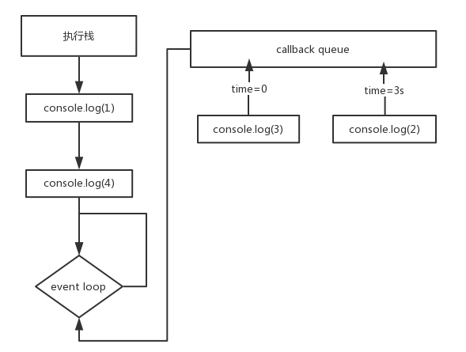

# Event Loop浅谈
> event loop 即事件循环。最初了解到js的event loop机制是通过自己对js中异步、同步的疑惑。今天聊一聊自己的理解，希望和大家一起学习。

首先，让我们看一个经典的setTimeOut的问题
```
console.log(1)
setTimeOut(function(){
    console.log(2)
},1000)
setTimeOut(function(){
    console.log(3)
},0)
console.log(4)
```
　　浏览器打印的结果是怎样的呢？大家可以写一段脚本试一下，打印的结果是1，4，3，2；为什么不是按照js从上到下的执行顺序，输出1，3，4，2呢？这就要说到我们今天的主题，js的事件循环机制了。

　　想要了解event loop我们就要从js的工作原理说起。首先，大家都知道js是单线程的。所谓单线程就是进程中只有一个线程在运行。那么，js为什么是单线程而不是做成多线程的呢？个人理解，js是用来实现浏览器与用户之间的交互的。如果同时要处理用户点击，用户输入，用户关闭等操作，浏览器无法知道这个时间我到底应该做什么。所以js是从上至下按顺序运行下去的。这里谈及到两个名词，线程和进程。简单介绍：进程，可以理解为正在运行的程序的实体。例如，在手机中打开一个app，打开了一个后台进程。那么，线程又是什么呢？线程是程序执行流的最小单位，也叫轻量级的进程。是程序执行的过程中，一个单一的顺序控制流程。一个进程中，包含很多的线程。单线程，程序执行的过程中，所走的程序路径按照连续的顺序排下来。前面的必须处理好，后面的才会执行。

　　按照单线程的思想，顺序执行我们的代码，那么，如果我们的js中间向后台发送一个ajax请求，就要等到请求等到结果后才会继续向下执行。如果请求耗时10秒，页面就要停在这里10秒。这样的用户体验很不好。。。因此，就有了同步任务、异步任务的区别。所谓异步任务，就好比我们在烧水的同时看书，等到水烧好了，再用烧好的水煮面。这就是一个简单的异步操作。异步可以提高处理事件的效率。异步任务就可以解决单线程按照顺序依次执行，不可以同时进行多个任务的问题。

　　同步任务和异步任务在js中是如何执行的呢？js的代码运行会形成一个主线程和一个任务队列。主线程会从上到下一步步执行我们的js代码，形成一个执行栈。同步任务就会被放到这个执行栈中依次执行。而异步任务被放入到任务队列中执行，执行完就会在任务队列中打一个标记，形成一个对应的事件。当执行栈中的任务全部运行完毕，js会去提取并执行任务队列中的事件。这个过程是循环进行的，这就是我们今天想要了解的event loop。

　　这里简单粗暴的理解一下异步任务，什么样的任务会被放到任务队列中呢？简单理解，有callback函数的就可以被看做是异步任务，会被放到任务队列中执行。大家可能在使用vue的时候用到过$nextTick方法，这个方法的主要目的就是把事件直接插入到执行栈的最后，而不是放入到任务队列中去执行。这个执行流程就变成了执行栈的任务——>$nextTick——>任务队列。

　　我们回过头再来看一下最开始提到的问题。console.log(1)和console.log(4)在主线程的执行栈中执行完，此时，执行栈被清空，js开始执行任务队列中的两个setTimeOut事件。先执行延迟时间设置为0秒的setTimeOut打印出3，再执行1秒的setTimeOut事件，打印出2。最后的输出结果就是1、4、3、2

   因为js的event loop机制，所以大家不要认为setTimeOut设置的事件到了延迟时间就是被执行。如果你的执行栈任务没有被全部执行完，清空。setTimeOut事件执行的时间很有可能是要大于你设置的延时参数。

   通过了解js的实现基础和它的执行顺序，进一步让我理解里eventloop的工作原理。脑子里有了一个执行机制的大概流程。通过开头的setTimeout引出了事件循环的概念，随着ES6的广泛应用。同样解决异步问题的Promise对象，可以通过它的链式写法，达到写同步代码的手法实现异步任务的效果。那么，Promise和setTimeout在事件队列里是否一样呢？
```
console.log(1);

setTimeout(function() {
  console.log(2);
}, 0);

Promise.resolve().then(function() {
  console.log(3);
}).then(function() {
  console.log(4);
});

console.log(5);
```

   这段js执行的结果是1，5，2，3，4么？大家可以尝试一下。根据上面得到的结论，首先输出的应该是1，5，因为console.log(1)和console.log(5)是执行栈里的同步任务，完成后才进行事件循环。那么setTimeout和Promise的执行顺序是怎样的呢？

   这里就要引入两个新名词，microtask、macrotask。即宏任务和微任务。

   宏任务：
   需要多次事件循环才能执行完，事件队列中的每一个事件都是一个宏任务。浏览器为了能够使得js内部宏任务与DOM任务有序的执行，会在一个宏任务执行结束后，在下一个宏执行开始前，对页面进行重新渲染 （task->渲染->task->…）鼠标点击会触发一个事件回调，需要执行一个宏任务，然后解析HTML。setTimeout的作用是等待给定的时间后为它的回调产生一个新的宏任务。

   微任务：
   微任务是一次性执行完的。微任务通常来说是需要在当前task执行结束后立即执行的任务，例如对一些动作做出反馈或者异步执行任务又不需要分配一个新的task，这样便可以提高一些性能。只要执行栈中没有其他的js代码正在执行了，而且每个宏任务都执行完了，微任务队列会立即执行。如果在微任务执行期间微任务队列加入了新的微任务，会将新的微任务加入队列尾部，之后也会被执行。简单理解，宏任务在下一轮事件循环执行，微任务在本轮事件循环的所有任务结束后执行。

   宏任务主要包括了：setTimeout、setInterval、setImmediate、I/O、各种事件（比如鼠标单击事件）的回调函数

   优先级：主代码块 > setImmediate > MessageChannel > setTimeout / setInterval

   微任务主要包括了：process.nextTick、Promise、MutationObserver

   优先级：process.nextTick > Promise > MutationObserver

   看到这里，想必大家已经得到了上面代码块的执行结果。对于事件循环机制粗浅的介绍到这里，希望能帮助到大家。如果文中哪里阐述有问题，还请各位大神多多指点。