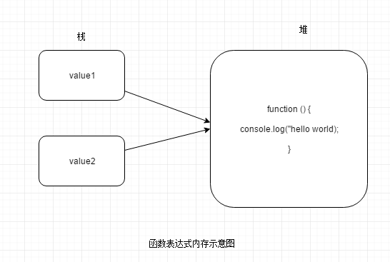

在学习JavaScript的过程中，你是不是也遇到过这样的情况：看比人的代码感觉看懂了，过段时间回来再看，似乎又看不懂了，自己动手去写的时候，又不知该如何下手，怎么破？俗话说：好记性不如烂笔头，看的多，写的少，容易产生一种错觉，觉得很简单。
###如何定义函数
1、函数声明
> 使用function关键字来声明一个函数，在关键字之后要定义函数名、形参以及函数体。
```
function hello () {
    console.log('hello world');
}
```
2、函数表达式
> 函数作为Function类型的实例，也就是一个对象，那么函数名便可以认为是一个指针，指向内存中存放函数的区域。这种方法是把匿名函数赋值给一个变量。
```
var hello = function() {
  console.log('hello world');
};
```
这两种方法有个细微的区别：使用函数表达式定义函数的时候，在函数末尾需要加上分号，跟声明其他变量一样，使用函数表达式定义函数也是相当于声明了一个变量，只不过这个变量的值比较特殊，是函数。

既然函数是个对象，那它就不会跟某个变量绑定在一起，而是可以赋值给多个变量即多个变量指向同一个函数。

当把函数赋值给一个变量的时候，只是把函数在内存中的地址赋值给了变量，可以赋值给多个变量，从而可以通过多个变量去调用函数。
### 函数如何调用
定义好的函数，在使用过程中，我们应该注意什么呢？
1、通过函数名称和参数调用

上面定义的函数就可以通过函数表达式和()来调用：
```
hello();
```
是不是很简单啊~~~试想一下，如果把变量hello替换成刚才定义的函数，像下面这样：
```
function() {
  console.log('hello world');
}()
```
会发生什么呢？很遗憾，浏览器在解析的时候报错了，为什么呢？原来，浏览器遇到function关键字的时候会认为这是一个函数声明，函数声明必须包括：关键字function、函数名、形参、函数体。在解析上面代码的时候，解析器发现没有出现函数名而直接出现了()，浏览器便会认为这种定义不符合规范，所以就报错了呗。
既然是缺少函数名，那如果我们给它添加函数名，是不是会正确调用呢？
```
function hello (){
    console.log('hello world');
}()
```
静静等待奇迹出现~~~咦？浏览器在解析的时候怎么又报错了呢？想一想，函数声明是不是有个特权----函数声明提升，也就是说通过函数声明方式声明的函数会被提升到其他代码的前面，提升之后是不是就是这样了：
```
function hello () {
    console.log('hello world');
}
 .... //我们在业务中编写的除了函数之外的其他代码
 
 (); // 咦？这是什么东东？
```
解析器对此也很茫然，不知道该按照声明标准去解析了，只能告诉你写的不够规范了~

继续对上面的函数调用做一些改变，如果我们把函数用()包裹起来，然后再执行，会不会调用成功呢？
```
(function() {
  console.log('hello world');
})();
```
呦呵，调用成功了诶~这是为什么呢？用()把匿名函数包裹起来，解析器便会认为这是一个函数表达式，函数表达式的后面添加()当然可以正确执行了。此外，除了()之外,也可以使用!、~等常见的一元运算符来执行匿名函数。

一般情况下，this指向调用函数（方法）的对象。直接调用函数，可以认为是全局对象在调用函数，则函数内部的this指针是指向Global对象，在浏览器中便是指向window对象。
```
function hello () {
       console.log(this); // window
   }
```

2、作为构造函数来使用

在其他语言中可以通过类实现面向对象的功能，但是在ES6规范公布之前，JavaScript中并没有类的概念，面向对象的语法只能通过构造函数的方式来实现。
```
function Phone (name, size) {
    this.name = name;
    this.size = size;
}
Phone.prototype.getInfo = function () {
   return {
            name: this.name,
            size: this.size
           }
 }
```
要的到对象，必须使用new关键字
```
    var phone = new Phone('iPhoneX',5.8);

```


3、作为对象的方法
```var obj = {
    name: 'Bob',
    getName: function (){
     console.log(this);//{name: "Bob", getName: ƒ},指向obj对象
    }
}
```
### 改变函数的作用域
每一个函数都有2个比较重要的改变作用域的方法：apply和call，通过这两个方法，可以改变函数中this的指向。主要的区别是传递参数的方法不同，apply接收数组或者类数组（arguments对象），而call只能逐个传递需要的参数。在记忆的时候可以通过首字母来区分，由于数组array的第一个字母也是a，所以可以据此记忆applay接收数组作为参数。
在学习比人代码的过程中，看到有这么个写法：Array.prototype.slice.call()，根据以上内容来，我们来一步一步来揭开它神秘的面纱吧。


**必备知识**
> arrayObject.slice(start,end)

该方法可以返回一个新的数组，并不会修改原来的数组。新数组中包含start 到 end （不包括该元素）的所有元素。
> function.call()

上面我们也说了call方法的用途，该方法改变了函数的作用域，在传递参数的时候需要逐个列出即将传递的参数。
> arguments对象

该对象保存了传递给函数的所有实参，因为有这个对象的存在，实参和形参的个数不相同也不会出错。该对象只是与数组类似，并不是真正的数组类型，但是可以使用方括号语法访问每一个元素，使用length来确定传递进来多少个参数。
 
 > Array.prototype.slice.call()
 
 这个方法可以理解为：改变数组的slice方法的作用域，在指定的作用域中去调用slice方法。call()方法的第一个参数指定方法运行的作用域，从第二个参数开始传递slice方法所需要的参数。
 
 **整合**
 Array.prototype.slice.call(arguments)能将具有length属性并且key值为数字的对象转成数组。[]是Array的实例，所以可以直接访问定义在原型上的方法。
 
 ```
var obj = {0:'hello',1:'world',length:2};
console.log(Array.prototype.slice.call(obj,0));//["hello", "world"]
```
arguments对象可以认为与上述对象类似，所以可以把arguments对象转换成数组。
如果对象没有length属性，那么浏览器会怎么解析呢？

```
var obj = {0:'hello',1:'world'};//没有length属性
console.log(Array.prototype.slice.call(obj,0));//[]
```
 ### ES6中函数的变化
 1、箭头函数
 在ES6语法中，可以使用=> 来定义函数，这样定义函数使得表达更加的精简。
 ```
    () => {
        console.log('hello');
    }
```
()中是声明函数时的形参，{}中是函数体。
箭头函数和以前用function声明的函数有什么区别呢？
- this的对象指向比较固定，在定义函数的时候，this的指向就已经确定了，指向定义函数时所处的对象。这一点在传递回调函数时尤为明显。其实，箭头函数并没有属于自己的this，从而使得函数内部的this就是外层环境中的this。
- 箭头函数不能用作构造函数。很明显，箭头函数没有属于自己的this对象，所以，无法作为构造函数去使用。
- 箭头函数没有arguments对象，箭头函数内部的arguments对象时指向外层函数的arguments对象。

 2、使用class语法来实现面向对象
 在ES6之前，使用构造函数来创建对象，阅读起来并不是很清晰。ES6提供的class语法跟其他面向对象的语言语法较为接近。
 使用ES6的语法来改写一下上面用构造函数定义的“类”。
 ```
 class Phone {
    constructor (name, size) {
        this.name = name;
        this.size = size;
    }
    getInfo () {
        return {
                 name: this.name,
                 size: this.size
                }
    }
    
 }
 let phone = new Phone('iPhone',5.8);
```
看起来是不是特别像C++语言中的面向对象风格呢~~~


希望这些总结能解决你的一些疑惑~~~学习JavaScript是一个渐进的过程，除了自己多做总结之外，还可以去社区中去回答别人提出的问题，不断给自己正向鼓励。骐骥一跃，不能十步，驽马十驾，功在不舍。多总结，多做笔记，多思考，不断踩坑，不断填坑，每天进步一点点，不断提高自己的专业技能。