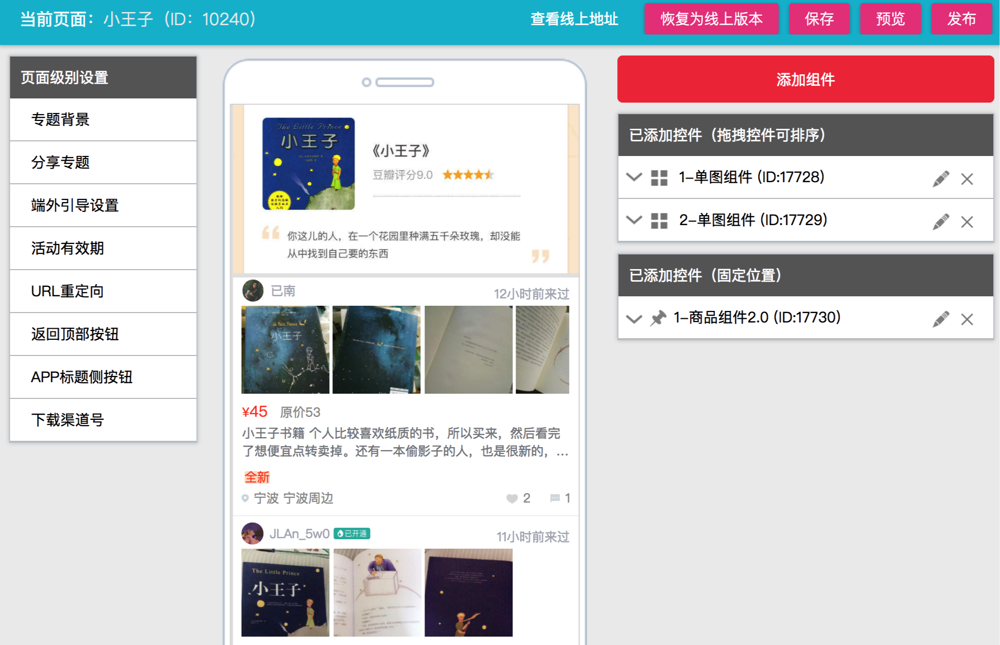
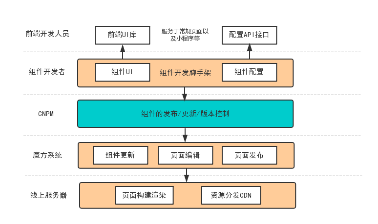
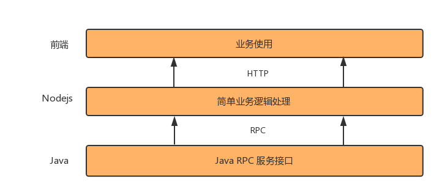

## 背景  
转转作为一个初创公司，在成长过程中，面临着大量的运营活动页面以及MVP(minimum viable product，最小可执行产品)项目。这类项目技术上虽然没有多复杂，但却让我们头疼不已，主要有这几个原因:
 - 项目开发时间短，上线时间比较急
 - 需求修改往往较为频繁
 - 有明确的下线时间，没机会做迭代优化

项目的这些特点，在前期给了我们很大的压力。马不停蹄的上线，频繁的修改，技术的成长等，都让我们有了一些疲惫。  
后来，经过了半年的磨砺，渐渐的我们沉淀出了一些工具与经验，来从容的应对这类型项目，话不多说，先来看看我们的整体技术架构图  

  

图画的比较糙，下面我们仔细讲解一下  

## 运营技术能力架构解读  
首先是通用需求模板，虽说这和前端技术没太大关系，但实践证明，协助产品整理出一个需求模板至关重要。因为项目着急时候，总是容易出现需求遗漏或不清晰的情况，如果后期修改的话，成本会很高。我们早期时候也总是会遇到遗漏埋点统计以和遗漏投放平台的兼容性一类的需求。自从有了固定模板后，这类问题得到了根本的改善。  
UI部分，我们使用Photoshop作为主要的切图工具，辅佐以Cutterman，借助其快捷的图层和组操作，实现了切图效率的提升。  

### 业务技术部分
大部分运营类项目都有一定的模式，所以我们开发了一个组件化页面生成系统，取名“魔方”。这个系统可以支撑我们绝大部分运营类页面的自动生成，运营人员可以使用魔方自己搭建个性化页面，让开发成本直接降到**0**，后面我们会重点讲下这个系统，这里就先不细讲了~  

除了相对较为标准的模板型页面，我们也会碰到许多个性化运营页面需求，对于这部分需求，我们做了以下工具/库来保证业务的快速开发:
- 项目脚手架
- React UI库
- 终端API适配库  

脚手架是我们得以快速开发的利器，现代前端开发越来越复杂，项目的前期搭建成本已经不低，一个好的种子项目(project-seed)，可以让开发的时候只需要关注核心业务，无需被繁琐的配置干扰。  
UI库也是必需品，各个公司通常都会有一个自己的业务UI库。可能封装的不是那么完美，但一定能解决大部分业务问题。  
终端API适配库主要是解决页面容器的接口统一问题，比如设置分享信息。微信/微博/手Q以及我们自己的APP等都不一样，需要有个库来适配这些。  

除了前端页面部分，我们还使用了**Nodejs**开发部分业务的后端接口，实践发现，针对某些后端逻辑较弱的业务，使用Noejs可以让我们的效率得到很大的提升，这点后面我们也会具体讲下。

## 组件化开发平台
运营类项目应该优先使用模板生成，这已是一个业界的共识，剩下的问题就是如何开发一个页面模板平台了。先瞅一眼我们的组件化开发平台吧。  
  
UI比较简陋，但功能还是很健全的= =!。操作起来也很简单，以组件为维度，运营人员添加/编辑组件，预览无误后，最后发布页面，服务器会根据运营配置的信息，进行页面的构建，最后把构建结果分发到相应的服务器，就实现了一个页面的发布。  

说完了使用层面，我们再聊聊技术层面的东西。  
在前端组件化开发的大潮下，我们以组件为维度开发了这个平台。  

在我们看来，页面就是由各个组件来组成，一个组件就像一个函数，它接收数据，返回页面。运营人员在我们的平台选择组件，其行为类似于import一个包，然后编辑配置，也就是给组件传入数据，当确定组件和数据之后，我们自然可以把组件渲染出来。  

确定了组件的模式之后，随之而来的第一个问题，便是组件的存储形态。  
一个组件，它应该是一个JSX文件？还是一个NPM包？又或者是别的什么？这个问题让我们产生了纠结。  
在经过了激烈的讨论之后，我们最后决定使用NPM包来表述一个组件。依托于NPM完善的发布/拉取，以及版本控制机制，可以让我们少做一些额外的工作，快速的把平台搭建起来。当这点确定之后，我们的整个开发流程就是这样：  
1. 开发人员使用我们的组件脚手架来开发组件，一个组件通常包括UI显示部分与配置部分，当开发完成时，便可以把组件发布在我们的私服npm上。
2. 进入魔方组件管理页面，添加该组件，得益于Webpack的动态加载机制，运营人员在接下来的页面设计中可以使用该组件。
3. 在魔方中新建一个页面，添加我们刚刚更新的组件，然后进行一系列的配置。
4. 发布该页面，魔方的后台Server会根据配置信息，比如使用了哪些组件，每个组件的配置等，导出一个JSON文件。根据JSON文件，调用脚本，然后使用Webpack去构建出页面，最后分发到服务器。因为是在服务端构建生成页面，这样也节省了用户打开页面时，拉取初始化配置信息接口的过程，大大减少了白屏时间。  

最后我们再看一看魔方系统的技术架构图吧  
  
这是我们系统目前架构图，支撑了我们部分运营类型页面，由组件为核心，一方面组件和UI库打通，另一方面配置部分导出API，可以提供给其余端用（小程序、RN、客户端等）。然后魔方平台通过CNPM拉取组件，给运营人员提供一个可视化页面编辑平台。  
魔方系统我们还在不断的迭代中，它肯定有很多设计不好的地方，十分欢迎大家一起来讨论。  

## Nodejs中间层  
现在越来越多的公司使用Nodejs，目的各异。  
我们也使用了Nodejs，其中一个目的在于提高个性化运营项目的开发效率。  
我们大部分运营项目，对于后端的需求并不高。通常是做一些简单的存储和调用一下底层的服务，比如领红包，抽奖，查询商品等。这些服务都有成熟的底层接口，所以在应用层来说，逻辑就十分的少了。RD来做的话，可能半天一天开发完了，但是要花更多的时间在需求评审沟通，测试上线验收等阶段，十分浪费时间。如果这部分逻辑如果交由FE用Nodejs实现，可以有效减少沟通联调时间，更重要的是节省了人力。  
我们项目后端使用的是JAVA，所以这里我们做了一层Nodejs中间层，来实现了Nodejs与Java的互通。  
  
关于Nodejs和Java交互方式，我们之前写过一篇文章，感兴趣可以看看[实战系列之Node.js玩转Java](https://mp.weixin.qq.com/s?__biz=MzU0OTExNzYwNg==&mid=2247483944&idx=1&sn=57f68d4de321a3928c9b2016bbac24df&chksm=fbb589e1ccc200f7912d81ad40385c3a55f5bc2bcfa35e1a10a5aaf863de6f67fff8ea500b2a#rd)

## 前端监控
运营类项目追求效率，这样很容易导致质量不佳。前期我们往往把质量完全寄托于QA的把关以及开发人员的技术水平，但长远来看，线上页面的监控也是一个不可或缺的角色。  
监控主要有两方面  
- 性能监控
- 异常监控

性能监控能很好的帮我们把关页面的性能，转转FE支撑团队研发了一套性能监控系统。以插件的形式，在入口文件引入后，会通过高阶组件形式，Hook页面组件的生命周期。通过Performance API，获得各个阶段的数据，通过埋点的方式，向后台发送数据，并展示。  
异常监控部分，以Webpack插件的形式，在生成HTML的时候，给代码加上错误监控sdk，并格式化错误信息，发送给后台展示。原理是使用window.onerror监听页面的错误。这里面也会需要处理一些问题，比如跨域script的错误捕捉，压缩代码使用sourcemap的还原等。  

## 后记
以上这些就是我们高效开发运营类活动的经验了。对于成熟的公司来说，这些系统可能很早就有了，并且十分强大。但对于转转来说，一切还需要我们根据实际业务一步步完善。  
效率是一个永恒的话题，下个阶段，我们会针对更多元化的页面（比如动画类），去找出它们的通用点，沉淀下来，让我们的效率得到更高的提升，也欢迎大家一起来交流。

