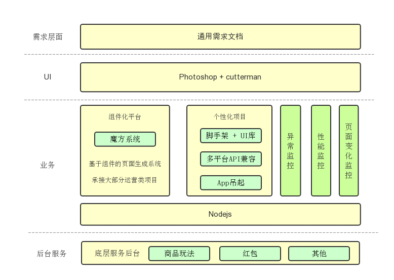

## 背景  
转转作为一个初创公司，在成长过程中，面临着大量的运营活动页面以及MVP(minimum viable product，最小可执行产品)项目。这类项目虽然谈不上技术上有多复杂，但是它们有自己的特点，让我们头疼不已。
 - 项目开发时间短，上线时间比较急
 - 需求修改往往较为频繁
 - 有明确的下线时间，没机会做迭代优化

项目的这些特点，在前期给了我们很大的压力。马不停蹄的上线，频繁的修改，技术的成长等，都让我们有了一些疲惫。  
后来，经过了半年的磨砺，渐渐的我们沉淀出了一些工具与经验，来从容的应对这类型项目，话不多说，先来看看我们的整体技术架构图  

  

图画的比较糙，下面我们仔细讲解一下  

## 运营技术能力架构解读  
首先是通用需求模板，虽说这和我们前端技术没太大关系，但实践证明，协助产品整理出一个需求模板至关重要。因为项目着急时候，总是容易出现需求遗漏或不清晰的情况。前期我们有些需求总是会出现忘记给技术说数据统计的 需求，又或者忘记说这次页面会投放到某个APP中等等。自从有了模板后，这类问题得到了根本的改善。  
UI部分，我们使用Photoshop作为主要的切图工具，辅佐以Cutterman

解析部分技术架构
如何解决大部分模块化页面
如何解决小部分非模块化页面

基础工具
UI库 + 固定模板 + adapter + callapp

## 组件化开发平台
魔方系统 细讲

## Nodejs中间层

## 前端监控

## 后记
补充一些经验
未来，弥补动画类不足，完善版图

