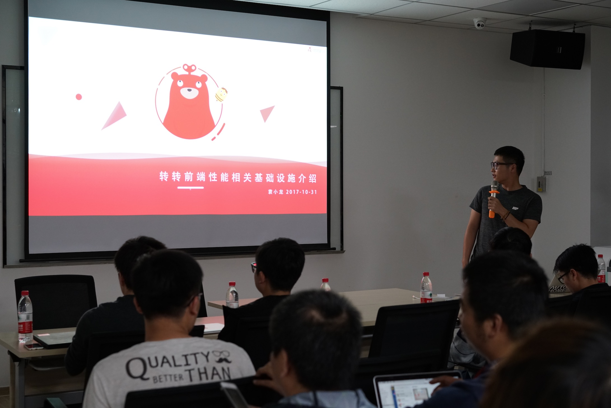
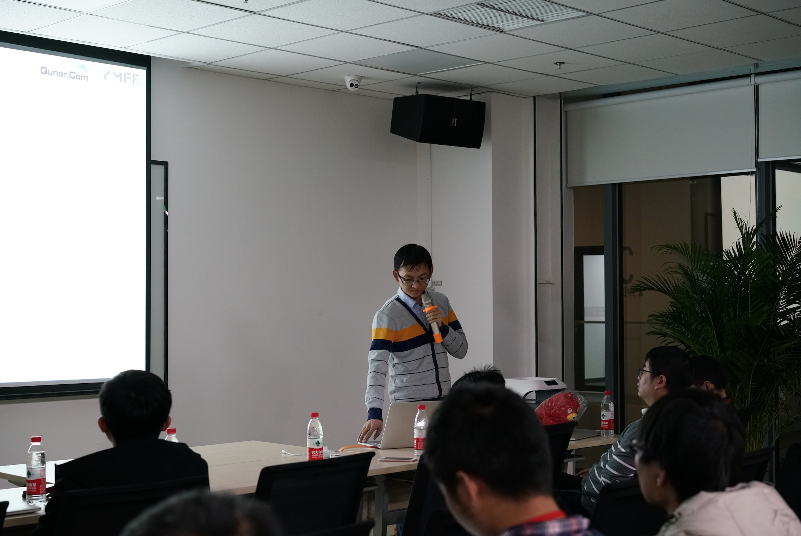
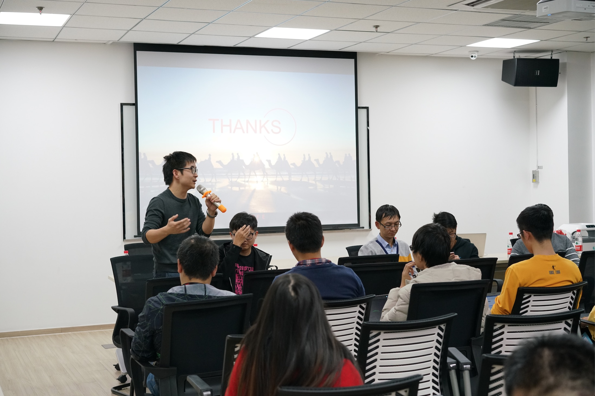

# 转转&去哪儿技术沙龙

冬天快要来啦，又到了动物们......冬眠的季节了，作为一支有胆有想法，敢做敢搞事的前端团队，在这个瑟瑟发抖的季节里搞一搞动静，仿佛是使命一般支撑着我们秋冬乏的双眼皮，那我们到底搞了什么事呢？下面来一波正经的。

前端领域瞬息万变，不断发展的同时呢，业务工具和策略也不断的增多，咱们大转转Fe一直非常希望可以有机会可以和一些优秀的前端团队交流经验，学习借鉴。所以，经过双方Fe小伙伴的努力，这次转转Fe有了一个难得的机会可以和我们的好邻居**"去哪儿前端团队"**，来进行一个技术交流分享会~ 接下来让我们策马奔腾，走进这场分享会，看看双方团队都带来了哪些干货吧！

## 转转前端性能相关基础设施介绍

该主题是由转转Fe大神袁小龙分享，男神现在主要负责转转前端性能平台的一些相关研究。前端性能，一直是前端程序员关注的一个重点。从原理到实践，小龙结合业务场景，详细的阐述了转转目前的前端性能平台，到底do了what。

转转的前端性能平台通过`Performance`对象来获取各项数据衡量指标，首包时间，白屏时间，首屏时间，可操作时间，加载完成时间等，都是性能分析的重点数据。统计目前只支持兼容 `performance.timing` 的页面。目前业内前端框架百花齐放，性能平台对转转当前前端业务使用的`react`与`vue`框架分别有一套获取首屏时间的方法，小龙和团队小伙伴接下来也会努力为性能平台研究开发一款`webpack`插件，针对不同业务框架采用统一的方式来获取各项数据指标。

性能平台每日从海量数据中对需要条件进行汇总，通过`mongdb+`分析脚本，监控则借助转转数据平台，同时为结果数据增加各种纬度，区分ios和安卓，区分首次加载二次加载，区分端内和端外，手机版本号等等，来保证数据更加的直观与明显，为业务提供最大价值。然而，当前性能平台也面临一些问题，如离线数据库容量有限，个性化统计需求统计成本高，数据去除长尾难度大等，都是接下来优化完善的重点内容。

接下来小龙结合业务场景，详细介绍了几个性能平台的优化实践实例：`webview+dns`解析优化，`webpack 3`升级优化，数据接口优化与离线包平台策略，并列举了几个优化实践所带来的效率的提升。

尽管如此，目前转转前端性能平台还面临着许多需要解决和完善的问题，各种前端框架加大了统计难度，不能一个个为其个性化定制获取数据指标的方法，以及目前业务代码侵入较大，个性化监控服务缺少，数据纬度的进一步调整等等。统计细化，前端优化，实时监控，异常预警，统计优化，线下工具，`lightHouse`接入性能统计，生成性能功能报告等等，都是性能平台接下来的征服的挑战，相信在小龙和性能平台小伙伴的一起努力下，转转前端性能平台一定会越来越强大，为业务带来最大价值的数据，为性能带来质的提升~

推荐测试工具：

  - webpagetest
  - 百度APM
  - lighthouse
  
推荐文章：

  - 《Front-End Performance Optimization:Best Practices》
  - 《前端感官性能的衡量和优化实践》
  - 《webview性能，体验分析与优化》
  
PPT：https://ppt.baomitu.com/d/0b747203#/
  
## Hiproxy 基于Node.js开发的轻量级网络代理工具介绍

为我们带来这个主题分享的，是去哪儿团队机票事业部优秀到发光的前端开发工程师——张代应。在前端开发中，前端程序员总是会面`Hosts`切换、反向代理、`Https`证书以及缓存等带来的一些琐碎的问题，`Nginx`固然可以解决部分问题，但是具体使用起来，也是有一些不方便，于是乎针对这些痛点，`Hiproxy`应世而生。  

`Hiproxy`是基于`Node.js`开发的一个轻量级代理工具，核心功能是请求代理，在代理请求的同时，处理了一些开发中的细节问题，比如`Https`证书自动生成、自动配置浏览器代理等。接下来代应为大家详细的介绍了`Hiproxy`的特点，使用方法，以及配置文件规则。

`Hiproxy`在去哪儿的使用覆盖率高达92%，基本实现全Case覆盖，结合使用的情况，像是配置文件修改即时自动刷新浏览器，`Hosts／Nginx`配置文件在git上的统一管理，证书不被信任等都问题都不再是痛点。

提高效率直戳痛点，操作简单维护方便，就是`Hiproxy`了。代应和他优秀的小伙伴还会继续为`Hiproxy`丰富更多的用例，开发实用的插件，为`Hiproxy`开发App版本，让`Hiproxy`变得更强大。贴上`Hiproxy`主页链接，这么优秀又高效的工具，你，值得拥有~

链接：http://hiproxy.org

PPT：https://ppt.baomitu.com/d/874462b4#/

## 离线资源包的更新策略

该主题是来自咱们去哪儿团队的客户端研发工程师张乃旺分享，大师自带一身浓郁技术气息，目前负责`Hybrid`和`ReactNative Android`框架的设计和开发。大神从自身的业务环境就去哪儿APP离线资源包更新所遇到的问题及解决策略进行了详细的阐述，要点如下：

1. 减少故障：开发和测试同学高质量的产出；对权限的把控；提供特定用户下载功能，主要面向测试同学；灰度控制，先为少部分用户派发新的包。
2. 故障处理：开发同学对故障的快速响应；在可回滚的前提下，服务端下线有bug的资源包；`Native`分别在整个应用启动的时候，打开每个页面的时候以及`ios`还在`APP`后台切到前台的时记录下线标识并不再使用；
3. 强制升级：发资源包的时候设置为强制升级，服务端把下线标识在`Native`请求时返回；`Native`发版时，内置失效版本控制，对框架升级导致的不兼容旧版本，覆盖旧版全部资源包。
4. 安全保障：用`Https`服务；每次使用之前校验；下载完成后校验
5. 提高更新率：使用差分下载，因为网速不可控，所以包越小更新率越快，但是总量也不能太大；不用的业务要及时的下线；启动客户端时静默下载`（WIFI）`；打开页面时静默下载；使用率高的业务先下载；
6. 完善服务：分别对离线包版本占比，离线包版本趋势，离线包下载时间，页面加载时间等数据进行统计分析，完善策略。

PPT：https://ppt.baomitu.com/d/a9f986b4#/

在最后的技术圆桌交流环节，去哪儿和转转的小伙伴对分享内容进行了深入的探讨交流，对分享的内容有了更深的理解和沉淀，去哪儿前端团队也为转转前端接下来的发展传授了十分宝贵的经验与建议，技术分享虽然结束，但是友谊的小船正式扬帆！以后转转Fe与去哪儿Fe小伙伴会努力争取更多可以坐下来闲话技术家常的机会，为大家带来更多暖洋洋的干货！鼓掌，撒花，期待~

## 现场照片

