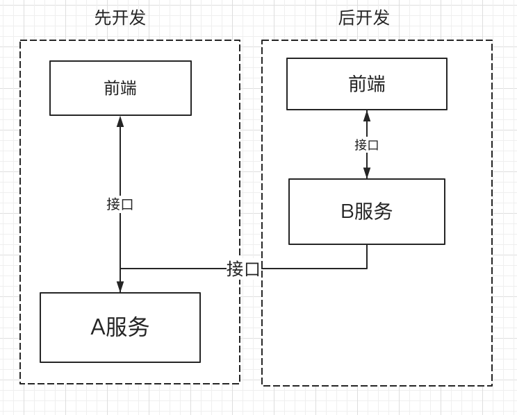
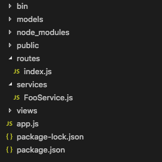
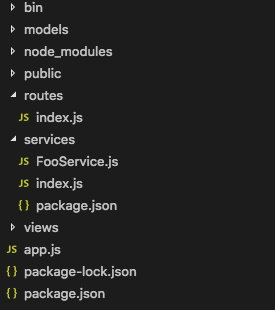
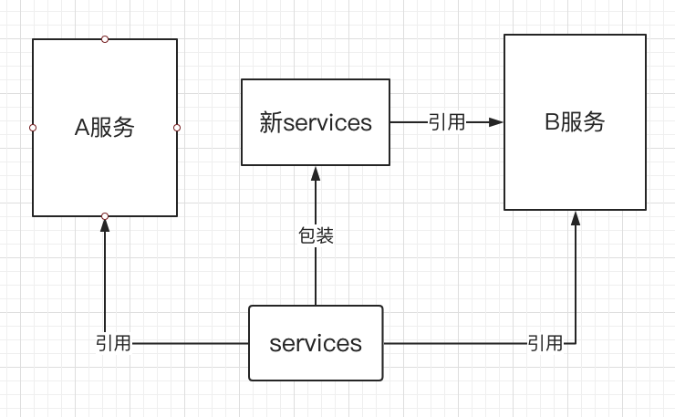
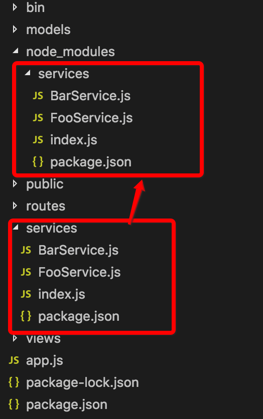
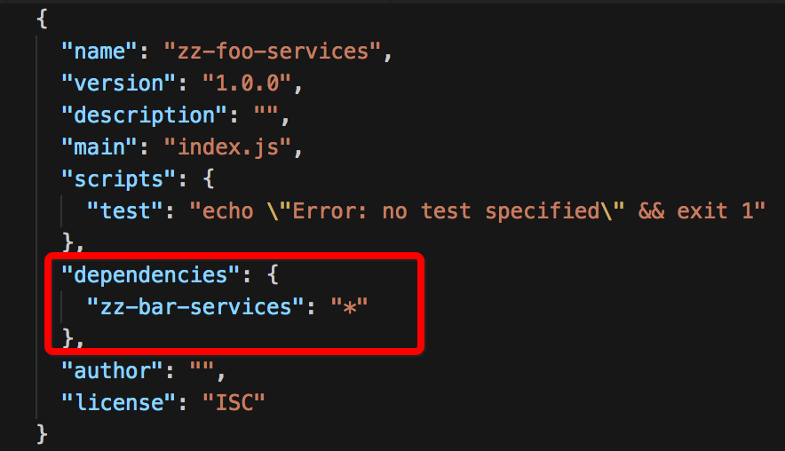
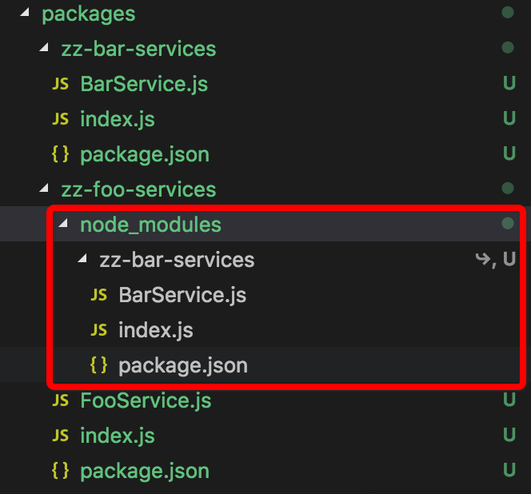

# 背景
在我们开发的过程中，经常会遇到这样的问题，开发完了一些代码或者一个接口，别的小伙伴过来问你，代码可不可以给他复用，接口可以给他调用。这说明代码的复用和抽象对团队协作是很重要的。举个例子，如下图




在这幅图中A服务先开发的，B服务开发的时候与A服务功能相似，尽量使用A服务的接口以提高效率，那么B服务是依赖A服务的，这样会产生如下痛点
1. 如果B服务有需求，A服务不满足，则需求要先提给A服务,如果A服务的小伙伴没时间开发...那么B服务只能等待，因为这是一种依赖关系。
2. 代码复用，因为是通过接口，所以也谈不上复用
要想解决这个两个痛点，通用的思路是将A服务做下沉抽象，找团队专门做，或者约定规范A服务组和B服务组共同维护一个下沉的服务 ，这里我们使用node.js来开发A、B项目，通过包来代替web服务，可以提供一种不一样的思路，通过对node.js项目的工程化，优化A、B项目的依赖，使开发A服务的同时对B服务进行开发支持

# 思路
如何一边开发A服务一边对外提供支持？node.js抽象的形式就是包，也就是说我们一边开发A服务一边对外发布公用的包，我们来看下面这幅图


这是一个koa项目的目录，问题来了，除了node_modules，这个项目里面可以有几个包，有人会说一个项目就是一个包，我们先写一个简单的例子,如下图



在routes里面添加一个路由地址，调用services里面的方法

```
const router = require('koa-router')()
const FooService = require('services').FooService

router.get('/queryFoo', async (ctx, next) => {
  let fooService = new FooService()
  ctx.body = await fooService.queryFoo()
})

module.exports = router

```
写一个service
```
class FooServices {
  async queryFoo () {
    return 'foo'
  }
}

module.exports = FooServices
```

下面开始改造：
在services里面加入index.js和package.json，将FooService.js通过index.js曝露出来，这样services我们就拆成了一个包了





然后直接把services扔到node_modules里面,修改下routes里面的index.js的引入

```
const router = require('koa-router')()
const FooService = require('services').FooService //修改

router.get('/queryFoo', async (ctx, next) => {
  let fooService = new FooService()
  ctx.body = await fooService.queryFoo()
})

module.exports = router
```

那么routes可不可以变成包、models可以不可以，当然可以，虽然不用这么极端的把一切都拆成包，但把services拆成包，效果是很不错的，如下图



在这里我们可以这样定义, A服务在开发的同时，也开发一个公用的下沉式的服务包，开发完services后，A组可以继续开发controller、view层，B组在services基础之上就可以开始开发了，不需要等A服务都开发完成，更高效，团队间的配合更加灵活。

# 实现
上面只是提供了一种想法，实现这个想法还需要一个过程，先说产生了什么问题：
问题1，如果我们把services单独拆出来变成一个项目,可以...但是我们开发的时候回很郁闷，会遇到: 修改services发包、下包、调试、修改、发包、下包、调试...真是好麻烦啊~~~
那么如何在一个项目里面解决包依赖，我们来看一种实现的思路：
先编写一个js脚本，将services文件夹通过创建符号链接,链接到node_modules

```
#!/usr/bin/env node
const fs = require('fs');
const path = require('path');
const rootPath = process.cwd();
fs.symlinkSync(`${rootPath}/services`, `${rootPath}/node_modules/services`, 'dir');
```

随便配置个命令将调用脚本命令配置到package.json中

```
  "scripts": {
    "start": "node bin/www",
    "dev": "./node_modules/.bin/nodemon bin/www",
    "prd": "pm2 start bin/www",
    "test": "echo \"Error: no test specified\" && exit 1",
    "l": "node bin/link"
  }
```

使用命令执行脚本
```
npm run l
```




建立符号链接后，修改services里面的代码，node_modules里的services也会跟着变，这样我们就解决了上面的问题。
注意：这里只是提供思路，要完善功能，请有兴趣的小伙伴自己实现。

问题2，上面的项目里我们只同时多开发一个包，如果在一个项目里面同时开发几十个包,引包和发布,岂不是每次都要做几十次,这个问题还好，更恐怖的是，如果这几十个包还有引用关系....想象不出来,那么看下面的例子，


在services里面有两个包，下面我们用zz-foo-services引用下zz-bar-services，多个services之间的引用是十分常见的。



问题来了，zz-bar-services就没有发布，从哪引用啊，难不成又建个脚本用来建符号链接，那要是包多，几十个包都有依赖关系,怎么建链接啊~~~
这里我们就需要使用lerna来帮我们管理一个项目的多个包的包依赖、包发布等,例如babel项目的开发就是使用lerna进行包管理、发布的，下面我们来看下lerna的用法。

### 安装 lerna
```
npm i -g lerna
```
### 初始化
在项目根目录执行命令
```
lerna init
```
在根目录建一个packages，是lerna管理的跟目录，我们把刚才的包移动到这个目录下，如下图


使用命令将packages里面的包的依赖安装好

```
lerna bootstrap
```

这个命令会执行npm i，还有创建符号链接



如上图，zz-foo-services已经被链接进来了。
注意：这里packages里面的包链接到node_modules，有兴趣的小伙伴自己动手试试。
问题3 多包的版本管理，这里我们使用lerna publish命令将包批量发布出去，这里我们不举例子，有兴趣的小伙伴可以自己都动手试试。

# 总结
通过对node.js的项目工程化的处理，我们可以在一个项目里面同时开发多个包，管理多个包，使得更紧密的团队协作，包的高效拆分，包的管理与优化的开发过程，本文中笔者只是提供了工程化的部分思路，要想产出最佳实践还需要做很多的优化。
