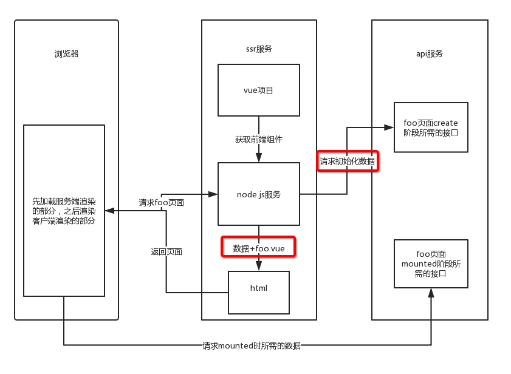
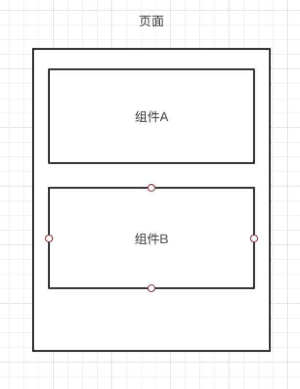
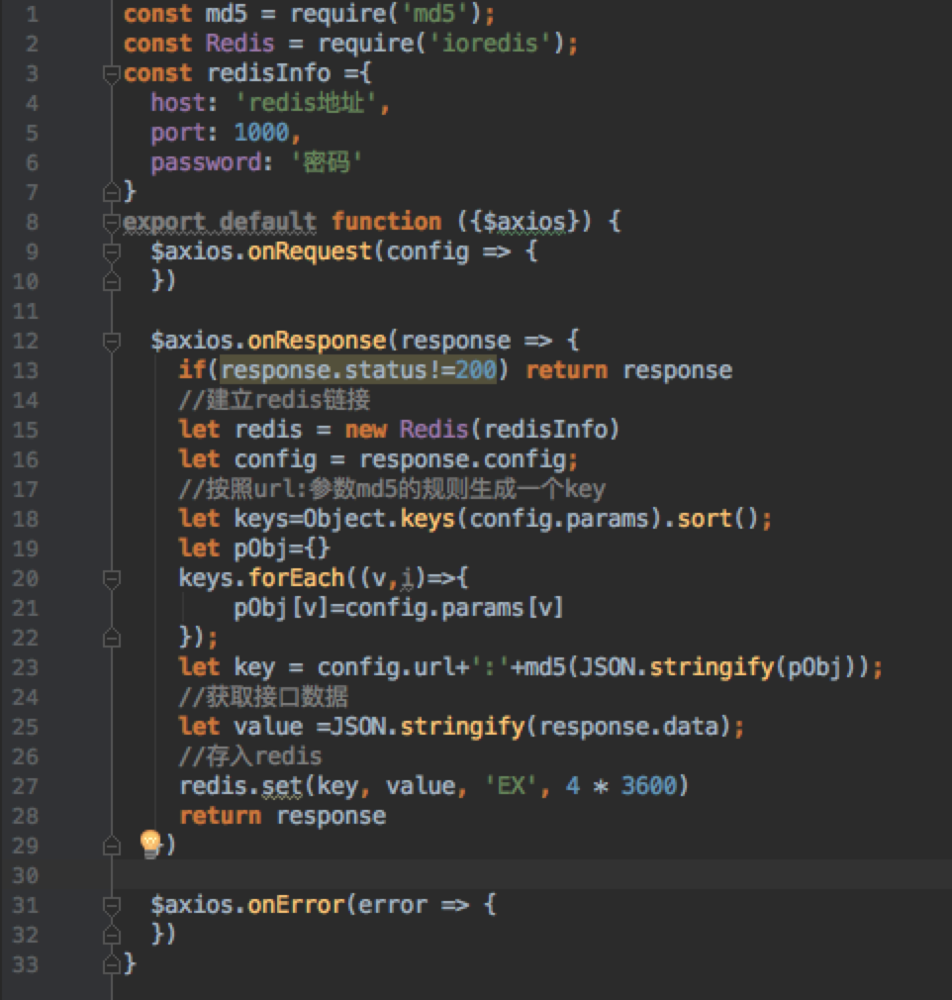
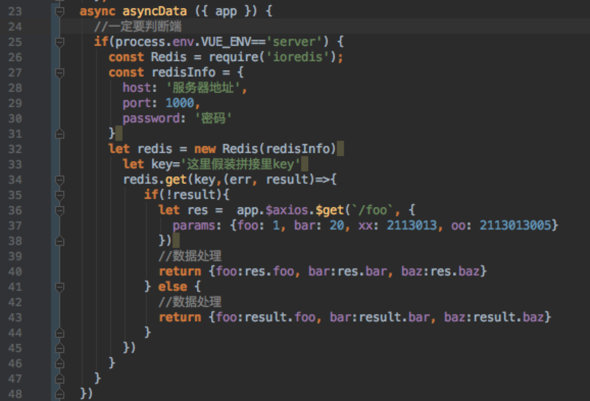
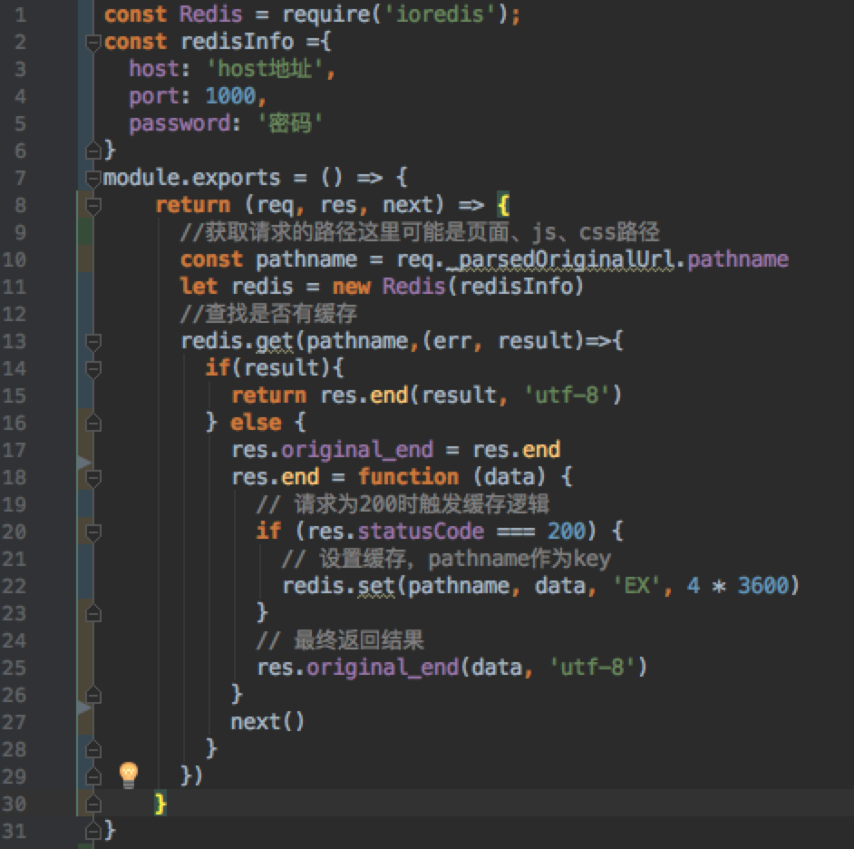
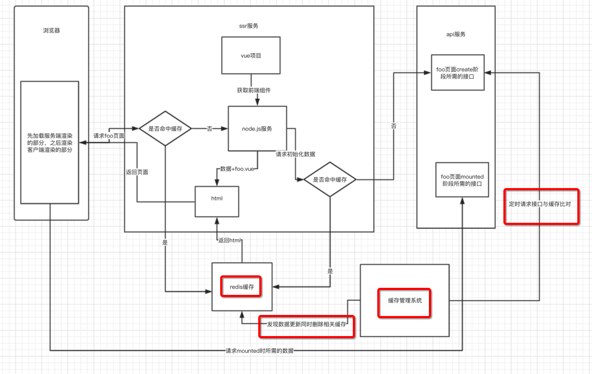

# 简述nuxtjs
Nuxt.js 是一个基于 Vue.js 的通用应用框架，一个用于Vue.js 开发SSR应用的一站式解决方案。它的优点是将原来几个配置文件要完成的内容，都整合在了一个nuxt.config.js，封装与扩展性完美的契合。

简单说nuxtjs项目，它其实就是一个vue的项目融合一个node.js server项目，这里node服务有两个作用，第一点是代替浏览器的工作,笼统理解就是在created时的请求数据和页面渲染，第二点是当作静态文件服务器，把渲染好的页面返回给用户。

# ssr服务做缓存的意义

在上图中，我们可以看到一个简单的ssr服务渲染流程，在这里笔者把与前端渲染不同之处标红，一个是初始化的数据。第二个是获取数据后服务器对于页面的渲染。

图中如果未使用缓存，就会导致每一个用户的对页面的请求，都使用服务去渲染一次，这对于服务器简直是灾难。特别是渲染所依赖的node.js服务，不论是express还是koa又或者是像nuxt的封装，都绕不开渲染时对于服务器cpu产生压力。反之，使用缓存，用内存空间换取cpu的使用率这是划算的，且属于node.js的长项。

# 缓存的使用思路
nuxt缓存有三种，从小到大就是接口缓存、组件缓存、页面缓存，下面我们找具体的场景来聊一下。

1.接口缓存，我们来看下下面这张图。

这是转转有书的首页，你所能看到的都是从接口获取的数据渲染的，往往首页的数据的在一段时间内是不会变动的，也许是1小时、也许是几天，我们每次都去服务端取数据，完全没必要，所有接口做缓存，在这种场景非常有必要。即便是页面数据经常变动，通过一次请求，使用缓存，代替用户的n次请求对于api服务器来说会有很不错的收益。

2.组件缓存

没找到特别贴合的页面，这里就画图了，如上图，你的组件会在多个服务端渲染的页面中出现，使用组件缓存是非常不错的选择。

再说一个极端都例子，例如一个页面中是如上图中的A、B组件的结构，A组件是长时间不会怎么变且大量使用，B组件需要展示用户头像和用户的名字，每个B组件渲染出来都不一样，且这个页面还要放在服务端渲染，那么这样的场景使用组件渲染是合适的。

上面这个极端的例子，千万不要被误导，因为B组件没有可复用的地方，完全可以放在客户端去渲染。

3.页面缓存
页面缓存的场景就是一个页面长的一样的部分，大量被用户请求，那么就可以做页面缓存，例如上面的首页，在一段时间内，用户看到的内容是不会变的。

这三种缓存是包含关系，也就触发了大级别的缓存，就不会触发小级别的缓存，简单来说就是一个请求找到页面缓存，肯定不需要再去请求接口了。

最后笔者选定是接口缓存与页面缓存搭配使用，理由是我可以把那些类似于根据用户不同而不同的推荐组件放到客户端去获取数据并渲染，也就是公共部分用服务端渲染，差异部分用客户端渲染。这是对于我们现在的业务是最好的选择。

# 缓存的实践

笔者在里并没有使用常规的lru-cache这个包做缓存，而是把接口与页面的缓存都做在里redis里。先说怎么做，下面的思考部分我们再来聊笔者的理由。

下面是实现，先来说说接口缓存：
1.如何接口获取的数据存入redis
在nuxt.config.js中，我们在modules配置中加入@nuxtjs/axios，这是nuxtjs自带的，然后编写一个叫axios.server.js的文件，加入plugins配置中，这里的重点是文件命中一定要加server的标示，这样nuxt在加载这个插件的时候只会把它加载到服务端去。

代码如上图，比较好理解就是onResponse监听一下接口返回的数据存入redis，这是存缓存的部分。

axios获取缓存的代码如下。

注意点：这个一定要加上服务端的判断，虽然打包的时候asyncData里的代码不会被打包到客户端，但是在打包和开发的时候不加上服务端的判断，会报一些无法引包的错误。这里可以对axios进行封装，但一定要注意服务端和客户端。

2.页面缓存存入redis
这里就比较简单了，在nuxt.config.js中,serverMiddleware配置里加入一个中间件，代码如下。

在上面的中间件中你需要自己处理下哪些是你需要缓存的，包括html、js、css。

# 问题

聊聊笔者为什么想用redis代替lru-catch的方案，理由是使用redis,使我会担心内存膨胀太快带来的问题，而且多台负载的ssr服务可以共同使用一个缓存，我们甚至可以通过操作redis主动的去管理缓存，对于很多页面、接口需要做缓存来说，这样做是很不错的。

这样一来，我们的ssr服务通过做缓存解决里cpu使用率的问题，然后又通过使用redis解决了本地内存膨胀的问题，ssr服务变的更专心于io。

还有个问题就是缓存的生存时间，例如我们设置了一个很长的缓存的生存时间，接口的数据都变了，可是我们还在使用缓存，当然你可以选择一个合适长短的过去时间，可以从redis里面把缓存删掉，这也是我们用redis存储缓存的好处。

还有就是要注意缓存级别的问题，大级别的缓存会覆盖小级别的缓存，例如客户端一直在走页面的缓存，那么接口缓存怎么刷新也没用，这就需要我们做一些缓存的关联管理。思路如下图。

