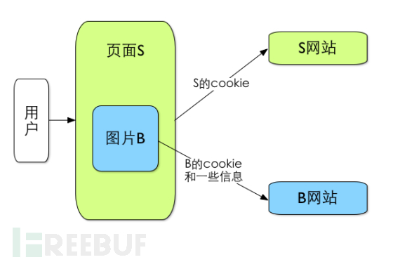
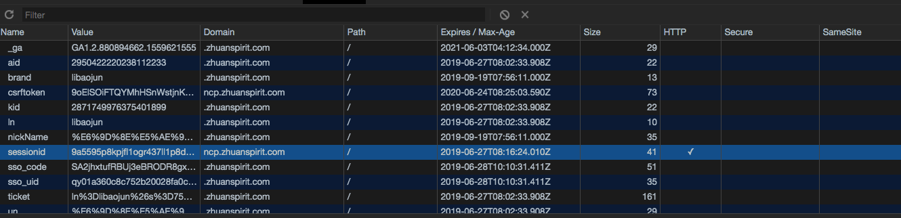
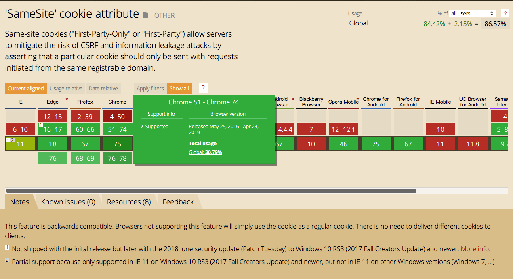

## chrome浏览器对于网络隐私控制作出重大改变

>  今年5月8日，在其I/O年度开发者大会上，google的chrome浏览器研发团队宣布将会对用户隐私和安全的处理机制作出重大改变。下面我们整理下这些改变的内容，缘由，以及对我们带来的影响。


#### 改变的内容，简而言之将会有以下几点：

1  chrome浏览器将会在今年晚些的版本中，在默认情况下阻止网站的cookies跨域传输。开发者必须通过手动设置cookie的 samesite 属性，决定是否允许此cookie跨域传输。

2  chrome浏览器将能够提供有关哪些站点正在设置这些cookie的明确信息，以便用户可以对其数据的使用方式做出明智的选择。

3  最终将跨站点cookie传输只能在HTTPS域名起作用。

4 chrome浏览器会采取措施限制各网站获取浏览器的除cookie信息之外的信息。这些信息是由UA，referer请求头等信息组成的。也包含了大量的用户独特信息。chrome形象地称之为“浏览器指纹“

上述的几条举措中，除最后一条外，全部都是针对cookie的控制方式作出的改变，下面我们详细解读一下这些举措背后的技术原理，以及chrome 作出上述改变的缘由。

#### 详解

"cookies" 已经是全球web开发者耳熟能详的一个概念和实物了。它使得基于无状态的HTTP协议记录稳定的状态信息成为了可能。 一直以来，整个世界几乎互联网所有上的应用，都构建在了当年网景公司发明的这个小文本文件上。  不夸张的说，它几乎是先进互联网世界得以运转的一个基石。

它的功能强大，但如今cookies这一个古老事物却成为整个互联网世界中最不安全的因素之一，有以下的几个原因：

1 cookie内的内容即为用户在某站点的身份证明。而在浏览器中的document对象中，就储存了Cookie的信息，而利用js可以把这里面的Cookie给取出来（document.cookie），只要得到这个Cookie就可以拥有别人的身份了。

2 cookie可以跨站点和域名传输。这是整个业界进行商业化广告精准投放的技术基础。这也是为什么你在淘宝搜索某类商品之后，第三方网页广告能否给你推荐你搜索过的这类商品的原因。

虽然近些年随着浏览器自身功能的进化发展 ，cookies的功能和安全性标准得以有一定的提升，（例如HttpOnly 和 P3P机制）但基本的安全挑战依然存在，加上引申带来的其他问题，

所以导致结论就为：

      你的个人数据存放在cookie中，是不安全的，他会泄露，会乱跑，会被或好或不好地被利用。

而网络安全中最常见的二大类攻击方式 ：
**XSS(Cross SiteScript) 跨站脚本攻击  和  CSRF (Cross Site Request Forgery) 跨域请求伪造，**
均涉及到了对用户cookies的盗取和伪造。所以也就带来种种攻防手段的话题。

而本次 chrome 对于cookies处理机制的改变，即是聚焦于解决 cookies被不受限制的跨域调用的问题，也就是会导致CSRF攻击安全问题的可能，下面我们略微展开解释下：

**cookie 最初被设计成了允许在第三方网站发起的请求中携带,CSRF 攻击就是利用了 cookie 的这一“弱点”:**

当某用户通过登录正常合法进入了a.com之后，就获得了a.com的登录凭证（Cookie）。
这些由a.com内页面发起的请求的 URL 不一定也是指向a.com 上的，可能有指向 b.com 的，也可能有指向 c.com 的。
我们把发送给 a.com 上的请求叫做第一方请求（first-party request），发送给 b.com 和 c.com 等的请求叫做第三方请求（third-party request），
第三方请求和第一方请求一样，都会带上各自域名下的 cookie，所以就有了第一方 cookie（first-party cookie）和第三方 cookie（third-party cookie）的区别。上面提到的 CSRF 攻击，就是利用了第三方 cookie 。



所以，一个典型的CSRF攻击有着如下的流程：

1. 受害者登录a.com，并保留了登录凭证（Cookie）。
2. 攻击者引诱受害者访问了b.com。
3. b.com 向 a.com 发送了一个请求：a.com/act=xx。浏览器会默认携带a.com的Cookie。
4. a.com接收到请求后，对请求进行验证，并确认是受害者的凭证，误以为是受害者自己发送的请求。
5. a.com以受害者的名义执行了act=xx。
6. 攻击完成，攻击者在受害者不知情的情况下，冒充受害者，让a.com执行了自己定义的操作。

可能导致的后果是不言而喻的。目前在业界防御 CSRF 攻击主要有三种策略：验证 HTTP Referer 字段，在请求地址中添加 token 并验证，在 HTTP 头中自定义属性并验证。 （具体措施可以具体自行查阅啦）。

    但这些都不能算是从cookies的源头解决问题。


在2016年5月，Google起草了一份草案来改进HTTP协议，https://tools.ietf.org/html/draft-west-first-party-cookies-07，旨在为cookie标准提供更坚实的防御层，那就是为Set-Cookie响应头新增Samesite属性，它用来标明这个 Cookie是个“同站 Cookie”，来控制原本“第三方cookie”带来的安全风险。并率先在2016年的chrome 51版本中支持了这个功能，


下面我来详细讲解Samesite这个属性的功能和作用：

使用samesite这个属性时：需要在 Set-Cookie 中加入 SameSite 属性，并可以对其赋予几种值，例如

```
Set-Cookie: key=value; HttpOnly; SameSite=Strict
```

##### SameSite属性的值：

```
 1 严格模式：SameSite=Strict
```
###### 含义为：此cookie为禁止发送所有第三方链接的 cookie

当我们通过其他网站来访问一个有 SameSite-Cookies 机制的网站时，例如从 a.com 点击链接进入 b.com，如果 b.com 设置了 Set-Cookie:foo=bar;SameSite=Strict，那么，foo=bar 这一 cookie 是不会随着 request 发送的

这种情况下：CSRF会完全死在水中

```
 2  宽松模式 ： SameSite=LAX
```
宽松模式下也不是允许所有类型的跨域请求都可以携带cookie, 限制有以下几类：

1 允许发送安全 HTTP 请求类型（ GET , HEAD , OPTIONS , TRACE ）第三方链接的 cookies

2 必须是 TOP-LEVEL 即可引起地址栏变化的跳转方式，例如
```
<a> , <link rel="prerender">，以及GET 方式的 form 表单 ，此外， XMLHttpRequest , 图标标签的地址
```
等方式进行 GET 方式的访问将不会发送 cookies

3 发送不安全 HTTP 方法（ POST , PUT , DELETE ）类型的http 请求被视为不安全的的请求，禁止携带第三方链接的cookies


**此外，值得说明的是：如果我们给cookie添加了 SameSite 关键字，但是没有指定 value（Lax or Stict）,例如**

```
Set-Cookie: key=value; HttpOnly; SameSite
```

此种情况下，chrome浏览器会认为等同于

```
Set-Cookie: key=value; HttpOnly; SameSite=Strict
```

以上即是截止到目前对于cookie的处理方式。

至此 我们熟悉的cookie总共拥有了以下的几种属性：



自从sameSite属性发布至今，已经过去了几年，虽然截止到目前此属性已经得到了各浏览器广泛的支持。
但是并没有得到广泛的使用。



```
而根据google本次的声明，chrome默认情况下会阻止网站的cookies跨域传输。

可以理解为上述的cookie SameSite属性会默认其作用。

不管我们是否添加了这个关键字。

如果开发人员明确想允许其Cookie跨网站使用，则必须手动设置cookie的SameSite。

仅在单个域上运行的Cookie不会受到影响。
```

对于这条修改，我们必须仔细review我们的系统现状中对cookie的调用设计，这不仅仅是向Chrome添加了新的功能，还会改变我们在非常基础的层面使用cooike的方式。

而除了这条以外的改动举措，相对容易理解。


#### 结束语
作为一个已经在全球浏览器市场份额占据超过2/3的产品，chrome浏览器不仅提供了强大的功能，还不断加强对用户隐私和数据安全性的保护。哪怕这会整个在线广告行业产生震动性的影响。这不仅反映了国际社会大部分国家在法律上对于用户隐私和数据安全保护的强制要求。 也体现了google作为科技巨头公司不断加强其产品改善用户隐私和安全性的态度和努力。

也真诚希望国内的法规和科技业界也能一起努力起来，负责任地共同改善国内的网络生态系统。


>  参考

> 1:  https://chinagdg.org/2019/05/improving-privacy-and-security-on-the-web/

> 2:  https://techcrunch.com/2019/05/07/chrome-privacy-security-changes/

> 3: https://developer.mozilla.org/zh-CN/docs/Web/HTTP/Cookies

> 4: https://tools.ietf.org/html/draft-west-first-party-cookies-07
