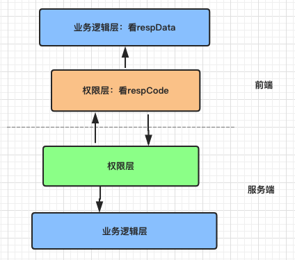
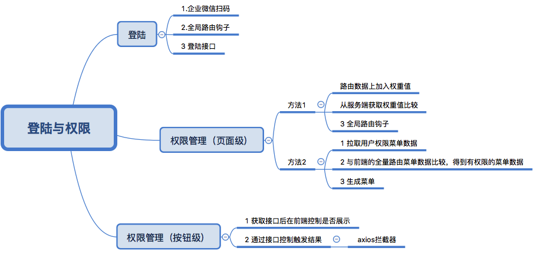

## 管理系统类项目的登陆与权限功能的实现
---
### 前言

>笔者最近参与了公司的几个业务的管理系统类项目，在这样的项目需求中，相对于所选择的前端技术栈以及前后端分离协同开发的模式。理解并实现后台项目的业务需求是其中的重点，其中，账户的登陆，以及权限验证与安全性是非常重要的。本文就以一个系统为例讲一讲如何在各技术与业务相结合完成这样的需求。所以本文对于技术细节不多赘述，重点说办法与思想。

### 需求与设计:
本系统为客服所用的工单系统，所以改系统的用户均为客服人员，系统并不是由各客服人员自行注册使用，而是在后台预建好各个客服人员的信息，并通过一个权限配置页面为每一个客服人员分配相应的权限角色，不同的角色拥有不同的菜单以及按钮级别的权限，以做到权限控制的目的。

## 登陆

### 1 扫码
系统登陆的方法，如通过在系统做自己的登陆页实现，现今已经成了一种小众，且不开放的做法。随着各个大的平台开放自己OAuth授权。走第三方的授权登陆才是目前主流的做法。优点在于安全性与用户信息的整合。

本系统在运维层面接入了企业微信登陆， 当用户输入系统网址时，会在webserver层跳转到企业微信扫码登陆页。
通过在nginx 中调用access_by_lua_file 模块，使得对该系统的访问会判断在header中是否有sso_uid 这个cookie,
如果没有的话，使访问跳转到一个企业微信扫码页面。进行开放授权登陆的操作。
这里放一下nginx的部分server配置

```
 location /
        {
        access_by_lua_file /opt/soft/nginx/main-conf/zhuanzhuan_zzssoauth.lua;
        proxy_next_upstream http_502 error timeout invalid_header;
        proxy_set_header Host $host;
        proxy_set_header X-Forwarded-For $remote_addr;
        proxy_set_header X-Real-IP $remote_addr;
        proxy_set_header HTTPS-Tag "HTTP";
        proxy_set_header X-Forwarded-Proto $scheme;
                root /opt/web/frontend/ZZKF;
                index index.html;
                autoindex on;
                autoindex_exact_size off;
                autoindex_localtime on;
        }
        location /zzssocheck/ {
                proxy_pass http://zhuanzhuan_zzsso_pool/;
        }
```
可以看到，在访问前端根路径，即系统域名时，先通过access_by_lua_file模块走lua文件的逻辑，而lua文件内，则是根据访问的header头判断是否跳到微信扫码登陆页面了。

扫码截图：

 


在用户使用企业微信扫码登陆成功之后，页面会跳转回系统自身，并在浏览器中当前域下的cookies 中写入一个sso_uid， 值为使用者的企业微信id。
这样，我们在前端就方便地通过oauth获取到了用户的基本信息。

我们在前端也将sso_uid作为用户登录的状态位，在全局的路由钩子router.beforeEach中拦截路由，判断是否已经有sso_uid的cookie,如没有的话（比如登出操作）,使重新进入扫码页面。
但值得指出的是：这还并没有真的登陆到我们的后台系统中。

### 2 全局路由钩子

```
router.beforeEach((to, from, next) => {

...
        // 未登录且前往的页面不是登录页
        //没有wxId的 cookie  以及 前往的页面不是登录页

        if (!Cookies.get('sso_uid')) {
           location.reload()
			    // location.href='http://apidoc.zhuanspirit.com'
        }
        if (!Cookies.get('sso_uid') && to.name !== 'login') {
            next({
                 name:  'login'
                 //name: 'home_index'
            });
            //debugger;
			    //  location.href='http://apidoc.zhuanspirit.com'
        }
        //已经登录且前往的是登录页
        else if (Cookies.get('sso_uid') && to.name === 'login') {
            Util.title();
            // next({
            //      name: 'home_index'
            // });
            next();
        }
...
    }
});
```

### 3 登陆
 在获取到了用户的 sso_uid之后，我们取服务端的登陆接口，服务端在获取到用户的ssu_uid之后，会与后台预录入的用户信息比较，
 如果该无该用户信息，或在黑名单中，则会跳转到失败页，并显示登陆的失败信息。
 如果登陆成功，服务端会返回用户的中文名，头像等基本信息，并在cookie中植入该系统的cookie ，其中的tk为唯一标示用户身份的一个key,此后每次向服务端发出的接口请求都会带上此key作为凭据 ,服务端会实时根据此值作出权限操作，例如用户踢出等。


## 权限管理
 权限的控制方法，都是在路由上做文章，这里分别讲一下：

#### 方法1  

  此方法适用于权限角色数较少，并且角色总数可预期的情况，方法为：
  在前端的路由表中每个路由项中加入该路由项的权重值，可以为数字，也可以为 角色名，以表示进入该路由最低需要的权限。
  例如：
```
    {
      path: 'index',
      title: '权限测试页',
      name: 'accesstest_index',
      access: 0,  ／／此为权限描述
      component: () =>
        import ('@/views/access/access-test.vue')
    }
```

 在登陆时，服务端根据用户获取其角色，然后将用户的权限值植入前端的cookie中，前端依然是在全局的路由钩子中，比较cookie中的权限值于 路由中的权限值，如果大于或等于权限要求，则允许进入，否则跳转到提示页
比如，用户的权限值为 1  ，可以进入access值为 0，1 的路由中，但无法进入access值为2 的路由中。
 路由钩子中的权限控制代码为：

 ```
 router.beforeEach((to, from, next) => {
            if (curRouterObj && curRouterObj.access !== undefined) { // 需要判断权限的路由
                if (curRouterObj.access <= parseInt(Cookies.get('access'))) {
 next()
                }
                else
                {
                    next({
                        replace: true,
                        name: 'error-403'
                    });
                }
            } else { // 没有配置权限的路由, 直接通过
 		next()
            }
}
 ```

 此方法也是主流技术栈的一些管理系统类脚手架所提供的方法，例如react技术栈的ant
 design pro脚手架，其权限控制功能，也是使用的此方法，在其官方文档中所叙述：

 >如需对某些菜单进行权限控制，只须对菜单配置文件 menu.js 中的菜单项设置 authority 属性即可，代表该项菜单的准入权限，菜单生成文件中会默认调用 Authorized.check 进行判断处理。
 ```
 {
  name: '表单页',
  icon: 'form',
  path: 'form',
  children: [{
    name: '基础表单',
    path: 'basic-form',
  }, {
    name: '分步表单',
    path: 'step-form',
  }, {
    name: '高级表单',
    authority: 'admin', // 配置准入权限
    path: 'advanced-form',
  }],
}
 ```
 见官方文档：
 [传送门：权限管理](https://pro.ant.design/docs/authority-management-cn)

 注：ant design pro的官方文档在国内可能需要翻墙访问，ping到的ip地址位于新加坡

 这种方法虽然做到了菜单的权限控制，满足了不同的客服有权限进入不同的菜单，但体验和私密却不好，所有人都看到了所有的菜单项。所以为了更好地实现权限功能，我们需要（更好的）方法。

 #### 方法2

 此种方法适用于：系统角色数量较多，每个角色的菜单权限均为动态的配置出来，以及每个角色的角色权限并非一成不变的情况
此种方法下，前端不再在路由表中为每个路由赋与权限，而通过由接口返回的路由数据动态生成菜单显示，具体步骤为：

1 用户登录成功后，再单独访问一个拉取用户权限的接口userPermission

2 该接口会根据用户的信息返回该用的有访问权限的路由表信息。

3 在前端通过比对全量的菜单数据得到用户的有效路由值，
通过router.addRoutes动态挂载路由

4 使用vuex（redux）管理路由表，根据vuex中可访问的路由渲染侧边栏组件。做到只显示用户有权限访问的菜单。

##### 注：
router.addRoutes为vue-router2.2之后新增加的api，能够动态的添加路由。之前的版本无法做到。


值得说明的是，这些页面级别的权限控制，虽然已经在前端做了，但是只在前端做是不够的，服务端也依然要做接口层面的权限控制。

### 接口权限控制以及按钮级别的权限控制

  在页面级权限控制的基础上，即不同权限角色有权进入不同的代码的基础上，做到同一个页面，不同的角色进入，显示的按钮不同，或者触发点击后，得到不同的结果呢？

#### 我们采用了两种方法相结合 ：
  1 : 特定按钮的显示与否
      部分按钮与接口逻辑的耦合度较深，比较容易在代码层面做控制，通过服务端的接口中包含按钮权限的数据，前端通过v-if手动控制其是否显示

2  同样显示出的按钮，点击后触发的权限结果不同
    此种方法需要结合请求与响应拦截器一同实现
    在此系统中，我们其实针对每一个请求都会验证其使用者是否有操作权限，
    在此系统服务端架构中，在业务逻辑操作层之上，有一层权限校验层，当发现按钮点击人因为某种原因没有权限使用此接口功能时，
    （原因可能有一下：，比如通过地址进入了没有权限使用的页面，或者在别的电脑上登陆了相同的账号，或者管理员在后台中把一个已经登陆的用户权限删除等等情况），此时，权限系统会在接口中返回异常的错误码，其错误码体现在接口数据的最外层 respCode中，除了登陆接口外的所有接口，我们统一使用返回值的respCode值作为权限验证的结果，我们给项目中使用的ajax请求插件axios封装了一个respone的拦截器，当respCode值为约定的异常代码时，我们统一做跳转等处理，否则做正确的业务逻辑。     

  ##### 权限设计架构示意图：

  

  ##### 接口格式：
  ```
  {
  "respCode": "0",     //使用此key作为权限控制的标识位
  "respData": {        // 此key作为真正展示所需数据
    "status": "0",
    "msg": "操作提示信息"
  },
  "respMsg": "请求异常信息"
}
  ```

  ##### axios拦截器

  ```
  util.ajax.interceptors.response.use(
  res => {
    console.log(res.data)
    //对响应数据做些事
    //统一判断后端返回的错误码
    // const { respCode, respMsg = '' } = res.data
    // if (+respCode === 0) {
    //   const resData = res.data.respData
    //     return { ...resData, respCode, respMsg };
    // }
    if (res.data.respCode === '0') {
      return res.data.respData
    }
    if (res.data.respCode === -2 || res.data.respCode === -5) {
      vm.$Message.error(res.data.errMsg);
    }
    if (res.data.respCode === -8) {
      vm.$store.commit('logout', this);
    }
  },
  error => {
    alert("网络异常～")
  }
  )
  ```

### 最后用一张脑图来总结一下本文所阐述的内容
  
