## 转转hybrid app web静态资源离线系统实践
---

### 一.前言

> 目前的转转app是一个典型的hybrid app,采用的是业内主流的做法：
客户端内有大量业务页面使用webview内加载h5页面承载。

> 其优点是显而易见的，即：web页面上线频度满足快速迭代的业务需求，不受客户端审核和发版的时间限制，也可以将各个业务线的开发工作分摊到各个业务的fe团队上，使得个业务线可以并行开发。

> 而缺点，则不言而喻的在于客户端内webview加载h5页面，准确来说是web应用的性能和体验，是肯定不及客户端的。本篇文章中，笔者将会梳理立足于本团队内，根据团队的特点和制约，开发并实践web应用的静态资源离线系统的过程与实践。

#### 痛点1：

现今本团队内的端内web应用，均是由webpack构建打包而成的单页或多页web应用，前端工程构建完成的结果是这样的画风：

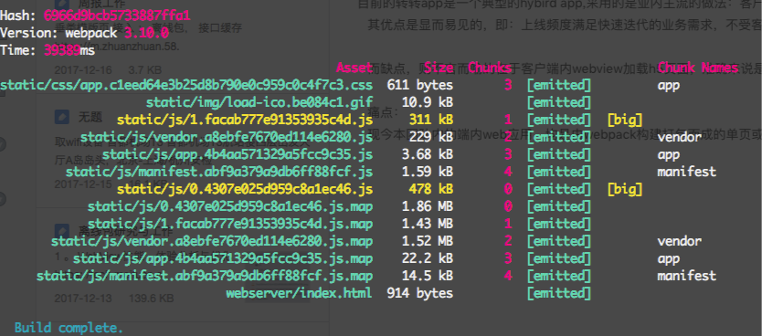

可以看出其静态资源中，不乏体积几百k~几m不等，而这些静态资源均是首次打开页面时需要下载的，并且在web应用有更新时，这些静态资源文件均会发生变化，也需要重新下载。

**导致：首次打开·线上h5资源更新·网络条件差的时候，或者本地页面缓存失效的时候。**
出现：


这使得移动端网页体验像一块巨石—它包含了大量 CPU 计算的 JavaScript 包，拖延了页面的加载和可交互的速度。
而对于任何一家互联网公司，性能往往与利益直接相关。
面对海量的交易用户，提升web应用加载的体验成为了fe和app 工程师极力重视解决的一个问题。

#### 痛点2

**其一:**
 笔者之前也调研过 service worker等利用web api 来实现pwa的离线缓存方案，但目前转转的app使用的还是系统原生的webview。暂时不兼容pwa特性.[(点击查看本团队过往对于pwa项目的尝试总结)](https://www.cnblogs.com/zhuanzhuanfe/p/7573727.html)

**其二:**
 目前各个业务团队使用的技术栈的范围比较广，涵盖vue及react等生态方案。同时各个业务线均在保持快节奏的业务开发，需要设计一套能良好工作，更重要的是可以让各业务线前端工程可以低成本无痛接入，对业务代码不会产生侵入，不会引发风险与问题的接入方案。


### 我们的方案：

在调研了腾讯 手机QQ  阿里 美团 新浪 等公司的实现方案后，我们设计了自己的web应用静态资源离线系统方案：

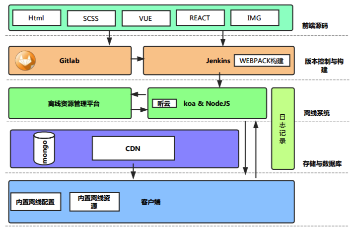

图片是粗糙的，印象是模糊的。下面我们从 **前端构建和发布测** 和 **app测**  两个方向分别来分别阐述：


#### 1.前端构建和发布测：

我们采用腾讯alloy团队出品的webpack离线包插件：**ak-webpack-plugin**，其可以根据配置，将webpack的构建出的静态资源，压缩成映射了静态资源在cdn路径url的zip压缩包。
同时在配置的过程中，也可以选择 **排除掉** 部份文件（比如图片，并不是所有构建出的图片都是用得到的）。其生成的压缩结构如下：

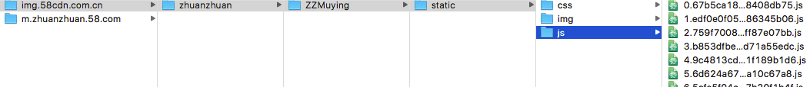

在此过程中，我们不需要关注资源之间加载的依赖关系，更不需要关注具体的业务逻辑。
只需要关注webpack构建后生成的资源文件夹的结构。

把生成和上传离线资源包的过程封装成了一个npm script后，就可以方便地在各个需要接入离线系统的项目中移植，相比起pwa等方法，算是一个改造成本很低的方案。解决了接入的痛点。


> ##### 生成的离线资源如何让客户端如何上传呢？ ####

交由各个fe工程师手动上传吗？ 这样显然不符合效率最大化的原则。幸好我们有持续集成和发布工具jenkins。在本团队的发布与上线流程中，jenkins代替fe工程师构建与部署前端项目。使前端项目也像传统的app与后端项目一样做到了开发与构建部署分离，提高了团队的效率。
而我们生成和部署离线包的操作，也交由jenkins替我们完成。

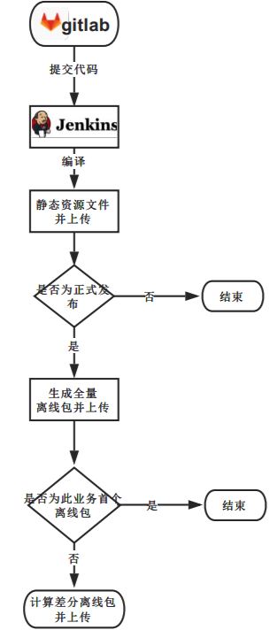


#### 2.转转app测 ####
在客户端内，预制了一份最新的各业务线的离线包与版本号的配置表。app安装后首次启动时，会将压缩包解压到手机rom中。
各业务线配置中包含app访问线上的静态资源时需拦截的url规则map:
```
[
        {
            "bizid": 13,
            "date": "1513681326579",
            "ver": "20171219185710",
            "offlinePath": [
                "c.58cdn.com.cn/youpin/activities"
            ]
        },
        {

            "bizid": 12,
            "ver": "20171216234635",
            "offlinePath": [
                "img.58cdn.com.cn/zhuanzhuan/zzactivity/ZZHeadline",
                "m.zhuanzhuan.58.com/Mzhuanzhuan/zhuanzhuan/zzactivity/ZZHeadline"
            ]
        }
    ]
```
，当app访问到与规则map相匹配的地址时，就转为使用本地的资源，达到离线访问的目的。

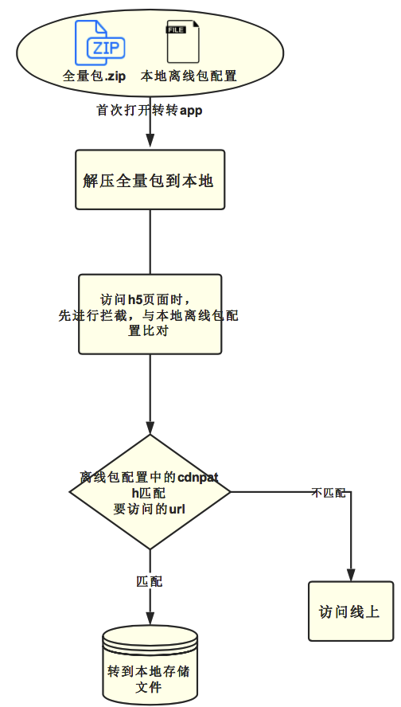


> ##### 离线化后的资源如何更新呢？

客户端启动后，向离线系统查询最新的各个业务的离线包版本号，依次跟本地配置中的对应业务线比较。
如果需要更新，则再次向离线系统查询此业务线的离线包信息，离线系统会提供此业务线的离线包的信息（包括基础包，更新包的信息）。

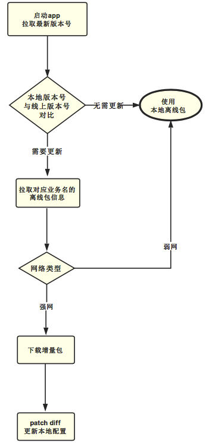

> ##### 是否需要更新？ ####

判断某一业务线是否需要更新离线包的的具体原则如下:

1. 线上的各业务线的离线包的版本号与本地配置中 同一业务线的配置不同 (不论最新的离线包版本比本地的更高还是更低。)
2. 线上的各业务线的配置中中包含有本地配置有没有的业务线。


### 三.资源包加载的优化


#### 1. 增量的资源更新（bsdiff/bspatch）

客户端在内置（或者在wifi环境下载）了各业务全量包的基础上，为了减少每次下载更新的资源包的体积，我们采用了增量更新策略，具体为：每次发布版本的时候，如果此业务线之前已有离线包，则通过
离线系统生成差分包放在cdn。

增量更新的策略使用的是基于node的 bsdiff/bspatch 二进制差量算法工具npm包-- bsdp。（坑点：因为安装此node module 含有编译c语言的过程，所以对于liunx的gcc版本有一定要求，要求必须为4.7以上版本，低于此版本则无法安装）
客户端下载差分包后使用bspatch合成更新包。

**经过比较 影响bsdiff生成的差分包的体积的因素主要有以下几类：**

- zip包的压缩等级。
- zip包中文件内容的修改：比如js进行了uglify压缩，变量名的变化可能引起大幅的变更等。


**项目A：**
11月30日版本 | 12月8日版本  | bsdiff增量包
---|---|---
740.2k | 740.2k | 36.85k


**项目b：**
11月23日版本 | 12月19日版本  | bsdiff增量包
---|---|---
415.8k | 418.4k | 172.3k


可以看出：虽然增量包的体积与全量包的体积的比值虽然各不相同，但无疑是大大减小了客户端升级离线资源需要下载的流量。


#### 2. 单独控制各个业务线web应用是否使用离线机制:

为了更好的监控离线包服务端和客户端的运行情况，并且降低使用离线资源带来的不可预料的风险，将隐患做到可控。
 我们在每一个业务上都加入了使用离线资源的开关和灰度放量的控制。


#### 3. 数据一致性校验 与 数据安全性

为了防止客户端下载离线资源时数据在传输过程中出现窜扰，导致下载的离线包无法解压，我们在服务端通过接口中将资源包的md5值告知客户端，客户端下载后通过计算得到的资源包的md5值，与之比较，可以保证数据的一致性。


同时为了保证传输过程中，资源文件不被篡改，我们将上述的md5值通过rsa加密算法进行加密。在服务端和客户端分别使用一对非对称的密钥进行加解密。


#### 4.批量下载

在启动app时，app会集中批量的下载各个业务线的离线包资源，我们在存放离线包资源的cdn中使用了http/2协议，这样客户端与cdn只需要建立一次连接，就可以并行下载所有的资源。
在需要下载离线包个数较多的情况下，可以比传统的http1 有更快的传输速度。
同时，客户端只需要运行一次下载器。减少多次运行下载时对手机cpu的消耗。


### 四.回退机制：

在实际情况中，为了避免用户下载离线资源或者解压资源失败等问题，导致无法加载相应的离线资源，我们设计了回退机制，在

>- 本地内置的 base包(zip文件)解压失败的时候
>- 离线系统接口超时
>- 下载离线资源失败
>- 增量的离线资源合并失败等情况下

我们转而请求线上文件。


### 五.离线资源管理平台

对于接入了离线系统的各个业务线的前端工程生成的不同时间版本的离线包
，我们需要有一个直观明晰的方案来对其进行管理。
我们开发了离线资源管理平台，对接离线后台系统:

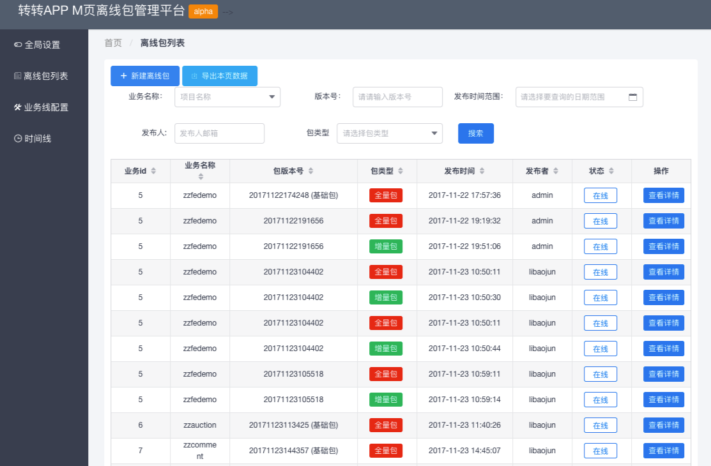

其主要的功能包含有：

- 查看与管理各个业务线信息及其离线功能的灰度放量的比例。
  对于新接入离线系统的前端工程，灰度放量可以使得部分用户先使用其离线的特性，并防止不可预料的问题发生在全体用户上。

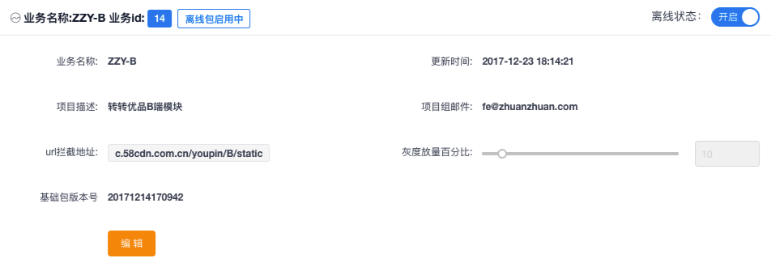

- 通过业务线，版本号，发布时间等条件，查询各个版本的离线资源包的列表及其详细信息。
如 离线包的类型，体积，上线时间等属性。

并在此基础上允许将某版本的离线包下线，以实现离线资源版本的回滚功能。

- 针对全局的离线功能，提供了离线功能的开关。


### 六.技术栈与选型介绍
本篇文章通篇介绍的大体都是思路，实现原理和架构，作为一个技术项目当然也要把使用的技术栈简单的介绍一下：

- 离线系统的服务端使用的为nodejs实现，因为是一个fe工程师推动的性能基础项目。自然选择自己熟悉的语言开发。开发的主动权也可以掌握在自己手上。node版本为较新的LTS版本8.x。

- node 框架的选型: 市面上主流框架有两种，express koa ,还有一些是经过一些封装和定制的框架，例如eggjs等。
对于框架的选型，我们看趋势。在7.6版本之后，node 就支持了async/await 语法糖，不需要再用yield 和*函数了,koa天生选用await/async的结构，解决了回调地狱，确实是下一代的开发框架，现在也有大量的中间件帮你解决诸多的问题。
而基于koa2的企业级框架eggjs在一开始的时候考虑过，
但是eggjs的功能很强大，有很多功能，多到有些根本用不着，从而导致了他不会轻量级，扩展上的灵活性有待考究，并且eggjs对于我来说是个黑盒，如果有什么问题，我解决起来将会花费很长的时间。

- 使用了log4js进行node日志的采集和记录，log4js作为目前在node上最强大的日志记录框架，现在每天其npm包下载量均为6位数。我们将node服务分为resLogger和errorLogger两个不用等级的分类分别记录，并使用-yyyy-MM-dd-hh.log的pattern分割日志，在出问题的时候方便快速定位到日志文件。

- 使用了log4js进行node日志的采集和记录，log4js作为目前在node上最强大的日志记录框架，现在每天其npm包下载量均为6位数。我们将node服务分为resLogger和errorLogger两个不用等级的分类分别记录，并使用-yyyy-MM-dd-hh.log的pattern分割日志，在出问题的时候方便快速定位到日志文件。

- 使用轻量级的nosql数据库mongodb记录各离线资源包的数据信息，使用对象模型工具mongoose进行nosql的操作。

- md5的加密，使用node-rsa库进行非对称密钥的生成，操作和加解密处理。

- 前端离线系统的后台页面，采用主流的vue及组件技术栈，并使用talkingdata出品的iview组件库进行搭建，灰常好用，也向大家推荐。

- 压力测试：因为是直接面向转转客户端全量的基础服务，并且预期要接入所有业务的m页，我们做了几次不同层面的压测，保证其起性能可以达到要求。
  我是用的为liunx下的基于命令行的压力测试工具siege，
  在并发数200，测试50次的情况下，其结果为：
  ```
  Transactions:		       10000 hits    
  Availability:		      100.00 %
  Elapsed time:		       15.03 secs
  Data transferred:	        0.3 MB
  Response time:		        0.86 secs
  Transaction rate:	      133.07 trans/sec
  Throughput:		        0.00 MB/sec
  Concurrency:		      113.98
  Successful transactions:        10000
  Failed transactions:	           0
  Longest transaction:	       10.43
  Shortest transaction:	        0.03  
  ```
  可以看出其表现相对稳定，但上线后就要依赖下述的性能监控系统了。

- 对于这样的一套基础服务，对其运行情况的相关监控也是非常重要的，不管是及运行的是否稳定，承载的压力，占用服务器硬件的资源情况，我们都需要有详细的指标来进行观察，才能采取措施来对服务保驾护航，并采取措施改进。


### 六.运行情况
目前离线系统支撑着转转几乎所有的m页，每天其api的访问量为几百万次。接口响应时间平均只有20ms，也说明node的稳定轻量，以及koa框架的迅速。

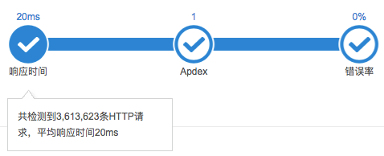

以下为占用机器的cpu和内存情况，如果后续出现内存泄漏，性能瓶颈，我们会加入缓存层解决。

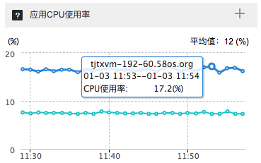


### 七.收益：

截止目前转转h5静态资源离线系统已经*无痛地* 接入了多个端内web应用，在页面静态资源加载耗时和由此延伸的可操作时间等性能指标上，均取得了很好的收益。

我们通过录屏的对比直观感受一下使用了离线系统后，在加载速度上带来的提升.
下图为4G网络情况下，某web应用首次打开的速度对比。左侧为使用离线系统，右侧为未使用：


通过本团队开发的性能统计平台与埋点sdk，我们可以看到几个关键指标的提升:

** 页面的静态资源加载（js,css）耗时的对比数据**

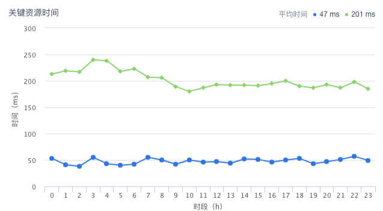

平均时间提升约为75%左右

**页面的可操作时间耗时的对比数据**

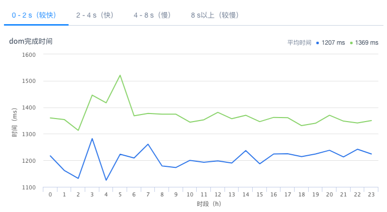

平均时间提升约为15%左右

*（采样页面为客服中心项目）*

面对海量的用户，节约的流量和网络请求时间消耗都是我们为用户带来的价值。


### 八.展望：
对于技术完美的追求是一个永无止境的过程，而面对复杂网络情况下离线资源下载的一整套过程。我们仍有诸多细节仍需完善和优化，比如：

1. **下载引擎的优化** 。目前还待实现的功能有离线包下载的断点续传和分块下载的功能，以及下载失败后重试的逻辑。

2. **离线资源下载的统计** 虽然我们拥有完善的数据打点采集系统，但是对于各个业务线的离线资源的下载量，现在的统计还有待完善，有个下载量的统计，就可以为后续功能的完善提供建议（此统计可以在node api层或者cdn的nginx层实施）

3. 2017年是PWA技术**大放光彩**的一年， 由它带来的Service Worker的离线缓存和服务端推送能力可以将web应用的体验提升一大截。虽然在安卓原生的webview中并不具备一个很好的兼容性。但我们仍在探索通过接入功能更为强大的第三方浏览器内核来让hybrid app可以支持.

4. 除此之外，离线存储技术也在业界不断的探索有呈现百花齐放的局面，出了pwa和本文基于文件的离线策略，也有其他团队开创了自己的离线存储方法。

### 结束语
时至今日，Hybrid模式已经过了它最火的时候，市面上也出现如weex，react-native等直接写原生组件的框架，
但是，现在使用最多，应用最广的仍然要属这种传统的Hybrid模式，它已经进入了稳定期。但设法提升内嵌h5的性能和体验，依然是一个永不止步的话题。
