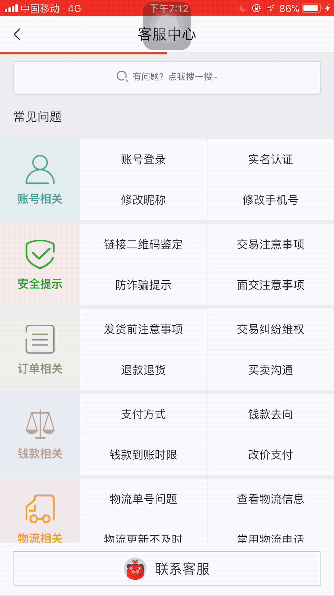

## 转转RN工程化历程

---

#### 选型RN理由？

> 目前各大公司技术栈都是native端（android，iOS）以及H5端，然而这两大传统的开发方式都各有优缺点，下面表格简单汇总一下。

| - | native端 | web端 | RN |
|:-----:| :------: |:----:| :---: |
| 开发效率| 低   | 高   | 中 |
| 性能| 高   | 低   | 高 |
| 灵活性| 低   | 高  | 高 |
| 接入成本| 高  | 低  | 低 |

从上面表格中可以看出native端高性能的代价是低开发效，低灵活性以及接入的高成本，主要归咎于需要同时开发android和iOS两套代码，而且上线成本高。H5的开发方式，受限于webView容器的瓶颈，在页面体验上和native有较大的差距。而RN就是整合native和H5的优点诞生的幸运儿。

#### RN的痛点

1. 稳定版本是0.53,嗯，大版本还没有到1。RN发版频率基本5天一个小版本，所以如果线上环境跟随RN一起升级版本，只会疲于奔命，现在RN做的时间相对长一些的公司，比如去哪儿网，58，腾讯的RN版本基本都是在0.50以下，选择一个版本深度定制化。转转做RN是从17年4月份开始的，我们刚开始做RN选择0.44.0版本，后来因为android系统8的出现，RN0.50才开始支持android8，所以我们果断升级为RN0.50.3。
2. RN框架不支持web端。转转结合社区定制化了自己的转转三端同步方案。
3. RN原生不支持热更新，虽然有一些比较成熟的比如微软的CodePush。
4. RN原生的API不足，比如视频上传，播放，文件上传等功能不支持。

如上痛点决定了想要像开发H5一样，顺手的开发RN项目，提前还需要做一番准备，工欲善其事，必先利其器。

#### 拆分打包以及加载顺序

> 在RN0.50.3基础上，把base部分拆分出来，每个业务线有自己对应的bundle。加载过程是，刚启动App的时候，预加载base部分，同时开始进行热更新逻辑，但进入具体RN业务线的时候，开始加载业务线自己对应的bundle。

#### 热更新 + 集成开发

> 如果没有热更新，感觉RN就失去了至少50%的价值，所以我们做了热更新管理系统，这个系统负责打包上线，管理bundle等功能。
> 热更新是通过native端调用接口，从cdn上得到下发的各业务线bundle，然后加载。

#### 三端同步

> 我们三端同步实现方式是，通过webpack把RN开发项目，通过三端框架打包成H5项目，把诸如View，Text等native标签渲染为div，span等html规范标签。

#### 实践中摸索
对RN的实践，目前我们主要经历两个阶段，第一个阶段我称作“大而全时代”，代表项目是转转内部的“客服中心”。第二个阶段我称作“删繁就简时代”，代表项目是“有好货”，下面从技术栈，路由，导航栏，是否拆包和RN版本等几个维度进行比较。

| - | 客服中心 | 有好货 |
|:-----:| :------: |:----:|
| 技术栈| RN + redux + react-navigation  | RN   |
| 是否拆包| 否   | 是   |
| 是否利用路由| 是，利用react-navigation提供的路由   | 否，利用native跳转  |
| RN版本| 0.44.0  | 0.50.3  |
| 是否利用native导航栏| 否，利用react-navigation提供的导航栏  | 否  |

客服中心：
 

有好货：


具体介绍：

客服中心是我们将RN应用到工程中的一次试点项目，从上图中可以看出页面之间跳转是非常频繁的，因此我们选择了react-navigation作为路由框架（单页面做多了，习惯了路由），同时利用redux管理全局的数据。后来, 因为跳转定位到指定页面的需求，我们放弃了前端路由的方案，统一利用native提供的跳转实现页面跳转，同时每个页面对应一个moduleName。

无限列表如何设计：

具体到项目里，有好货项目从截图中看出，页面整体滚动，当滚动过头图的时候，下拉组件部分吸顶，继续滚动的话，商品列表开始滚动。那么这种双层滚动的页面该如何设计呢？最开始我们通过在最外层用ScrollView包裹，然后商品列表是另一个ScrollView。

```
// 外层滚动组件
<ScrollView>
  <Image />
  <View />
  // 商品列表滚动组件
  <ScrollView>
  </ScrollView>
</ScrollView>
```
上面这种设计如果通过native端解决嵌套滚动的问题的话，貌似可以实现效果，但是如果内部的商品列表滚动组件我们用FlatList实现呢？

```
// 外层滚动组件
<ScrollView>
  <Image />
  <View />
  // 商品列表滚动组件
  <FlatList>
  </FlatList>
</ScrollView>
```
基本功能是可以实现的，但是滚动列表的时候通过AndroidStudio查看内存消耗情况，会发现内存一直在上涨，没有利用到FlatList的回收机制，原因是外层的ScrollView的OnScroll事件屏蔽了FlatList的OnScroll事件，导致FlatList的内存回收失效。所以我们舍弃了ScrollView嵌套FlatList的方式，丢掉ScrollView，只用FlatList来包裹，同时，把之前FlatList的兄弟组件作为FlatList组件的renderItem方式引入。

这样的做法就让滚动直接触发FlatList的事件, 利用FlatList的性能优势, 来解决这个问题, 释放了多屏滚动所消耗的内存, 使浏览页面如丝般顺滑, 具体就像下面这样：

```
// 商品列表滚动组件，Image组件和View组件都包含在FlatList组件中
<FlatList>
</FlatList>
```
具体实现方式是通过在renderItem函数中，通过data的type类型决定渲染不同的item组件。

```
renderItem ({item, index}) {
    const {isLoading} = this.state;
    switch (item.type){
        case "Picbanner":
            const {banners} = item;
            return (
                <PicBanner data={item.banners} callback={(height) => (this._picBannerHeight = height)} />
            );
        case "tabMenus":
            const {selectMenu, tabs} = item;
            return (
                <View>
                    <SelectMenu 
                        menu={selectMenu} 
                        changeMenu={(clickOpts) => this.handleClick(clickOpts)} 
                        handleSortCall={(sortPart) => this.handleSortCall(sortPart)}
                        handleBackupPress={() => this.handleBackupPress()}
                    />
                </View>
            );
        default:
            return (
                <Item key={index} item={item} onPressItem={this._onPressItem}></Item>
            )
    }
}
```

这样做的好处是既可以避免Native端提供嵌套滚动组件，也可以充分利用FlatList的内存回收功能。

说到这, 感觉告一段落了, 我们需要做的还有很多, 包括我们考虑RN应该最适用于什么场景, 或者说究竟我们没有遇到的坑到底有多少, 再换个角度说我们究竟解决什么问题和提高了多少效率, 这些都是我们后面要继续探索和思考的问题。也希望大家积极的给我们提一些意见和想法, 也欢迎大家加入我们的团队, 大家一起学习进步。