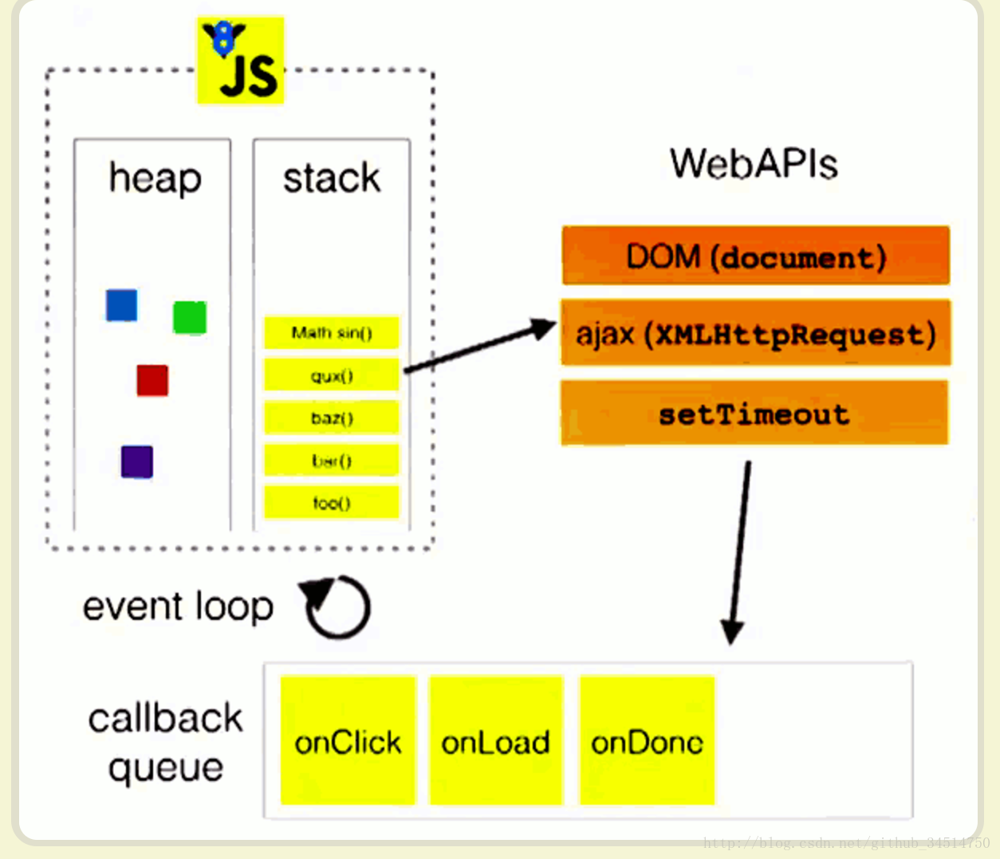
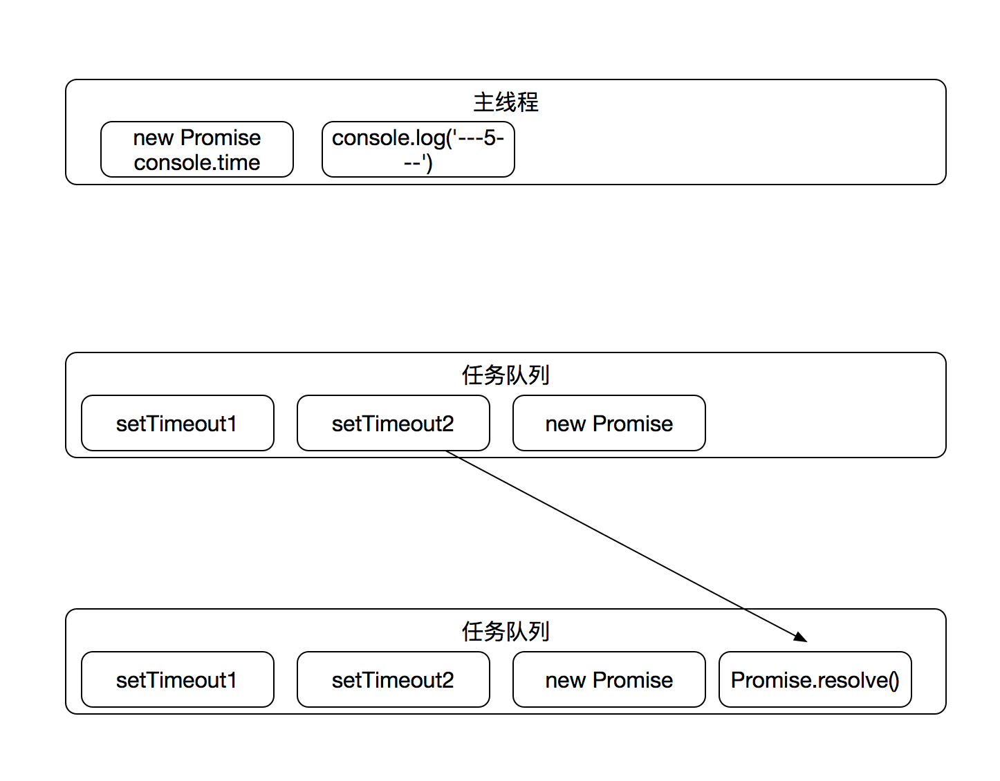

## 浏览器内的线程
 
 众所周知JavaScript是基于单线程运行的，同时又是可以异步执行的，一般来说这种既是单线程又是异步的语言都是基于事件来驱动的，恰好浏览器就给JavaScript提供了这么一个环境
 
```javascript
setTimeout(function(argument) {
  console.log('---1---')
}, 0)

console.time("test")
for (var i = 0; i < 1000000; i++) {
  i === (100000 - 1)
}
console.timeEnd("test")

console.log('---2---')
```

在我电脑上输出的是:

>test: 5.4892578125ms

>---2---

>---1---

咦，它不讲道理啊，明明我设置的是0毫秒之后打印‘---1---’的

有情况，打开[前端圣经](https://developer.mozilla.org/en-US/docs/Web/API/WindowOrWorkerGlobalScope/setTimeout)瞧瞧，里头有句话：

This is because even though setTimeout was called with a delay of zero, it's placed on a queue and scheduled to run at the next opportunity; not immediately. Currently-executing code must complete before functions on the queue are executed, thus the resulting execution order may not be as expected.

原来setTimeout的等待时间结束后并不是直接执行的而是先推入浏览器的一个任务队列，在同步队列结束后在依次调用任务队列中的任务。

这就牵涉到浏览器的几个线程了，一般来说浏览器会有以下几个线程

1. js引擎线程 （解释执行js代码、用户输入、网络请求）

2. GUI线程  （绘制用户界面、与js主线程是互斥的）

3. http网络请求线程  （处理用户的get、post等请求，等返回结果后将回调函数推入任务队列）

4. 定时触发器线程   （setTimeout、setInterval等待时间结束后把执行函数推入任务队列中）

5. 浏览器事件处理线程  （将click、mouse等交互事件发生后将这些事件放入事件队列中）


## JavaScript函数的执行栈及回调


```JavaScript
function test1() {
  test2()
  console.log('大家好，我是test1')
}

function test2() {
  console.log('大家好，我是test2')
}

function main() {
  console.log('大家好，我是main')
  setTimeout(() => {
    console.log('大家好，我是setTimeout')
  }, 0)
  test1()
}

main()
```
执行结果如下:

>大家好，我是main

>大家好，我是test2

>大家好，我是test1

>大家好，我是setTimeout

当我们调用一个函数，它的地址、参数、局部变量都会压入到一个 stack 中

step1：main()函数首先被调用，进入执行栈打印‘大家好，我是main’

step2：遇到setTimeout，将回调函数放入任务队列中

step3：main调用test1，test1函数进入stack中将被执行

step4：test1执行，test1调用test2

step5：test2执行，打印‘大家好，我是test2’

step6：test2执行完毕从stack弹出回到test1，打印‘大家好，我是test1’

step6：主线程执行完毕，进入callback queue队列执行setTimeout的回调函数打印‘大家好，我是setTimeout’  至此整个程序执行完毕，不过event loop一直在等待着其他的回调函数。

用代码表示的话大概是这样

```
while (queue.waitForMessage()) {
  queue.processNextMessage()
}
```

这个线程会一直在等待其他回调函数过来例如click、setTimeout等

用一张图来表示如下所示:

 


## macrotask 与 microtask

接下来看段代码想想这个的运行结果是怎样的

```JavaScript
  setTimeout1 = setTimeout(function() {
    console.log('---1---')
  }, 0)

  setTimeout2 = setTimeout(function() {
    Promise.resolve()
      .then(() => {
        console.log('---2---')
      })
    console.log('---3---')
  }, 0)

  new Promise(function(resolve) {

    console.time("Promise")
    for (var i = 0; i < 1000000; i++) {
      i === (1000000 - 1) && resolve()
    }
    console.timeEnd("Promise")

  }).then(function() {
    console.log('---4---')
  });

  console.log('---5---')
```

在上面我们有分析到浏览器会将异步的回调函数放进一个任务队列中去，按照此思路分析当程序运行的时候首先会遇到setTimeout函数，并将setTimeout的回调函数放入任务队列中去，继续往下执行又会遇到个setTimeout函数，不过这个setTimeout的回调函数有些例外，回调函数中又有个Promise对象，不过这个咱暂且不管等到任务队列里头轮到它执行再说，接下来浏览器的解释器会遇到个正在new Promise对象的操作，这个总算不是异步执行的了，首先会开始一个程序运行计时器，随后会输出从0自增到1000000所用的时间，在i = 999999时，Promise的状态会变成resolve随后将resolve所要执行的回调函数推入任务队列，最后执行到程序末尾，此时输出的是‘---5---`。

按照上面的分析我们的程序输出顺序是：   

>程序从0自增到1000000所需要的时间

>---5---

>---1---

>---3---

>---4---

>---2---

用一张图来表示如下所示：

 

接下来给扔浏览器里头执行一遍看下结果，结果如下：

>Promise: 5.151123046875ms

>---5---

>---4---

>---1---

>---3---

>---2---


### why

因为浏览器的任务队列不止一个，还有 microtasks 和 macrotasks

microtasks:

* process.nextTick
* promise
* Object.observe
* MutationObserver

macrotasks:

* setTimeout：
* setInterval
* setImmediate
* I/O
* UI渲染

据whatwg[规范介绍](https://html.spec.whatwg.org/multipage/webappapis.html#task-queue)：

* 一个事件循环(event loop)会有一个或多个任务队列(task queue)
* 每一个 event loop 都有一个 microtask queue
* task queue == macrotask queue != microtask queue
* 一个任务 task 可以放入 macrotask queue 也可以放入 microtask queue 中
* 调用栈清空(只剩全局)，然后执行所有的microtask。当所有可执行的microtask执行完毕之后。循环再次从macrotask开始，找到其中一个任务队列执行完毕，然后再执行所有的microtask，这样一直循环下去

so，正确的执行步骤应该为：

step1：执行脚本，把这段脚本压入task queue，此时
      
      stacks: []
      task queue: [script]
      microtask queue: []

step2：遇到setTimeout1，setTimeout可当作一个task，所以此时

      stacks: [script]
      task queue: [setTimeout1]
      microtask queue: []

step3：继续往下执行，遇到setTimeout2，将setTimeout2压入task queue中

      stacks: [script]
      task queue: [setTimeout1，setTimeout2]
      microtask queue: []


step4：继续往下执行，new Promise，按同步流程往下走，输出new Promise内的执行时间

      stacks: [script]
      task queue: [setTimeout1，setTimeout2]
      microtask queue: []
      

step5：在i = 99999的时候，resolve()发生，把回调成功的代码段压入microtask queue，此时

      stacks: [script]
      task queue: [setTimeout1，setTimeout2]
      microtask queue: [console.log('---4---')]
     

step6：继续往下执行就是console.log('---5---')，此时stacks队列里头的任务结束
   
      stacks: []
      task queue: [setTimeout1，setTimeout2]
      microtask queue: [console.log('---4---')]


step7：stacks队列为空，此时事件轮询线程会将microtask queue队列里头的任务推入stacks中去，然后执行输出’---4---‘
 
      stacks: []
      task queue: [setTimeout1，setTimeout2]
      microtask queue: []

step8：stacks队列又为空了且microtask queue队列也是空着的，这时就会开始执行task queue里头的任务了，首先是setTimeout1，输出’---1---‘
 
      stacks: [setTimeout1，setTimeout2]
      task queue: []
      microtask queue: []
      


step8：接着setTimeout2在里头遇到个Promise.resolve()，将回调成功的函数压入microtask queue队列里头，然后输出’---3---‘
 
      stacks: [setTimeout2]
      task queue: []
      microtask queue: [Promise.resolve()]
      
step9：当setTimeout2执行完毕之后执行microtask queue，输出’---2---‘，至此该代码段执行完毕
 
      stacks: []
      task queue: []
      microtask queue: []
      

用一句话简单的来说：**整个的js代码macrotask先执行，同步代码执行完后有microtask执行microtask，没有microtask执行下一个macrotask，如此往复循环至结束**

