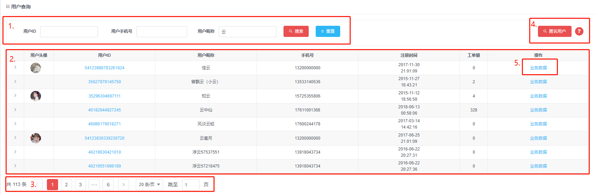

## 行星工单系统部分实现(1)-流程控制

### 1.工单系统的表格页
工单系统是一种网络软件系统，根据不同组织，部门和外部客户的需求，来由针对的管理，维护和追踪一系列的问题和请求。大多用于记录、处理、跟踪一项工作的完成情况。
为使客服同学有序、协同处理客户问题,客服技术团队打造了多渠道整合的，可灵活配置的，便于流转的行星工单系统。

由于工单系统从属后台系统,页面展示基本以如下表格页为主.为统一表格页行为,故将其统一封装成表格页组件.

表格页组件分为如下几块:

1. 筛选项区域
2. 表格主体
3. 分页组件
4. 操作按钮
5. 行内操作链接



其中分页组件可通过向表格页组件传入标志来控制其显示状态、筛选项区域及表格主体内容可通过向表格页组件传入表格列配置及表单项配置实现不同页面间各异的逻辑。

但由于操作按钮、行内操作链接的逻辑各页基本不同，无法将其封入表格页组件。因此采用事件处理这部分逻辑从列表页组件中解耦，我们将不同表格页按钮操作名称作为唯一标识，在入口文件中将系统全量事件集注册到全局，将标识与事件集中事件建立起对应关系，以此实现上述需求。

然后我们发现，这些操作按钮的逻辑，基本为以下几类行为的聚合：

- 弹出提示框让用户操作
- 弹出表单类组件获取一部分数据
- 表单及其他数据校验
- 调用接口去拉取/更新数据

而且比较重要的一点是,它们都是串行的。如编辑用户的操作：

- 从接口拉取用户数据
- 弹出表单组件将数据填入同时供用户修改
- 校验用户提交数据
- 调用接口提交数据。

这几步操作中，如果流程中某一节点的行为出现问题，比较合理的处理方案是截停流程，并抛出一个错误响应给开发者或用户。所以根据这个处理思路，我们建立工单系统的流程控制方案。

### 2.简单的管道

论及串行执行流程行为，并将当前行为的执行结果作为下一行为的参数的操作，我们首先想到的是vue及angular中的管道。下面我们用Array.reduce去实现一个简单的管道.

```javascript
const grep = ({srcData, fnList, context}) => fnList.reduce((dist, currFn) => currFn.call(context, dist), srcData)
```

此函数逻辑很简单,即遍历行为集，取各项行为执行，再借用reduce特性将上一行为结果传入下一行为。据此，我们用类管道函数实现了简单的流程控制。

如下调用:

```javascript
function filterLessThanFive(srcData){ //[1,3,4,6,7,8] => [1,3,4]
    return srcData.filter(item => Number.isInteger(item) ? item > 5 : false)
}
function sum(srcData){ // [1,3,4] => 1+3+4 => 8
    return srcData.reduce((dist,item) => dist+(parseInt(item, 10)), 0)
}
function plusOne(srcData){ // 8+1 => 9
    return srcData+1
}
const fnList = [filterLessThanFive, sum, plusOne]
const srcData = [1,3,4,6,7,8]
const res = grep({context:this, fnList, srcData}) 
```

注意: 

1.由于grep内部强制更改fnList的上下文,故fnList内部函数不可用箭头函数及bind进行上下文绑定

2.为了灵活适应需求,不强制规范流转数据格式,或造成多次遍历等性能浪费,由于前端数据量较小,故不考虑性能问题.

### 3.流程控制

但是管道有两个不能解决的问题:

1.不能处理异步需求：如需求为接口返回结果之后,将结果作为下一个函数的参数。鉴于fnList（流程行为集）中如果存在异步函数，那么异步流程行为函数在流程中不能流转数据或仅能流转promise对象吗，无法完成上述需求。

2.当前流程节点行为只能获取上个流程节点行为执行结果：我们需要更灵活的获取之前行为结果的方式，如跨节点获取、多节点获取。

为解决以上两点我们初步构建事务流处理函数如下：

```javascript
export async function actionFnSimple(actionList, eventMap) {
    const that = this // 获取组件上下文
    const defaultEventMap = { ...eventMapSrc, ...this }// 默认行为集
    const eventActionMap = eventMap || defaultEventMap
    const result = await actionList
    .reduce(async (cache, actionItem) => {
        const { actionKey, from = '' } = actionItem
        const ownParams = getRestObj(actionItem, ['actionKey', 'from'])
        const cacheReal = cache.then ? await cache : cache //初次非promise
        const { continueStatus: prevContinueStatus, resultCache: prevResultCache } = cacheReal //continueStatus继续执行标识   resultCache各个行为运行结果缓存
        const paramsFromCache = prevResultCache[from]
        const params = paramsFromCache ? objDeepMerge(ownParams, paramsFromCache) : ownParams // 混合两个源的参数
        const actionFn = eventActionMap[actionKey] 
        let result = prevContinueStatus && await actionFn.call(that, params, stateObj, prevResultCache) // 显式指定行为上下文为当前页面vue实例
        result = result === undefined ? true : result
        const continueStatus = prevContinueStatus && !!result
        const resultCache = { ...prevResultCache, [actionKey]: result }
        return { continueStatus, resultCache }  // 更新运行标识和缓存
    }, { continueStatus: true, resultCache: resCache || {} })
}
```

此函数通过同类管道函数grep一样，借助Array.reduce遍历传入的配置数组(actionList)，从每项配置(actionItem)中取得行为标识(actionKey)后，从通用行为库(eventMap)和上下文中获取到当前行为(actionFn)去执行当前行为。

不同之处在于,grep仅流转操作后的数据.而此函数通过流转:

1.继续执行标志 （continueStatus），并在执行当前行为（actionFn）前校验此标志，来实现出现异常后停止后续行为的操作。

2.全部行为返回的结果的缓存 （resultCache），并结合从每项配置（actionItem）中获取参数来源（from）来灵活指派其传参，使当前行为的传参不拘泥于仅为上一行为执行结果。

另外对于当前事务为异步的情况，我们利用async的特性（1.表象为同步处理 2.返回promise ），并将其用到reduce处理函数中。最终将reduce中每项的处理函数揉为一个整体promise

现在我们的流程控制函数初具雏形,其调用方式如下：

```javascript
function deleteUser(that, params = {}) {
    const { id, name } = params
    const config = [
        {
            actionKey: 'showConfirmModal', msg: `确认删除员工：【${name}】?`
        },
        {
            actionKey: 'simpleReq',
            url: '/user/transfer/removeUser',
            data: { userId: id },
            otherOption: {
                errorMsg: '用户删除失败!',
                succMsg: '用户删除成功!'
            }
        },
        {
            actionKey: 'initTable',
        },
    ]
    actionFnSimple.bind(that, config)
}
```

其中showConfirmModal,simpleReq取自通用行为集， initTable取自事件触发组件的methods， 如下：

```javascript
const eventActionMap = { // 截取部分通用行为集
     showConfirmModal(params) {
        const { msg = '确认执行当前操作?', title = '提醒' } = params
        return new Promise(resolve => {
            const onOk = () => {resolve(true)}
            const onCancel = () => {resolve(false)}
            Modal.confirm({ title, content: msg, onOk, onCancel })
        })
    },
     async simpleReq(params) {
        let { url, data, resPath = [], otherOption } = params
        const res = await fetchApi(this, url, data, otherOption)
        const resData = getIn(res, resPath, {})
        if (!res) return false
        return { data: resData }
    },
}
```


### 4.更灵活的流程控制

虽然我们的流程控制函数可以处理简单需求，但是将其应用于处理复杂需求还需要解决以下几点问题：

1.行为只能通过通用行为库及组件上下文提供，过于单一。如map后端数据这种无需复用的行为存入行为库较为不妥，又因其不属于组件逻辑，故也不能放入组件中。因此需建立用户手动指定行为（customFn）以解决此问题。

2.由于行为结果缓存以actionkey作为唯一标识，流程中若引用多个通用行为会造成同名结果缓存被覆盖,，故引入别名(alias)机制以区分引用多个通用行为结果缓存的问题。

2.行为传参通过from标志指定,，from仅能指定单行为。如果有从多处表单取值校验并请求接口的需求，则无法实现。一种解决方案是判断from内容，若为全量标志(建议用symbol建议避免与actionKey冲突)，则将各行为结果缓存(resultCache)传入。但此解决方案会向行为传入冗余参数。 另一种方案是允许from为数组，通过from数组中的actionkey去resultCache中取得所需行为的结果,，再传入当前行为。两种方案皆可实现此需求,，鉴于第二种方案没有冗余传参,此处我们采用方案二。

据此我们得到流程控制函数如下：

```javascript

export async function actionFnSimple(actionList, eventMap) {
    const that = this 
    const defaultEventMap = { ...eventMapSrc, ...this }
    const eventActionMap = eventMap || defaultEventMap
    const result = await actionList
    .reduce(async (cache, actionItem) => {
        const { actionKey, from = '', customFn, alias } = actionItem
        const ownParams = getRestObj(actionItem, ['actionKey', 'from', 'customFn'])
        const cacheReal = cache.then ? await cache : cache 
        const { continueStatus: prevContinueStatus, resultCache: prevResultCache } = cacheReal 
        const paramsFromCache = Array.isArray(from) ? from.reduce((dist, fromItem) => ({ ...dist, [fromItem]: prevResultCache[fromItem] }), {}) : prevResultCache[from] // 新增支持指定多个from
        const params = paramsFromCache ? objDeepMerge(ownParams, paramsFromCache) : ownParams
        const actionFn = isFunction(customFn) ? customFn : eventActionMap[actionKey] // 新增支持自定义行为
        let result = prevContinueStatus && await actionFn.call(that, params, stateObj, prevResultCache) 
        result = result === undefined ? true : result
        const continueStatus = prevContinueStatus && !!result
        const resultCache = { ...prevResultCache, [alias || actionKey]: result } // 新增别名机制
        return { continueStatus, resultCache } 
    }, { continueStatus: true, resultCache: resCache || {} })
}
```

### 5.错误处理机制

我们的流程处理函数虽然可以处理复杂逻辑，且可以通过在流程节点的行为里返回false去截停流程。但在截停流程后，并未对用户作出反馈。且当行为产生异常时(逻辑错误返回false)，并不能及时反馈给用户，也并未在控制台输出日志， 这样对用户、开发者都不友好。

故当流程节点行为返回false时，我们引入错误处理机制如下：

- 触发此节点配置文件中的onError函数
- 向控制台输出错误日志

```javascript
export async function actionFnSimple(actionList, eventMap) {
    const that = this
    const defaultEventMap = { ...eventMapSrc, ...this }
    const eventActionMap = eventMap || defaultEventMap
    const result = await actionList
    .reduce(async (cache, actionItem) => {
        const { actionKey, from = '', customFn, alias } = actionItem
        const ownParams = getRestObj(actionItem, ['actionKey', 'from', 'customFn'])
        const cacheReal = cache.then ? await cache : cache
        const { continueStatus: prevContinueStatus, resultCache: prevResultCache } = cacheReal 
        const paramsFromCache = Array.isArray(from) ? from.reduce((dist, fromItem) => ({ ...dist, [fromItem]: prevResultCache[fromItem] }), {}) : prevResultCache[from]
        const params = paramsFromCache ? objDeepMerge(ownParams, paramsFromCache) : ownParams 
        const actionFn = isFunction(customFn) ? customFn : eventActionMap[actionKey] 
        let result = prevContinueStatus && await actionFn.call(that, params, stateObj, prevResultCache)
        result = result === undefined ? true : result
        const isError = prevContinueStatus && !result
        if(isError && onError){ // 新增错误处理机制
            const errorIsText = typeof onError === 'string'
            const errorConsoleText = `CONTEXT_NAME: ${that.name};ACTION_NAME: ${alias||actionKey}`
            console.log('ACTION_FN_ERROR', errorConsoleText, params, result)
            if(onError){
                errorIsText ? (()=>{that.$Message && that.$Message.error(onError)})() : onError()
            }
        }
        const continueStatus = prevContinueStatus && !!result
        const resultCache = { ...prevResultCache, [alias || actionKey]: result }
        return { continueStatus, resultCache }
    }, { continueStatus: true, resultCache: resCache || {} })
}
```

### 6.TODO

鉴于继续执行标志及行为结果缓存的共享特性， 可将流程处理函数主体作为方法封入class，继续执行标志及行为结果缓存可作为class属性来实现其共享。

流程处理函数核心通过promise流来实现，可改用事件流的形式。
