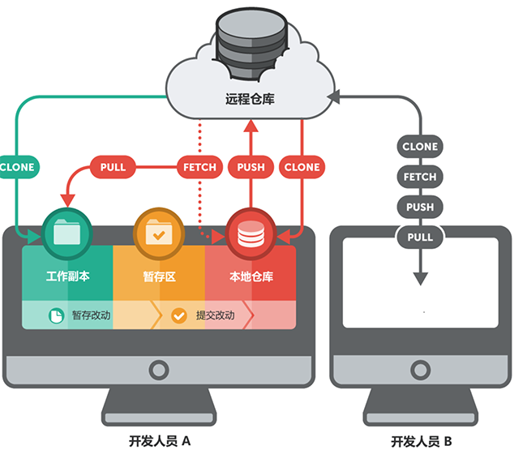
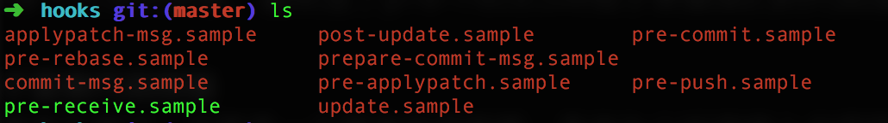
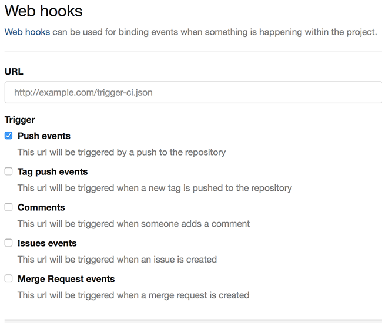
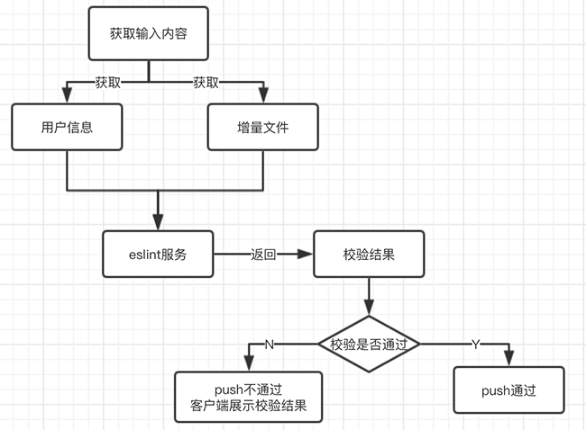
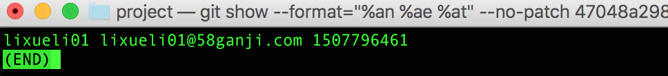
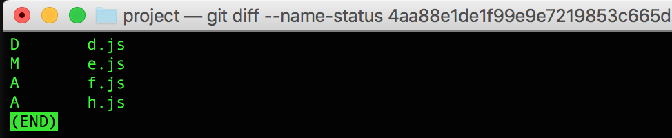

在git上如何强推代码规范
====================

### 引言

>  最近参加了“前端规范制定topic”小组，小组成员一起制定了html、css、js、es6、vue和react等规范，但规范制定好了怎么进行推广去强制执行呢，已知我们的项目都是用git做管理的，所以马上想到在git上做文章，本文讲述的就是如何在git上推行代码强校验。

### git知识点

说到git，我们先来了解下平时项目中不是很关注的几个git概念.

**git仓库**

git是分布式版本管理系统，可以有多个代码仓库，所有参与项目的开发者都可以拥有自己的本地仓库，每一个本地仓库都是一个完整的版本库，即使不联网，也可以任意的进行开发、创建分支、commit和查看版本的历史提交记录等。

但每个人都在自己的本地仓库开发，怎么做到代码共享和同步呢？在我们的项目中，通常都会建立一个大家都可以访问的共享仓库，这个共享仓库放在一个专门的线上服务器上，我们也叫它远程仓库。远程仓库和本地仓库的唯一差别就在于它是裸仓库，就是不包含任何工作目录，仅仅是由 “.git” 目录组成的。它作为服务器仓库供各开发者push、pull数据，实现数据共享和同步，不保存文件，只保存历史提交的版本信息等。



**git存储方式**

说完git仓库，我们来了解下git的存储方式。git存储数据更像是把数据看作是对小型文件系统的一组快照，每次提交更新或者是保存项目状态时，它主要对现有的文件制作一个快照并保存这个快照的索引。这个“快照”就是git对象，而“快照的索引”就是对象名。所有用来表示项目历史信息的文件,都是通过一个40字符的（40-digit）“对象名”来索引的。对象名看起来像这样的：26e5847434caa7597c4088de8ecab9cd567957d1。

在git里，每一个“对象名”都是对“对象”内容做 SHA-1哈希计算得来的， SHA-1是一种密码学的hash算法，这样在每个仓库中不同内容的对象就会有不同的对象名。git有四种类型的对象："blob"、"tree"、 "commit" 和”tag”：
-  “blob”用来存储文件数据，没有文件名，只有内容
-  “tree”有一串指向blob对象或是其它tree对象的指针，它一般用来表示内容之间的目录层次关系
-  “commit” 指向一个"tree对象", 并且带有相关的描述信息，如提交者、提交时间、注释等等
-  “tag”用来标记某一个提交(commit) 的方法

所以下面所描述的获取文件信息基本上都是通过各种git命令操作hash对象名来获取的，这也是为什么在这里介绍“git存储方式”的原因，方便大家更深刻的了解git命令。

**作用域**

由git仓库的定义可以看出，本地仓库因为是本地的，任何能接触得到仓库的人都可以进行修改、删除等，所以本地仓库不适合做代码强校验。那只能考虑远程仓库了，可以当用户push推送的时候，校验代码，如果不符合规范，就拒绝这次提交，虽然你不能阻止开发者写出糟糕的代码，但可以防止这些代码流入官方的代码库。

**git钩子**

好了，确定了规范在服务端仓库上来强推行，但怎么做到当用户push动作触发的时候去做一下代码强校验呢，经过调研发现，git钩子正好解决了我们的这个问题。

什么是git钩子呢？git钩子是在git仓库中特定重要动作发生时自动运行的脚本，它可以让你自定义git内部的行为，在开发周期中的关键点触发自定义的行为。这样来说，git钩子就可以帮我们来推行规范了。

git钩子到底什么样呢，它存在于每个git仓库的.git/hooks目录中，当你观察.git/hooks时，你会看到下面这样的文件：



hooks目录下展示的钩子并不全，这里带simple后缀的只是git的大部分钩子，.sample拓展名防止它们默认被执行，想要运行一个钩子，去掉后缀名或者在git官网查看相应钩子名称添加新文件即可。

* **钩子分类**

    按照钩子的定义，hooks下的钩子可分为本地钩子和服务端钩子两类。本地钩子基本由提交和合并这样的操作所调用，而服务器端钩子主要用于接收推送这样的联网操作。上面“作用域”部分已经提到，我们只能在服务端仓库做代码强校验，所以接下来主要研究服务端钩子。

* **钩子语言**

    这些钩子就是git内置的一些脚本，内置的脚本大多是shell和perl语言的，但你可以使用任何脚本语言，只要它们最后能编译到可执行文件。本人对python比较熟，所以整个的开发用的是python语言。

### git服务端钩子

由上面的git知识点一步步看下来，我们就可以确定了代码校验合适的地方是在服务端钩子上，但服务端钩子也有好多，我们的代码规范要在哪个钩子做比较合适呢，接来下就具体介绍下服务端最有用的3个钩子，并找出一个适合我们的钩子。

* **pre-receive**

这个脚本在git push向远程仓库推送操作时，最先被调用。它没有参数，但是可以从标准输入获取一系列的推送引用。如果它以非零值退出，所有的推送内容都不会被接受，所以这是强制推行开发规范的好地方。

```
#!/usr/bin/python
# -*- coding: utf-8 -*-

import re,fileinput

for file_line in fileinput.input():
    #从标准输入可以获取三个值
    #推送前的引用指向的内容的SHA-1值，用户准备推送的内容的SHA-1值，引用的名字（分支）
    old_hash,new_hash,branch = re.split(r'\s+', file_line.strip('\n'))
# 放弃推送
# sys.exit(1)
```

* **update**

update脚本和pre-receive脚本十分类似，不同之处在于它会为每一个准备更新的分支各运行一次。假如推送者同时向多个分支推送内容，pre-receive只运行一次，相比之下update则会为每一个被推送的分支各运行一次。它不会从标准输入读取内容，而是会接受三个参数，这三个参数信息和pre-receive在标准输入读取信息相同。如果update脚本以非零值退出，只有相应的那一个引用会被拒绝；其余的依然会被更新。

```
#!/usr/bin/python
# -*- coding: utf-8 -*-

import sys
#接受三个参数
#引用的名字（分支）, 推送前的引用指向的内容的SHA-1值，用户准备推送的内容的SHA-1值
branch,old_hash,new_hash = sys.argv
# 只放弃当前分支的推送
# sys.exit(1)
```

* **post-receive**

post-receive脚本在成功推送后被调用，可以用来更新其他系统服务或者通知用户，它接受与 pre-receive相同的标准输入数据。它的用途包括给某个邮件列表发信，通知持续集成（continous integration）的服务器，或者更新问题追踪系统（ticket-tracking system）等。

服务端推送成功后调用的钩子不止post-receive这一个，如上面.git/hooks图中的post-update也是其中之一，但是为什么不介绍post-update呢？原因是它的输入获取值太单一，post-receive更像是post-update的超级集合，所以推送成功后的调用我们一般用post-receive。

我们经常用到的gitlab中的web hook就绑定了这个钩子，当然web hook是绑定了好几个不同的钩子的，post-receive只是其中一个，如下图的web hook的中的Push events事件触发的就是.git/hooks中的post-receive脚本



分析这三个钩子，我们显然选push成功前调用的钩子，那到底是选pre-receive还是update呢？考虑到我们的项目很少有一次push多个分支的场景，最终选了pre-receive钩子来做我们的代码强校验。

### 在pre-receive钩子里做代码校验

钩子选择好了，接下来就是怎么做了，下面是一个简单的流程图，具体为从标准输入中获取三个值，分别是推送前的引用指向内容的SHA-1值，用户准备推送内容的SHA-1值和分支名，我再代码里分别用变量old_hash,new_hash和branch来表示这三个值，下面有用到。根据这三个值用git命令分别获取用户信息和提交的增量文件，把这些文件推送到eslint服务上进行代码校验，校验成功就直接push通过；不成功则在客户端返回校验结果，push不通过。



根据上面的描述，重点介绍下怎么获取用户信息和增量文件

* **用户信息**

获取用户信息的目的是传给eslint服务端，在服务端可以给分析用户的行为及给用户发送邮件等
这个命令可以定制化格式只获取用户的信息

- %cn: committer name
- %ce: committer email
- %ct: committer date, UNIX timestamp
- --no-patch: 不显示提交差异

```
'git show --format="%%cn %%ce %%ct" --no-patch %s' % new_hash
```

定制化后运行的结果是下面这样的，可以获取提交者的信息：



* **增量文件**

增量文件取得是本次推送引用指向内容的SHA-1值和推送前的引用指向内容的SHA-1值中间的差值。命令如下，其中 --name-status是只取差异文件的名字和状态值

为什么不直接取本次推送引用指向内容的SHA-1值而取差值呢，原因是上次推送和本次推送中间可能隔了好几个commit，每一个commit对象都会生成一个唯一的SHA-1哈希字串的。

```
 'git diff --name-status %s %s' %(old_hash,new_hash)
```

运行后得到的结果是：



后面的就是怎么获取文件及和eslint服务通讯的问题了，在这里不是重点就略过了...

### 总结
本文可以说是我接到任务后，从只了解git的git pull、git clone、git push等几个常用命令到怎么在git上实现我们的需求的一个探索过程，希望里面的介绍对不是很熟悉git的同学有点帮助，另外也简单介绍了下我们强推规范的大致流程。后续会继续研究下gitlab和git钩子的关联关系。


  


