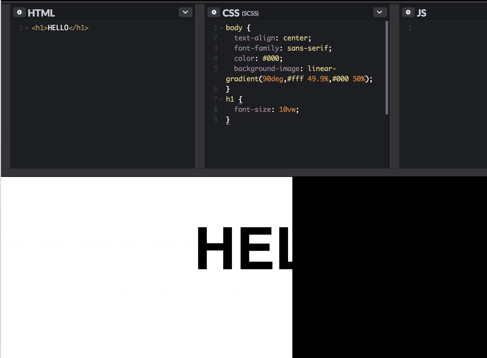
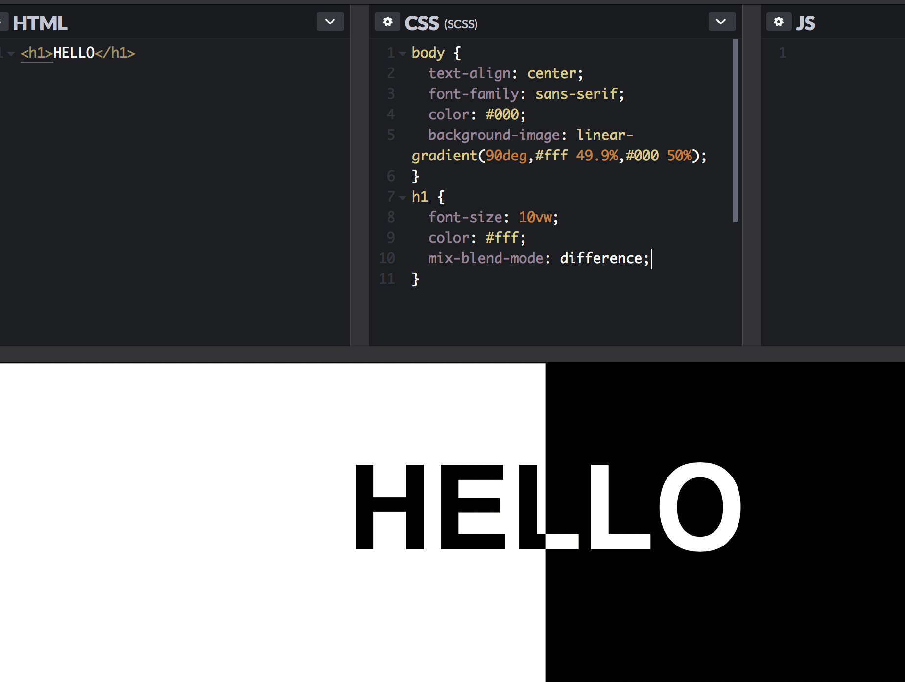
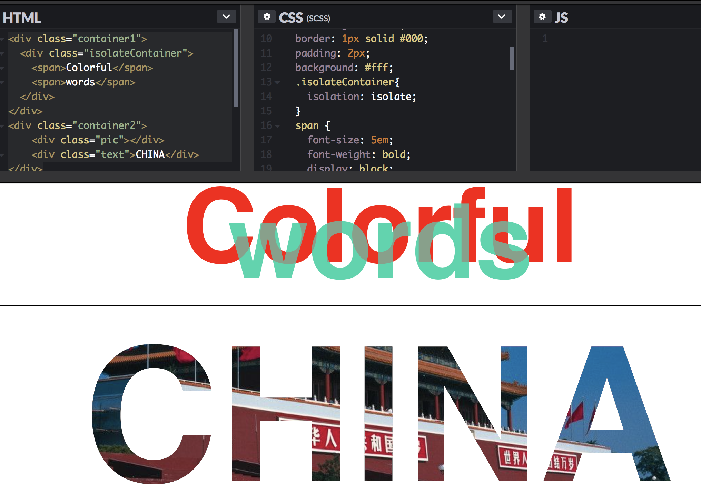
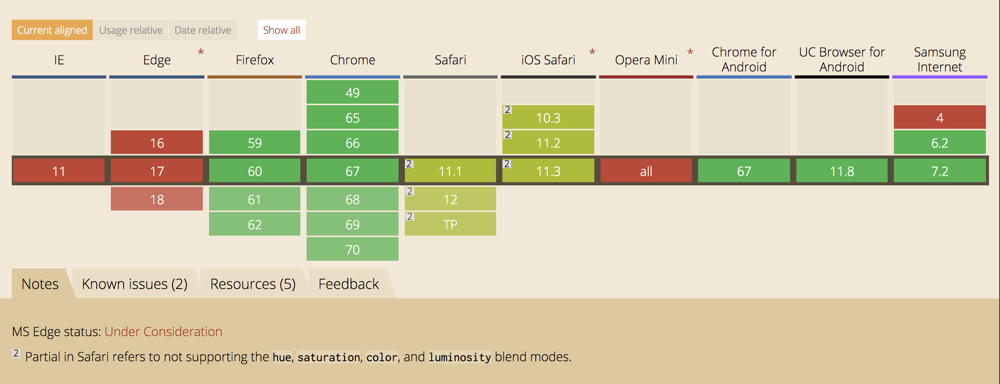

神奇的css3混合模式
---------------------
> 对于前端开发人员应该都很熟悉Photoshop的图层混合模式，就是几个图层按不同的模式进行混合，实现不同的图像效果。但是当我们前端同学在切这些效果图的时候，基本上就是一刀切的，即使是文字，当字体很炫的话，我们也不得不用切图来替代。实际上在16年CSS3就新增了一个很有意思的属性 -- mix-blend-mode，我们称之为混合模式，它类同于ps的混合模式，也就是说在CSS中我们也可以利用混合模式制作出一些效果。

#### 先引出一个小例子，我们来看下css3混合模式到底可以实现一个什么样的效果
> 有这样一个需求，当文本跨越一个与自身颜色相似的区域时，怎么实现颜色反转？

```
body {
	text-align: center;
	font-family: sans-serif;
	color: #000;
	background-image: linear-gradient(90deg,#fff 49.9%,#000 50%);
}
h1 {
	font-size: 10vw;
}

```
> 按照上面的做法，效果是这样的，“HELLO”的右半部分是完全不可见的



> 那么要想实现右半部分可见且字体显示白色，我们以往的做法无非就两种：
* 把文字变成图片
* 写一大堆css实现，总之css应该是能实现的
> 但是有了css3的混合模式，我们可以直接将文本的颜色翻转到黑色背景中，两行css代码就搞定了。

```
h1 {
	color: #fff;
	mix-blend-mode: difference; 
}

```



> 是不是很强大，很easy的就实现了我们的需求。那么在上面的例子中用到了mix-blend-mode: difference;混合模式的差值模式，到底css3有几种与混合模式相关的属性，取值又都有哪些，我们先看一下基础概念，再举一些基础应用的例子。

#### CSS3 mix-blend-mode 和 background-blend-mode

> 本节主要讲下css3混合模式的mix-blend-mode和background-blend-mode两个属性，两个属性的取值是一样的，不一样的是：

* mix-blend-model属性用来定义元素与背景的混合模式，可以是元素与背景图片的混合，也可以是元素与背景色的混合
* background-blend-mode属性用来定义背景的混合模式，可以是背景图片与背景图片的混合，也可以是背景图片和背景色的混合

> 引题的小例子就是用的mix-blend-mode属性，实现的是文本和背景图的混合。下面介绍一下混合模式的取值情况，我们首先学习3个术语：基色，混合色和结果色。

* 基色：指当前图层之下的图层颜色。
* 混合色：指当前图层的颜色。
* 结果色：指混合后得到的颜色。

<table>
    <tr>
        <td>normal</td>
		<td>正常</td>
		<td>直接返回结果色</td>
    </tr>
	<tr>
        <td>multiply</td>
		<td>正片叠底</td>
		<td>查看每个通道中的颜色信息，并将基色与混合色复合</td>
    </tr>
	<tr>
        <td>screen</td>
		<td>滤色</td>
		<td>与“正片叠底”相反，查看每个通道的颜色信息，将图像的基色与混合色结合起来产生比两种颜色都浅的第三种颜色</td>
    </tr>
	<tr>
        <td>overlay</td>
		<td>叠加</td>
		<td>把图像的基色与混合色相混合产生一种中间色。</td>
    </tr>
	<tr>
        <td>darken</td>
		<td>变暗</td>
		<td>查看每个通道中的颜色信息，并选择基色或混合色中较暗的颜色作为结果色</td>
    </tr>
	<tr>
        <td>lighten</td>
		<td>变亮</td>
		<td>查看每个通道中的颜色信息，并选择基色或混合色中较亮的颜色作为结果色</td>
    </tr>
	<tr>
        <td>color-dodge</td>
		<td>颜色减淡</td>
		<td>查看每个通道中的颜色信息，并通过减小对比度使基色变亮以反映混合色。与黑色混合则不发生变化</td>
    </tr>
	<tr>
        <td>color-burn</td>
		<td>颜色加深</td>
		<td>查看每个通道中的颜色信息，并通过增加对比度使基色变暗以反映混合色，如果与白色混合的话将不会产生变化</td>
    </tr>
	<tr>
        <td>hard-light</td>
		<td>强光</td>
		<td>产生一种强光照射的效果。如果混合色比基色更亮一些，那么结果色将更亮；如果混合色比基色更暗一些，那么结果色将更暗</td>
    </tr>
	<tr>
        <td>soft-light</td>
		<td>柔光</td>
		<td>产生一种柔光照射的效果。如果混合色比基色更亮一些，那么结果色将更亮；如果混合色比基色更暗一些，那么结果色将更暗，使图像的亮度反差增大</td>
    </tr>
	<tr>
        <td>difference</td>
		<td>差值</td>
		<td>查看每个通道中的颜色信息，从图像中基色的亮度值减去混合色的亮度值，如果结果为负，则取正值，产生反相效果</td>
    </tr>
	<tr>
        <td>exclusion</td>
		<td>排除</td>
		<td>与“差值”模式相似，但是具有高对比度和低饱和度的特点。比用“差值”模式获得的颜色要柔和、更明亮一些</td>
    </tr>
	<tr>
        <td>hue</td>
		<td>色相</td>
		<td>选择基色的亮度和饱和度值与混合色进行混合而创建的效果，混合后的亮度及饱和度取决于基色，但色相取决于混合色</td>
    </tr>
	<tr>
        <td>saturation</td>
		<td>饱和度</td>
		<td>在保持基色色相和亮度值的前提下，只用混合色的饱和度值进行着色。基色与混合色的饱和度值不同时，才使用混合色进行着色处理。若饱和度为0，则与任何混合色叠加均无变化。当基色不变的情况下，混合色图像饱和度越低，结果色饱和度越低；混合色图像饱和度越高，结果色饱和度越高</td>
    </tr>
	<tr>
        <td>color</td>
		<td>颜色</td>
		<td>引用基色的明度和混合色的色相与饱和度创建结果色。它能够使用混合色的饱和度和色相同时进行着色，这样可以保护图像的灰色色调，但结果色的颜色由混合色决定。颜色模式可以看作是饱和度模式和色相模式的综合效果，一般用于为图像添加单色效果</td>
    </tr>
	<tr>
        <td>luminosity</td>
		<td>亮度</td>
		<td>能够使用混合色的亮度值进行着色，而保持基色的饱和度和色相数值不变。其实就是用基色中的“色相”和“饱和度”以及混合色的亮度创建结果色</td>
    </tr>
</table>

> 这些api是不是看着头大，我也是看了前几个还行，后面就晕了，那不妨给他们归归类

<table>
    <tr>
        <th>分类名称</th>
		<th>darken,multiply,color-burn</th>
		<th>介绍</th>
    </tr>
	<tr>
        <td>降暗混合模式</td>
		<td>亮度</td>
		<td>减色，滤掉图像中高亮色，使图像变暗</td>
    </tr>
	<tr>
        <td>加亮混合模式</td>
		<td>screen,lighten,color-dodge</td>
		<td>加色模式，滤掉图像中暗色，使图像变亮</td>
    </tr>
	<tr>
        <td>融合混合模式</td>
		<td>overlay,soft-light,hard-light</td>
		<td>不同程度的图层融合</td>
    </tr>
	<tr>
        <td>变异混合模式</td>
		<td>difference,exclusion,hard-light</td>
		<td>用于制作各种变异的图层混合</td>
    </tr>
	<tr>
        <td>色彩叠加混合模式</td>
		<td>hue,saturation,color,luminosity</td>
		<td>根据图层的色相，饱和度等基本属性，完成图层融合</td>
    </tr>
</table>

> 归类后更清晰一些，知道哪些取值大概可以实现什么效果了，好了，理论说这么多，我们还是来具体看看这些混合模式到底可以制作出来什么样的炫酷效果吧~

### 效果展示

#### * 各种文字效果
> 我们可以用mix-blend-mod制作出混合文字和文字背景图，之前做页面碰到混合文字类的，因为重叠部分显示颜色的问题，我们往往是把文字切出来一个图片实现的，现在用css3的混合模式可以轻易实现了；文字背景图也很简单，我们只需要构造出黑色文字，白色底色的文字div ，叠加上图片，再运用 mix-blend-mode即可。
> 核心代码如下，简单看一下：

 ```
 <div class="container1">
  <div class="isolateContainer">
    <span>Colorful</span>
    <span>words</span>
  </div>
</div>
<div class="container2">
  <div class="pic"></div>
  <div class="text">CHINA</div>
</div>

.container1{
  width: 100%;
  height: 200px;
  text-align: center;
  border: 1px solid #000;
  padding: 2px;
  background: #fff;
  .isolateContainer{
    isolation: isolate;
  }
  span {
    font-size: 5em;
    font-weight: bold;
    display: block;
    color: red;
    &:last-child {
      margin-top: -1em;
      color: #1AD6AC;
      mix-blend-mode: difference;
    }
  }
}
.container2 {
    position: relative;
    width: 100%;
    height: 300px;
	.pic {
		position: relative;
		width: 100%;
		height: 100%;
		background: url($img) no-repeat;
		background-position:center;
	}

	.text {
		position: absolute;
		top: 50%;
		left: 50%;
		transform: translate(-50%, -50%);
		font-size:9em;
		line-height:320px;
		width:100%;
		height:100%;
		font-weight:bold;
		text-align:center;
		color: #000;
		mix-blend-mode: lighten;
		background-color: #fff;
	}
}

 ```

 

 > 我们发现在混合文字的例子中，用到了isolation: isolate这个css3属性，这个属性正如其语义，就是隔离的意思，那隔离什么呢？是用来隔离mix-blend-mode元素的混合的。当元素应用了混合模式的时候，默认情况下，其会混合所有层叠顺序比其低的层叠元素。像文字混合的例子中，我们不用隔离属性的话，文字颜色还会混合白色背景，“words”显示的就不是绿色了，但是，我们就希望混合模式只用到某一个元素，不向下渗透了的话，isolation: isolate就派上用场了，它会阻断混合模式的进行，允许使一组元素从它们后面的背景中独立出来，只混合这组元素。大家有兴趣的话可以研究下这个属性。

#### * hover改变图标的颜色
> 之前我们想hover改变一个icon的颜色，基本上也是切出来两个图，原始的一个，hover后加颜色的一个来回切换的，实际上我们这样的交互应用还挺多，像“收藏”按钮、着重提示按钮等，但是有了css3混合模式，还是那句话，两行代码统统搞定这些效果，不管是渐变、纯色皆可以，下面看下渐变色hover的效果图：



#### * 动画

> 看了上面一个简单的hover动画后，我想到了之前公众号里老推的智力或者心理疲劳度测试题，就是一张图老在那动，动的你头晕，看你能坚持几秒。我们用黑白两种颜色加上css3的混合模式就能做出那种动效，我发现黑白这两种颜色在一起总能碰撞出不一样的火花，利用黑白的差值模式，可以实现这个万花筒的动效。


### 总结

> 大概介绍到这里，实际上即使已知每种混合模式的定义，也很难预测如何应用某种混合模式会影响混合元素，所以选择混合模式通常是一个反复试验的过程，但是在实验的过程中我们用纯CSS，几行代码就能实现了这些很炫的效果，是不是很奇妙。感兴趣的同学可以用这些属性做些小动画，小游戏也是极好的。
> 但这么炫的属性，用的都不是很多，很大原因也是因为兼容性的问题，我们来看一下兼容情况：



> 可以看到兼容性不是很好，所以用的时候，最好判断一下浏览器的兼容性，推荐两种方法，以上面引题的例子做说明

* 一种是用js判断兼容性

```
// JS
if ("CSS" in window && "supports" in window.CSS) {
	var support = window.CSS.supports("mix-blend-mode","difference");
	support = support?"mix-blend-mode":"no-mix-blend-mode";
	document.documentElement.className += support;
}
// CSS
h1 { color: #000; }
.mix-blend-mode body {
	background-image: linear-gradient(90deg,#fff 49.9%,#000 50%);
}
.mix-blend-mode h1 { 
	color: #fff; 
	mix-blend-mode: difference; 
}
```

* 另一种是直接用CSS中的@supports

```
@supports (mix-blend-mode: difference) {
	body {
		background-image: linear-gradient(90deg,#fff 49.9%,#000 50%);
	}
	h1 { 
		color: #fff; 
		mix-blend-mode: difference; 
	}
}
```
> 到这就介绍完了，实际上类似于混合模式的css3有意思的属性还很多，有兴趣的话我们可以一块探讨交流下~