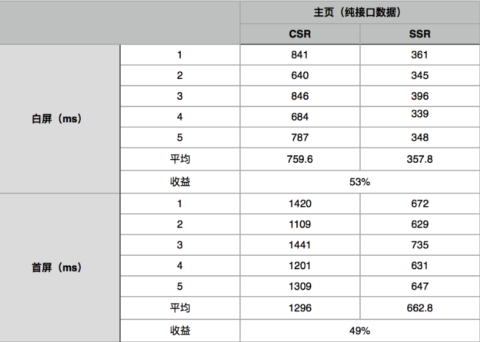

## Vue SSR不可不知的问题

本文主要介绍Vue SSR(vue服务端渲染)的应用场景，开发中容易遇到的一些问题，提升ssr性能的方法，以及ssr的安全性问题。

### ssr的应用场景

#### 1.SEO需求
SEO（Search Engine Optimization，搜索引擎优化），是一种利用搜索引擎规则，提高网站在搜索引擎内自然排名的技术。通常这需要页面内容在页面加载完成时便已经存在。SEO需求的存在与互联网技术的发展历程密不可分。在互联网产生之初，网页使用超文本链接协议，将服务器的信息传递给客户端。而后出现了专门为人们检索信息的搜索引擎。随着前端技术的不断发展，出现了前后端分离的纯前端项目，由于这类项目需要页面加载完成后再异步获取数据渲染，因此大部分搜索引擎无法获取到这类项目的内容。Vue SSR正是基于此类需求而给出的一种技术方案。利用nodejs搭建页面渲染服务，在服务端完成之前需要在客户端完成的页面渲染工作，输出给SEO更友好的页面。

除Vue SSR方案外，也可以选择Prerender（<https://github.com/prerender/prerender>）作为替代方案。Prerender和Vue SSR的相同点是都需要在服务端完成页面的渲染，不同点在于Prerender采用无界面虚拟浏览器Phantomjs去渲染输出页面，而Vue SSR是基于vue组件的渲染。相比来说Prerender的通用性更强，任何页面都适用，而Vue SSR则只适用于vue项目，但由于Vue SSR是基于代码层面的直接渲染，不需要像Prerender那样再去拉取静态资源，因此速度更快。

至于应该使用哪一种技术方案，就要视需求和实际情况取舍了。

#### 2.首屏渲染速度
如在上面SEO需求中提到的，目前前后端的分离的前端项目需要先加载静态资源，再异步获取数据，最后渲染页面，在这个过程中的前两部页面都是没有数据的，影响了首屏的渲染速度，也就影响了用户的体验。
目前对于首屏渲染速度的提升有许多方案，在ssr之外还有龙骨，墓碑，数据直出。相比于这些方案ssr方案实现是最复杂的，但效果也是最好的。

下图是项目使用服务端渲染前后的首屏加载时间对比，可以明显看出服务端渲染将白屏时间和首屏完成渲染的时间都减少了50%左右。



#### 3.Vue SSR方案的选择
目前Vue SSR的实现有两种实现，一种是基于官方Vue SSR指南文档的官方方案，一种是vue.js通用应用框架--NUXT。
官方方案具有更直接的控制应用程序的结构，更深入底层，更加灵活，同时在使用官方方案的过程中，也会对Vue SSR有更加深入的了解。
而NUXT提供了平滑的开箱即用的体验，它建立在同等的Vue技术栈之上，但抽象出很多模板，并提供了一些额外的功能，例如静态站点生成。通过NUXT可以根据约定的规则，快速的实现Vue SSR。

### 开发中容易遇到的一些问题

##### 1.一套代码两套执行环境
vue的生命周期钩子函数中， 只有 **beforeCreate**和 **created** 会在服务器端渲染(SSR)过程中被调用，这就是说在这两个钩子函数中的代码以及除了vue生命周期钩子函数的全局代码，都将会在**服务端和客户端两套环境**下执行。如果在两套环境的代码中加入具有副作用的代码或访问特定平台的API，将出现各种问题。比如服务端没有window、document对象， 如果加了对这个对象的引用和操作，将在服务端引起报错中断。

因此，总结起来，最容易犯的错误就是不判断环境就去使用window、document对象。

解决方案：

（1）在beforeCreate，created生命周期以及全局的执行环境中调用特定的api前需要**判断执行环境**；

（2）使用adapter模式，写一套adapter**兼容不同环境的api**。

##### 2.服务端数据的预获取
官方方案使用**Vuex**在服务端预获取数据。
在服务端添加vue钩子函数，获取数据后，将数据保存在vuex的store结构中，同时渲染页面。

在数据预获取阶段注册的钩子函数中，最好只进行数据的获取和保存，不进行其他任何涉及this的操作。因为此时的this是服务端的this，是所有用户共享的this，进行操作将发生一些不可预知的错误。

举个例子，比如想在数据预获取的钩子函数中操作data数据。
首先，数据预获取的钩子函数在运行时还没有vue的实例，因此根本拿不到关于vue实例的任何东西；其次，进行的存取操作都是在所有用户的公共变量下进行的，一旦成功进行了存取操作，必然是所有用户的存取操作。

同时需要注意的是，vuex在Vue SSR方案下，应使用**惰性注册**的方案。如果不使用惰性注册方案，而是在一开始vuex初始化实例的时候就把所有的模块统一注册，将会出现多个页面共用许多模块的问题。

如我们有store模块如下：

```
// store/modules/foo.js
export default {
  namespaced: true,
  // 重要信息：state 必须是一个函数，
  // 因此可以创建多个实例化该模块
  state: () => ({
    count: 0
  }),
  actions: {
    inc: ({ commit }) => commit('inc')
  },
  mutations: {
    inc: state => state.count++
  }
}
```
则在路由组件内，需要按如下代码惰性注册vuex模块

```
// 在路由组件内
<template>
  <div>{{ fooCount }}</div>
</template>

<script>
// 在这里导入模块，而不是在 `store/index.js` 中
import fooStoreModule from '../store/modules/foo'

export default {
  // 数据预获取生命周期，在服务端运行
  asyncData ({ store }) {
	//惰性注册store模块
    store.registerModule('foo', fooStoreModule)
	//执行foo命名空间下名为inc的action操作
    return store.dispatch('foo/inc')
  },

  // 重要信息：当多次访问路由时，
  // 避免在客户端重复注册模块。
  destroyed () {
    this.$store.unregisterModule('foo')
  },

  computed: {
    fooCount () {
	  //获取store数据
      return this.$store.state.foo.count
    }
  }
}
</script>
``` 

总结起来就是，在服务端预获取数据的钩子函数中，不要进行额外的操作，任何对于数据的额外操作都要在vuex的体系下进行，vuex在Vue SSR方案下，应使用惰性注册的方案。

##### 3.接口代理的问题
由于前端平时开发时的接口很多都是线下的，因此需要对于接口的地址进行代理切换。我们平时用的最多的是fiddler和charles等端口代理软件。但是ssr在数据预获取时走的是服务端，不是浏览器，因此不能通过这两个工具进行代理。

办法有两个，一个是修改服务器的host地址，这个方法在开发阶段只需要更改本机的host就好，但是在提测阶段需要修改服务器的host，如果两个项目在同一个机器上测试，将不可避免的造成冲突。
第二个方法是使用axios的代理功能，因为axios对于ssr有天然的适配性，因此99%的项目都会用它。而它自带的proxy功能，可以帮助我们方便的做接口代理。

代理配置文件如下：
```
// config/dev-host
export default {
   https: '192.168.183.80',
   http: '192.168.183.80'
}
```
代理设置代码如下：
```
import Axios from 'axios';
import https from 'https';
import devHost from '../config/dev-host';

let proxy = (isDev) => {
  if (!isDev) {
    return;
  }
  let proxy = null;
 
  if (devHost.https) {
	//如果存在https的代理，则设置https的代理
    proxy = {
      host: devHost.https,
      port: 443
    };
	//可以配置忽略https的证书认证
    Axios.interceptors.request.use(function (config) {
      config.httpsAgent = new https.Agent({rejectUnauthorized: false});
      return config;
    });

    Axios.defaults.proxy = proxy;
  } else if (devHost.http) {
	//如果存在http的代理，则设置http的代理
    proxy = {
      host: devHost.http,
      port: 80
    };

    Axios.defaults.proxy = proxy;
  }
}

export default proxy

```

##### 4.cookie穿透
由于客户端的http请求首先达到SSR服务器，再由SSR服务器去后端服务器获取相应的接口数据。在客户端到SSR服务器的请求中，客户端是携带有cookie数据的。但是在SSR服务器请求后端接口的过程中，却是没有相应的cookie数据的。因此在SSR服务器进行接口请求的时候，我们需要手动拿到客户端的cookie传给后端服务器。这里如果使用是axios，就可以手动设置axios请求的headers字段，达到cookie穿透的目的。

```
let addCookie = (config) => {
	// 判断客户端请求中是否携带cookie
    if(!process.browser && config.req && config.req.headers && config.req.headers.cookie){
		//将客户端请求携带的cookie添加到SSR服务端请求的header中
        config.headers =  config.headers || {};
        config.headers.cookie = config.req.headers.cookie;
        delete config.req;
    }
    return config;
}
```
##### 5.路由模式
vue有两种路由模式，一种是hash模式，就是我们经常用的#/hasha/hashb这种，还有一种是history模式，就是/historya/historyb这种。因为hash模式的路由提交不到服务器上，因此ssr的路由需要采用history的方式。

### 异常处理问题

##### 1.异常来自哪里？
（1）服务端数据预获取过程中的异常，如接口请求的各种异常，获取到数据后对数据进行操作的过程中出现的错误异常。

（2）在服务端数据预获取的生命周期结束后的渲染页面过程中出现的异常，包括各种操作数据的语法错误等，如对undefined取属性。
##### 2.怎么处理异常
（1）官方处理方法

	抛出500错误页面，体验不友好，产品不接受。
	
（2）目前采用的方法
	
	a.服务端数据预获取过程中出现的异常，让页面继续渲染，不抛出500异常页面，打错误日志，接入监控。同时，在页面加入标志，让前端页面再次进行一次数据获取页面渲染的尝试。
	
	b.页面渲染过程的异常。由于目前渲染过程是vue提供的一个插件进行的，异常不好捕获，同时出现问题的概率不是很大，因此还没有做专门的处理。
	
	
代码如下：
	
entry-server.js服务端部分：
	
```
Promise.all(matchedComponents.map(component => {
	//代码略，参见官方文档
})).then(() => {
	//代码略，参见官方文档
}).catch(err => {
	//官方代码在这里直接抛出异常，从而走500错误页面
	
	//我们做如下处理，首先打印错误日志，将日志加入监控报警，监控异常
	console.log('rendererror','entry-server',err);
	// 其次，增加服务端预渲染错误标识，前端拿到标志后重新渲染
	context.serverError = true;
	//最后，将服务端vue实例正常返回，避免抛500
	resolve(app)
})	
```
	
index.template.html页面模板部分增加如下js代码：
	
```
// 服务端渲染错误标识
window.__serverRenderError = {{serverError || false}};	
```
	
entry-client.js客户端部分：

```
// ...忽略无关代码
router.onReady((currentRoute) => {

	// ...忽略无关代码
	
	//如果拿到服务端的错误状态，则执行客户端渲染程序
	if(window.__serverRenderError){
		feCompatibleRende(currentRoute);
	}
	app.$mount('#app');
})	
	
// node报错时前端路由重渲染
function feCompatibleRende(route){
	let matched = router.getMatchedComponents(route);
	console.log('前端兼容渲染执行');
	Promise.all(matched.map(c => {
		if (c.preFetch) {
			return c.preFetch({
				store,
				route,
				req: {
					headers: {
						cookie: document.cookie
					}
				}
			})
		}
	})).then(() => {
		console.log('ok');
	}).catch((e)=>{
		console.error(e);
	})
}
```
总结：总结起来一句话，为了更好的体验，不要出现500。

### 性能
ssr可以提高首屏加载的速度，减少白屏时间，通过以下设置可以提高性能，减少服务器资源的占用，加快访问速度。

（1）页面级别的缓存
	将渲染完成的页面缓存到内存中，同时设置最大缓存数量和缓存时间。
	优势：大幅度提高页面的访问速度
	代价：增加服务器内存的使用
	
```
const LRU = require('lru-cache');//删除最近最少使用条目的缓存对象
// 实例化配置缓存对象
const microCache = LRU({
  max: 100,//最大存储100条
  maxAge: 1000 // 存储在 1 秒后过期
})

//http请求处理
server.get('*', (req, res) => {
  //根据url获取缓存页面	
  const hit = microCache.get(req.url)
  //如果有缓存则直接返回缓存数据
  if (hit) {
    return res.end(hit)
  }

  renderer.renderToString((err, html) => {
    res.end(html)
	//将页面缓存到缓存对象中
    microCache.set(req.url, html)
  })
})
```


（2）组件级别的缓存
	适用：纯静态组件，v-for中循环的子组件

	在大多数情况下，你不应该也不需要缓存单一实例组
	
（3）接口级别的缓存

	适用：通用性强的接口

	将通用的接口缓存到内存，减少服务端接口请求的时间
	
	代码如下：
```
import axios from 'axios'
import qs from 'qs'
import md5 from 'md5' 
const LRU = require('lru-cache');//删除最近最少使用条目的缓存对象
const microCache = LRU({
  max: 100,//最大存储100条
  maxAge: 1000 // 存储在 1 秒后过期
}) 
export default {
  get(url, data) {
	//通过 url 和参数, 生成一个唯一的 key
    const key = md5(url + JSON.stringify(data))
	//如果命中缓存则返回缓存
    if (microCache.has(key)) {
      return Promise.resolve(microCache.get(key))
    }
    return axios.get(url,{params:data}).then(res => {
	  //如果需要缓存，则缓存
      if (data.cache) microCache.set(key, res)
      return res
    })
  }
}
```

### 安全
因为做了node服务，因此安全方面也需要考虑。

(1)DDOS攻击

最基本的DDOS攻击就是利用合理的服务请求来占用过多的服务资源，从而使合法用户无法得到服务的响应

应对：

1.提升硬件设备

硬件性能越好，提供的服务并发能力越强，这样即使有小量的DDOS攻击也可以不影响正常用户的访问。

2.在服务端只做最基本的处理


在服务端不做过多复杂的数据处理，可以有效的提高ssr的性能。


3.日志只打印关键部位的关键信息


打印日志过多将耗费服务器资源，影响服务器的性能。


4.DDOS流量清洗

部署流量清洗相关设备，可以对网络中的DDoS攻击流量进行清除，同时保证正常流量的通过。

5.DDOS软硬件防火墙

软件防火墙解决方案为将软件防火墙部署到被保护的服务器上，优点是成本低、方便、灵活，缺点是作用有限、占用资源。

硬件防火墙解决方案为安装防火墙硬件，优点是效果好，缺点是成本高。

(2)sql注入

就是通过把SQL命令插入到Web表单递交或输入域名或页面请求的查询字符串，最终达到欺骗服务器执行恶意的SQL命令
例如：
游戏pc详情页的代码为http://game.zhuanzhuan.com/detail/1001306437923405830?metric=e32aeb1b742c27af0ec80cef4b51b654

而攻击者将url替换为http://game.zhuanzhuan.com/detail/select%20*%20from%20user?metric=e32aeb1b742c27af0ec80cef4b51b654


应对：

1.对参数进行校验


在服务端的entry文件中添加校验代码，执行组件的校验规则
```
  /*
  ** 执行组件的校验方法
  */
  let isValid = true
  Components.forEach((Component) => {
    if (!isValid) return
    if (typeof Component.options.validate !== 'function') return
    isValid = Component.options.validate(app.context)
  })
  //验证不通过则返回404
  if (!isValid) {
    // Render a 404 error page
    return render404Page()
  }
```

(3)数据泄露

使用vuex的情况下，如果不使用惰性加载，容易造成数据泄露的情况发生。

关于任何需要登录获取数据的情况，建议不在服务端进行，只在客户端进行

