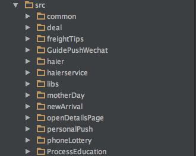
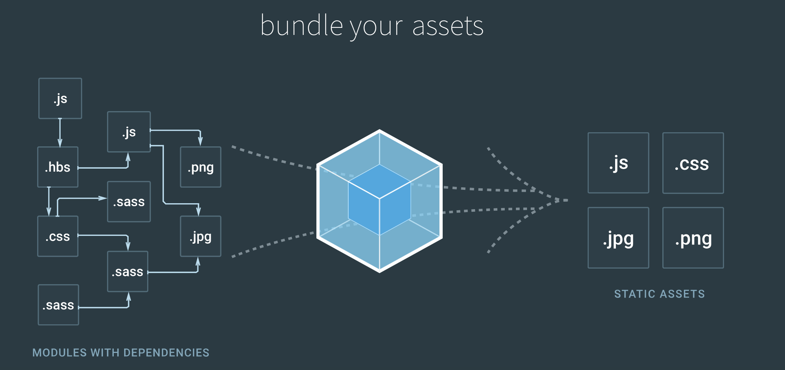
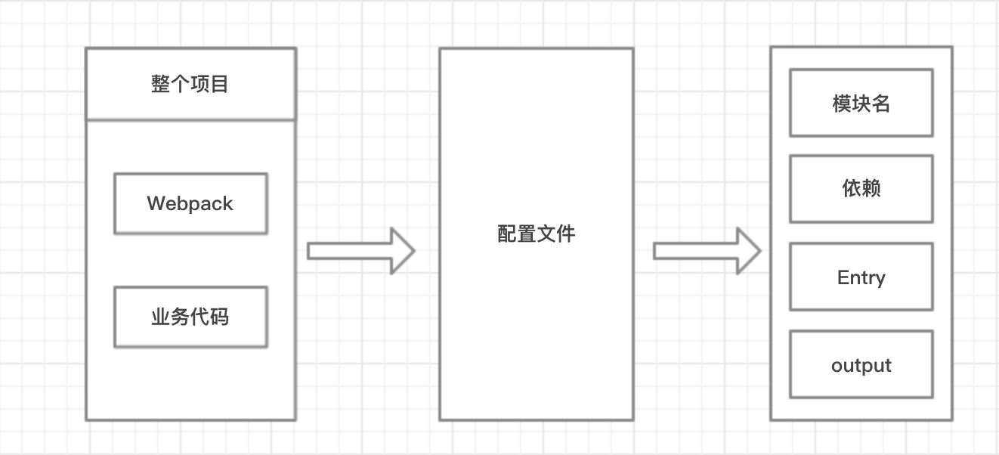
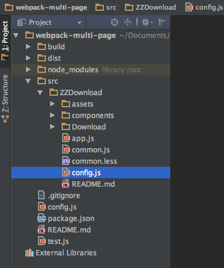
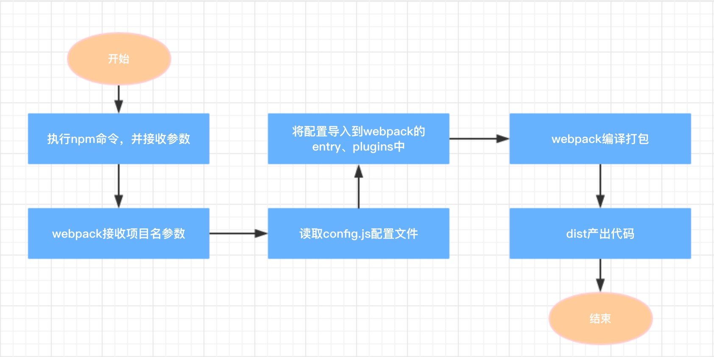

## 小型Web页打包优化（下）
-----

&emsp;&emsp; 之前我们推送了一篇小型Web项目打包优化文章，（[**链接**][1]），我们使用了一段时间, 在这过程中我们也一直在思考, 怎么能把结构做的更好。于是我们改造了一版, 把可以改进的地方和可能会出现的问题, 在这一版中进行了优化。小伙伴们, 有没有迫不及待? 那好, 我们废话少说, 进入正题^_^

#### 一、背景

&emsp;&emsp; 之前, 转转App端内有些Hybrid页面和一些端外的落地页, 一般是单个的一两个小页面, 不是所谓的大型的前端应用, 比较零散, 交互也比较简单。如果用vue或react, 有点杀鸡焉用宰牛刀的意思, 没有必要, 而且业务代码比框架代码还少, 对页面加载的性能来说, 效率也不高。 
于是我们为了把这些页面统一管理, 我们在自己的gitlab上创建一个项目, 作为这些小页面的集合, 里面有许多目录, 每个目录代表一个小项目。一切看似都很正常, 都很有序...

&emsp;&emsp; 两个月前, 我们组内发现, 这些页面经历了一年多的时间, 已经迭代了好多小项目, 由于规范不是很完善, 里面的页面也写的五花八门, 尤其是打包构建工具, 有fis、有glup、还有webpack等。这无疑给后面接手的同学, 带来了麻烦, 于是我们产生了[**第一版**][1]的统一。我们统一了打包工具的使用, 然后精简了代码, 优化了层级结构, 使每个目录结构得到了统一, 形成了规范。



&emsp;&emsp; 可是最近, 我们在思考, 虽然目录结构统一了, 但是如果遇到了组件升级, 比如我们转转的JsBridge升级, 那么要把每个项目的依赖都升级一遍, 这岂不是很头疼的事。如果项目目录超过20个, 那就要手动升级20个页面, 带来了麻烦不说, 而且还很容易出错。所以, 操练起来吧, 让我们一起来优化。

#### 二、简单介绍

- 1.原理图

    &emsp;&emsp; 说到原理, 不得不先说下webpack, 这次的改造都是基于webpack来打包编译的, webpack主要帮我们做了这些事, 也是webpack最最基本的功能, 如下图:

    &emsp;&emsp; 众所周知, webpack是[**全英文**][2]的文档, 这里给英文不好的小伙伴贴一个[**中文版**][3]的。下图是整个项目的拆解图
    
    
- 2.项目结构
    
    &emsp;&emsp; 废话少说, 大家都是程序猿, 先上代码。本人在自己的github里放了项目结构代码, 后面以此为例, ZZDownload为众多小项目的一个(例子)。为了方便大家查看, 把项目目录结构截图如下, 具体请[**移步这里**][4]!  
    


#### 三、使用方法和场景

- 1.如何使用
    
    - 依赖的安装
```
npm install
```
    nodejs环境是前提, 我想大家应该没有什么疑问, 这个不做过多解释, 你懂得~
        
    - 配置
```
    module.exports = {
        "name": "ZZDownload",
        "vendor": ['es6-promise/auto', 'axios', 'mustache'],
        "pages": [{
            "name": "Download",
            "template": "/Download/Download.html",
            "entry": "/Download/Download.js",
            "output": "index.html"
        }]
    };
```    

    每个src中的目录, 可以称之为一个独立小项目。 每个小项目中, 需要有个此项目的配置, 即config.js。还是以ZZDownload为例, 见上面的配置, 可以是单个落地页、也可以是多个页面。配置在此不做过多阐述, 后面会有详细解释。
    
    调试页面可以使用

    ```
        npm run dev 项目名
    ```        
        
        待页面发开完成, 需要打包上线, 执行
    ```
        npm run build 项目名
    ```              
        以我们git的例子来说, 我们就执行 **npm run build ZZDownload**。然后编译产出的代码就在根目录的 **dist/ZZDownload** 里。
        
        **至于页面内部的业务实现, 随便你! **
        
        **至于页面内部的依赖框架, 随便你! **
        
        **至于页面内部的目录结构, 随便你! **
        
        我们就是这么人性化, 业务代码随你DIY! 不干扰个人习惯, 我们只是代码的编译打包的搬运工!

- 2.哪些情况来使用

    - 减小了产出代码的大小
    
        &emsp;&emsp; 用事实说话, 以上面的项目为例, 我做了一个转转的下载落地页面ZZDownload。看了下dist产出的页面, 一共75k。是不是显而易见了, 整个页面不到80k, 我想就算是2G的环境, 加载起来也不算很慢吧。
    
    - 不建议搭建复杂的单页应用
    
    &emsp;&emsp; 说到这, 好多同学会问, 如果我们利用像React/Vue这样的框架, 搭建整个项目, 每个小页面是一个路由, 那不也能达到同样的效果么? 那么升级jdk或者解决一些公共组件的问题, 不是也很方便么? 
    
    &emsp;&emsp; 其实是这样, 短期看这样貌似没什么问题, 但是考虑到一段时间以后, 有可能小页面数量会很多, 那么每当新增一个小页面的时候, 需要编译整个项目, 那个时候项目产出的代码可不是几十K的大小能解决的。而且只是新增了一个小页面, 却需要整包编译和上线, 这对于项目内其他小页面, 还是比较有风险的。
    
    &emsp;&emsp; 虽然我们对复杂单页面也支持, 但是为了精简产出代码, 就没有引入babel, 像React/Vue这种构建复杂应用的项目, 不用es6, 开发起来也并不顺手, 对于强迫症的我, 还是挺不能接受的。并且复杂的页面应用, 本身就会依赖很多库或者插件, 这也和我们为了精简的出发点是相违背的。如果大家有复杂单页应用的项目, 建议还是vue-cli比较来的方便, 也更快捷。


#### 四、原理

- 1.代码执行步骤

    
    
    - 我们对npm的命令, 进行了传参, 项目名就是参数。 
      
    - 将参数透传到webpack里, 并根据参数查找src中对应目录。   
    
    - 读取目录内的config.js文件, 根属性包括name、vendor、pages, 分别对应项目名(后续可能会优化掉此参数, 只用目录名和参数匹配)、公共依赖、页面集合(多个页面, 数组配多项)。
    
    - 通过遍历config的各个属性, config可以理解为一个大的参数集合, 遍历的结果传入webpack的entry和plugins属性里, 生成完整的webpack的配置。
    
    - 一切就绪之后, 就是webpack自己的编译打包了。等待若干秒之后, 你就可以在dist里看到产出的代码啦!
    
- 2.参数说明
        
    ```
    module.exports = {
        "name": "ZZDownload",
        "vendor": ['es6-promise/auto', 'axios', 'mustache'],
        "pages": [{
            "name": "Download",
            "template": "/Download/Download.html",
            "entry": "/Download/Download.js",
            "output": "index.html"
        }]
    };
    ```   
    
     还是以上面的配置为例。
     - name: 为此项目的项目名, 需要与src里的目录相同, 用作webpack编译的目录, 后续考虑是否可以把此参数优化掉, 因为执行npm run的参数, 可以找到目录。
     
     - vendor: 为此项目的公共依赖, 比如我们依赖的模板(如mustache)、发送请求(如axios)等, 都可以放在此处配置。
     
     - pages: 属于页面的集合, 如果多个页面, 就配置数组多项。
     
        - name: 为页面名, 可以理解起到一个id的作用, 同一个项目中的多个页面, name不能相同。
        
        - template: 页面入口的模板, 就是产出页面的html路径
        
        - entry: 页面入口的js文件路径
        
        - output: 产出页面的文件名
     
    PS: 上面配置为单个页面, 多个页面只要在pages数组里配置多个项即可。每个入口需要分别有html和js的entry, 每个页面也要产出的页面名(即output)。整个项目的模块名为name, 总体的第三方功能依赖为vender。注意, 这里的依赖, 是指每个小项目的依赖, 不是整个大项目的依赖。


#### 五、总结
    
- 1.优势
    
    - 依赖问题
    
        &emsp;&emsp; 目前所有项目的依赖得到了统一, 都依赖最外部的package.json的配置。即使有依赖升级, 只要修改package.json中的版本, 然后编译一下就OK啦。
        
    - 产出代码
    
        &emsp;&emsp; 每个项目的产出代码, 都统一到根目录的dist里, dist中会根据src中的项目目录进行分割, 并且一一对应。进入自己的产出项目目录, 里面有html文件和static目录, 然后分别部署到测试的服务器和cdn就可以了。
        
    - 个性化页面入口
        
        &emsp;&emsp; 此配置同时适用于单页面和多页面, 根据配置文件的入口而定。外部的webpack都是统一的, 只是每个项目需要自己的配置文件, 来个性化DIY。所以, 不管是你基于什么技术站, vue/react或是早起的require/jquery, 统统一网打尽。
        
- 2.作用
    
    &emsp;&emsp; 此优化主要是针对零散的小页面, 方便对小页面的集合进行管理。如果每个小页面作为一个项目, 既造成了项目数量的泛滥、不方便管理, 又会。如果在缺失文档, 那后果可想而知, 估计每个接手的同学都会有怨言。
    
    &emsp;&emsp; 个人感觉, 这种形式试用与那种交互不复杂、迭代需求快的页面, 类似一些运营页面之类的, 我觉得是一种不错的方式。

------   
    
&emsp;&emsp; 说到这里, 我们要暂时告一段落了, 感谢大家能看到这里。对于这种方案, 我们还会持续优化, 有了新的提升我会再给大家进行分享。也请看到本文的大神们多提宝贵意见, 我们会继续加油努力......


[1]: https://mp.weixin.qq.com/s?__biz=MzU0OTExNzYwNg==&mid=2247483756&idx=1&sn=ae57f5dd67fcd196876a86ef5a46711c&chksm=fbb58aa5ccc203b3f55b934796c85d361033ced7cfa0392d7dacd4a95cadf55eed3b6740481f&scene=0&key=07ca847744b0901893fc81c95e2f55b4022af6f0b339be4aa5f82656f481d3676e0df9f0a2b1a08bc80a421c522484b4f0d8f550e17a35f7307f27fe28c026aa826006aa784b7aa5120a3e06516a6a30&ascene=0&uin=MjIxODIxNjA0MA%3D%3D&devicetype=iMac+MacBookPro12%2C1+OSX+OSX+10.11.6+build(15G1004)&version=12010110&nettype=WIFI&fontScale=100&pass_ticket=4%2FZwausg5Ydnoi9SJ6TlfLnHir7%2Fb3y2B%2FwR6eWiroQIsTL%2BbgI5g7pOORzTzj%2BX
[2]: http://webpack.github.io/docs/
[3]: https://doc.webpack-china.org/concepts/
[4]: https://github.com/yunhailu/webpack-multi-page.git