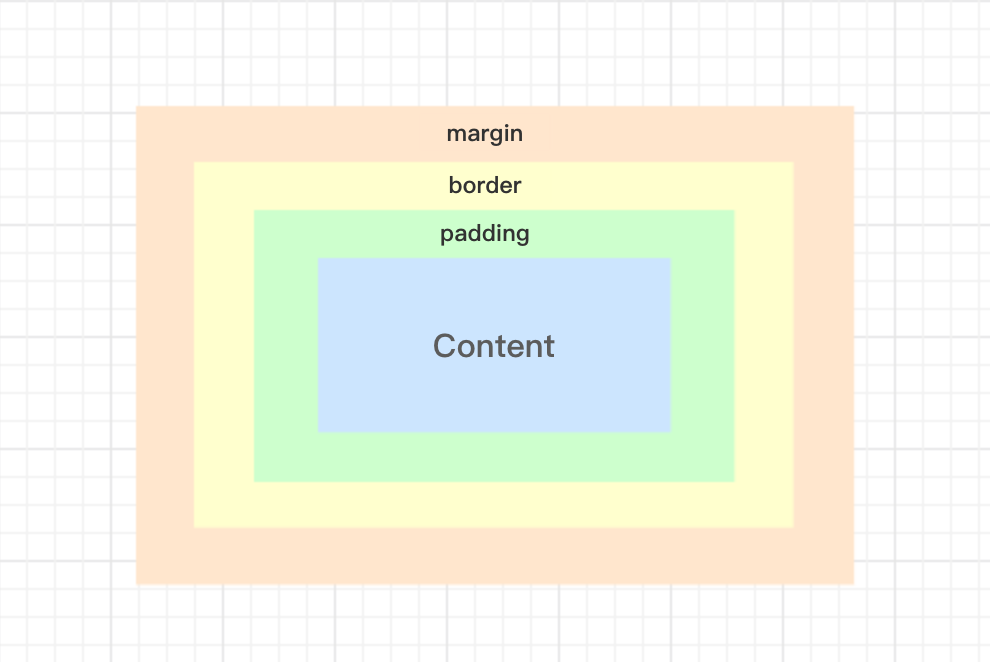
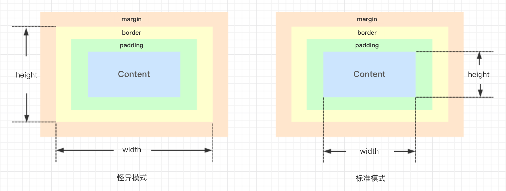
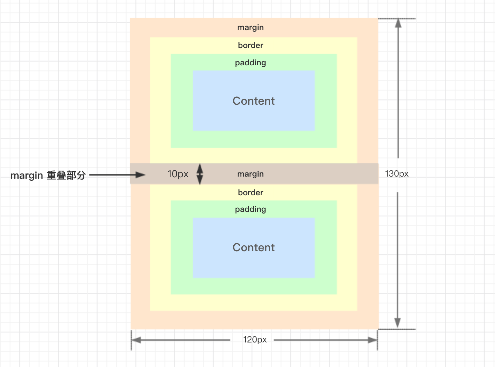
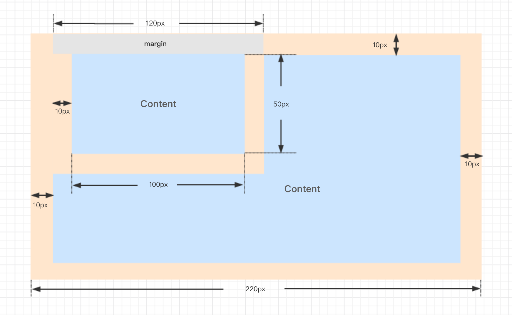
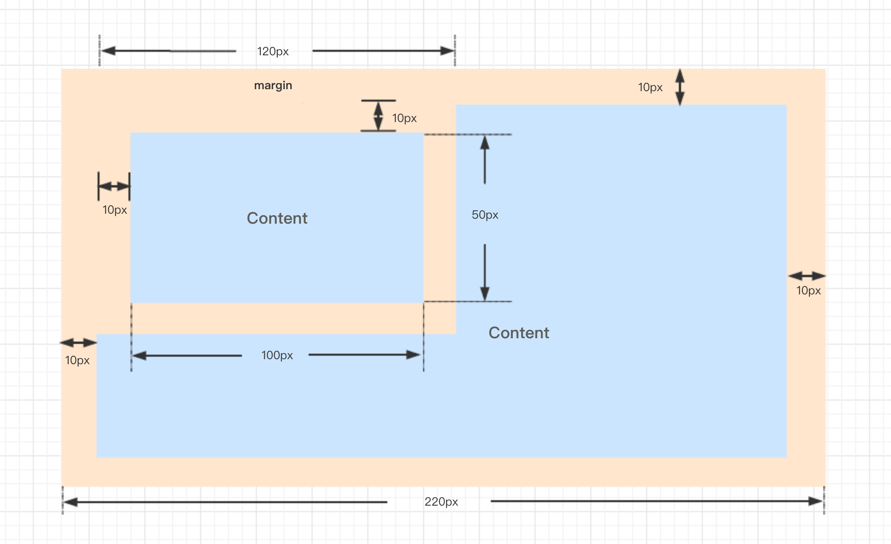

## 你真的了解盒模型么

---

说到前端, 大家第一反应是不是都是vue、react、webpack等这些大大小小的框架或者工具, 但其实这些都是和js相关的, 真正的样式会被大家忽略。其实真正呈现给大家看到华丽的页面, 都是样式才让他们多了那份色彩。那么大家觉得简单的css样式, 真的简单么? 让我们一起来看下, 开启css的入坑之旅, 今天一起跟大家简单聊聊盒模型的相关问题......

#### 盒模型

百度知道对此的解释, 很有意思, 在此引用一下
> CSS盒子模型, 内容（CONTENT）就是盒子里装的东西; 而填充(PADDING)就是怕盒子里装的东西（贵重的）损坏而添加的泡沫或者其它抗震的辅料; 边框(BORDER)就是盒子本身了; 至于边界(MARGIN)则说明盒子摆放的时候的不能全部堆在一起，要留一定空隙保持通风，同时也为了方便取出。   —— [百度知道](https://baike.baidu.com/item/CSS%E7%9B%92%E5%AD%90%E6%A8%A1%E5%9E%8B/9814562?fr=aladdin)




这段描述很有趣, 很好的解释margin、border、padding之间的关系, 不同模式下, 盒模型的width也是不同的, 那么好, 盒模型的第一个坑来了, width的范围问题。

通常浏览器里, 盒模型的分为两种模式, 两种模式(怪异模式和标准模式)下width和height的值不同, 怪异模式的width和height包含border、padding和content, 而标准模式下的width和height只包含content, 这就是为啥有些浏览器渲染出来的dom标签排版会乱。解决也很简单, 在<html>标签的上面, 加上doctype的设置就好了, 让浏览器统一用同一种标准去解析页面。
怪异模式(左图)和标准模式(右图)的如下: 




当然, 还有用来改变盒模型width范围的一个css3的属性, `box-sizing`:

当设置为'border-box'时, width = border + padding + content;

当设置为'content-box'时, width = content。


```html
	<div class="wrapper z1"></div>
	<div class="wrapper z2"></div>
```

```css
	.wrapper{
		width: 100px;
		height: 50px;
		padding: 10px;
		background-color: #dedede;
	}
	.z1{
		box-sizing: border-box;
	}
	.z2{
        box-sizing: content-box;
    }
```
那么第一个div的实际宽度为100px, 第二个div的实际宽度为120px。


说完盒模型的padding和border, 那么再来吐槽下margin, 盒模型的margin的折叠(margin collapsing)问题, 有些也叫外边距合并。

通常我们说的折叠, 都是垂直方向上的折叠, 水平方向是不存在的。标准模式下, 上下两个兄弟的块级元素, margin是会重叠的, 并且以最大的那个间距为准(都为正数)。

比如下面这段代码:
```html
	<div class="wrapper"></div>
	<div class="wrapper"></div>
```

```css
	.wrapper{
		width: 100px;
		height: 50px;
		margin: 10px;
		background-color: #dedede;
	}
```




上图灰色为重叠部分, 重叠10px的间距。

既然兄弟盒模型会有margin折叠, 那么父子呢? 答案是一定的, 父子也存在margin折叠的问题, 只不过条件稍微苛刻一点, 我们一起来看下。
父子组件的折叠触发, 要求不能有间隙, 就是父组件不能设置border或padding值, 不能有空余的内容, 且同时有margin值, 比如下面这段代码:
```html
	<div class="outer">
		<div class="inner"></div>
	</div>
```

```css
	.outer{
		width: 200px;
		height: 100px;
		margin: 10px;
		background-color: #dedede;
	}
	.inner{
        width: 100px;
        height: 50px;
        margin: 10px;
        background-color: #bcbcbc;
    }
```

当然, 折叠后的空余部分, 也是取较大值, 且折叠触发, 只存在于垂直方向。



上图灰色为重叠部分, 重叠10px的间距。

刚才提到一个词"间隙", 如果有间隙的话是不会触发折叠的, 比如父级元素设置了padding, 或者子元素都设置了相对定位和top值等等。如下图: 




看到这里, 我想有些同学会问了, 对于这些`margin collapsing`, 有没有一个统一的整理, 对于大转转的FEer, 我们当然想到了大家的前面, 请看下面: 

- Margins between a floated box and any other box do not collapse (not even between a float and its in-flow children).
- Margins of elements that establish new block formatting contexts (such as floats and elements with 'overflow' other than 'visible') do not collapse with their in-flow children.
- Margins of absolutely positioned boxes do not collapse (not even with their in-flow children).
- Margins of inline-block boxes do not collapse (not even with their in-flow children).
- The bottom margin of an in-flow block-level element always collapses with the top margin of its next in-flow block-level sibling, unless that sibling has clearance.
- The top margin of an in-flow block element collapses with its first in-flow block-level child's top margin if the element has no top border, no top padding, and the child has no clearance.
- The bottom margin of an in-flow block box with a 'height' of 'auto' and a 'min-height' of zero collapses with its last in-flow block-level child's bottom margin if the box has no bottom padding and no bottom border and the child's bottom margin does not collapse with a top margin that has clearance.
- A box's own margins collapse if the 'min-height' property is zero, and it has neither top or bottom borders nor top or bottom padding, and it has a 'height' of either 0 or 'auto', and it does not contain a line box, and all of its in-flow children's margins (if any) collapse.

这是从[W3C](https://www.w3.org/TR/CSS2/box.html#collapsing-margins)里引用的原文, 这8条规则是特殊的不折叠的情况, 简单翻译过来(仅供参考):

- 浮动的盒模型不会margin折叠
- 创建BFC与子不折叠
- 设置定位的盒模型不会折叠
- 行内块级元素的盒模型不折叠
- 兄弟元素有间隙不折叠
- 父子盒模型元素, 孩子元素有border、padding、有浮动就不折叠
- height为auto、min-height为0的块级盒模型, 和它的最后一个没有border和padding的孩子盒模型底边距折叠, 且孩子的底部外边距和被清除浮动上边距有间隙不折叠。
- 如果min-height为0, 上下border、上下padding都为0, height为0或auto, 且没有行内盒模型, 他的孩子节点都会折叠

有点晦涩难懂, 大家不妨消化一下。说到这, 再补充一下, 盒模型margin折叠的计算问题, 总结了以下几点:

- 同为正值时, 取较大者为两者为间距
- 一正一负时, 正负相加为间距, 若结果为负值, 则两者部分重合
- 都为负值时, 两者重合, 且重合部分为绝对值大者

举个例子:
```html
	<div class="wrapper z-01"></div>
	<div class="wrapper z-02"></div>
```

```css
	.wrapper{
		width: 100px;
        height: 50px;
        background-color: #dedede;
	}
	.z-01{
		margin: -10px;
	}
	.z-02{
        margin: -15px;
    }
```

两者都为负值, 两个div上下重合, 且重合间距为15px。

暂时就想到这么多, css的学习之路任重而道远, 盒模型又是重中之重。上面有描述不对的地方也欢迎各位同学批评指正, 也欢迎大家来到大转转FE做客, 一起讨论一起研究前端的技术问题。志同道合的同学, 也欢迎加入我们转转FE团队, 咱们一起打拼。