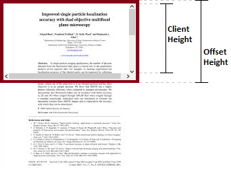
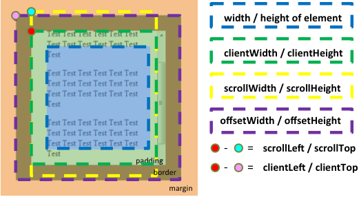

> 在移动端开发中，模态（Modal）弹窗可以说是非常之常见了，作为正在看这篇文章的你，可能写过基于Vue或者小程序的统一弹窗Modal组件；可能处理
过定宽高或者不定宽高的情况等，看起来一个小小的模态框其实蕴藏了大大的知识点，本文就带你去探索模态框中的滚动穿透（scroll chaining）问题。

#### 背景
俗话说，产品有三宝：弹窗、浮层加引导，足以见弹窗在产品同学心目中的地位。对任意一个刚入门的前端同学来说，实现一个模态框基本都可以达到信手
拈来的地步，但是，当模态框里边的内容滚动起来以后，就会出现各种各样的让人摸不着头脑的问题，其中，最出名的想必就是滚动穿透。

那么，什么是滚动穿透呢？滚动穿透即：移动端弹出fixed弹窗的话，在弹窗上滑动会导致下层的页面跟着滚动，这个叫 “滚动穿透”。了解了什么是滚动穿
透以及它出现的场景，那么，接下来就直接进入正题。我将会从H5以及小程序两方面讨论滚动穿透的解决方案。

#### H5的滚动穿透
#### ***解决方案一***

当我们在模态框内部滚动的时候，底部内容也会跟着滚动，那么如果禁止掉遮罩层的滚动事件，底部内容也就自然不会滚动了。（本文假设模态框和遮罩层
都处在同一级），如下代码：
```
<div class="popup" v-if="showPopDialog" @click="closePopDialog" @touchmove="touchForbidden"></div>

touchForbidden(e){
    e.preventDefault()
},
```
按照上面这样操作以后，模态框里边的内容是正常滚动的，触摸背景也不会随着滚动，这么看来，好像我们的问题已经成功的解决了，但是实际情况并没有
这么乐观，经过反复测试，发现当在模态框的顶部或者底部边缘随意滑动时，仍然能触发底部内容的滑动。


既然已经发现了触发的规律，那顺着规律去解决问题就好了嘛，顺藤摸瓜，当打开模态框时，我们可以进行边缘检测，当用户手贱滑动到模态框顶部或者模
态框最底部时，我们就禁止滑动，这样应该就可以解决上述问题了，继续看代码：
```
<div class="content" v-if="showPopDialog" @touchmove="touchMove" id="canmove" @touchstart="touchStart">
      我是来进行测试的我是来进行测试的我是来进行测试的我是来进行测试的我是来进行测试的我是来进行测试的我是来进行测试的我是来进行测试的
</div>
```
我们在模态框上首先注册touchstart事件，得到用户首次触摸的y坐标值
```
touchStart(e){
     this.firstY = e.targetTouches[0].clientY;
}
```
然后，当用户在模态框滑动的时候，得到其滑动过程中的y坐标值，当滑动过程中触点的clientY > stratY的时候表明滑动方向向下，在用户往下滑的过程
中，滑动距离为0则表明为用户的滑动位置为模态框的最顶部，此时就得到了用户滑动到模态框顶部的边缘条件。

同样的道理，当clientY < startY时表明滑动方向为向上，scrollTop + offsetHeight >= scrollHeight则表明已经滑动到了模态框最底部。
```
touchMove(e){
    let target = document.getElementById('canmove')
    let offsetHeight = target.offsetHeight,
      scrollHeight = target.scrollHeight;
    let changedTouches = e.changedTouches;
    let scrollTop = target.scrollTop;
    if (changedTouches.length > 0) {
      let touch = changedTouches[0] || {};
      let moveY = touch.clientY;
      if (moveY > this.firstY && scrollTop === 0) {
        // 滑动到弹窗顶部临界条件
        e.preventDefault()
        return false
      } else if (moveY < this.firstY && scrollTop + offsetHeight >= scrollHeight) {
        // 滑动到底部临界条件
        e.preventDefault()
        return false
      }
    }
}
```
ok，接下来进行测试，再没有发现任何问题，完美解决，方案一Done。

在解决有关滑动问题的过程中，总会出现clientHeight、offsetHeight、scrollHeight、scrollTop等不是亲兄弟而胜似亲兄弟的一系列葫芦娃，有必
要来复习一波关于他们的基础知识。

- offsetHeight和元素的滚动没有任何关系，它只代表元素的高度，包括border、padding、水平滚动条但不包括margin
- clientHeight类似于offsetHeight，不同的是它只包括padding不包括border、水平滚动条以及margin



- scrollHeight只有当元素出现滚动时才有意义，元素不滚动时候，scrollHeight==clientHeight，当元素滚动时，scrollHeight的值为scrollTop+clientHeight


- scrollTop为元素滚动时隐藏的部分
- offsetTop依然和滚动没有关系，代表当前元素顶部距离最近父元素顶部的距离



在我们处理滚动过程中，基本都会使用到上述变量，图文结合的方式相信大家更容易理解清楚它们之间的关系。

#### ***解决方案二***
接下来我们来研究方案二，在打开弹窗的时候，可以通过为底部内容区域增加动态class来阻止底部内容滑动，但是这样导致的问题是会丢失底部内容区域
的滚动距离，没事，不慌！在丢失滚动距离之前我们可以将它记录下来，关闭弹窗的时候再将之前记录的scrollTop设置回去不就ok了吗？理论可行，接下
来我们就正式开始coding...

当打开模态框的时候，需要为底部内容区域增加一个动态class来阻止滑动，如下：
```
.forbidden_scroll{
    position: fixed;
    height: 100%;
  }
```

打开模态框之前，我们需要记录当前的底部内容的scrollTop值，
```
touchmove(e){
    this.scrollTop = document.getElementById('scrollElement').scrollTop
}
```
当关闭弹窗的时候，首先移除掉刚才添加的动态class，再将scrollTop设置回去即可。
```
closePopDialog(){
    this.showPopDialog = false
    this.top = -this.scrollTop
    this.showStyle = false
},
```
整个模板部分代码如下：
```
<div class="main">
    <div :class="showStyle ? 'forbidden_open' : 'article'" id="scrollElement" :style="{'margin-top': top + 'px'}" @touchmove="touchmove">
      <div class="block_red">
        <div class="block_click" @click="openPopDialog">Click Me</div>
      </div>
      <div class="block_yellow"></div>
      <div class="block_green"></div>
    </div>
    <div class="popup" v-if="showPopDialog" @click="closePopDialog" @touchmove="touchForbidden">
    </div>
    <div class="content" v-if="showPopDialog">
      我是来进行测试的我是来进行测试的我是来进行测试的我是来进行测试的我是来进行测试的我是来进行测试的我是来进行测试的我是来进行测试的
      我是来进行测试的我是来进行测试的我是来进行测试的我是来进行测试的我是来进行测试的我是来进行测试的我是来进行测试的我是来进行测试的
      我是来进行测试的我是来进行测试的我是来进行测试的我是来进行测试的我是来进行测试的我是来进行测试的我是来进行测试的我是来进行测试的
      我是来进行测试的我是来进行测试的我是来进行测试的我是来进行测试的我是来进行测试的我是来进行测试的我是来进行测试的我是来进行测试的
      我是来进行测试的我是来进行测试的我是来进行测试的我是来进行测试的我是来进行测试的我是来进行测试的我是来进行测试的我是来进行测试的
    </div>
  </div>
```
经过测试，发现此方案也可以解决滚动穿透的问题，但是，手贱的我又一次尝试了滑动到弹窗边缘的情况，然鹅，还是触发了底部内容的滑动，没办法，依
然需要像方案一一样进行边缘检测，才能完美解决问题。

上述讨论的2种解决方案都是基于H5的，小程序中对于滚动穿透仍然没有完美解决方案，根本原因在于小程序中不能像H5那样可以任意操作DOM。

##### 其他解决方案缺陷
- @touchmove.prevent 无法解决滑动到边缘又触发底部滑动的问题
- overscroll-behavior依然无法解决上述问题，并且兼容性成迷[https://caniuse.com/#search=overscroll-behavior](https://note.youdao.com/)

上述讨论都是基于H5的，在小程序中，可以使用scroll-view结合上述方案解决此类问题，但是仍然会存在滑动到边缘触发底部滚动问题。
（文中所有图片均来自于网络）
