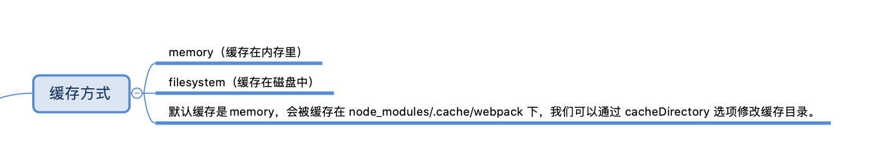
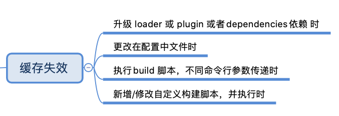

# 了解一下webpack 5

## 新特性内容

* 持久缓存，提高构建性能。
* 优化算法和默认值，改善长期缓存。
* 通过优化 Tree Shaking 和 Code Generation 更好的代码生成，减小打包体积。
* Module Federation：实现不同应用中的资源cdn共享，不再是本地依赖npm包，重新构建发布。

### 缓存

#### 什么是持久缓存？

缓存对前端性能优化非常重要，利用静态资源的缓存机制，加速且稳定的运行我们的应用，从而给用户良好的体验。

如果只是资源缓存，远远满足不了业务场景，我们需要对不断更新的资源做持久化缓存（Long term cache）。

持久化缓存需要解决模块化，模块依赖，静态资源优化，模块打包，文件摘要处理等问题。

#### webpack怎么实现持久缓存？



```js
module.exports = {
  cache: {
    type: 'filesystem' // memory or filesystem
  }
};
```
当设置 `cache.type: "filesystem"` 时，webpack 会在内部以分层方式启用文件系统缓存和内存缓存。优先级为

> 内存缓存->文件缓存->即时编译

##### 公共代码（比如一些依赖的库）和业务代码分割

每次变更代码时，运行webpack，可以发现`./dist/vendor.js` 文件的hash会因为每次构建而改变，浏览器也会刷新重新加载文件。

为解决这个问题，将业务代码和公共模块代码，拆分打包公共代码放在vendor，业务代码拆分到bundle，我们每次变更的只有bundle，不影响vendor文件的长期缓存。

#### 什么情况下，缓存失效？



### Code Generation

webpack4 仅支持 ES5，webpack5 支持 ES5 跟 ES6

ecmaVersion 的取值范围：5 ~ 11 or 2009 ~ 2020

webpack5 默认最小值： 5

```js
config.output.set('ecmaVersion', 8);
```

#### 优化minSize&maxSize的配置

v5根据不同类型文件分别设置 splitChunks 打包的大小，默认情况下仅对js分割打包

DEMO
```js
config.optimization.splitChunks({
  minSize: {
    javascript: 20000,
    style: 10000
  }
});
```

### Tree Shaking

v5 会检查内部的方法是否被应用：
* 当没有被使用时，模块内部调用的方法会被删除
* 当使用时，需要在 package.json 中配置 `"sideEffects": false`，同时设置 `optimization.usedExports 为 true`

```js
// package.json
{
  "sideEffects": false
}

// config.js
module.exports = {
  optimization: {
    usedExports: true
  }
};

// or 使用的 webpack-chain 来配置 webpack
chainWebpack(config) {
  config.optimization.usedExports(true);
}
```
DEMO：

```js
// inner.js
export const a = 111;
export const b = 222;

// module.js
import * as inner from "./inner";
export { inner };

// user.js
import * as module from "./module";
console.log(module.inner.a);
```
结果：
1. v4中，a和b 都会被打包。
2. v5会分析模块的依赖关系，判断b未被调用，所以只会打包b。


### 与v4相对，都有哪些改动？

> 延伸：webapck4 缓存方式是loader 设置，<br>
> 当文件没有变化时，webpack直接拉取cache-loader缓存加载器，缓存在磁盘中编译结果（与 babel cacheDirectory 相同）。比如会缓存vue-loader，缓存路径在`./node_modules/.cache/vue-loader`。

* 已删除v4中不推荐使用的所有项。
* v4中未弃用，但有警告提示的，例如IgnorePlugin和BannerPlugin，必须且只能传一个参数（对象、字符串或者函数）。
* v5移除了node模块兼容polyfill脚本，转而专注于前端兼容模块。
* 支持最低版本是8.9.0，推荐使用node 10或者12，可以大大提高生成性能。
* 为了包大小和长期缓存之间的权衡，v5会通过新的算法，生产环境默认启动 `chunkIds: "deterministic", moduleIds: "deterministic"`，以准确的方式将短（3或4位字符）的数字id分配给module和chunk。
* 使用cache: {type: "filesystem"}配置实现持久化缓存，提高构建速度
* cache-loader 不再需要
* 优化minSize&maxSize的配置方式

## 总结

v5的升级侧重点: 在性能改进、Tree Shaking、代码生成和Module Federation方向。

无论一个工具再强大，它也只是工具，我们更多需要的是代码规范。规范且合理设计的模块必然能协助 tree shaking 机制实现真正的按需打包。
如果设计的不合理，白搭，依旧会打包很多无用代码。

通过缓存确实提升了打包编译速度，v5还是值得期待的。

### 可借鉴的实践经验

* [Webpack 5 升级实验](https://zhuanlan.zhihu.com/p/81122986)
* [探索 webpack5 新特性 Module federation 在腾讯文档的应用](http://www.alloyteam.com/2020/04/14338/)
* [调研 Federated Modules，应用秒开，应用集方案，微前端加载方案改进等](https://mp.weixin.qq.com/s/sdIVsfmRlhDtT6DF2dmsJQ)

## 相关文献

* https://github.com/webpack/webpack/issues
* https://github.com/webpack/changelog-v5/blob/master/README.md
* https://github.com/module-federation/module-federation-examples
* https://richlab.design/translations/2020/03/27/webpack-5-module-federation/#
* https://medium.com/swlh/webpack-5-module-federation-a-game-changer-to-javascript-architecture-bcdd30e02669
* https://github.com/webpack/webpack/issues/10352
* [The road to webpack 5](https://myslide.cn/slides/21653#)
* [webpack cache](https://webpack.js.org/configuration/other-options/#cache)