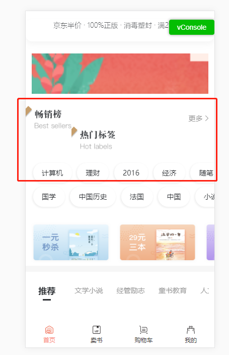
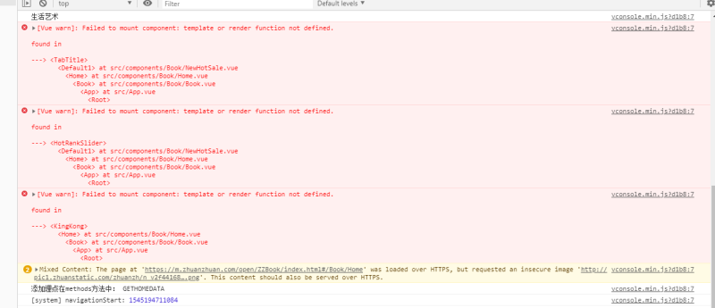
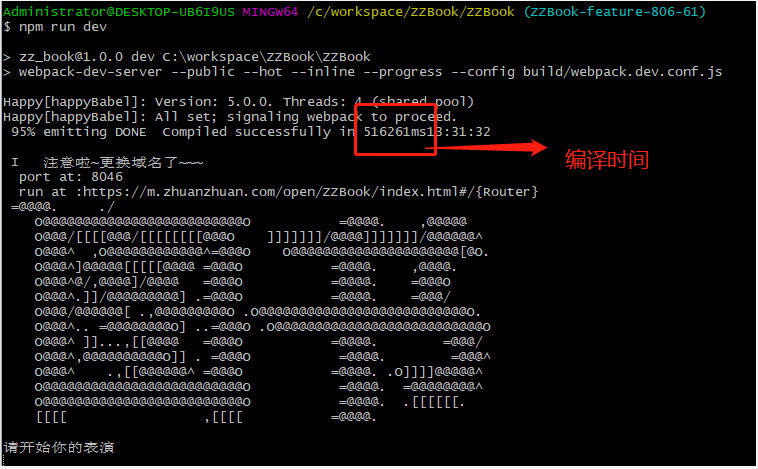
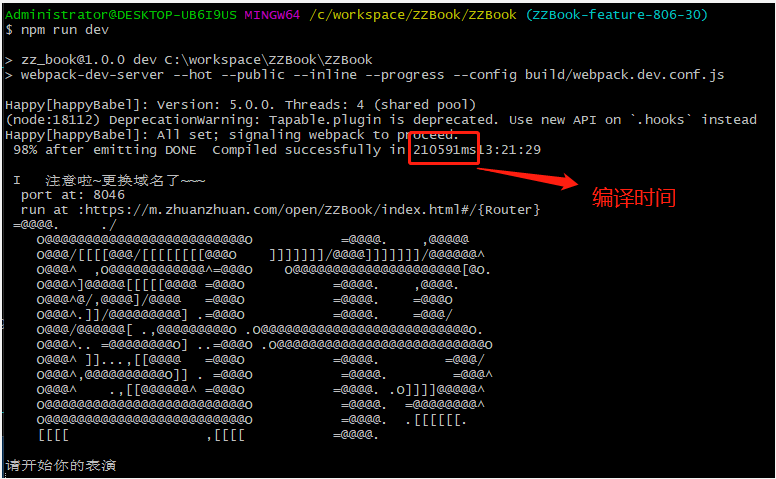

## webpack4升级指南

鉴于图书项目编译速度极慢的情况（项目里面module太多了，编译慢很正常)且最近需求不多（很少出现的空挡期）。所以我觉得搞一波webpack升级,看看有没有帮助。webpack于2018年2月25正式发布v4.0.0版本，代号legato。名字是不是很大器，不明觉厉的样子。废话少说下面正式进入主题。(本文的升级配置主要针对vue项目)

#### 一、webpack4更新变化
先说一下webpack4有几个比较重要的更新[：webpack4更新日志](https://github.com/webpack/webpack/releases/tag/v4.0.0)

**1.环境支持：** 官方不再支持Node 4,Node 6,最好使用v8.5.0以上稳定版本。支持93%的ES6语法。因为webpack4使用了很多JS新的语法，它们在新版本的 v8 里经过了优化。

**2.0配置：** 受Parcel打包工具启发，尽可能的让开发者运行项目的成本变低。webpack4不再强制需要 webpack.config.js 作为打包的入口配置文件了，它默认的入口为'./src/'和默认出口'./dist'，这对于小项目来说确实是一件不错的事情。

**3.mode选项：** 告知 webpack 使用相应模式的内置优化。可选 development 或 production，举个栗子。
```
module.exports = {
  mode: 'production'
};
```
或者从 CLI 参数中传递：
webpack --mode = production

选项 | 描述
---|---
development| 会将 process.env.NODE_ENV 的值设为 development。启用 NamedChunksPlugin 和 NamedModulesPlugin。
production | 会将 process.env.NODE_ENV 的值设为 production。启用 FlagDependencyUsagePlugin, FlagIncludedChunksPlugin, ModuleConcatenationPlugin, NoEmitOnErrorsPlugin, OccurrenceOrderPlugin, SideEffectsFlagPlugin 和 UglifyJsPlugin.

==注意：只设置 NODE_ENV，则不会自动设置 mode==

mode: development
```
// webpack.dev.config.js
module.exports = {
+ mode: 'development'
- plugins: [
-   new webpack.NamedModulesPlugin(),
-   new webpack.DefinePlugin({ "process.env.NODE_ENV": JSON.stringify("development") }),
- ]
}
```
mode: production

```
// webpack.prod.config.js
module.exports = {
+  mode: 'production',
-  plugins: [
-    new UglifyJsPlugin(/* ... */),
-    new webpack.DefinePlugin({ "process.env.NODE_ENV": JSON.stringify("production") }),
-    new webpack.optimize.ModuleConcatenationPlugin(),
-    new webpack.NoEmitOnErrorsPlugin()
-  ]
}
```
**4.插件变化:**  webpack4删除了CommonsChunkPlugin插件，它使用内置API optimization.splitChunks 和 optimization.runtimeChunk，即webpack会默认为你生成共享的代码块。

**5.Rule.loaders:** 此选项已废弃（Rule.loaders 是 Rule.use 的别名。可以使用Rule.use）

**6.WebAssembly:** 开箱即用WebAssembly(这个没用到，不知道是啥)

#### 二、升级webpack4 loader及插件的配置修改
升级webpack4首先需要更新webpack到v4.0.0以上版，然后安装webpack-cli,建议使用cnpm安装，有时候npm安装下载不下来。

```
npm install --save-dev webpack-cli
```
> 项目相关的loader和插件也是需要更新的，不然会报错。接下来介绍一些需要额外配置的loader和插件。

1.vue-loader[（更多细节）](https://vue-loader.vuejs.org/zh/migrating.html#%E5%80%BC%E5%BE%97%E6%B3%A8%E6%84%8F%E7%9A%84%E4%B8%8D%E5%85%BC%E5%AE%B9%E5%8F%98%E6%9B%B4)

Vue Loader v15 现在需要配合一个 webpack 插件才能正确使用：

```
// webpack.config.js
const VueLoaderPlugin = require('vue-loader/lib/plugin')

module.exports = {
  // ...
  plugins: [
    new VueLoaderPlugin()
  ]
}
```
现在 Vue Loader v15 使用了一个不一样的策略来推导语言块使用的 loader。

拿 &lt;style lang="less"&gt; 举例：在 v14 或更低版本中，它会尝试使用 less-loader 加载这个块，并在其后面隐式地链上 css-loader 和 vue-style-loader，这一切都使用内联的 loader 字符串。

在 v15 中，&lt;style lang="less"&gt; 会完成把它当作一个真实的 *.less 文件来加载。因此，为了这样处理它，你需要在你的主 webpack 配置中显式地提供一条规则：

```
{
  module: {
    rules: [
      // ... 其它规则
      {
        test: /\.less$/,
        use: [
          'vue-style-loader',
          'css-loader',
          'less-loader'
        ]
      }
    ]
  }
}
```
这样做的好处是这条规则同样应用在 JavaScript 里普通的 *.less 导入中，并且你可以为这些 loader 配置任何你想要的选项。在 v14 或更低版本中，如果你想为一个推导出来的 loader 定制选项，你不得不在 Vue Loader 自己的 loaders 选项中将它重复一遍。在 v15 中你再也没有必要这么做了。如果是用cli搭建的项目，升级webpack4时，别忘记把配置中的样式规则删掉，如下：

```
//webpack.dev.conf.js
const devWebpackConfig = merge(baseWebpackConfig, {
    mode: 'development',
-   module: {
-     rules: utils.styleLoaders({ sourceMap: config.dev.cssSourceMap, usePostCSS: true })
-   },
    //其他配置...
})
```
webpack.prod.conf.js文件同上修改

鉴于 v15 中的推导变化，如果你导入一个 node_modules 内的 Vue 单文件组件，它的 &lt;script&gt; 部分在转译时将会被排除在外。为了确保 JS 的转译应用到 node_modules 的 Vue 单文件组件，你需要通过使用一个排除函数将它们加入白名单：


```
{
  test: /\.js$/,
  loader: 'babel-loader',
  exclude: file => (
    /node_modules/.test(file) &&
    !/\.vue\.js/.test(file)
  )
}
```
Vue Loader v15 还废弃了很多选项，它们应该使用普通的 webpack 模块的规则来配置：
- loader
- preLoaders
- postLoaders
- postcss
- cssSourceMap
- buble
- extractCSS
- template

下列选项已经被废弃了，它们应该使用新的 compilerOptions 选项来配置：
- preserveWhitespace (使用 compilerOptions.preserveWhitespace)
- compilerModules (使用 compilerOptions.modules)
- compilerDirectives (使用 compilerOptions.directives)

下列选项已经被改名了：
- transformToRequire (现在改名为 transformAssetUrls)

2.CommonsChunkPlugin

前面提及到webpack4删除了CommonsChunkPlugin插件，需要使用内置API optimization.splitChunks 和 optimization.runtimeChunk替代，具体替代配置如下：

```
//webpack.prod.conf.js
optimization: {
    //其他配置
    runtimeChunk: {
      name: 'manifest'
    },
    splitChunks:{
      chunks: 'async',
      minSize: 30000,
      minChunks: 1,
      maxAsyncRequests: 5,
      maxInitialRequests: 3,
      name: false,
      cacheGroups: {
        vendor: {
          name: 'vendor',
          chunks: 'initial',
          priority: -10,
          reuseExistingChunk: false,
          test: /node_modules\/(.*)\.js/
        },
        styles: {
          name: 'styles',
          test: /\.(scss|css)$/,
          chunks: 'all',
          minChunks: 1,
          reuseExistingChunk: true,
          enforce: true
        }
      }
    }
  },
```
由于CommonsChunkPlugin已经废弃，所以HtmlWebpackPlugin插件配置中的chunksSortMode也不再需要。


```
plugins: [
    //...
    new HtmlWebpackPlugin({
      filename: process.env.NODE_ENV === 'testing'? 'index.html': config.build.index,
      template: 'index.html',
      inject: true,
      inlineSource:/(app\.(.+)?\.css|manifest\.(.+)?\.js)$/,
      minify: {
        removeComments: true,
        collapseWhitespace: true,
        removeAttributeQuotes: true
        // more options: https://github.com/kangax/html-minifier#options-quick-reference
      },
-      chunksSortMode: 'dependency'
    }),
]
```


3.mini-css-extract-plugin[（更多细节）](https://github.com/webpack-contrib/mini-css-extract-plugin)（webpack4新插件）

介绍新插件之前先说一下extract-text-webpack-plugin，相信大家多少会听说过，它的作用是会将所有的入口 chunk(entry chunks)中引用的 *.css，移动到独立分离的 CSS 文件。因此，你的样式将不再内嵌到 JS bundle 中，而是会放到一个单独的 CSS 文件（即 styles.css）当中。 如果你的样式文件大小较大，这会做更快提前加载，因为 CSS bundle 会跟 JS bundle 并行加载。不过在webpack4中推荐使用mini-css-extract-plugin这个插件。具体配置如下：

```
//webpack.prod.conf.js
const MiniCssExtractPlugin = require("mini-css-extract-plugin")

plugins：[
    //其他配置
    new MiniCssExtractPlugin({
      filename: utils.assetsPath('css/[name].[contenthash].css'),//"[name].css"
      chunkFilename: utils.assetsPath('css/[id].css'),//"[id].css"
    }),
]
```
```
//webpack.base.conf.js
const MiniCssExtractPlugin = require("mini-css-extract-plugin")
const devMode = process.env.NODE_ENV === 'production'

module: {
    rules: [
      //...
      {
        test: /\.css$/,
        use: [
          devMode ?  MiniCssExtractPlugin.loader : 'vue-style-loader',
          {
            loader: 'css-loader',
            options: { importLoaders: 1 }
          },
          'postcss-loader'
        ]
      },
    ]
}
```
再来压缩一下css和js

```
//webpack.prod.conf.js
const UglifyJsPlugin = require("uglifyjs-webpack-plugin")
const OptimizeCSSAssetsPlugin = require("optimize-css-assets-webpack-plugin")

optimization: {
    minimizer: [
      new UglifyJsPlugin({
        cache: true,
        parallel: true,
        sourceMap: true // set to true if you want JS source maps
      }),
      new OptimizeCSSAssetsPlugin({})
    ],
}
```


我在升级过程中大概升级了这些东西：

```
"devDependencies"： {
    //...
    "webpack": "^4.27.1",
    "webpack-cli": "^3.1.2",
    "webpack-dev-server": "^3.1.10",
    "vue-loader": "^15.4.2",
    "vue-style-loader": "^4.1.2",
    "html-webpack-plugin": "^3.2.0",
    "html-webpack-inline-source-plugin": "0.0.10",
    "babel-loader": "^7.1.3",
    "file-loader": "^2.0.0",
    "mini-css-extract-plugin": "^0.5.0",
    "ts-loader": "^5.3.1",
    "url-loader": "^1.1.2",
    "vue-html-loader": "^1.2.4",
}
```
因为不同的项目相关配置不同，所以接下来就可以npm run dev,看看有啥报错，哪个插件、loader有问题，升个级就好了。

#### 三、项目运行起来了



咋回事样式乱了，看一眼控制台，发现：



组件的模板没有识别，这是什么毛病？在翻阅了大量资料后，得知：

> 在引入组件的时候，除了ES6的 import 之外，还可以用 webpack 的 require，比如，在vue文件里，就写了大量的如下代码：


```

const KingKong = require('../BookHomeCommon/KingKong.vue');
const BookList = require('../BookHomeCommon/BookList.vue');
const HomeAlert = require('../BookHomeCommon/HomeAlert.vue');
const DoubleElevenToast = require('../Activitys/DoudleEleven/DoubleElevenToast.vue');
const BrandVideo = require('./BrandVideo.vue');
```


在vue-loader [v13.0.0](https://github.com/vuejs/vue-loader/releases?after=v13.5.1)的更新文档中提到：

**New**
- Now uses ES modules internally to take advantage of webpack 3 scope hoisting. This should result in smaller bundle sizes.
- Now uses PostCSS@6.

**Breaking Changes**

- The esModule option is now true by default, because this is necessary for ES-module-based scope hoisting to work. This means the export from a *.vue file is now an ES module by default, so async components via dynamic import like this will break:


```
const Foo = () => import('./Foo.vue')
```

**Note: the above can continue to work with Vue 2.4 + vue-router 2.7**, which will automatically resolve ES modules' default exports when dealing with async components. In earlier versions of Vue and vue-router you will have to do this:

```
const Foo = () => import('./Foo.vue').then(m => m.default)
```

Alternatively, you can turn off the new behavior by explicitly using esModule: false in vue-loader options.

---
Similarly, old CommonJS-style requires will also need to be updated:

```
// before
const Foo = require('./Foo.vue')

// after
const Foo = require('./Foo.vue').default
```


- PostCSS 6 might break old PostCSS plugins that haven't been updated to work with it yet.

官方文档说的很清楚：
- 可以在 vue-loader 的 options 里通过 esModule: false 配置来关闭 ES 模块
- 同步引入组件，正常用 import，而原来使用 require 引入 ES6 语法的文件（例如：export default {...}），现在需要多加一个 default 属性来引用。异步引入组件，需要用动态 import 语法

1. 如果有通过 require 引入组件的话，全部改为 require(xxx).default
1. 如果有异步引入组件的话，全部更新为动态 import 方式，() => import(xxx)

但是在vue-loader v14.0.0中已经移除options里的esModule配置。无法关闭ES模块。那咋整？项目中已经有大量的const Foo = require('./Foo.vue')的用法。一个一个修改，太费时间，这时自定义loader就是一个很好的解决方案。代码如下：


```
//compatible-es-module.js
module.exports = function(content) {
  return content.replace(new RegExp(/require\('\.[/\w\.]+[^(\.png|\.gif|\.jpg)]'\)(\.default)?/,'g'),function(res) {
    return  /(\.default)$/.test(res)  ? res :res + '.default';
  });
};

//

module: {
    rules: [
      {
        test: /\.(vue)$/,
        loader: './compatible-es-module'
      }
    ]
}
```

#### 四、总结

费这么大劲升级，不能没有效果吧，下面看看编译时间对比，这是webpack3编译时长截图：



这是webpack4的：



51万ms和21万ms编译速度足足提高了50%多。（不同项目情况不同，请以实际情况为准）

webpack4还有很多新的特性，有待继续学习。

> 人们总是对未知的东西，感到恐惧。直面自己的恐惧，学习理解它，你就会进步。（手动耶）
