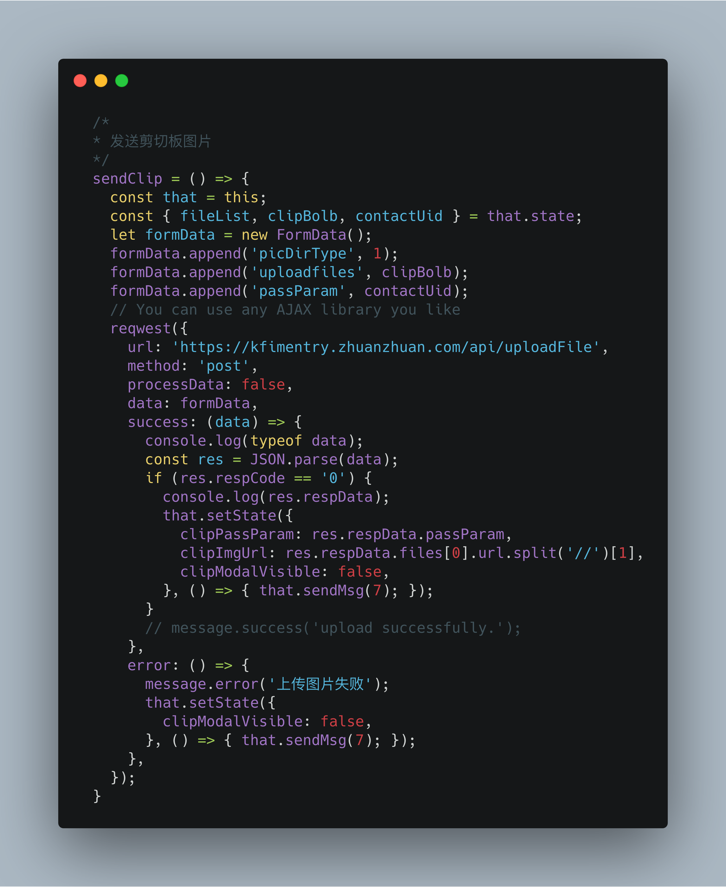
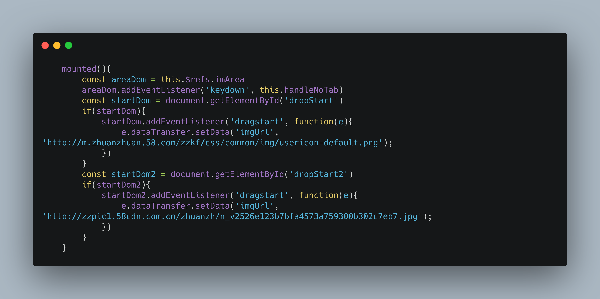
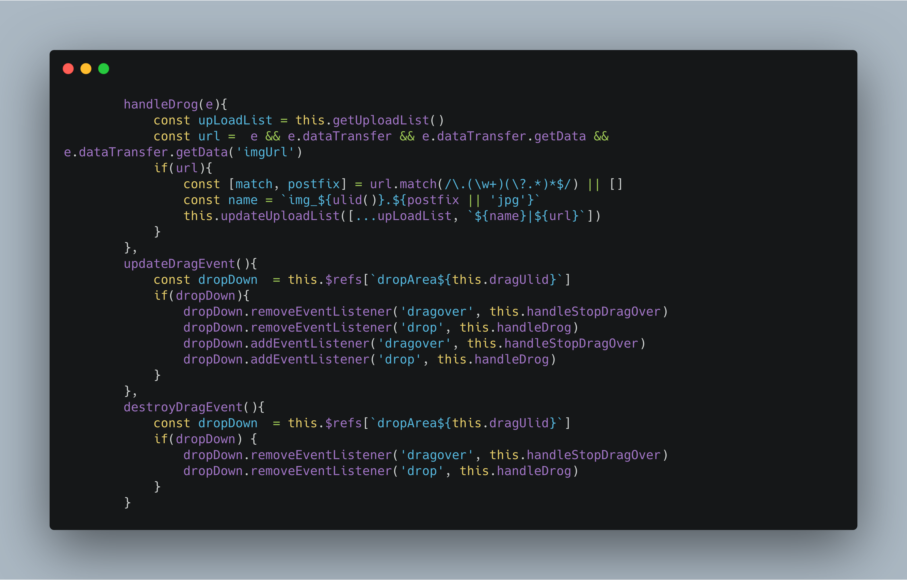
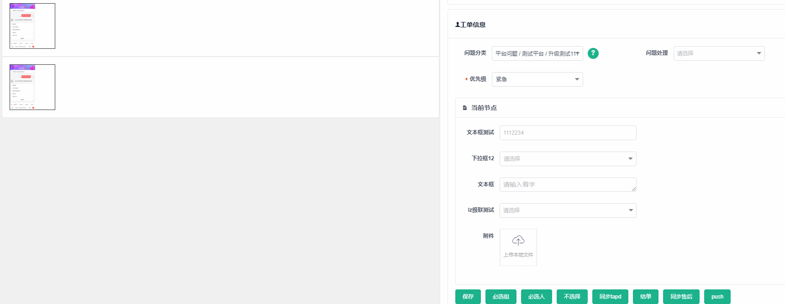
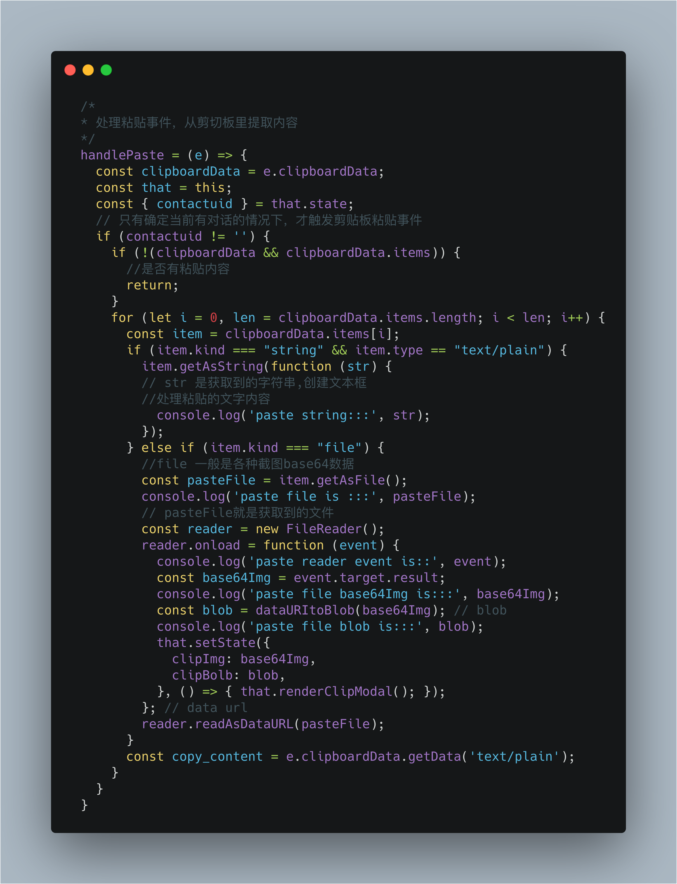
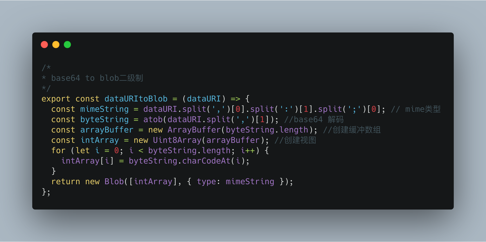
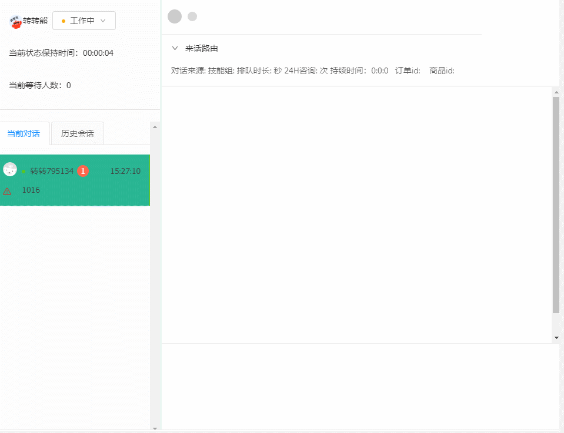

随着我司的发展，前端开发同学在公司企业级的中台业务的重要性也在提高

我们正处在从IT时代到DT时代中的过渡阶段，各个企业都要面临信息化数字化的压力，如何提高内效是目前都要面临的一个问题，我司中台业务走到今天，既要好体验，也要高效率，给技术团队提出了一个有趣的问题

在我们日常项目开发中，图片上传是一个十分常见的场景。

而现在的各种UI框架都提供了自己的上传组件，网上第三方的上传组件也多如牛毛。可能你早已习惯了直接使用这些现成的组件，然而对于其具体的实现，却并未深入解析。

本文以图片上传为入口，将通过简单的代码，为你解析图片上传的各个知识点，让你一次打通任督二脉

孔子说过食不厌精、脍不厌细，他是说食物制作的越精细越好。在顺德，有一鱼八吃，各个都是经典味道，吃鱼的心思巧，全鱼宴的设计精妙，点点滴滴都是厨师的心血与骄傲！

为什么突然转到吃了，可能是临近中午，有些饿了，开个玩笑，不过各位同学不觉得食不厌精、脍不厌细也是在说我们的技术开发态度吗？

今天我给大家带来一传三精！

---

### 基本原理

* Form表单提交
* Ajax上传

> Form表单提交

表单上传需要注意以下几点：

(1).提供form表单，method必须是post。

(2).form表单的enctype必须是multipart/form-data。

属性 | 说明
---|---
enctype | 属性规定在发送到服务器之前应该如何对表单数据进行编码。默认地，表单数据会编码为 "application/x-www-form-urlencoded"。就是说，在发送到服务器之前，所有字符都会进行编码。HTML表单如何打包数据文件是由enctype这个属性决定的。enctype有以下几种取值：
application/x-www-form-urlencoded | 在发送前编码所有字符(默认)(空格被编码为’+’，特殊字符被编码为ASCII十六进制字符)。
multipart/form-data | 不对字符编码。在使用包含文件上传控件的表单时，必须使用该值。
text/plain | 空格转换为 “+” 加号，但不对特殊字符编码。

默认enctype=application/x-www-form-urlencoded，所以表单的内容会按URL规则编码，然后根据表单的提交方法：

> Ajax上传

[FormData](https://developer.mozilla.org/zh-CN/docs/Web/API/FormData)对象是html5的一个对象，目前的一些主流的浏览器都已经兼容。

通过FormData对象可以更灵活方便的发送表单数据，因为可以独立于表单使用。如果你把表单的编码类型设置为multipart/form-data ，则通过FormData传输的数据格式和表单通过submit()方法传输的数据格式相同。

代码如下：

---

### 拖拽上传

主要是基于DataTransfer和FormData，通过借助dataTransfer和formData实现从电脑的资源管理器直接拖拽图片到网页上传，具体过程是从电脑拖拽图片到网页，js在drop的事件中取到当前事件对象的dataTransfer进而得到文件对象，然后实例化formData对象，借助xhr异步上传图片，这无疑是一个锦上添花的功能

实现代码如下：

dropEffect 将基于用户要求的动作被初始化设置：

监听事件进行处理：

Demo效果:

----

### 粘贴上传

这就今天要说的第三种吃法，剪切板图片粘贴上传

有三种方式可以在元素中粘贴内容：

* 按下 CTRL + V
* 从浏览器的编辑菜单中选择 "Paste（粘贴）"
* 右击鼠标按钮在上下文菜单中选择 "Paste（粘贴）" 命令

实现原理是：通过clipboardData对象访问剪切板中的数据，专为Base64进行预览，使用FileReader对象，使用Bolb对象处理数据，添加到FormData中，通过AJAX传给服务器端

整个实现过程中，有几个知识点需要确定，且每个点都有不小的坑需要兼容，分别为

* 监听剪切板事件
* clipboardData
* FileReader
* FormData

> clipboardData

它实际上是一个DataTransfer类型的对象，DataTransfer是拖动产生的一个对象，但实际上粘贴事件也是它。

clipboardData的属性

属性 | 类型 | 说明
---|---|---
dropEffect | String | 默认是 none
effectAllowed | String | 默认是 uninitialized
files | FileList | 粘贴操作为空List
items | DataTransferItemList | 剪切板中的各项数据
types | Array | 剪切板中的数据类型 | 该属性在Safari下比较混乱

访问剪贴板中的数据，可以：在IE中，clipboardData对象是window对象的属性;而在Chrome、Safari和Firefox 4+中，clipboardData对象是相应event对的属性。但是，在Chrome、Safari和Firefox 4+中，只有在处理剪贴板事件期间，clipboardData对象才有效，这是为了防止对剪贴板的未授权访问;在IE中，则可以随时访问clipboardData对象。为了确保跨浏览器兼容，最好只在发生剪贴板事件期间使用这个对象。

clipboardData对象有三个方法：getData()方法、setData()方法和clearData()方法。

getData()方法用于从剪贴板中获取数据，它接收一个参数，即要取得的数据格式。在IE中，有两种数据格式：’text”和”URL”。在Chrome、Safari和Firefox 4+中，这个参数是一种MIME类型;不过，可以用”text”代表”text/plain”。

setData()方法的第一个参数也是数据类型，第二个参数是要放在剪贴板中的文字。对于第一个参数，IE照样是支持”text”和”URL”，而在Chrome、Safari中，仍然支持MIME类型。但是与getData()方法不同的是，在Chrome、Safari中的setData()方法不能识别”text”类型。这两个浏览器在成功将文本放到剪贴板中后，都会返回true;否则返回false。

> FileReader

FileReader 对象允许Web应用程序异步读取存储在用户计算机上的文件（或原始数据缓冲区）的内容，使用 File 或 Blob 对象指定要读取的文件或数据。

事件处理
FileReader.onload处理load事件。该事件在读取操作完成时触发。

FileReader.onloadend处理loadend事件。该事件在读取操作结束时（要么成功，要么失败）触发。

方法
FileReader.readAsDataURL()开始读取指定的Blob中的内容。一旦完成，result属性中将包含一个data: URL格式的字符串以表示所读取文件的内容。

readAsDataURL: 该方法会读取指定的 Blob 或 File 对象。读取操作完成的时候，readyState 会变成已完成（DONE），并触发 loadend 事件，同时 result 属性将包含一个data:URL格式的字符串（base64编码）以表示所读取文件的内容。

实现代码如下：

触发粘贴事件后的操作：

base64转二进制

Demo效果:

---

