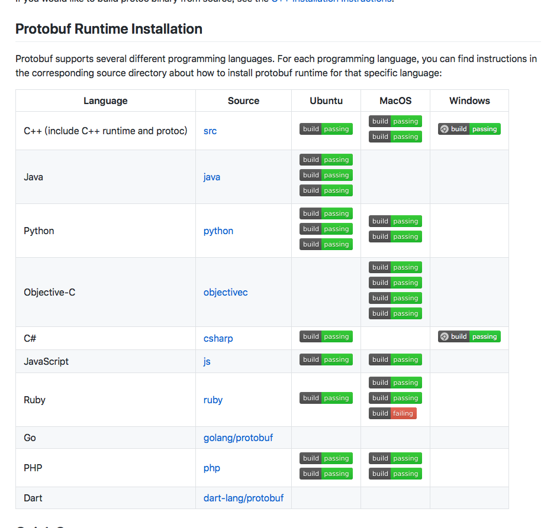

#### 前言


由于笔者业团队的业务对即时通讯服务有很大的依赖，春节结束后的第一天，红包没到，产品同学先到了，产品同学和我说要做一款IM，看到需求文档后和设计图后笔者大吃一斤

这不就是一个翻版的web qq吗？

可以可以

联想到最最近美团的大象，头条的Lark，用户与用户，商家与用户，企业同事的沟通，及其衍生的配套增值服务，真是需求旺盛的强需求啊


#### 如果我要做一个WebIM应用

> 现在的Web应用通常会考虑ajax轮询或者是long polling的方式来实现，但是频繁的建立https连接，会带来多余请求和消息精准性的问题，本质上是TCP，消息边界不清晰，会有黏包的情况

> 类似我司ios和andorid客户端，采用socket+PB协议来解决及时通讯问题，采用socket服务，依赖google的oc PB协议包来实现，socket是基于TCP协议，由通信协议和编程API组成的，原理一次HTTP协议握手成功后，与服务器建立双向连接，数据就可以直接从TCP 通道传输基于事件的方式，二级制传输，反编译为json或者xml


笔者在查阅翻google PB开发者文档时，看到17年下半年google发布了官方的js的版本，配合websocket，可以与PB协议进行配合，在实现原理上，优于现有的ajax轮询或者是long polling的实现方式

So，Let's rock !

#### Protocol Buffer是个什么东东？

>Protocol Buffer是Google提供的一种数据序列化协议，下面是我从网上找到的Google官方对protobuf的定义：

>Protocol Buffers 是一种轻便高效的结构化数据存储格式，可以用于结构化数据序列化，很适合做数据存储或 RPC 数据交换格式。它可用于通讯协议、数据存储等领域的语言无关、平台无关、可扩展的序列化结构数据格式。

#### 为什么是Node，为何要和Protocol Buffer打交道？

>做为javascript开发者，对我们最好的数据序列化协议当然是JSON，pb协议相较于之前流行的XML更加的简洁高效

>pb属于二进制协议，更容易解析，解析速度比文本协议有二向箔级别的压制，so，在聊天场景下，udp传输明显是优于tcp的

>后台通信基本是基于二进制的，以往我们开发中用到的纯文本协议是后台同学在封装一层实现的，例如我司的服务，就维护了两套，一套二进制的，一套http接口的，如果可以用Node打通了pb，可以将维护成本降到最低，理论上只有一套底层二级制服务

>ps. 类似PB这样的东西，还有MessagePack和Apache Thrift


说的这么热闹，老夫已经迫不及待了！

想必你已经说，别逼逼，show me the code，怎么好的开发都么上进呢？

好吧，Let's Rock & Roll!

#### 官方案例

我们来操作一下

#####  安装google-protobuf

2017年4月开始官方支持javascript

[github](https://github.com/google/protobuf) 

[develops](https://developers.google.com/protocol-buffers/)



```
npm install google-protobuf
```

#####  定义.proto文件

> proto文件 messages.proto

```
package zxwj;
syntax = "proto3";
message helloworld 
{ 
   string zzuid = 123;  
   string zzstatus = 0;
}  
```

#####  编译.proto文件

>使用protobuf.js命令行工具编译

```
protoc --js_out=import_style=commonjs,binary:. messages.proto
```
protoc会编译输入文件，并且构建messages_pb，在sever中，可以以以下方式引用

```
var messages = require('./messages_pb');
var message = new messages.MyMessage();
```

#### 编写server.js


```
var basepb = require('./messages_pb');
console.log(basepb);

var message = new basepb.SearchRequest();
console.log(message);

message.setName("TS");
message.setPassword("123456");

var bytes = message.serializeBinary(); //对象序列化
console.log(bytes);

var message2 = basepb.SearchRequest.deserializeBinary(bytes); //进制序列化
console.log(message2);
```


### 运行

```
node sever.js
```


#### 总结一下

##### 上个案例并不具备线上产品能力，但是还可以能看出PB协议的优势所在

> 快，从官方的测试结果来看，整体比較起來，ProtoBuf.js 則是比纯JSON 的处理快上一倍以上，附官方Github测试结果（机器配置：i7-2600K。Node.js 版本：6.9.1）

```
benchmarking encoding performance ...

Type.encode to buffer x 547,361 ops/sec ±0.27% (94 runs sampled)
JSON.stringify to string x 310,848 ops/sec ±0.73% (92 runs sampled)
JSON.stringify to buffer x 173,608 ops/sec ±1.51% (86 runs sampled)

      Type.encode to buffer was fastest
   JSON.stringify to string was 43.5% slower
   JSON.stringify to buffer was 68.7% slower

benchmarking decoding performance ...

Type.decode from buffer x 1,294,378 ops/sec ±0.86% (90 runs sampled)
JSON.parse from string x 291,944 ops/sec ±0.72% (92 runs sampled)
JSON.parse from buffer x 256,325 ops/sec ±1.50% (90 runs sampled)

    Type.decode from buffer was fastest
     JSON.parse from string was 77.4% slower
     JSON.parse from buffer was 80.3% slower

benchmarking combined performance ...

Type to/from buffer x 254,126 ops/sec ±1.13% (91 runs sampled)
JSON to/from string x 122,896 ops/sec ±1.29% (90 runs sampled)
JSON to/from buffer x 88,005 ops/sec ±0.87% (89 runs sampled)

        Type to/from buffer was fastest
        JSON to/from string was 51.7% slower
        JSON to/from buffer was 65.3% slower

benchmarking verifying performance ...

Type.verify x 6,246,765 ops/sec ±2.00% (87 runs sampled)

benchmarking message from object performance ...

Type.fromObject x 2,892,973 ops/sec ±0.70% (92 runs sampled)

benchmarking message to object performance ...

Type.toObject x 3,601,738 ops/sec ±0.72% (93 runs sampled)
```


##### 接下来要做的事情


> PB的优势场景是IM中的数据存储和交互，如果要实现一个高品质的IM，信息流的稳定和边界很重要，我们还需要完善以下几个部分

- 稳定可维护的Node socket.io服务（socket篇）
- PB的动态编译的特性和嵌套message，数据结构简单化（数据篇）
- 前端对于二级制的的处理，例如ArrayBuffer，序列化与反序列化，MD5加密（加密篇）