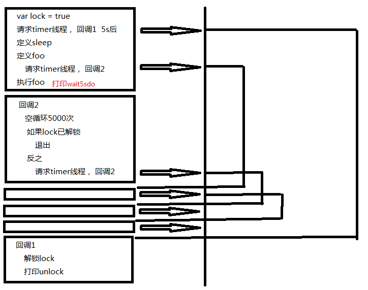

## 源起
小飞是一名刚入行前端不久的新人，因为进到了某个大公司，俨然成为了学弟学妹眼中'大神'，大家遇到js问题都喜欢问他，这不，此时他的qq弹出了这样一条消息  

"hi,大神在吗？我有个问题想问，现在我们的代码里面有这样的东西,可是得不到正确的返回结果
``` 
function getDataByAjax () {
    return $.ajax(...postParam)
}
var data = getDataByAjax()
if (data) {
    console.log(data.info)
}
```
"哦，你这里是异步调用，不能直接获得返回值，你要把if语句写到回调函数中",小飞不假思索的说到，对于一个‘专业’的fe来说，这根本不是一个问题。  
“可是我希望只是改造getDataByAjax这个方法，让后面的代码成立。”
“研究这个没有意义，异步是js的精髓，同步的话会阻塞js调用，超级慢的，但是你要一再坚持的话，用async:true就好了”  
“不愧是大神，我回去立刻试一试，么么哒”

两天后，她哭丧着脸登上了qq
“试了一下你的方法，但是根本行不通，哭~~”
“别急，我看看你这个postParam的参数行吗”

```
{
    ...
    dataType: 'jsonp',
    async: true
    ...
}
```
"这是一个jsonp请求啊，老掉牙的东西了，，jsonp请求是没有办法异步的"  
“我知道jsonp请求的原理是通过script标签实现的，但是，你看，script也是支持同步的呀，你看http://www.w3school.com.cn/tags/att_script_async.asp”  
“额，那可能是jquery没有实现吧，哈哈”  
“大神，你能帮我实现一个jsonp的同步调用方式嘛，拜托了(星星眼)”  
虽然他有点奇怪jquery为什么没有实现，但是既然w3school的标准摆在那里，码两行代码又没什么，

```
export const loadJsonpSync = (url) => {
  var result;
  window.callback1 = (data) => (result = data)
  let head = window.document.getElementsByTagName('head')[0]
  let js = window.document.createElement('script')
  js.setAttribute('type', 'text/javascript')
  js.setAttribute('async', 'sync')
  // 这句显式声明强调src不是按照异步方式调用的
  js.setAttribute('src', url)
  head.appendChild(js)
  return result
}
```
额，运行起来结果竟然是undefined！w3cshool的文档竟然也不准，还权威呢，我看也不怎么着，小飞暗自想到。
“刚才试了一下，w3school文档上写的有问题，这个异步属性根本就是错的”
“可是我刚还试过一次这个，我确认是好的呀”
```
<script src="loop50000 && put('frist').js"></script>
<script src="put('second').js"></script>
```
(有兴趣的同学可以实现以下两个js，并且加上async的标签进行尝试。)  
“这个，我就搞不清楚了”，小飞讪讪的说到  
对方已离线

## 抽象
关于这个问题，相信不只是小飞，很多人都难以解答。为什么ajax可以做到同步，但jsonp不行，推广到nodejs上，为什么readFile也可以做到同步(readFileSync)，但有的库却不行。
（至于script的async选项我们暂时避而不谈，是因为现在的知识维度暂时还不够，但是不要着急，下文中会给出明确的解释）
现在，让我们以计算机科学的角度抽象这个问题：
>     我们是否可以将异步代码转化为同步代码呢？(ASYNC_CALL => SYNC_CALL)

既然是抽象问题，那么我们就可以不从工程角度/性能角度/实现语言等等等方面来看(同步比异步效率低下),每增加一个维度，复杂程度将以几何爆炸般增长下去。

首先，我们来明确一点，==在计算机科学领域==同步和异步的定义
> 同步（英语：Synchronization），指对在一个系统中所发生的事件（event）之间进行协调，在时间上出现一致性与统一化的现象。在系统中进行同步，也被称为及时（in time）、同步化的（synchronous、in sync）。--摘自百度百科


> 异步的概念和同步相对。即时间不一致，不统一

明确了这一点，我们可以借助甘特图来表示同步和异步

  
其中t1和t2是同步的，t1和t3是异步的。
答案就在操作系统原理的大学教材上，我们有自旋锁，信号量来解决问题，伪代码如下
```
 spinLock () {
   // 自旋锁
   fork Wait 3000 unlock() //开启一个异步线程，等待三秒后执行解锁动作
   loop until unlock 不断进行空循环直到解锁动作
   Put ‘unlock’
 }
 
 //pv原语，当信号量为假时立即执行下一步，同时将信号量置真
 //反之将当前执行栈挂起，置入等待唤醒队列
 //uv原语，将信号量置为假，并从等待唤醒队列中唤醒一个执行栈
 Semaphore () {
   pv()
   fork Wait 3000 uv()
   pv()
   uv()
   Put 'unlock'
 }
```
很好，至此都可以在操作系统原理的教材上翻到答案。于是我们在此基础上添加约束条件
>     仅仅依赖于js本身，我们是否可以将异步代码转化为同步代码呢？(ASYNC_CALL => SYNC_CALL)

## 论证

带着这个问题，我们翻看一下jquery的源码
https://github.com/jquery/jquery/blob/262acc6f1e0f71a3a8b786e3c421b2e645799ea0/src/ajax/xhr.js#L42
可以看出, ajax的同步机制本质上是由XMLHttpRequest实现的，而非js原生实现。
同样的道理，我们再翻看一下nodejs的源码
https://github.com/nodejs/node/blob/v8.3.0/lib/fs.js#L550
从readFileSync->tryReadSync->readSync一路追下去，会追到一个c++ binding， https://github.com/nodejs/node/blob/v8.3.0/src/node_file.cc#L1167
```
  if (req->IsObject()) {
    ASYNC_CALL(read, req, UTF8, fd, &uvbuf, 1, pos);
  } else {
    SYNC_CALL(read, 0, fd, &uvbuf, 1, pos)
    args.GetReturnValue().Set(SYNC_RESULT);
  }
```
同步的奥妙在于c++的宏定义上，这是一种借由c++来实现的底层同步方式。
观察了这两种最广泛的异步转同步式调用，我们发现均没有采用js来实现。  
似乎从现象层面上来看js无法原生支持，但是这还不够，我们探究在js语义下上面的自旋锁/信号量的特性模拟实现(我知道你们一定会嗤之以鼻，==js本身就是单线程的，只是模拟了多线程的特性== 我无比赞同这句话，所以这里用的不是实现，而是特性模拟实现)，另外，由于settimeout具有fork相似的异步执行特性，所以我们用setitmeout暂时代替fork

#### 自旋锁
1.第一个实现版本
```
var lock = true
setTimeout(function () {
lock = false
}, 5000)

while(lock);
console.log('unlock')
```

我们预期在5000ms后执行unlock语句，但是悲剧的是，整个chrome进程僵死掉了。
为了解释清楚这个问题，我们读一下阮一峰老师的event loop模型
http://www.ruanyifeng.com/blog/2014/10/event-loop.html
看样子咱们已经清楚的了解了event loop这个js运行顺序的本质（同步执行代码立即执行，异步代码入等待队列），那么，我们可以基于此给出js vm的调度实现（eventloop的一种实现），当然，咱们为了解释自旋锁失败只需要模拟异步操作， 同步操作，和循环就好
```
//taskQueue：任务队列
//runPart：当前正在执行的任务(同步指令集)
//instruct： 正在执行的指令

function eventloop (taskQueue) {
  while(runPart = taskQueue.shift()) {
    while(instruct = runPart.shift()) {
      const { type, act, codePart } = instruct
      switch(type) {
        case 'SYNC':
          console.log(act)
          if (act === 'loop')
            runPart.unshift({
              act: 'loop',
              type: 'SYNC'
            })
          break
        case 'ASYNC':
          taskQueue.push(codePart)
          break
      }
    }
  }
}
```
然后转化我们的第一个版本自旋锁
```
let taskQueue = [
  [
    {act: 'var lock = true', type: 'SYNC'}, //var lock = true
    {
        act: 'setTimeout',
        type: 'ASYNC',
        codePart: [
            {act: 'lock = false', type: 'SYNC'}
        ]
    }, // setTimeout(function () { lock = false }, 5000)
    /*{
        act: 'loop',
        type: 'SYNC'
    },*/ // while(lock);
    {
        act: 'console.log(\'sync\')',
        type: 'SYNC'
    } // console.log('unlock')
  ]
]
```
测试一下，符合evnet loop的定义，然后放开注释，我们成功的让loop block住了整个执行过程，lock = false永远也没有机会执行！！！  
（真实的调度机制远比这个复杂的多得多的，有兴趣的可以看看webkit~~~的jscore的实现哈）  

知道了原理，我们就来手动的改进这部分代码
2.改进的代码
```
var lock = true
setTimeout(function () {
    lock = false
    console.log('unlock')
}, 5000)

function sleep() {
  var i = 5000
  while(i--);
}

var foo = () => setTimeout(function () {
    sleep()
    lock && foo()
})
foo()
```
这个版本的改进我们对while(true);做了切块的动作,实际上这种技巧被广泛的应用到改善页面体验的方面，所以，有些人因为时序无法预知而抗拒使用settimeout这种想法是错误的！
http://blog.csdn.net/kongls08/article/details/6996528，
> 小测验1： 改写eventloop和taskQueue，使它支持改进后的代码  

可是，如果把代码最后的foo() 变成 foo() && console.log('wait5sdo'),
我们的代码依然没有成功，why
  
注意看我们标红的地方，如果你完成了小测验1，就会得到和这张图一致的顺序  

==同步执行的代码片段必然在异步之前。==  

所以，无论从理论还是实际出发，我们都不得不承认，在js中，把异步方法改成同步方法这个命题是水月镜花

哦对了，最后还需要解释一下最开始我们埋下的坑， 为什么jsonp中的async没有生效，现在解释起来真的是相当轻松，即document.appendChild的动作是交由dom渲染线程完成的，所谓的async阻塞的是dom的解析，而非js引擎的阻塞。实际上，在async获取资源后，与js引擎的交互依旧是push taskQueue的动作，也就是我们所说的async call

> 推荐阅读： 关于dom解析请大家参考webkit技术内幕第九章资源加载部分  

## 峰回路转  

相信很多新潮的同学已经开始运用切了async/await语法，在下面的语法中，getAjax1和console之间的具有同步的特性
```
async function () {
    var data = await getAjax1()
    console.log(data)
}
```
讲完了event loop和异步的本质，我们来重新审视一下async/await。
老天，这段代码亲手推翻了==同步执行的代码片段必然在异步之前。== 的黄金定律！  
惊不惊喜，意不意外，这在我们的模型里如同三体里的质子一样的存在。我们重新审视了一遍上面的模型，实在找不到漏洞，找不到任何可以推翻的点，所以真的必须承认，async/await绝对是一个超级神奇的魔法。  
到这里来看我们不得不暂时放弃前面的推论，从async/await本身来看这个问题
相信很多人都会说，async/await是CO的语法糖，CO又是generator/promise的语法糖，好的，那我们不妨去掉这层语法糖，来看看这种代码的本质, 关于CO，读的人太多了，我实在不好老生常谈，可以看看这篇文章，咱们就直接绕过去了,这里给出一个简易的实现
http://www.cnblogs.com/jiasm/p/5800210.html  

```
function wrap(wait) {
  var iter
  iter = wait()
  const f = () => {
    const { value } = iter.next()
    value && value.then(f)
  }
  f()
}

function *wait() {
  var p = () => new Promise(resolve => {
      setTimeout(() => resolve(), 3000)
  })
  yield p()
  console.log('unlock1')
  yield p()
  console.log('unlock2')
  console.log('it\'s sync!!')
}

```

终于，我们发现了问题的关键，如果单纯的看wait生成器(注意，不是普通的函数)，是不是觉得非常眼熟。这就是我们最开始提出的spinlock伪代码！！！  
这个已经被我们完完全全的否定过了，js不可能存在自旋锁，事出反常必有妖，是的，yield和*就是表演async/await魔法的妖精。
generator和yield字面上含义。Gennerator叫做生成器，yield这块ruby，python，js等各种语言界争议很大，但是大多数人对于‘让权’这个概念是认同的(以前看到过maillist上面的争论，但是具体的内容已经找不到了)
> 扩展阅读---ruby元编程 闭包章节yield(ruby语义下的yield) 

所谓让权，是指cpu在执行时让出使用权利，操作系统的角度来看就是‘挂起’原语，在eventloop的语义下，似乎是暂存起当时正在执行的代码块(在我们的eventloop里面对应runPart)，然后顺序的执行下一个程序块。
我们可以修改eventloop来实现让权机制
> 小测验2 修改eventloop使之支持yield原语

至此，通过修改eventloop模型固然可以解决问题，但是，这并不能被称之为魔法。
## 和谐共存的世界
实际上通过babel，我们可以轻松的降级使用yield,（在es5的世界使用让权的概念！！）
看似不可能的事情，现在，让我们捡起曾经论证过的
==同步执行的代码片段必然在异步之前。==  这个定理，在此基础上进行进行逆否转化
> ==在异步代码执行之后的代码必然不是同步执行的(异步的)。==   

这是一个圈子里人尽皆知的话，但直到现在他才变得有说服力（我们绕了一个好长的圈子）
现在，让我们允许使用callback，不使用generator/yield的情况下完成一个wait generator相同的功能！！！
```
function wait() {
    const p = () => ({value: new Promise(resolve => setTimeout(() => resolve(), 3000))})
    let state = {
      next: () => {
        state.next = programPart
        return p()
      }
    }
    function programPart() {
      console.log('unlocked1')
      state.next = programPart2
      return p()
    }
    function programPart2() {
      console.log('unlocked2')
      console.log('it\'s sync!!')
      return {value: void 0}
    }
    return state
}

```
太棒了，我们成功的完成了generator到function的转化(虽然成本高昂)，同时，这段代码本身也解释清楚了generator的本质，高阶函数，片段生成器，或者直接叫做函数生成器！这和scip上的翻译完全一致,同时拥有自己的状态(有限状态机)
> 推荐阅读 计算机程序的构造和解释 第一章generator部分   
> 小测验3 实际上我们提供的解决方式存在缺陷，请从作用域角度谈谈

其实，在不知不觉中，我们已经重新发明了计算机科学中大名鼎鼎的CPS变换
https://en.wikipedia.org/wiki/Continuation-passing_style

最后的最后，容我向大家介绍一下facebook的CPS自动变换工具--regenerator。他在我们的基础上修正了作用域的缺陷，让generator在es5的世界里自然优雅。我们向facebook脱帽致敬！！https://github.com/facebook/regenerator  
## 后记
同步异步 可以说是整个圈子里面最喜欢谈论的问题，但是，谈来谈去，似乎绝大多数变成了所谓的‘约定俗称’，大家意味追求新技术的同时，却并不关心新技术是如何在老技术上传承发展的，知其然而不知其所以然，人云亦云的写着似是而非的js。==技术，不应该浮躁==。  


PS: 最大的功劳不是CO，也不是babel。regenerator的出现比babel早几个月，而且最初的实现是基于esprima/recast的，关于resprima/recast,国内似乎了解的并不多，其实在babel刚刚诞生之际， esprima/esprima-fb/acron 以及recast/jstransfrom/babel-generator几大族系围绕着react产生过一场激烈的斗争，或许将来的某一天，我会再从实现细节上谈一谈为什么babel笑到了最后~~~~