## 持续迭代的电商可视化运营页面生成系统

> 上个月在前端早读课做了一次关于“可视化运营页面生成系统”的live，本篇文章是这次live的文字记录。

在电商领域，活动运营扮演着极为重要的角色，一场成功的运营活动甚至可以为公司创造数千亿的成交额。所以，服务好运营同学，是技术团队必须要做好的重中之重。纵观转转发展的几年时间内，随着公司规模增长，运营团队成员呈现急速扩充趋势。相对的，技术侧资源紧张的弊端则日益凸显，如何用极少的人力hold住大量的运营需求，相信不止转转，每一个高速增长中企业都有着类似的诉求。

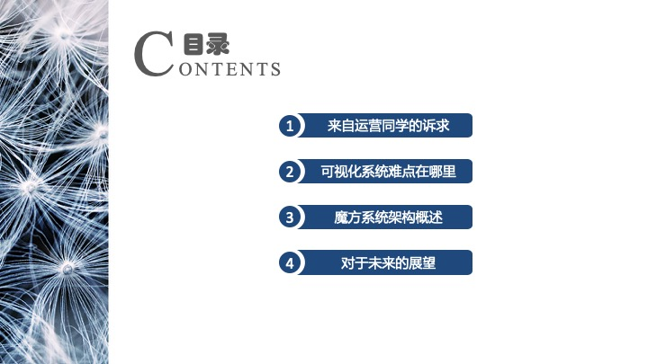

而本场live中，我们将会从运营活动的基本特性出发, 透过实际应用案例，推断出活动页面生成系统的核心需求，最后引申出一套维护成本低，可持续"自我进化“的活动页面生成系统，因为这个叫法过于拗口，所以下面我们将简称为可视化系统

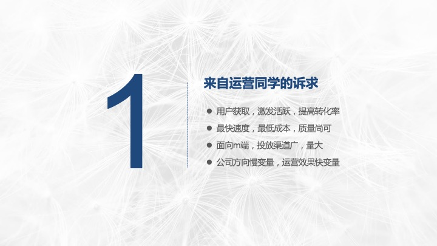

首先明确一点，这套系统是服务于公司内的运营同学帮助他们提高产出效率的工具。注意，“公司内”这一点非常之重要，因为他给定了一个子集。
- 大家看第一条，类比于大家都熟悉的标准的运营模型AAARR(获取用户, 提高活跃度, 提高留存率，获取收入，自传播)，因为我们作为一个逐渐打磨产品的创业公司，现阶段运营其实是用户获取，激发活跃，提高转化率这三个方面的，这就是我们的子集，换言之裂变玩法，自传播这块就暂时不需要投入太多精力去做。
- 第二点，最快速度，最低成本，质量尚可，众所众知，大部分运营活动经常卡某个时间点上线或者追热点，而且持续时间很短，所以投入太多资源打磨产品是没有必要也不现实的。
- 第三点，多端投放，渠道投放进行引流，所以其实这种需求对于运营这块快速兼容各种app是有很高要求的，因为瞬时峰值很大，所以结构要设计的尽可能简单，这点咱们放在后面的部分详细谈。
- 然后第四点，也是最重要的部分，公司方向慢变量，运营效果快变量。借用何帆老师在变量里面提到的变量的观点，快变量很好理解啊，今天我们发放了一笔优惠券，4毛100块，过了两天发现运营搞得特别好，全国人民都知道这事了，但是花的钱太多了，怎么办？动态的需要调整。金额，中奖几率，法律条款，文案，甚至图片颜色，一位富有经验的运营同学需要时时的监控数据的变化并进行快速调整，而且常常半夜守在公司，所以大家在碰到运营汪低三下四的求着改文案的时候，也千万要体谅一下他们。
公司发展慢变量，这个就厉害了，他是指公司战略层面进行调整， 持续增长，变现能力，一切经营活动都是紧扣一个主题进行的。如果想在一个阶段内支撑好某个旋律，就一定要有快速跟进甚至打好提前量的思维。有人说这个是不是太虚了。好，让我们来看一组数据。

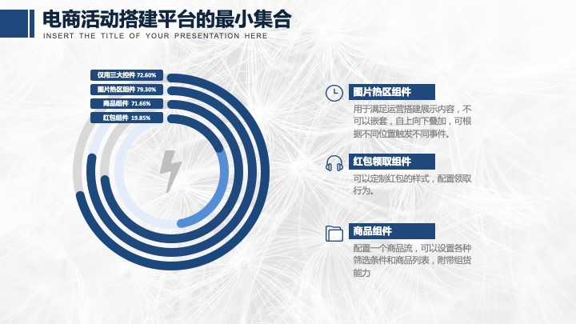

左边的图是周末统计出来的我们可视化平台上面的组件使用情况，最内圈上面的两种颜色是我特别追加上去的，较浅的代表2017-2018年上半年红包发放组件占整体活动页面的比例，大概是40%-50%之间，而18年下半年急降至不足20%，相反，对于商品展示流组件的需求大大提升。这是由于公司战略由拉新用户逐渐倾斜于订单转化率的大格局导致的，如果前瞻性的定制了大量红包组件的功能，最后的结果可能是很糟的，中台面临的最尴尬问题，辛辛苦苦做出来东西但是没人用。这种滋味并不好受。

眼尖的同学已经注意到了，除了说明公司大战略变化对于可视化平台组件需求的影响，这张图片还有几个更有趣的数据，红包组件，图片组件，商品组件在该平台的使用率分别达到了79%， 71%和20%。而这三个高频组件组织在一起使用率高达72%。换言之，这三个组件提供了可视化平台3/4的能力。如果您是一个小型电商公司，开发好这三种组件混搭布局的方案足以解放大半研发成本。
还是想象不出来？让我们看下实际样例。

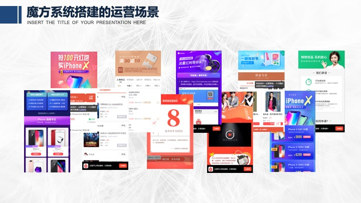

看着各种花哨的页面，但其实本质上面就是三种组件组合成的专题页面，看吧，在电商领域，做好了这三个组件，你的可视化系统已经能够生存下来了。

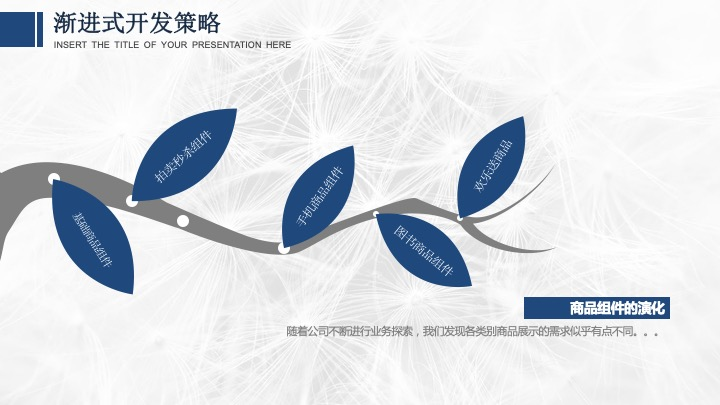

好，讲了一些业务层面的东西，现在足以支撑起我们做技术上的选型与判断了，我们思考一个最核心的问题，可视化系统的技术难点究竟在哪？像axure一样的自由布局方案？事件流编辑器？组件的协同工作？谈到可视化编辑大家第一反应一定是上面印象。但是相对的，复杂的技术对于研发投入，维护成本似乎不低。甚至对使用者来说门槛也显得比较高，借用业界的一句灵魂拷问来说：不会写前端的人就会用sketch了吗？。而且，而且业务迭代频繁，接口不统一，各种问题都会让情况变的复杂。公司在变，时代在变，设计一套系统以不变应万变，难。

所以，我们决定做的简单一点，做一个专注于页面生成发布，组件粗粒度编辑器（就像前面提到的三种组件），同时，通过持续迭代和自定义组件赋予她无穷的可能性。面向运营，也拥抱开发者。

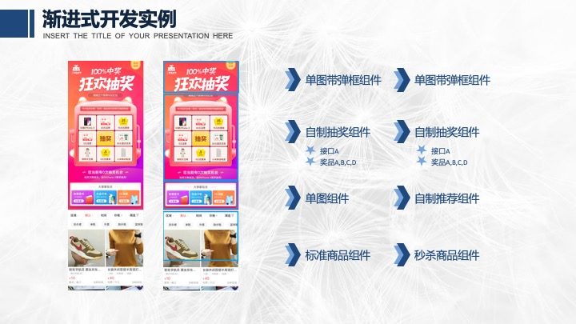

生存还远远不够，回顾一下标题，持续迭代的的电商可视化运营页面生成系统。是的，我们不但要生存下去，还要迭代，发展起来。所以我们提出了在这三大组件上面的渐进式开发策略，下沉到各个业务线上，一步一步的迭代出各种垂类组件。还是有点抽象？没关系，咱们再具体一点。

左边是我们的双十一预热抽奖页面，这是一个典型的与业务同学一同混合开发专题活动，在第一次迭代过程应用了图片组件，商品流组件和自制抽奖。而后分别定制了推荐组件和秒杀组件进行替换。抽奖组件最开始是全部内容接口写死的，但随着之后的活动我们开发了接口的配置项，奖项配置，皮肤配置等等。这个过程是全程持续交付的。运营同学可以通过我们的可视化编辑器随时调整，所以在我们的方案里，可视化平台的核心也是一个组件化交付平台。

下面开始基本就是干货了，我将重点讲一下我们的可视化平台魔方系统，工作原理及架构图，可视化仿真器以及插件系统。

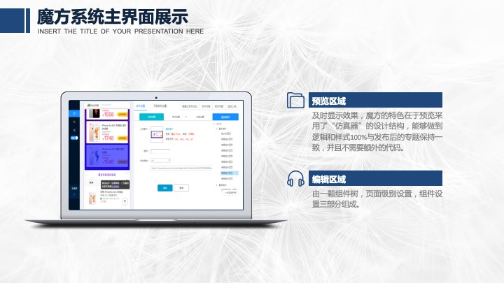

首先来看下我们的主界面，分成预览区域和编辑区域两部分。魔方的特色在于左侧预览区域采用了“仿真器”的设计结构，能够做到逻辑，样式100%与发布后的专题保持一致，并且不需要额外的代码，而且最重要的一点在于，她不借助与任何后端服务。
然后编辑区域则是中规中矩的组件树，页面级别设置，和组件设置。

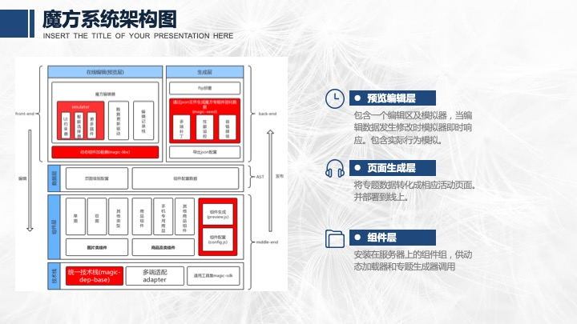

说完了主界面，让我们看下整体的架构，其实这套系统和编译器结构稍稍有点类似，简单的可以划分成预览编辑层，页面生成层和组件层三个部分。每个专题在编辑时会生成一个json文件用以描述该专题的配置信息，然后生成层读入这个json文件，通过webpack打包成一个完整的静态页面，是的，魔方系统从稳定性方面考虑，并没有借助任何ssr或后端模板技术，纯粹是通过webpack进行打包构建的。组件层则是通过npm安装在服务器上，供动态加载器和专题生成器调用，这两块我们一会再详细说。而最下层的核心技术栈则提供了整体的编译脚本和统一版本的第三方依赖。

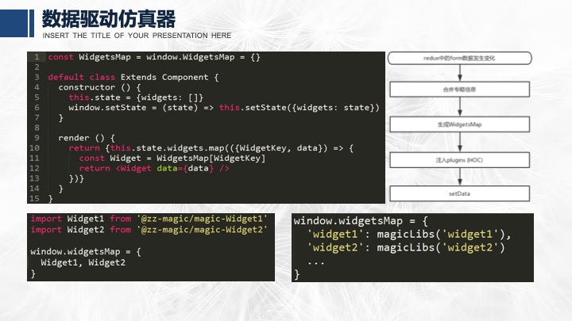

好，让我们看下仿真器这块，说仿真之前，其实我们需要先解释一下页面生成了什么、第一段代码其实就是生成器的核心渲染逻辑简化版，返回一个组件列表并且注入相应的数据。在生成层的逻辑中，我们以在生成模板执行构建命令，利用环境变量将专题json读入，通过分析生成下面左侧的代码，通过宏替换注入模板，最后通过webpack构建打包成最终产物。

而仿真器则是在一个iframe中内置了一个空的模板, 通过父层向iframe注入js(动态加载库)，并修改全局widgetsMap，右下所示。最后通过setState重新渲染页面。整个过程是无需后端参与的。

关于动态加载库，可以类比code split技术想象成需要哪个组件就请求哪段代码，这里篇幅有限，暂时不展开谈论，感兴趣的可以关注大转转FE进行互动讨论。

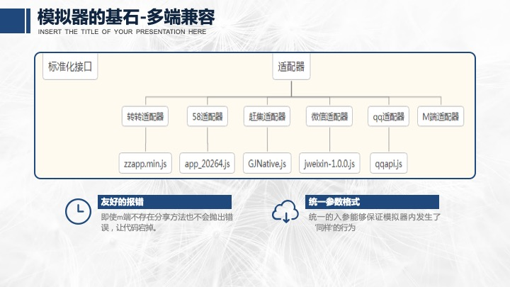

对于分享及其他native拓展能力来说，各个app提供的API并不相同，甚至在某些容器中没有相应的功能，为了让模拟器正常工作，我们需要一种抹平多端差异的公共库，使得各端不会抛出错误。

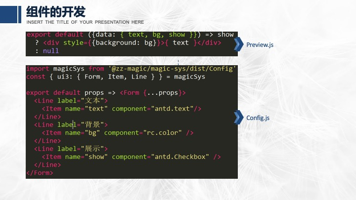

说完了模拟器，我们想聊一下组件系统，前文说过，可视化平台的核心也是一个组件化交付平台。如果开发一个组件的门槛过高就会导致开发者抛弃这套系统。所以我们设计的一个组件将是下面的样子。

我们的组件分成两个部分，即组件实体和配置项，在最初的组件开发过程中，不需要任何配置项，魔方组件就是一个普通的react组件，上手的成本非常低。而随着版本迭代，越来越多的配置项进去，我们提供了一套简洁的api用于快速增加配置项。关于配置项这里，我们也尝试过采用json来描述，最后从灵活性上面来看略微不满足需求。而且可拓展性不足。

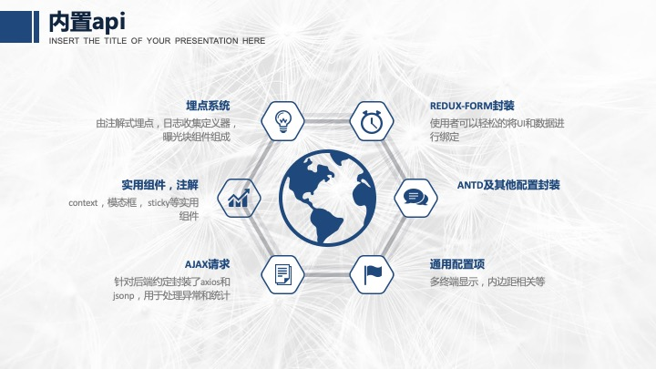

魔方提供了一套内置的api用以轻松的完成某些动作，我总结了一下大概如上6类。

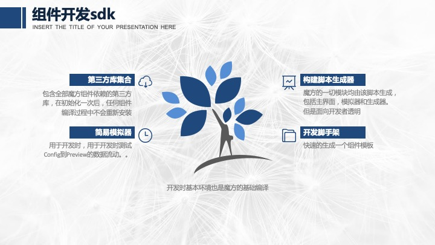

为了让开发人员方便的进行定制组件的调试，我们又设计了一套组件开发的sdk工具集，大概包括下面四个方面，第一：第三方库集合，包含全部魔方组件依赖的第三方库，在初始化一次后，任何组件编译过程中不会重新安装。第二，面向开发者透明的构建脚本生成器，用以进行组件的本地化测试构建。第三，一个简易的编辑模拟器，用于开发时测试Config到Preview的数据流动。最后，还有一个用于快速创建项目的组件脚手架。

在组件管理这块，我们采用monorepo+安装时构建的策略来处理组件包的。组件管理的最让人头疼的地方在于组件所依赖的其他第三方npm包的管理，利用monorepo来组织代码可以使结构更加清晰，权限明确，全部组件共享构建脚本使得底层优化更加可控，安装时构建更可以确保第三方组件不会重复或多版本引用。

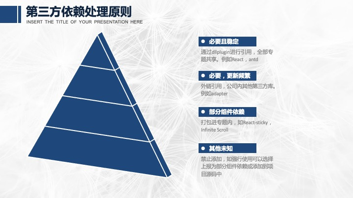

关于第三方的依赖的打包，我们采用一种多层的优化策略，按重要程度划分成4个类型，金字塔最上面的是必要且稳定的一类，比如react，antd，这种是通过dllplugin打包成一个js，所有的专题均引用这一个js。其次是部分组件依赖的，组件构建时extrenal掉，当专题生成时打包进专题内，比如无限滚动插件。还有一种会频繁更新，采用外链直接引用的方式，而其他未知组件，是禁止添加到项目源码中的。

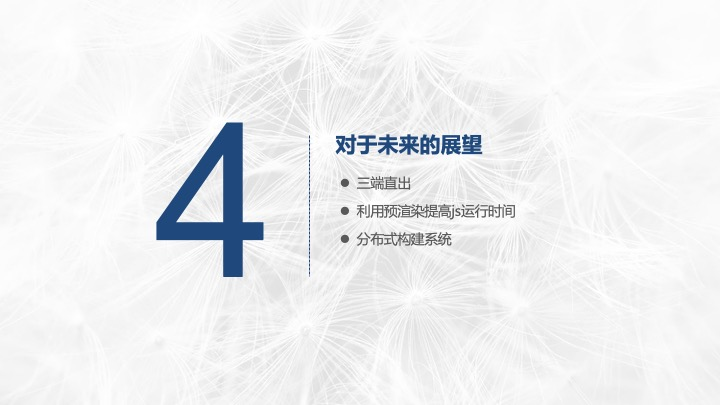

说了这么多实现细节，再说点我们的梦想，从最开始的架构图其实可以看出，魔方的本质是可视化生成json，然后读取json生成静态页面，实际通过描述甚至可以组装成native页面，微信小城序，产出存在着各种的可能。我们也会陆续尝试向这个方向探索，然后回顾一下我们的仿真器，我认为可以在生成页面时进行预渲染提升速度，最后就是随着公司规模扩大现在看起来单机构建效率不足，所以我们会考虑利用分布式构建来提升效率。

好了，总结一下本次live的观点：
1. 运营活动有很多特征，比如我们的电商公司：图片，商品流和红包是运营的核心要素。
2. 运营活动千变万化，以不变应万变很难，所以让可视化系统保持生命力的关键是持续迭代和支持插件。
3. 魔方的工作方式是通过可视化编辑器生成json，通过json注入模板生成静态页面。
4. 开放插件及定制能力需要完善的配套系统。
5. 插件系统棘手的难点在于第三方依赖的管理。
