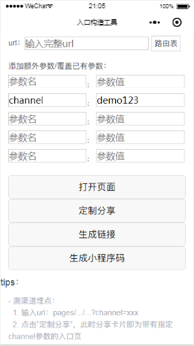
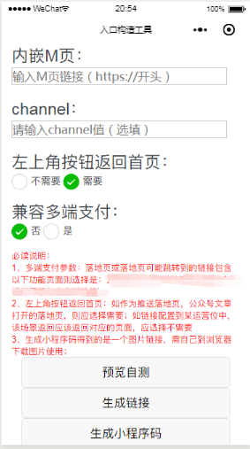
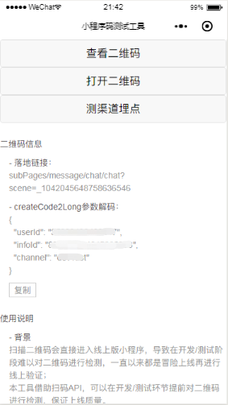

# 小程序入口构造工具&二维码测试工具

<!--
 标题：小程序入口构造工具&二维码测试工具
 封面：images/小程序入口构造工具&二维码测试工具/cover.png
 作者：吴鹏和
-->

本文将介绍我们小程序中隐藏的两个工具页面。原理虽不复杂，收益却实实在在，或许也能给诸君带来启发。

## 入口构造工具

### 痛点
- PM&运维 投放链接  
  PM&运维每次投放新入口时，都需要找FE要页面链接。投放多少链接就要找FE多少次，一方面相互之间的沟通等待会耗掉不少时间，另一方面询问/回复过程会打断对方手头的工作，影响状态。  
  关键是大多时候这些链接只是需要改个渠道参数，并不涉及结构上的调整，完全可以由PM/运维自行修改。  
  然而要向所有PM&运维全面科普url构造规则，并没有想象中容易；各种链接构造需求就这样在无形中不断消耗双方的精力。  
  
- FE&QA 开发/测试线下功能  
  开发/测试没有线上入口的新功能时，经常需要构造一个临时入口供以访问。  
  可以修改线下接口配置运营位作为访问入口，但是一则运营位有限，二则不能一站式操作；也可以修改代码加个临时入口，但是会污染代码，难保不会带到线上。  
  这样的情形反复出现也是挺麻烦的。  
    
### idea
开发一个专门的入口构造页面，直接提供给PM、运维、FE、QA等各方使用。需要什么链接需要什么入口，直接自助生成，无需一次次反复沟通/构造。  
  
### 效果
**通用入口构造：**  
  
如图所示，在入口构造页面中，用户可以直接输入FE提供的url模板并自助修改链接参数，从而获得所需链接。同时支持：  
- 直接打开该链接，进行查看、自测；
- 生成以该链接作为落地链接的分享卡片，从而以落地页的形式打开查看；
- 将该链接复制到剪贴板，供以投放；
- 生成以该链接作为落地链接的二维码，供以投放。

**内嵌M页入口构造：**  
  
如图所示，内嵌M页的小程序链接构造同样支持类似功能。  

### 实现
- 需求转译  
  将链接参数以普通用户能理解的形式展现出来，并允许其直接修改，再配以说明文案。以此抹平url构造规则造成的技术门槛。
- 入口构造  
  页内入口 直接以按钮跳转实现，外部入口 以分享卡片进行模拟。
- 链接输出  
  使用wx.setClipboardData接口经由剪贴板粘贴使用。
- 初始入口  
  生成二维码作为入口构造页面自身的初始入口；将工具页面分享出去，保留分享卡片作为初始入口。

### 意义
- 效率  
入口构造工具使得PM、运维、FE、QA等各方可以自助、高效地构造所需链接/入口，有效节省了重复沟通成本，并在一定程度上提高了开发、测试、投放效率。

- 质量  
入口构造工具提供的链接生成功能和预览功能可以在一定程度上避免/发现链接拼接失误等人工疏漏，提高整体交付质量。

## 二维码测试工具

### 痛点
扫描二维码时会直接进入线上版小程序，导致在开发/测试阶段难以对二维码相关功能进行有效的检测和把控。  
早期只能先冒险上线，然后进行线上验证，万一有问题再修复再重新上线，导致二维码相关功能调试效率低、上线风险高。  
后来开发者工具支持通过二维码编译，管理后台也支持回滚，相对来说，二维码相关功能可控性强了很多；但是对于QA、PM、运维、第三方接入业务等小伙伴来说，二维码的检查、测试还是很无力。  

### idea
开发一个专门的二维码测试页面，支持在当前开发版/体验版/线上版小程序中对二维码进行查看和预览。

### 效果
  
   
如图所示，在二维码测试页面中，用户可以：
- 直接查看二维码的编码信息，包括落地链接、参数等；
- 在当前开发版/体验版/线上版小程序中打开二维码落地链接；
- 生成与二维码拥有相同落地链接的当前开发版/体验版/线上版小程序的分享卡片。

### 实现
- 查看二维码信息  
  使用wx.scanCode接口可以读取二维码信息，包括落地页、参数等。

- 在当前开发版/体验版/线上版中打开二维码  
  使用wx.scanCode接口获取落地链接，使用wx.navigateTo等接口在当前开发版/体验版/线上版小程序中打开目标页面。

- 在当前开发版/体验版/线上版中以落地页的形式打开二维码  
  使用wx.scanCode接口获取落地链接，生成相同落地链接的分享卡片，访问分享卡片以模拟开发版/体验版下扫码打开小程序。  

### 意义
- 效率    
  查看二维码信息可以有效提高相关功能调试效率；  
  直接在当前开发版/体验版中打开二维码可以有效提高相关功能测试效率，特别是对于QA等非前端人员。

- 质量  
  二维码测试工具便于QA在稳定环境充分测试二维码相关功能，从而提高小程序交付质量。

值得一提的是，这两个工具都是FE自发思考自发实现的，产出时小伙伴们表示“很惊喜”。  
很多时候，主动去思考、发现、分析、解决痛点，能让你贡献出意料之外的价值，共勉。  
