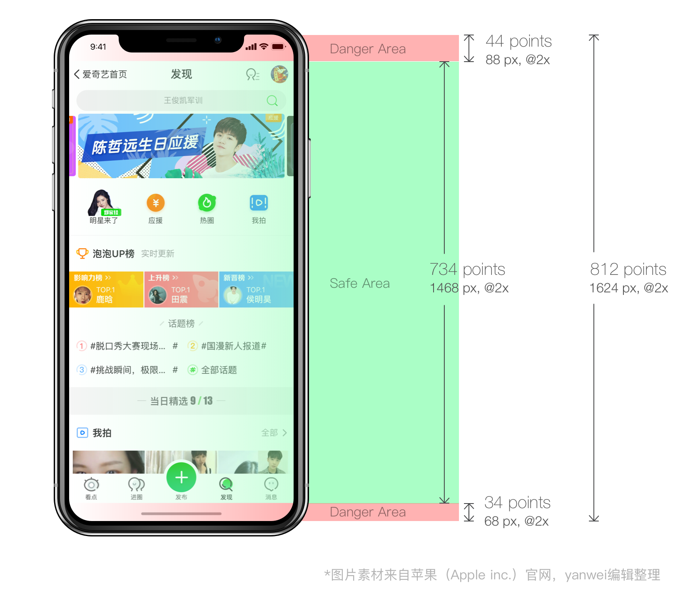

### 引言

iPhoneX发布至今已经有将近一年的时间了，各类app都多多少少做了对iPhoneX的适配，那对于我们H5页面该做哪方面的适配呢？

首先了解安全区域(safe area)的概念，它保证了内容在设备上的正确嵌入，不会被状态栏、导航栏等遮挡。

> Apps should adhere to the safe area and layout margins defined by UIKit, which ensure appropriate insetting based on the device and context. The safe area also prevents content from underlapping the status bar, navigation bar, toolbar, and tab bar.  

<sub>-- by Apple's Human Interface Guidelines</sub>


<sub>图1</sub>

对于h5页面来说，通常是在浏览器或app的webview这样的“容器”中打开，这些容器大都会做这样的适配：


<sub>图2</sub>

可以看到，这些容器都会保证页面顶部在安全区内，而为了保证全屏体验的效果，底部会占满屏幕。

在不考虑横屏浏览的情况下，我们只需要对底部导航做一个适配就可以啦~

如下图所示，iPhoneX底部的危险区域高度为34pt，对应@3x页面像素值为102px。我们可以根据这个值对底部导航做适配。


<sub>图3</sub>

### 底部导航适配三法

#### 1. js基本实现

```javascript
var isIphoneX = window.devicePixelRatio && window.devicePixelRatio === 3 && window.screen.width === 375 && testUA('iPhone')
if (isIphoneX) {
  document.body.classList.add('fix-iphonex-bottom')
}
function testUA (str) {
  return navigator.userAgent.indexOf(str) > -1
}
```
```css
.fix-iphonex-bottom .navi[data-v-539b7842]{
  padding-bottom: 34px;
}
```
**demo**：


#### 2.js动态适配

如上图2所示，针对有底部栏的浏览器，页面滚动过程中底部栏显示、隐藏的情况，我们可以做一个动态适配：

```javascript
var isIphoneX = window.devicePixelRatio && window.devicePixelRatio === 3 && window.screen.width === 375 && testUA('iPhone')
if (isIphoneX) {
  check()
  window.onscroll = throttle(check, 200)
}
function check () {
  // 处理lib-flexible放大viewport的情况
  var scale = window.innerWidth / window.screen.width
  // 部分浏览器在滚动页面时会显示/隐藏工具栏，影响视口高度。在有底部工具栏的情况下，不做iPhoneX的fix。100为经验值
  if (window.screen.height - window.innerHeight / scale < 100) {
    document.body.classList.add('fix-iphonex-bottom')
  } else {
    document.body.classList.remove('fix-iphonex-bottom')
  }
}
function testUA (str) {
  return navigator.userAgent.indexOf(str) > -1
}
```
效果：

demo:


#### 3.纯css实现

> In order to handle any adjustment that may be required iOS 11's version of Safari includes some constants that can be used when viewport-fit=cover is being used.
> - safe-area-inset-top
> - safe-area-inset-right
> - safe-area-inset-left
> - safe-area-inset-bottom

为了更好地适配IOS 11版本的safari提供了上面几个变量。且当`viewport-fit=cover`时可以在css中使用。


首先设置meta标签

```html
<meta name=“viewport” content=”initial-scale=1, viewport-fit=cover”>
```


然后我们可以使用`constant()`（IOS 11.0-11.2）或`env()`（>IOS 11.2）来引用上面的变量
```css
.selector{
  /* 利用css fallback机制，下面的代码可以兼容两种版本 */
  padding-top: env(safe-area-inset-top);
  padding-top: constant(safe-area-inset-top);
}
```

如果需要基于这些变量计算，可以这么写：
```css
.selector{
  --safe-area-inset-bottom: env(safe-area-inset-bottom);
  height: calc(80px + var(--safe-area-inset-bottom));
}
```

需要注意，`safe-area-inset-bottom`这个变量的实际像素值是固定的（约为34px），如果我们对页面进行了缩放，就要重新计算。比如我们的项目中使用手淘flexible布局方案，在iPhoneX上页面的实际宽度为1125px，这时页面底部的安全区域高度应为这个值的**3倍**：
```css
.selector{
  padding-bottom: calc(env(safe-area-inset-bottom) * 3);
}
```
demo:


#### 总结

js实现除了不够优雅没啥毛病，css实现因为是依赖于ios11版本的safari，有兼容性问题（测试发现内核为AppleWebkit/604.3.5的qq浏览器不支持，其他浏览器正常。具体兼容到哪个版本还未查到相关资料）

##### 全部demo地址：[https://marvinxu.github.io/demos/](https://marvinxu.github.io/demos/)


### References

1. [iPhone X - Overview - iOS Human Interface Guidelines](https://developer.apple.com/ios/human-interface-guidelines/overview/iphone-x/)
2. [三分钟弄懂iPhoneX设计尺寸和适配](http://bbs.zhulong.com/101010_group_100224/detail31160444)
3. [“The Notch” and CSS](https://css-tricks.com/the-notch-and-css/)
4. [Designing Websites for iPhone X](https://webkit.org/blog/7929/designing-websites-for-iphone-x/)
4. [iPhone X layout features with CSS Environment variables](https://medium.com/@draganeror/iphone-x-layout-features-with-css-environment-variables-d57423433dec)（需翻墙）
5. [CSS Round Display Level 1](https://www.w3.org/TR/css-round-display-1/#viewport-fit-descriptor)