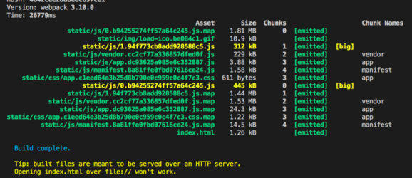
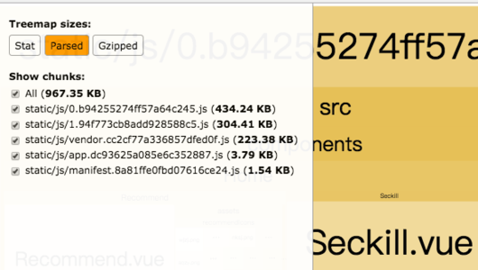
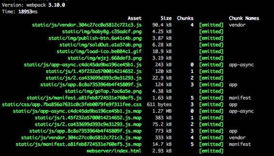
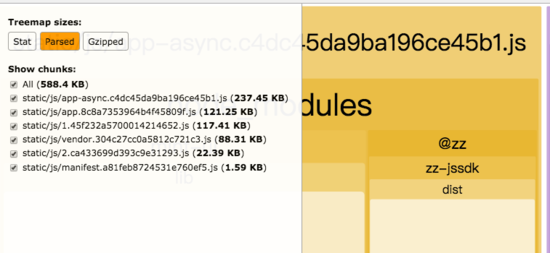

## (webpack系列二)webpack打包优化探索

虽然**webpack**的已经升级到了**webpack4**，而我们目前还在使用**webpack3**，但其中的优化点都大同小异，升级后同样适用。

### 性能优化初步原则
* 减小代码量
* 减小请求数
* 最大化利用浏览器缓存

这三条原则永远是一切优化的前提

### 优化配置
* 升级`webpack 3`，优化js的编译能力（Scope Hoisting）

````javascript
// 主要配置
plugins:[
  new webpack.optimize.ModuleConcatenationPlugin()
]
````

* 合理规划 `entry` 入口配置（平衡vendor.js, app.js文件的大小）

````javascript
// main.js中第三方公共库提出，作为公共vendor.js, 配合package.json固定第三方库版本，最大化利用浏览器缓存加载js
entry: {
  vendor:['vue', 'vue-router', 'vue-resource'],
  app: './src/main.js'
}
// ... 
plugins:[
  new webpack.optimize.CommonsChunkPlugin({
    name: ['manifest','vendor'].reverse(),
    minChunks:Infinity
  })
]
````
* 打包后文件大小限制，首次加载js+css超过 `400k`，单个文件大小超过 `300k`将会报错，打包不通过，该配置在build中使用

```javascript
performance: {
  hints: 'error',
  maxEntrypointSize: 400000,
  maxAssetSize: 300000
}
```

### 减小代码量
* 提取 `chunk` 中使用的公共库（能为chunk代码节约近1/3的代码量）

````javascript
new webpack.optimize.CommonsChunkPlugin({
  name: 'app',
  async: 'vendor-async',
  children: true,
  minChunks: (module, count) => {
    // 被 2 个及以上 chunk 使用的共用模块提取出来
    return count >= 2
  }
})
````

* 减少图片base64的使用，降低限制，限制**2k**（vue官方配置是10k，会大大增加js文件体积，移动端对base64的解析成本高）

```` javascript
  {
    test: /\.(png|jpe?g|gif|svg)(\?.*)?$/,
    loader: 'url-loader',
    options: {
      limit: 2048,
      name: utils.assetsPath('img/[name].[hash:7].[ext]')
    }
  }
````
* 生产模式（pro）下第三方库使用已压缩版本，能节约近**20k**文件大小

````javascript
// 开发模式
resolve: {
  alias: {
    'vue': 'vue/dist/vue.esm.js'
  }
}
// 生产模式
resolve: {
  alias: {
    'vue': 'vue/dist/vue.min.js'
  }
}
````

* 优化 `babel-ployfill`，结合 `babel-preset-env` 实现兼容按需加载，比使用`es2015`能节约近半的大小

````javascript
entry: {
  vendor:['babel-polyfill', 'vue', 'vue-router', 'axios'],
  app: './src/main.js'
}
````
````javascript
// .babelrc
{
  "presets": [
    ["env", {
      "modules": false,
      "targets": {
        "browsers": [
          "> 1%", 
          "last 3 versions", 
          "Firefox ESR", 
          "not ie < 10"
        ]
      },
      "debug": false,
      "useBuiltIns": true
    }],
    "react",
    "stage-2"
  ]
}

````

* 极致压缩js，css代码

````javascript
var os = require('os')
var OptimizeCSSPlugin = require('optimize-css-assets-webpack-plugin')

plugins: [
  new webpack.optimize.UglifyJsPlugin({
    // 利用多核能力压缩
    beautify: {
      cache: true,
      workers: os.cpus().length
    },
    // 最紧凑的输出
    beautify: false,
    // 删除所有的注释
    comments: false,
    compress: {
      // 在UglifyJs删除没有用到的代码时不输出警告 
      warnings: false,
      // 删除所有的 `console` 语句
      drop_console: true,
      // 内嵌定义了但是只用到一次的变量
      collapse_vars: true,
      // 提取出出现多次但是没有定义成变量去引用的静态值
      reduce_vars: true,
    },
    sourceMap: true
  }),
  new OptimizeCSSPlugin({
  	 cssProcessor: require('cssnano')({ zindex: false }),
    cssProcessorOptions: {
      safe: true,
      discardComments: {removeAll: true }
    }
  })
]

````

* 第三方库的依赖过滤，如下：

````javascript
// 此插件默认全部引入语言库，但我们只用到了中文，最多英文，所以进行了过滤，大大减少了总体代码量
plugins: [
  new webpack.ContextReplacementPlugin(/moment[\/\\]locale$/, /zh|en/)
]
````

### 减少请求数
* manifest.js文件内联（app.css可以自行选择，当小于10k是最好内联），webpack推荐配置如下：

```` javascript
// 引入内联插件
var HtmlWebpackInlineSourcePlugin = require('html-webpack-inline-source-plugin')

plugins:[
  // ...
  new HtmlWebpackPlugin({
    // ... 其他不相关配置省略
    inlineSource:/(app\.(.+)?\.css|manifest\.(.+)?\.js)$/,
    // ...
  }),
  new HtmlWebpackInlineSourcePlugin()
]
````

### 最大化利用浏览器缓存
这样能最大化利用浏览器缓存

````javascript
// 不固定版本，会造成打包后 hash 值变化，浏览器没办法利用本身的缓存加载js，每次上线都会使本地缓存失效，页面加载变慢
"dependencies": {
  "moment": "2.17.1",
  "querystring": "0.2.0",
  "sprite-cli": "0.1.5",
  "sticky-state": "2.4.1",
  "superagent-jsonp": "0.1.1",
  "underscore": "1.8.3",
  "vue": "2.0.0",
  "vue-lazyload": "0.8.3",
  "vue-router": "2.0.0",
  "vuex": "2.0.0"
}
````

### 其他优化
#### zindex被重置问题+autoprefixer不生效问题

* `zindex`被重置
  由于`cssnano`默认配置，是自动会把`z-index`重置为1，例如：

  ```javascript
  classname {
    z-index:1000;
  }

  after

  classname {
    z-index:1;
  }

  ```

* `autoprefixer`不生效
  这是由于`cssnano`中已经包含`autoprefixer`的配置，需要关闭

这时候需要优化`cssnano`的配置，`.postcssrc` 如下：

```javascript
module.exports = {
  plugins: {
    cssnano: {
      zindex: false,
      autoprefixer: false
    }
  }
}
```
此处需要做特殊说明，发现官方提供的`cssnano`的`preset`写法，并不生效

#### 使用按需加载js后，打包代码特别大
需要注意的是，当使用按需加载的功能，然后没有提取所有`chunk`包里的`css`，同时又开启了`sourcemap`功能，那么就会造成这种情况
最简单的办法就是，对`css`不使用`sourcemap`功能，例如：

```javascript
rules: [
  {
    loader: 'postcss-loader',
    options: {
      sourceMap: false
    }
  }
]
```

### 广告
以下是笔者基于 vue-cli 的模版优化后的`vue`和`react`的打包工具，用法一致。

以下包集成了以上所有优化，支持单页面及多页面应用，完全兼容`vue-cli`生成的模版项目

[zz-webpack-vue](https://www.npmjs.com/package/zz-webpack-vue)

[zz-webpack-react](https://www.npmjs.com/package/zz-webpack-react)

以下是使用本组一个vue-cli生成的项目做的一个优化对比：

优化前：





优化后：





可以查看具体的优化配置，或者直接在项目中尝试使用，有任何问题欢迎随时反馈，目前正在筹划统一升级`webpack4`

目前网上提供了各种脚手架，不要太相信这些脚手架的打包配置，其中可优化的点还有很多，根据自己的需要好好做深度优化吧


