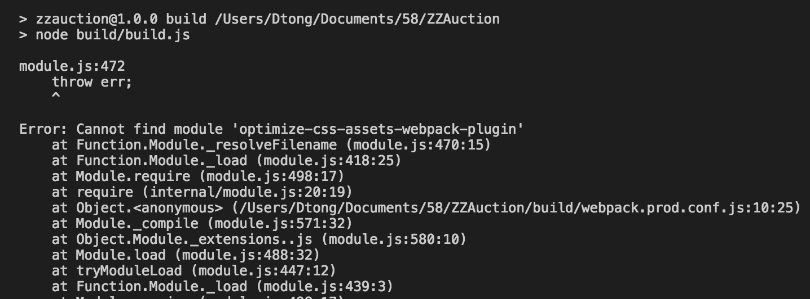
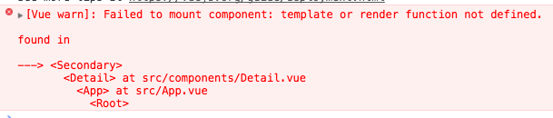

## (webpack系列一)如何快速把 vue 项目升级到 webpack3

&nbsp;&nbsp;&nbsp;&nbsp;&nbsp;&nbsp;&nbsp;由于`webpack3`升级后，新增了 **Scope Hositing（作用域提升）** 
功能，据说是对`js`的性能提升很大。因此，我们做了一个测试对比，就是`webpack3`和`webpack1/2` 的性能对比，如下：

### 测试目标

&nbsp;&nbsp;&nbsp;&nbsp;&nbsp;&nbsp;&nbsp;以下数据是2天随机时段3部手机各2组数据，每组数据都是30次取平均值，为了测试js的解析能力，排除了网络请求的影响

* 平台：M5 Note Build/MRA58K
* 系统：android 6.0

| 时间  | before  | after |
|:------------- |:---------------:| -------------:|
| 2017-08-10 13:00     | 920 |         511|
| 2017-08-11 11:10      | 915 |  543 |

平均提升：**42.55%**

* 平台：MI 3C Build/KTU84P
* 系统：Android 4.4.4

| 时间  | before  | after |
|:------------- |:---------------:| -------------:|
| 2017-08-13 15:00     | 648 |         365|
| 2017-08-14 17:10      | 648 |  377 |

平均提升：**42.74%**

* 平台：SM901 Build/MXB48T
* 系统：Android 6.0.1

| 时间  | before  | after |
|:------------- |:---------------:| -------------:|
| 2017-08-13 18:00     | 593 |         393|
| 2017-08-14 15:50      | 575 |  392 |

平均提升：**32.75%**

&nbsp;&nbsp;&nbsp;&nbsp;&nbsp;&nbsp;&nbsp;以上数据，提升比例虽然有所差距，但是，最后的结果，都表明......你应该毫不犹豫的升级你的`webpack`了。

&nbsp;&nbsp;&nbsp;&nbsp;&nbsp;&nbsp;&nbsp;问题来了，如何能快速且平滑的升级你的`webpack`呢？这是我们今天的重点，前面都是铺垫，哈哈

### 升级webpack3

&nbsp;&nbsp;&nbsp;&nbsp;&nbsp;&nbsp;&nbsp;今天只以`vue`项目来举例，`vue-cli`升级`w3`简直不要太快哦，而且也有项目上线成功了，并且线上测试与本地测试结果基本一致。如果使用的是`react`项目，用的又是脚手架的话，那么恭喜你，跟`vue-cli`一样快，可参考`vue-cli`的升级方式，如果你自己写的`w2`的话加一个配置（可以体验跟`vue-cli`一样的升级体验哦），然后升级相应扩展：

````
new webpack.optimize.ModuleConcatenationPlugin()
````

&nbsp;&nbsp;&nbsp;&nbsp;&nbsp;&nbsp;&nbsp;如果是自己写的`w1`的话，对不起，你只能去哭着对比`w3`和`w1`的语法兼容修改配置文件了，网上有详细的语法对比，这里就不详述了

#### 步骤
* 下载最新的的 `vue-cli`，初始化一个新项目 `tow3`
* 把你的 `src` 目录下的业务代码拷贝到新建的 `tow3` 项目中 `src` 路径替换了
* 把 `config/index.js` 更细成你自己项目的，这里需要注意的是，`webpack3`此文件的配置和`webpack1、2` 都不太一样，所以仔细比对，只修改一样的配置项
* 在 `build/webpack.prod.conf.js` 配置里文件里的加上如下配置，这是`webpack3`升级的最核心功能(加在这个文件时因为我生产环境不需要)，如果本身打包策略做了优化，那么就需要对造`webpack3`的最新语法进行修改迁移了
 
````
	plugins: [
		new webpack.optimize.ModuleConcatenationPlugin()
	]

````

* npm run dev & npm run build 缺什么包就装什么包，如图


&nbsp;&nbsp;&nbsp;&nbsp;&nbsp;&nbsp;&nbsp;然后，就是辣么简单，ok了

&nbsp;&nbsp;&nbsp;&nbsp;&nbsp;&nbsp;&nbsp;壮士，请留步。。。其实还有

&nbsp;&nbsp;&nbsp;&nbsp;&nbsp;&nbsp;&nbsp;每个人安装过程中都可能遇到不同的错，甚至是不显示错误信息，让人蛋疼又心碎，辣么如何进行科学的报错呢？其实很简单，如下

#### 错误调试

&nbsp;&nbsp;&nbsp;&nbsp;&nbsp;&nbsp;&nbsp;在 `build/webpack.dev.conf.js` 里有自带错误调试的插件

````javascript
	new webpack.HotModuleReplacementPlugin(),   
	new FriendlyErrorsPlugin()
````

&nbsp;&nbsp;&nbsp;&nbsp;&nbsp;&nbsp;&nbsp;但它并不能满足我们，我升级过程中就发现，很多bug只出现了个`error`，不出现错误信息，这让我如何调试啊，臣妾完全做不到啊

&nbsp;&nbsp;&nbsp;&nbsp;&nbsp;&nbsp;&nbsp;我们只需要修改一行配置：

````javascript
	new webpack.HotModuleReplacementPlugin(), 
	new FriendlyErrorsPlugin({
      onErrors: function (severity, errors) {
        console.log(errors);
      }
    })
````

&nbsp;&nbsp;&nbsp;&nbsp;&nbsp;&nbsp;&nbsp;常见错误也就是`npm`包版本不匹配，升级最新的包就行，推荐工具 [npm-check](https://www.npmjs.com/package/npm-check)，批量检查更新，简直不要太好用

&nbsp;&nbsp;&nbsp;&nbsp;&nbsp;&nbsp;&nbsp;不过凡事都有例外，错误也一样，升级过程中遇到了如下错误：


&nbsp;&nbsp;&nbsp;&nbsp;&nbsp;&nbsp;&nbsp;翻墙搜了半天，发现是 `"vue": "^2.3.4"` 版本对应的`vue-loader`版本不对，最好是 `> vue-loader@^7.0.0 &&  < vue-loader@^12.0.0`。

&nbsp;&nbsp;&nbsp;&nbsp;&nbsp;&nbsp;&nbsp;所以，剩下很大一部分错误就是框架和编译器的版本对应问题的锅了，多翻墙，多google，让一切难题变得不难。

&nbsp;&nbsp;&nbsp;&nbsp;&nbsp;&nbsp;&nbsp;哈哈，有了这些就算再狡猾的妖精，也逃不过老孙的金箍棒了。

&nbsp;&nbsp;&nbsp;&nbsp;&nbsp;&nbsp;&nbsp;好了，请开始你的表演吧。

### 最后

&nbsp;&nbsp;&nbsp;&nbsp;&nbsp;&nbsp;&nbsp;赠送一份`package.json`的配置，此配置乃最终兼容版，eslint好烦，我把它注释了，目前已上线，运行良好

````json
{
  "name": "w3",
  "version": "1.0.0",
  "description": "w3",
  "author": "yuanxiaolong",
  "private": true,
  "scripts": {
    "dev": "node build/dev-server.js",
    "start": "node build/dev-server.js",
    "build": "node build/build.js",
    "lint": "eslint --ext .js,.vue src"
  },
  "dependencies": {
    "vue": "^2.0.0",
    "vue-resource": "0.8.0",
    "vue-router": "^2.0.0",
    "vuex": "^2.0.0"
  },
  "devDependencies": {
    "autoprefixer": "^7.1.2",
    "babel-core": "^6.25.0",
    "babel-loader": "^7.1.1",
    "babel-plugin-component": "^0.10.0",
    "babel-plugin-transform-class-constructor-call": "^6.24.1",
    "babel-plugin-transform-object-assign": "^6.22.0",
    "babel-plugin-transform-runtime": "^6.23.0",
    "babel-preset-es2015": "^6.24.1",
    "babel-preset-stage-2": "^6.24.1",
    "babel-register": "^6.24.1",
    "chalk": "^2.1.0",
    "connect-history-api-fallback": "^1.3.0",
    "copy-webpack-plugin": "^4.0.1",
    "css-loader": "^0.28.0",
    "cssnano": "^3.10.0",
    "eventsource-polyfill": "^0.9.6",
    "express": "^4.14.1",
    "extract-text-webpack-plugin": "^3.0.0",
    "file-loader": "^0.11.1",
    "friendly-errors-webpack-plugin": "^1.1.3",
    "html-webpack-inline-source-plugin": "0.0.9",
    "html-webpack-plugin": "^2.30.1",
    "http-proxy-middleware": "^0.17.3",
    "less": "^2.7.2",
    "less-loader": "^4.0.5",
    "opn": "^5.1.0",
    "optimize-css-assets-webpack-plugin": "^2.0.0",
    "ora": "^1.3.0",
    "path": "^0.12.7",
    "rimraf": "^2.6.1",
    "semver": "^5.3.0",
    "shelljs": "^0.7.8",
    "uglifyjs-webpack-plugin": "^1.0.0-beta.2",
    "url-loader": "^0.5.8",
    "vue-loader": "^12.2.2",
    "vue-style-loader": "^3.0.1",
    "vue-template-compiler": "^2.4.2",
    "webpack": "^3.5.3",
    "webpack-bundle-analyzer": "^2.2.1",
    "webpack-dev-middleware": "^1.12.0",
    "webpack-hot-middleware": "^2.18.2",
    "webpack-merge": "^4.1.0"
  },
  "engines": {
    "node": ">= 4.0.0",
    "npm": ">= 3.0.0"
  },
  "browserslist": [
    "last 11 iOS versions"
  ]
}

````