# 转转商业前端错误监控系统(Sentry)策略升级

## 背景
众所周知，目前前端的错误监控在实际工作中越来越重要，好处如下：

* 收集前端页面错误
* 辅助定位分析错误
* 先于用户发现错误

区别于传统的靠用户反馈机制开发人员被动接收排查问题的模式来说。流程更短，体验更佳。

	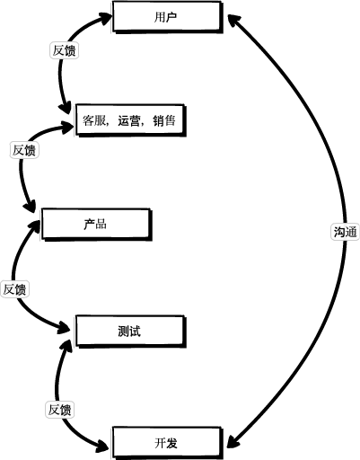
	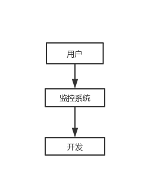

目前，转转的前端错误监控体系都是基于`Sentry`建立的。之前我们也或对比或使用过业内比较成熟的几个监控产品，例如`Badjs`，`FrontJS`，`Fundebug`等。但要么就是用起来繁琐，要么就是不开源，最后我们选择了`Sentry`，目前经过一段时间的使用来看`Sentry`是相对比较成熟且完整的前端错误监控方案了，已经基本能满足我们的项目要求。

不过对于商业团队来说，我们会更加注重线上质量，还有处理问题的效率（效率即生命），每一个商户对我们来说都是非常重要的，我们不能因为频繁的线上问题，还有处理问题效率上让商户觉得我们很`山寨`。

所以进行了一系列的优化升级，从`项目改造优化 —> 上报信息优化 —> sentry配置优化`。

### 每月线上bug折线图
从7月份我们上线了以下这套策略以后，我们能把线上用户发现错误控制在了平`2`个以内，收益明显。

	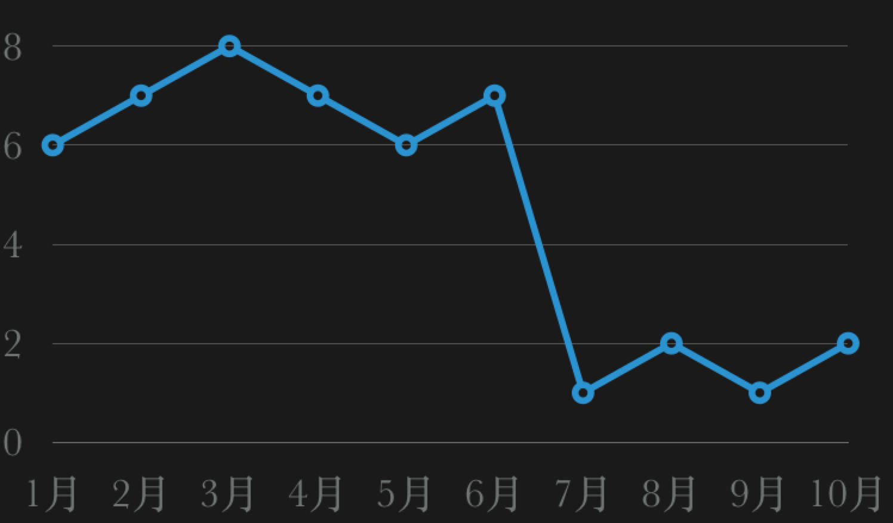

下面会具体说一下我们的方案策略。

## 为什么要进行上报策略的调整？
我们总结了使用`Sentry`过程中遇到的一些问题，如下：

* 收集信息混乱（所有错误信息混杂在一起）；
	* 定位问题相对较慢；
	* 影响范围评估难；
	* 错误频率无法统计；
* 部分监控缺失（不能全方位监控）；
	* 小程序缺少监控；
	* 接口缺少监控；
	* 404请求缺少监控；
* 预警邮件过于频繁（容易让开发人员接收疲劳）；

当然，相对以前没有错误监控来说，已经能够很好的使用了。

但是，如果能把这些问题都解决了，那么我们不止线上质量和处理效率的还可以更进一步的提升，而且还能在开发阶段避免部分问题，先于用户发现问题，还能为我们大前端产出一套公共解决方案。

## 如何解决？
* 以攻代守（主动上报）
* 多维度标签 & 辅助差错信息 & 自定义错误分组规则
* 修改邮件发送规则（上报即重点）
* 全方位监控兼容

### 以攻代守（主动上报）
侵入项目，虽然前端实际工作中一直以对业务无侵入为研究方向。但在实际的业务中偶尔的侵入业务去做一些处理是很有必要的，给业务带来的收益也是可关的，我们能做的就是尽量少的侵入业务代码，导致污染。以下是我们对项目的改造策略：

	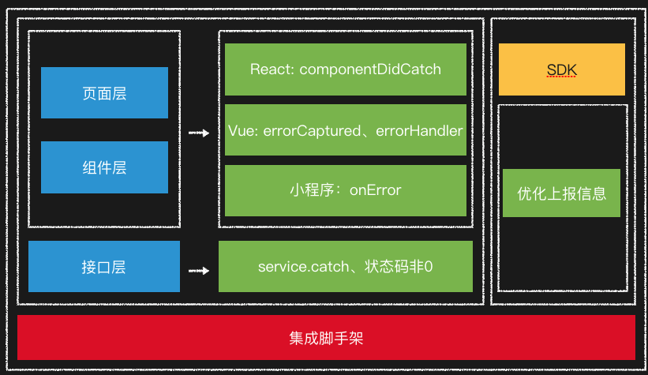

以`react`为例，我们做了以下处理，vue也是类似方案：

#### 页面改造
* 增加错误捕获组件：

	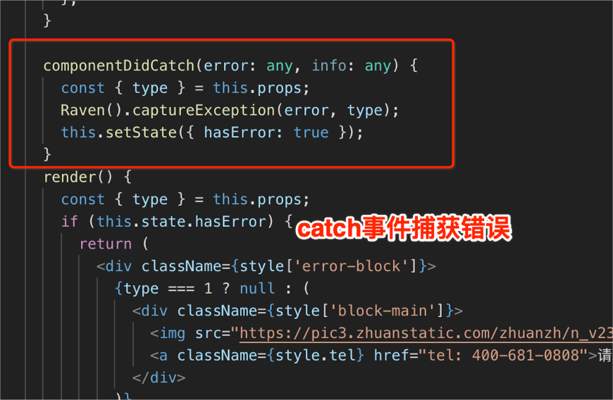

* 组件错误捕获 & 页面错误捕获：

	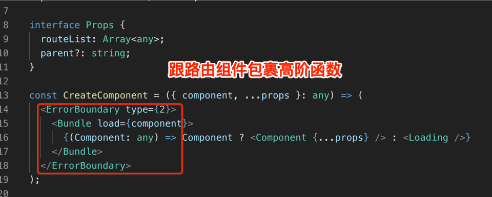
	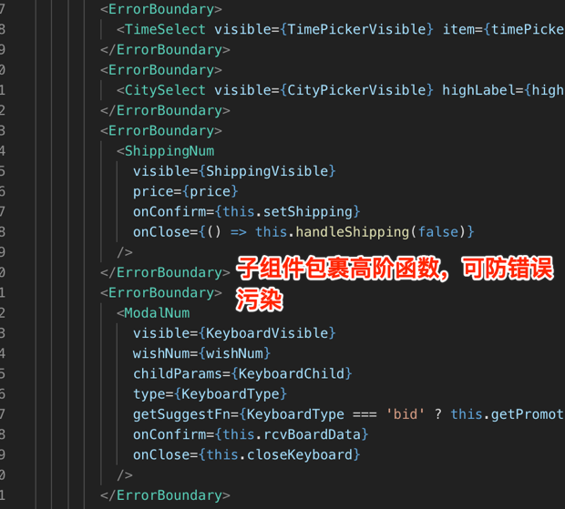

以上方案不止能有效捕获错误，区分错误级别，还能有效防止子组件错误影响整体页面渲染，导致白屏，简直一举两得。

#### 接口监控

为什么我们要做接口监控？

* 辅助后端错误监控及日志排查，提供更多有效信息；
* 监控接口及服务异常状态，根据异常状态发现现有代码，服务器，及产品逻辑的漏洞；
* 加强前端开发人员对于线上问题的重视，及对接口错误的重视，更好的融入业务；

因为我们有同一请求包`SDK`，所以处理起来异常简单。

	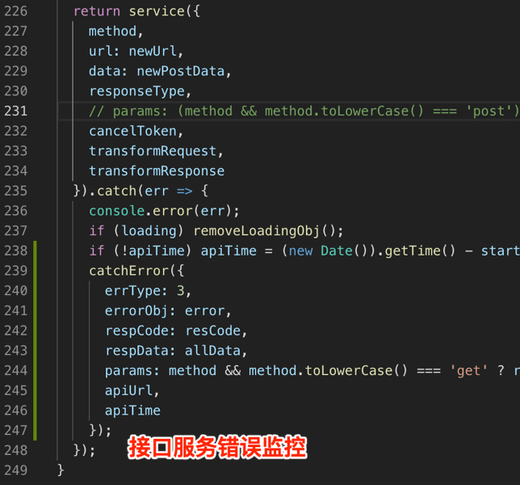
	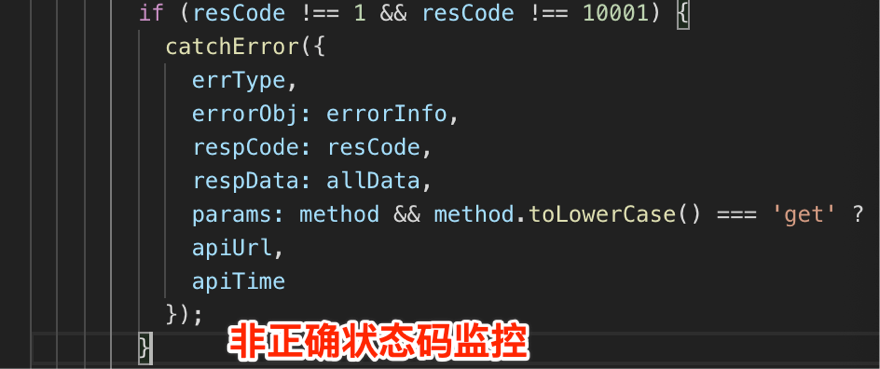

### 多维度标签 & 辅助查错信息 & 自定义错误分组规则

优势：

* 快速定位问题（1分钟内），迅速评估影响范围；
* 更多分析问题需要的信息，辅助快速解决问题；
* 规整错误列表，查看错误频率，优化代码，服务，及产品逻辑风险；

	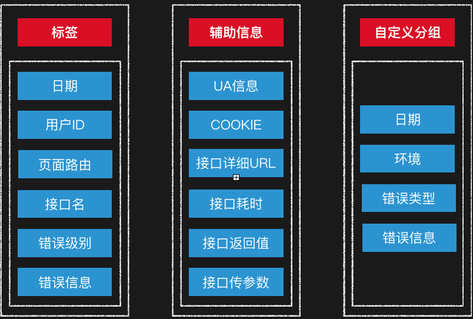

例如：快速查看错误根据`tags`的分布

	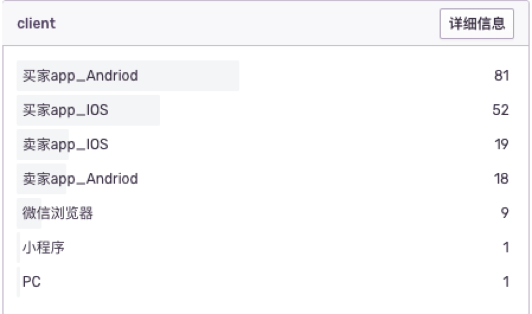
	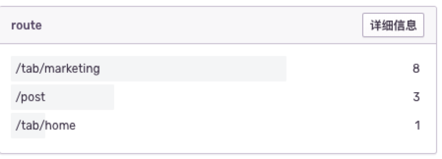
	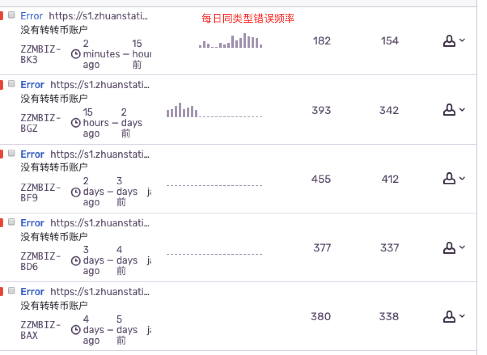

#### 重写错误上报方法

让上报的错误信息使用更方便，辅助信息更完善。

	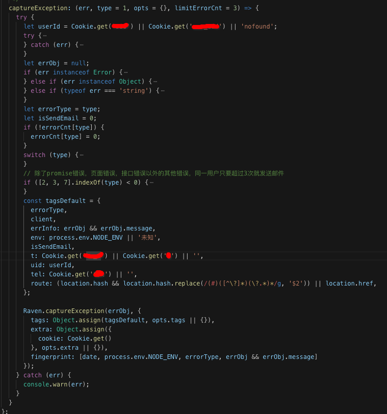

其中：

* tags: 错误标签 - 快速定位错误
* extra：辅助信息 - 辅助错误排查
* fingerprint： 自定义分组错误 - 解决错误信息混乱问题

当然默认的错误上报也同时发送，也可以设置`tags`和`extra`，主要是为了捕获主动上报漏掉的错误。

最终我们把重写的方法抽离成了可供大转转前端使用的公共`SDK`。

最终`sentry`列表展示

Before: 所有信息混杂，同类型错误无分类，没有进行日期的错误区分，看不到错误变化趋势

	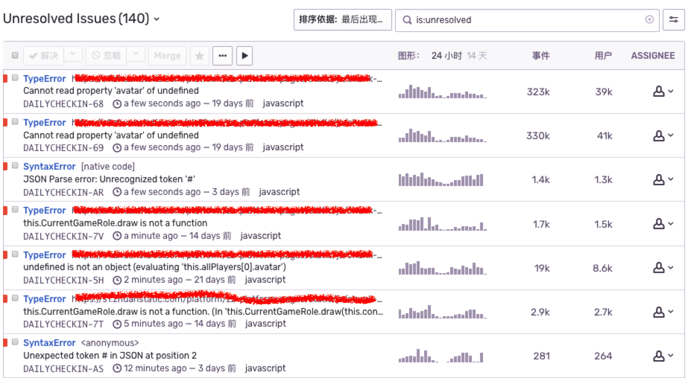

After：所有错误信息分组合并，提供更多有效tag帮助快速定位

	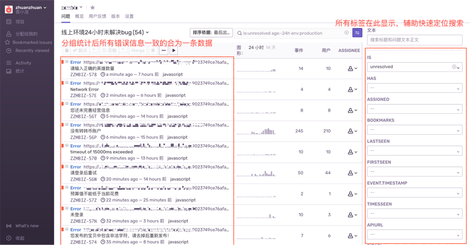

### 修改邮件规则（上报即重点）

#### 代码层面

* 通过`isSendMail=1`标签控制
* 控制`isSendMail=1`的频率

例如，同一个用户只要页面白屏错误，和其他同类型错误在页面浏览期间超过3次也设置`isSendMail=1`

	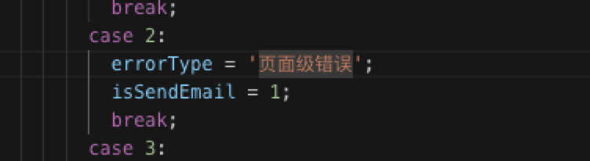
	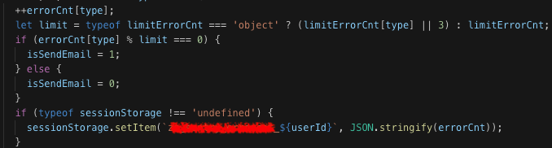

#### sentry系统规则配置

	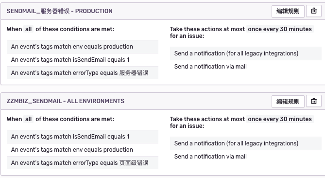

以上那么做了以后，整体的邮件错误频率能得到很大的降低，集中开发人员的经历去解决我们更关注的错误，实现上报即重点。
更多的规则可以更具前端上报的标签去做更多的处理，来减少报警频率。

### 全方位监控兼容

由于这套兼容方案是其他组同学，还有支撑组同学完成，所以这里我展示一下兼容的原理设计图，具体的后续升级率略与上面所述一致。

#### 小程序监控方案

	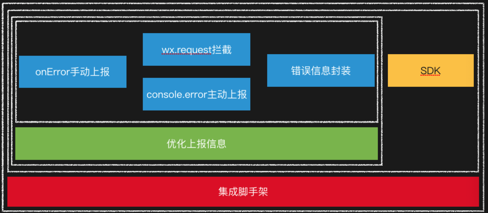

#### 404监控方案

	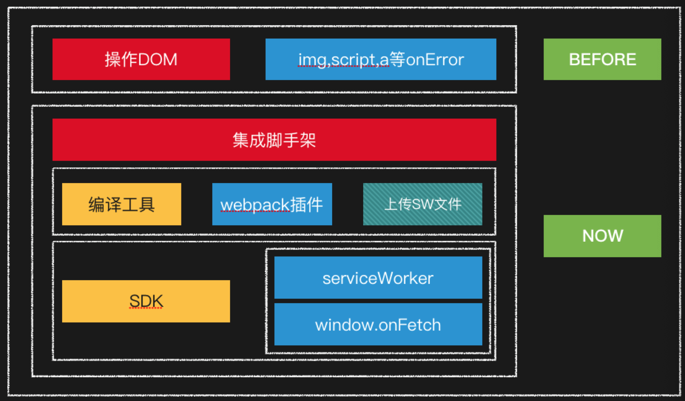

## 收益如何？
* 邮件即重点
* 1分钟内快速定位
* 异常服务追踪
* 即时发现新上线需求异常
* 实现全方位监控
* 迅速评估影响范围（解决问题优先级）
* 发现搜集代码风险逻辑（用于做pre-commit提前校验，减少线上报错）

## 实际案例
### 2019.06.18 - ios10系统页面兼容问题（邮件预警）

 
	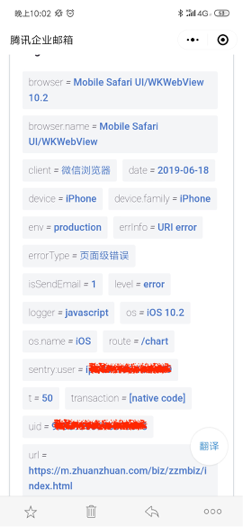
	

晚上10点上线一个新需求有收到邮件，在ios10里面有问题，迅速评估出了影响范围。

### 2019.07.22 - 视频md5不存在（用户上报）
根据用户id快速找到了错误信息

 
	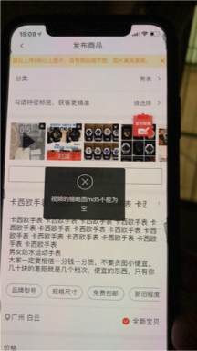
	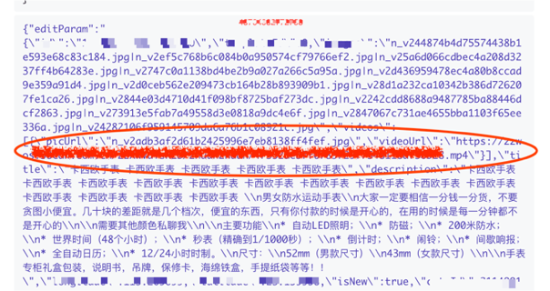

此问题发现传参有问题，但前端代码并没有逻辑问题，最后最终到了其他发布入口，发现中台提供的发布功能上md5参数会丢失。

### 2019.07.20 - 营销页推广后下单失败（上线后接口异常）

 
	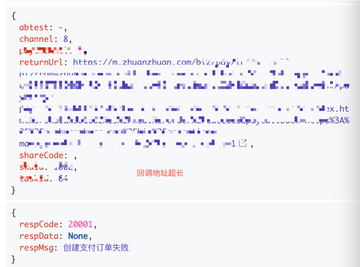
	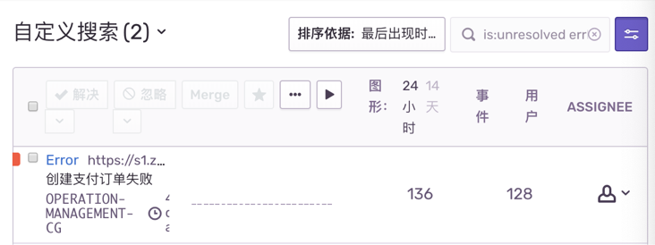

跟后端配合排查，发现其中一个参数长度过长，超过了数据库存储限制。

目前我们已经要求全部需求上线后必须关注`Sentry`报错，以免错误暴露给用户造成不好的影响。

### 2019.08.06 - 全用户异常接口提示（代码逻辑不完善）

	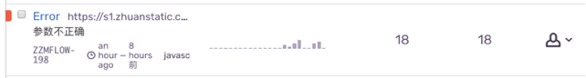
	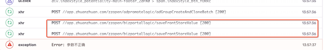

发现前端同时多次请求，后端接口未加锁造成入库异常，类似的风险代码发现了很多，包括一些代码边界值的判断等等，最终我们整理了一套前端开发风险规范，并且开发了一套`pre-commit`规则来对风险代码进行校验（校验的并不是代码风格，语法等，这里要是有兴趣可以安排相关同学整理分享一下），规避风险代码，减少线上错误。

## 结束语
每一次排查错误对我们来说都是一次收获，很多问题是可以提前规避的，就算避免不了我们也可以借助`Sentry`去更高效的解决。

最后，拥抱问题，才能让我们更加成长。

