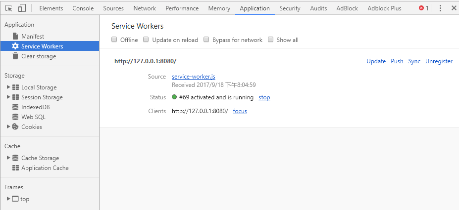
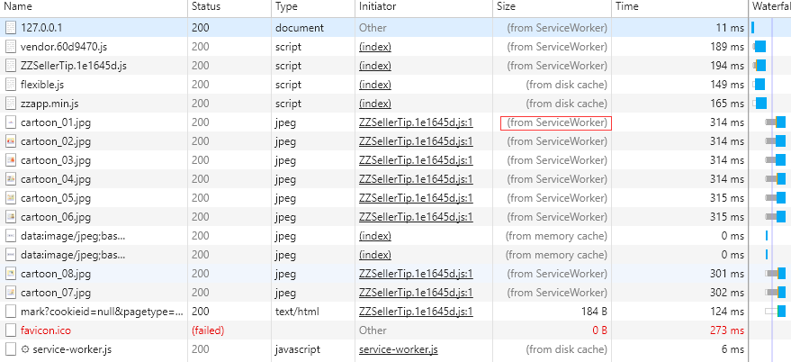

# 轻松把你的项目升级到PWA

## 什么是PWA
PWA（Progressive Web Apps,渐进式网页应用）是Google在2015年推出的项目，致力于通过web app获得类似native app体验的网站。

### 优点
1.无需客户端，少量流量即可安装
2.可添加到主屏并全屏运行
3.离线功能，响应更快，及时更新
4.PUSH能力
5.数据传输必须是https

### 缺点
1.safari对PWA的态度是考虑中,暂时还不支持
2.PUSH还不够成熟，依赖于[Web Push Protocol](https://tools.ietf.org/html/draft-ietf-webpush-protocol-12),Chrome只支持Google私有的GCM（Google Cloud Messaging）/FCM服务进行通知推送。国内的mipush也支持了很多app，在此希望中国能尽快有一个统一的推送服务出现~

### 个人观点
PWA属于非侵入式的技术，可以做到降级兼容，并且拥有强大的离线功能，可以更快的响应，所以还是非常推荐使用的。

## 网络应用清单
网络应用清单是一个 `JSON` 文件，主要定义一些启动网址，自定义图标，启动画面，主题颜色，启动样式等等配置信息
这边是在App内的M页，并且国内安卓用户使用的浏览器都不太支持这些定义，所以不详细介绍了。
[The Web App Manifest](https://developers.google.com/web/fundamentals/engage-and-retain/web-app-manifest/)官方文档，介绍的很详细~
[webpack-manifest-plugin](https://github.com/danethurber/webpack-manifest-plugin)如果使用webpack也可以使用类似这种插件来生成~
[Web App Manifest Generator](https://app-manifest.firebaseapp.com/)如果手写也有像这样的工具提供~

## Service workers
**定义：**
Service workers 本质上充当Web应用程序与浏览器之间的代理服务器，也可以在网络可用时作为浏览器和网络间的代理。它们旨在（除其他之外）使得能够创建有效的离线体验，拦截网络请求并基于网络是否可用以及更新的资源是否驻留在服务器上来采取适当的动作。他们还允许访问推送通知和后台同步API。

**生命周期：**
注册→下载→安装→激活

**状态**
`installing` 、`installed` 、`waiting` 、`activating` 、`activated`

**主要事件**
`install` 准备sw用于使用，例如创建缓存，放置离线资源
`activate` 此时可以清理旧缓存及相关的东西以便更新 
`fetch` 响应请求事件，通过`FetchEvent.respondWith`方法，对这些请求做处理 
install、activate事件会触发`waitUntil`方法

**注意：**
1.Service workers运行在其他线程，完全异步，同步API不能在其中使用
2.大量使用Promise

## Cache
**方法**
`add()`、`addAll()`、`delete()`、`keys()`、`match()`、`matchAll()`

## 基础用法
单独创建一个app.js文件，放到根目录,并在index.html中引用它
`app.js`
```ecmascript 6
if ('serviceWorker' in navigator) { 
  // register service worker
  navigator.serviceWorker.register('./service-worker.js', {scope: './'})   // 参数1：注册提供的脚本URL 参数2：导航匹配
  .then(function(registration) {
      // 注册成功
      // registration对象存有对sw所在生命周期的状态及状态变更事件及一些父接口的方法
      // 状态分别有 installing 、 installed 、 waiting 、 activating 、 activated
      if(registration.installing) {
        console.log('Service worker installing');
      } else if(registration.waiting) {
        console.log('Service worker installed');
      } else if(registration.active) {
        console.log('Service worker active');
      }
  }).catch(function(error) {
      // 注册失败
  });
}
```
根目录下创建执行文件service-worker.js
`service-worker.js`
```ecmascript 6
// 缓存静态文件
self.addEventListener('install', function(event) {
  event.waitUntil(
      // 缓存指定文件
    caches.open('v1').then(function(cache) {    
      return cache.addAll([
        '/',
        '/index.html',
        '/style.css',
        '/app.js',
        '/image-list.js',
        '/star-wars-logo.jpg',
      ]);
    })
  );
});

// 缓存接口数据
self.addEventListener('fetch', function(event) {
  event.respondWith(caches.match(event.request).then(function(response) {
    // 匹配到请求
    if (response !== undefined) {
      return response;
    } else {
      return fetch(event.request).then(function (response) {
        // 缓存响应数据
        let responseClone = response.clone();
        
        caches.open('v1').then(function (cache) {
          cache.put(event.request, responseClone);
        });
        return response;
      }).catch(function () {
        return caches.match('/gallery/myLittleVader.jpg');
      });
    }
  }));
});

// 更新缓存
self.addEventListener('activate', function(event) {
  event.waitUntil(
    caches.keys().then(function(cacheNames) {
      return Promise.all(
        cacheNames.map(function(cacheName) {
          // 如果有更新
          if (cacheName !== 'v1') {
            return caches.delete(cacheName);
          }
        })
      );
    })
    .then(function(){
      return self.clients.claim()
    })
  );
});
```

## webpack项目升级PWA
看到上边n多的API是不是很头疼，以及手动添加静态文件是不是很绝望，那么[sw-precache-webpack-plugin](https://www.npmjs.com/package/sw-precache-webpack-plugin)这个插件轻松帮你解决所有问题
现在我们就来升级下之前推过的**小型Web页打包优化**这片文章中所介绍的脚手架

### 1.修改文件：
1. `index.html`
```html
<script>
  if ('serviceWorker' in navigator) {
      window.addEventListener('load', function() {
          navigator.serviceWorker.register('./service-worker.js');
      });
  }
</script>
```

2. `webpack.prod.config.js`
```ecmascript 6
var SWPrecacheWebpackPlugin = require('sw-precache-webpack-plugin')
// plugins 数组内添加
new SWPrecacheWebpackPlugin({
    cacheId: 'my-vue-app',
    filename: 'service-worker.js',
    minify: true,
    // 其他更多配置请查看官方文档
})
```
自动生成service-worker.js并自动完成相关配置

### 2.通过正常逻辑打包~
```bash
npm run build ZZSellerTip
```

### 3.启动一个本地静态服务器
为了方便调试Service Worker在http://localhost或者http://127.0.0.1 本地环境下也可以跑起来
将打包好的文件通过http-server生成的静态服务器运行
运行结果：

关掉http-server可以看到依然可以访问

致此，项目改造就算完成了，总体来说改造成本还是很低的，所以小伙伴们一起搞起来吧~


