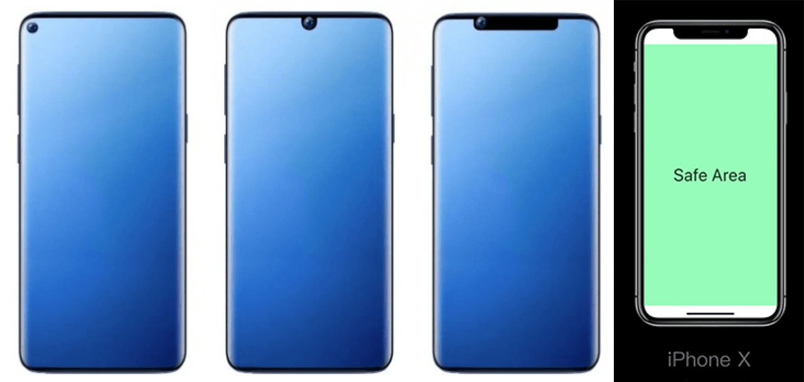
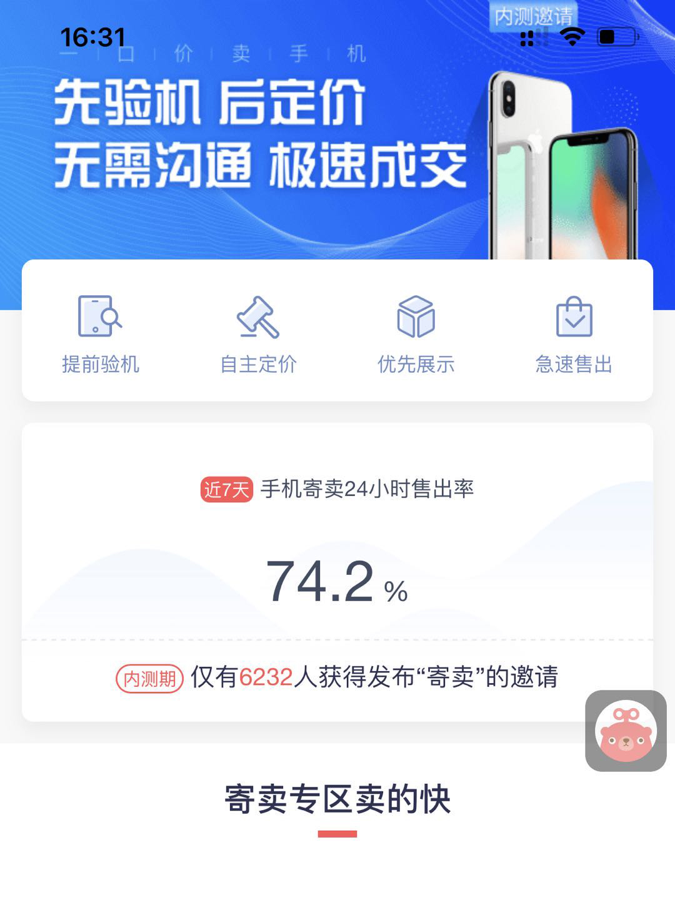
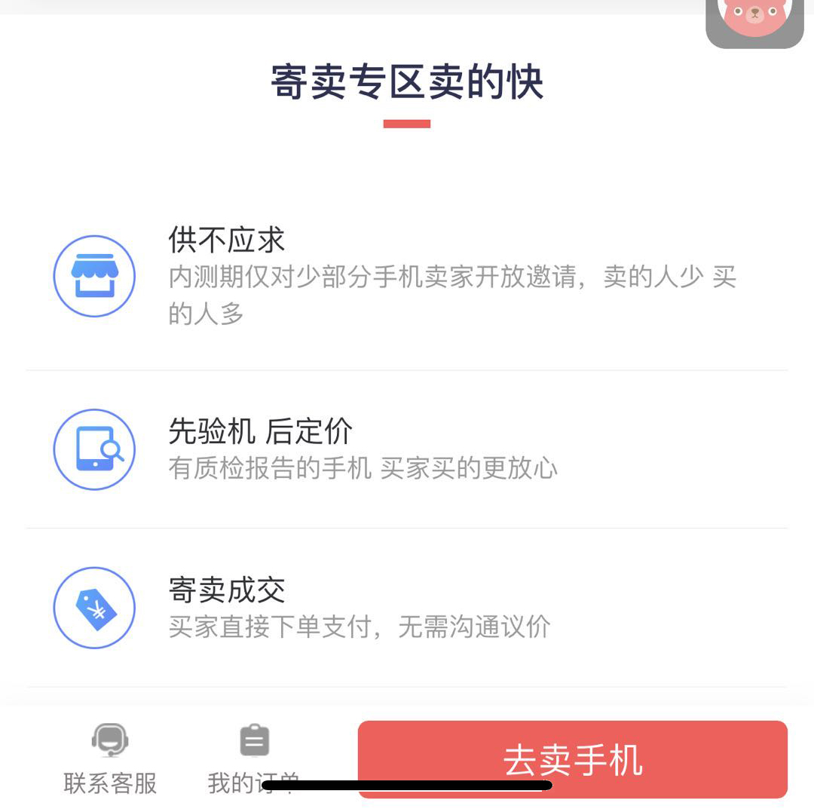
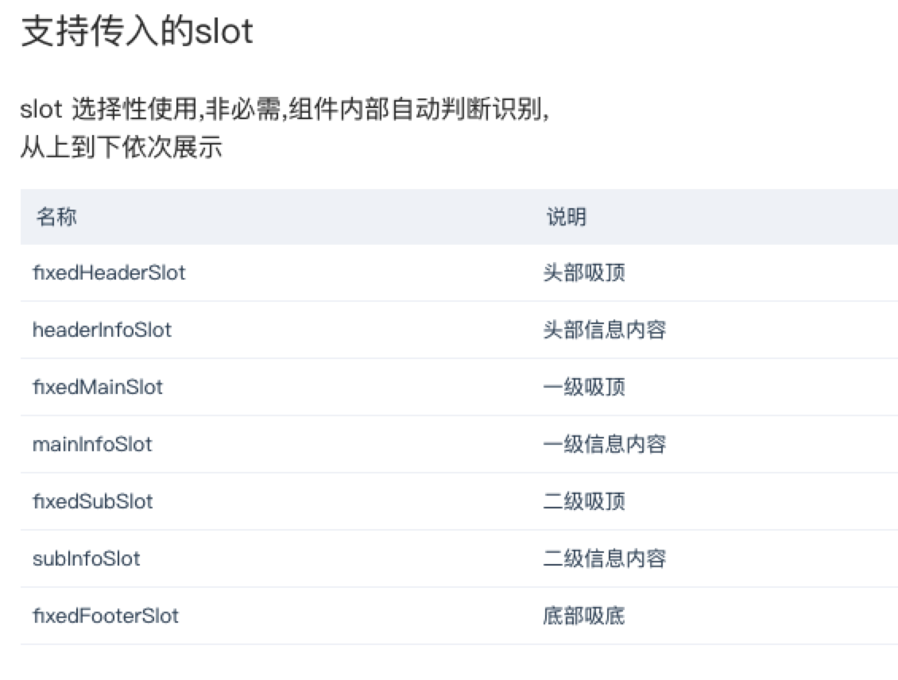

## 异型屏兼容框架
目前市面上的手机更新迭代速度快，水滴屏、刘海屏等各种异型屏手机横空出世，越来越大的屏幕，越来越独特的界面设计替换了规规矩矩的布局，作为前端开发者来说，这并不是一件好事。这些“异形”的出现意味着我们需要话费大量的精力在适配上，或者常常忘记了适配，造成功能遮挡或缺失，影响用户体验。



为了解决这一通用需求，我们决定做一个支持通用吸顶吸底，兼容各种异型屏的框架组件，用了这个组件你就不用为了这些兼容头疼，组件都会帮大家实现。本文就从这里展开 ~


### 这个框架组件解决了什么：
- Ta 支持通用吸顶，吸底；兼容水滴屏、刘海屏等各种异型屏。
- Ta 支持连续累加吸顶（目前支持2级）或连续覆盖吸顶。
- Ta 可支持serviceWork或异常监控等。
- Ta 可支持各页面统一添加特定模块或功能（如页面统一导航条）

一段简短的视频演示：


接下来我们从以下几个方向解读一下我的思路：
### 基本功能 - 吸顶&吸底：
我要做什么？
吸顶，那么我会用到 `position:sticky`，但是兼容性不是很好
让我们处理下兼容性：
```javascript
  // 是否支持某属性
  cssSupport (attr?: any, value?: any) {
    if (fixedMainDom && fixedMainDom.style && attr in fixedMainDom.style) {
      fixedMainDom.style[attr] = value
      fixedSubDom.style[attr] = value
      return fixedMainDom.style[attr] === value
    } else {
      return false
    }
  }

  initDome () {
    ...
    // 使用判断
    if (this.cssSupport('position', 'sticky')) {
      return
    } else {
      // do SomeThingA
    }
  }
  
```
do SomeThingA 做了什么？

`监听页面滚动事件(为了提高性能，增加了滚动节流)，识别元素吸顶时机；计算需要吸顶元素距离顶部的高，来获取top值。`

这里使用`position:fixed`
。But！ `top`值怎么计算？

一般吸顶的话设置`top: 0`。这个时候问题出现了，页面元素与iphoneX的刘海屏中隐藏不掉的时间和信号任务栏，重!叠!了！



吸顶的界面兼容，不同的 `异形`，预留不同的顶部高度，也就是top值。
判断如果是在客户端内，可以让客户端同学配合，获取任务栏的高度`TaskHeight`并提供给前端(这里不做赘述),然后拿到这个值，统一在框架外增加`paddingTop`,任务栏部分舍弃不用，避免h5内容被覆盖。若在端外，浏览器已经统一处理，不需要添加`paddingTop`。

同理，吸底！也是直接使用`position:fixed`;`bottom:0`

so easy~

这里需要注意的是，iphoneX的底部操作条覆盖了底部内容，导致按钮失效了，这里需要做一个兼容。
```javascript
// 如果是iphoneX，添加特有class
<div :class="['page_base', {'is_iphonex': isIphoneX}]">
    <div class="fixed_footer"></div>
</div>
// this.isIphoneX = navigator.userAgent.toLocaleUpperCase().indexOf('IPHONE') >= 0 && window.screen.height >= 812
// 样式
<style scoped lang="scss">
  $fixedBottomIPhoneX: 50px;
  .page_base.is_iphonex{
    margin-bottom: $fixedBottomIPhoneX;
    .fixed_footer{
      bottom: $fixedBottomIPhoneX
    }
  }
</style>
```

### 基本布局 - Slot实现：
作为一个框架，需要控制它包含的吸顶模块,吸底模块,连续吸顶等。
开发一个页面，内容布局多种多样，怎么识别模块呢？

为此，在框架中添加了一些特殊身份slot，还支持传入自定义slot。针对特殊身份的solt，做了一些处理，如：吸顶/吸底计算等
```html
<!-- z-page-base-box 默认带有标题任务栏，底部可吸底 -->
<z-page-base-box>
  <template v-slot:fixedHeaderSlot>
    <div class="header">自定义任务栏信息</div>
  </template>
  <div>自定义模块部分1</div>
  <div>自定义模块部分2</div>
  <template v-slot:fixedFooter>
    <div class="footer">底部模块-可编辑样式</div>
  </template>
</z-page-base-box>
```


### 连续吸顶，覆盖吸顶 - Dom跟随：
- 首先先来说一下覆盖吸顶，一层盖住一层，直接外部传参给组件，告诉组件要不要进行覆盖，那么层级的所有`top`都为任务栏的高度`taskHeigth`,这个不难理解。（见本文开头，一段简短的视频演示）

- 接下来连续吸顶：头部吸顶，一级吸顶，二级吸顶


这里可以看到一级吸顶高度变化了，二级吸顶dom会跟随，这是怎么做到的呢？

这里使用`MutationObserver`创建一个观察者。 

`MutationObserver`接口提供了监视对DOM树所做更改的能力,译名`dom变动观察器`
```javascript
// api定义
var observe = new MutationObserver(function(mutations,observer){
})
```

[MutationObserver](https://javascript.ruanyifeng.com/dom/mutationobserver.html)
有三个方法，分别如下：

- 1、observe：设置观察目标，接受两个参数，target：观察目标，options：通过对象成员来设置观察选项
- 2、disconnect：阻止观察者观察任何改变
- 3、takeRecords：清空记录队列并返回里面的内容
```javascript
  // 添加观察者
  addAbserve (target) {
    observe = new MutationObserver((mutations,observe) => {
      this.mainHeight = this.getTargetRect(abserveTarget).height
    })
    // childList：设置true，表示观察目标子节点的变化，比如添加或者删除目标子节点，不包括修改子节点以及子节点后代的变化;
    //subtree：设置为true，目标以及目标的后代改变都会观察
    observe.observe(target, {childList: true, subtree: true})
  }
  // 移除观察者
  removeAbserve () {
    observe && observe.disconnect()
  }
```

### 其他
由于是一个框架，包裹页面内容，因此可以增加一些通用UI，
例如：增加底部导航栏、增加侧边功能栏，增加广告位等
也可以统一加一些通用功能，例如：serviceWork、异常监控等

🔚 整理不易，希望能有所帮助
