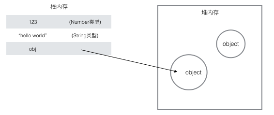
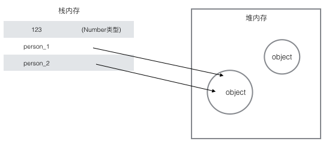
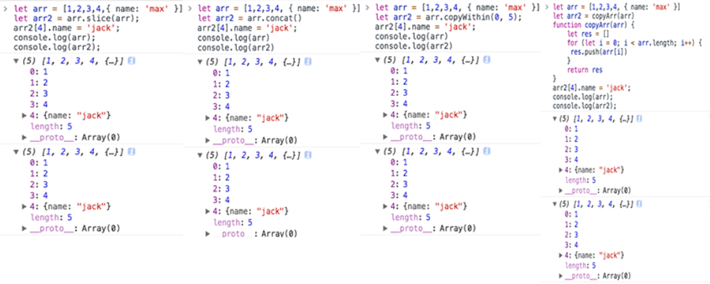
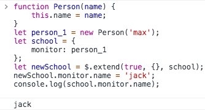

## 背景
上周组长给看了一下校招生的一道笔试题，题目是实现一个深拷贝的函数，实现方式各有不同，但是大多数还是只实现成了浅拷贝，作为一个刚入职的小校招生，也没有多少高深莫测的技术沉淀，就拿这个小小的点作一个总结吧，毕竟再牛逼的技术还是要足够扎实的基础才能理解与运用。

标准的工科生一枚，不善文笔，有什么不对的地方还需要大佬们指出。


## 数据类型
为什么要作深浅拷贝呢？什么样的数据类型存在深浅拷贝的问题？这还得从数据类型说起。在js中，变量的类型主要分为`基本数据类型`（string、number、boolean、null、undefined）和`引用数据类型`（比如Array、Date、RegExp、Function），基本类型保存在`栈`内存中，它们都是简单的数据段，大小固定，而引用类型可能是由多个值构成的对象，大小不固定，保存在`堆`内存中。



基本类型是按值访问的，可以操作保存在变量中的实际的值，而引用类型的值是保存在内存中的对象，js不能直接操作直接访问内存中的位置，也就是不能直接操作对象的内存空间，在操作对象时，实际上操作的是对象的引用，所以，引用类型的值是按引用访问的。

当从一个变量赋值另一个变量的引用类型的值的时候，复制的副本实际上是一个指针，指向储存在堆中的同一个对象，因此改变其中一个变量就会影响另一个变量。

```
	var person_1 = {
		name: 'max',
		age: 22
	};
	var person_2 = person_1;
	person_2.name = 'caesar';
	console.log(person_1, person_2);	//{name: "caesar", age: 22} 
	//{name: "caesar", age: 22}
```

在这里，我们只是简单的复制了一次引用类型的地址而已，因为两者引用的是同一个地址，对新变量操作后，之前的变量也就跟着变了，但是往往我们并不想这样。



Good！有这些就够了，现在我们进入正题，所以，基本类型不存在深浅拷贝的问题，我们要拷贝的类型肯定就是引用类型了，比如Array和Object。

## 浅拷贝
好，这个时候我想拷贝一个数组，我大脑里快速的闪现了几个原生的数组copy方法，以及我飞快写出的一个循环赋值法。

* Array.prototype.slice
* Array.prototype.concat
* ES6 copyWithin()
* function copyArr(arr) {
    let res = []
    for (let i = 0; i < arr.length; i++) {
     res.push(arr[i])
    }
    return res
}

但是它们是深拷贝吗？我小试了一下。



我只改变了新数组里面对象的一个属性，为什么之前的数组里的对象也跟着变了！！


要知道为什么，还得看看实现它们的原理，于是我搜了一下v8源码（就不分析其他详情功能啦- -，我们只看关键）,举个栗子：`Array.prototype.slice`:

#### ArraySliceFallback 主函数

```
function ArraySliceFallback(start, end) {
  CHECK_OBJECT_COERCIBLE(this, "Array.prototype.slice");

  ...

	//最终返回结果的值，可以从这里看到创建了一个新的真正的数组
  var result = ArraySpeciesCreate(array, MaxSimple(end_i - start_i, 0));

  if (end_i < start_i) return result;

	//走这里的逻辑大概处理的数组长度相对较大，但是拷贝的数与数组的总体大小相比，处理元素的数量相对较小，但是这和我们的目的无关，不细究。
  if (UseSparseVariant(array, len, IS_ARRAY(array), end_i - start_i)) {
    %NormalizeElements(array);
    if (IS_ARRAY(result)) %NormalizeElements(result);
    //看这里看这里,处理值的地方
    SparseSlice(array, start_i, end_i - start_i, len, result);
  } else {
  	//还有这里这里
    SimpleSlice(array, start_i, end_i - start_i, len, result);
  }

  result.length = end_i - start_i;

  return result;
}

```

slice方法的主函数。前面对start，end输入的一些判断处理就忽略了，主要看两个分支处理`SparseSlice`和`SimpleSlice`

#### SparseSlice

```
function SparseSlice(array, start_i, del_count, len, deleted_elements) {
  var indices = %GetArrayKeys(array, start_i + del_count);
  if (IS_NUMBER(indices)) {
    var limit = indices;
    //循环
    for (var i = start_i; i < limit; ++i) {
      var current = array[i];
    //赋值
      if (!IS_UNDEFINED(current) || i in array) {
        %CreateDataProperty(deleted_elements, i - start_i, current);
      }
    }
  } else {
    var length = indices.length;
    //循环
    for (var k = 0; k < length; ++k) {
      var key = indices[k];
      if (key >= start_i) {
        var current = array[key];
        //赋值
        if (!IS_UNDEFINED(current) || key in array) {
          %CreateDataProperty(deleted_elements, key - start_i, current);
        }
      }
    }
  }
}
```
可以看到该函数两个分支都只是循环了数组，然后进行直接的赋值操作。
#### SimpleSlice

```
function SimpleSlice(array, start_i, del_count, len, deleted_elements) {
	//直接循环
  for (var i = 0; i < del_count; i++) {
    var index = start_i + i;
    if (index in array) {
    //赋值
      var current = array[index];
      %CreateDataProperty(deleted_elements, i, current);
    }
  }
}
```
所以slice方法并没有对循环的每一项是基本类型还是引用类型作区分，并针对引用元素对其内部属性再作判断，所以，Array.prototype.slice是浅拷贝无疑。后面2个原生方法就不拿出来看了，其实也类似，感兴趣和不信的小伙伴可以点击下面图片去看看

<a href="https://github.com/v8/v8/blob/master/src/js/array.js"></a>

#### 小结

我们可以用`=`直接复制基本类型，复制引用类型时，循环遍历对象，对每个属性使用`=`完成复制，所以以上的这些拷贝都只是复制了第一层的属性，这就是浅拷贝，虽然我们确实得到了一个新的与复制源独立的对象，但是其内部包含的引用属性值仍然指向同一个地址（也就是我们只复制了地址）。

假如数组中保存的对象的某个属性还是一个对象呢？（然后一层一层这样下去呢？虽然肯定没人设计这么深的数据结构），但是为了解决这个问题，就有了深拷贝的实现方式：对属性中所有引用类型的值，一直遍历到基本类型为止，要实现深拷贝，也能想到用`递归`了。

## 深拷贝
所以深拷贝并不是简单的复制引用，而是在堆中重新分配内存，并且把源对象实例的所有属性都新建复制，以保证复制的对象的引用不指向任何原有对象上或其属性内的任何对象，复制后的对象与原来的对象是完全隔离的。

#### 其他类库的深拷贝实现（jquery）
我们先来看看jquery是怎么实现深拷贝的。jquery是使用extend函数来实现对象的深拷贝。

```
jQuery.extend = jQuery.fn.extend = function() {
    
    ...
    
    //前面都不重要，我们直接看拷贝的核心代码 
    for ( ; i < length; i++ ) {
       // 只处理非空参数
       if ( (options = arguments[ i ]) != null ) {
           for ( name in options ) { //遍历源对象的属性名
              src = target[ name ]; //获取目标对象上，属性名对应的属性
              copy = options[ name ]; //获取源对象上，属性名对应的属性
 
              // jq这里做的比较好，为了避免深度遍历时死循环，jq不会覆盖目标对象的同名属性，也就是避免对象环的问题（对象的某个属性值是对象本身）
              if ( target === copy ) {
                  continue;
              }
              // 深度拷贝且值是普通象或数组，则递归，也就是说，jquery对{}或者new Object创建的对象以及数组作了递归的深拷贝处理
              if ( deep && copy && ( jQuery.isPlainObject(copy) || (copyIsArray = jQuery.isArray(copy)) ) ) {
                  // 如果copy是数组
                  if ( copyIsArray ) {
                     copyIsArray = false;
                     // clone为src的修正值
                     clone = src && jQuery.isArray(src) ? src : [];
                  // 如果copy的是对象
                  } else {
                     // clone为src的修正值
                     clone = src && jQuery.isPlainObject(src) ? src : {};
                  }
 
                  // 递归调用jQuery.extend
                  target[ name ] = jQuery.extend( deep, clone, copy );
 
              // 否则，如果不是纯对象或者数组jquery最后会直接把源对象的属性，赋给源对象（浅拷贝）
              } else if ( copy !== undefined ) {
                  target[ name ] = copy;
              }
           }
       }
    }
 
    // 返回更改后的对象
    return target;
};
```
但是jquery的深拷贝不能实现函数对象的拷贝，看下面的这段代码。



我们写了一个函数类，虽然它是函数，但是它也是函数对象并且是引用类型呀，但是jquery并不会对函数对象作深拷贝处理，它会走到上面最后的`else if`里面,直接把源对象的属性赋值给对象，也就是，还是浅拷贝，不过函数更多的是用来完成某些功能，有输入值和返回值，所以也不是很需要对函数对象作深拷贝。

#### JSON全局对象


针对JSON数据对象的复制，有一种简单取巧的方法，那就是使用JSON的全局对象的`parse`和`stringify`来实现深复
制。

```
	function jsonClone(obj) {
    	return JSON.parse(JSON.stringify(obj));
	}
```

但是它能正确处理的只有Number、String、Boolean，Aarry，扁平对象，即那些能够被json直接表示的数据结构,如下。


#### 比较好的实现深拷贝的方法
本来想自己写一个深拷贝，尝试写了一下，在看了前人们写的后感觉多少都会有抄袭的感觉，而且细节考虑不周到（其实就是自己水平还不够- -），还是给大家分享一个我觉得的前人写的比较好的深拷贝吧

```
//定义一个辅助函数，用于在预定义对象的 Prototype 上定义方法：
function defineMethods(protoArray, nameToFunc) {
    protoArray.forEach(function(proto) {
        var names = Object.keys(nameToFunc),
            i = 0;
        for (; i < names.length; i++) {
            Object.defineProperty(proto, names[i], {
                enumerable: false,
                configurable: true,
                writable: true,
                value: nameToFunc[names[i]]
            });
        }
    });
}

//Object对象的处理
defineMethods([ Object.prototype ], {

//主要解释两个参数，srcStack和dstStack。它们的主要用途是对存在环的对象进行深复制。比如源对象中的子对象srcStack[7]在深复制以后，对应于dstStack[7]

    '$clone': function (srcStack, dstStack) {
        var obj = Object.create(Object.getPrototypeOf(this)),
            keys = Object.keys(this),
            index,
            prop;

        srcStack = srcStack || [];
        dstStack = dstStack || [];
        srcStack.push(this);
        dstStack.push(obj);

        for (var i = 0; i < keys.length; i++) {
            prop = this[keys[i]];
            if (prop === null || prop === undefined) {
                obj[keys[i]] = prop;
            }
            else if (!prop.$isFunction()) {
                if (prop.$isPlainObject()) {
                    index = srcStack.lastIndexOf(prop);
                    if (index > 0) {
                        obj[keys[i]] = dstStack[index];
                        continue;
                    }
                }
                obj[keys[i]] = prop.$clone(srcStack, dstStack);
            }
        }
        return obj;
    }
});
//Array的处理
defineMethods([ Array.prototype ], {
    '$clone': function (srcStack, dstStack) {
        var thisArr = this.valueOf(),
            newArr = [],
            keys = Object.keys(thisArr),
            index,
            element;
    
        srcStack = srcStack || [];
        dstStack = dstStack || [];
        srcStack.push(this);
        dstStack.push(newArr);
    
        for (var i = 0; i < keys.length; i++) {
            element = thisArr[keys[i]];
            if (element === undefined || element === null) {
                newArr[keys[i]] = element;
            } else if (!element.$isFunction()) {
                if (element.$isPlainObject()) {
                    index = srcStack.lastIndexOf(element);
                    if (index > 0) {
                        newArr[keys[i]] = dstStack[index];
                        continue;
                    }
                }
            }
            newArr[keys[i]] = element.$clone(srcStack, dstStack);
        }
        return newArr;
    }
});

//Date类型的处理
defineMethods([ Date.prototype ], {
    '$clone': function() { return new Date(this.valueOf()); }
});

//RegExp的处理
defineMethods([ RegExp.prototype ], {
    '$clone': function () {
        var pattern = this.valueOf();
        var flags = '';
        flags += pattern.global ? 'g' : '';
        flags += pattern.ignoreCase ? 'i' : '';
        flags += pattern.multiline ? 'm' : '';
        return new RegExp(pattern.source, flags);
    }
});

//Number, Boolean 和 String 的处理，这样能防止像单个字符串这样的对象错误地去调用Object.prototype.$clone
defineMethods([
    Number.prototype,
    Boolean.prototype,
    String.prototype
], {
    '$clone': function() { return this.valueOf(); }
});
```

考虑得周到多了，不仅能实现Object和Array的深拷贝，还考虑了Date个RegExp这两个引用类型，我这个前端小萌新还需要多多努力呀，多多学习努力，多多学习努力，多多学习努力。


## 结语
并不是所有变量的赋值都需要深拷贝，在大多数情况下，我们也只用得到浅拷贝，按需所取吧，像jquery针对是否需要深拷贝会加上供开发者选择的第一个参数。

第一次写文章，很多地方都不到位，但是最后感觉收获颇丰，在深浅拷贝上有了更深的印象与认识。


