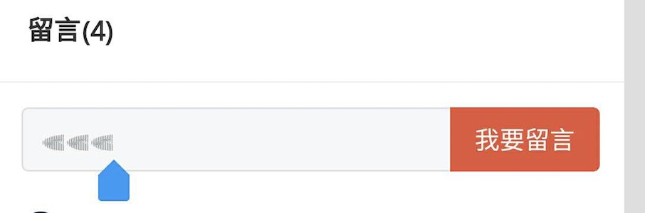
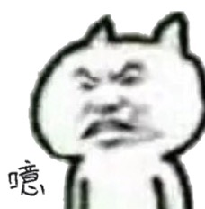
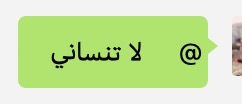
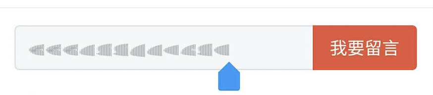
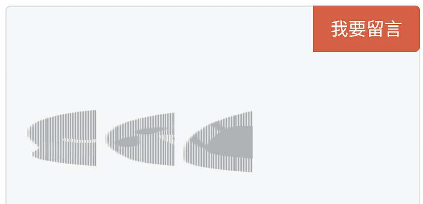
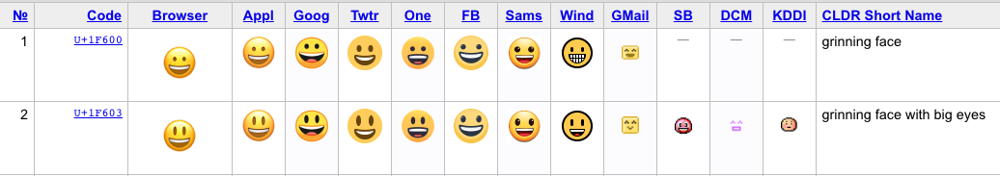

## 由一个emoji引发的思考
> 从毕业以来，基本就一直在做移动端，但是一直就关于移动端的开发，各种适配问题的解决，在日常搬砖中处理了就过了，也没有把东西都沉淀下来，觉得甚是寒颜。现就一个小bug，让我们来了解一下我们天天都在用的emoji，对于开发来说，是一个怎么样的存在。

### 背景
之前在做一个留言功能时，发现在其中一台安卓5.0的手机上，输入emoji糊掉了，成了如下这样的情况



这是skr啥玩意儿呀，怎么看上去像某白色幼虫。

与是我又试了好几个手机，ios都没有问题，甚至一台安卓机中之霸（安卓4.0），随便进个页面都要加载十几秒的手机都没有问题，是乱码了吗？

为啥emoji会出现乱码呢？相信很多人都遇到过关于emoji的问题，比如输入emoji，传给后端，再经过一系列操作后从接口中取到后端返回的emoji字符就乱了。又比如为了限制输入字数，给字符做截断时出现的问题。

初步怀疑是编码问题，那我们就来看看emoji究竟是何方神圣。

### emoji的历史

emoji对于我们来说并不陌生，我们很早就开始接触它了。emoji这个词来源于日语里的“絵文字”（假名为“えもじ”，读音即emoji）。它是1999年，当时还在日本无线运营商NTT DoCoMo工作的Shigetaka Kurita（栗田穣崇）发明的。

### emoji的编码
emoji虽然看上去是一个有颜色有形状的表情，但它属于计算机中的字符。在计算机中，我们把文字、标点符号、图形符号、数字等统一称为字符，由字符组成的集合，我们称为字符集。为了让计算机识别字符集里的字符，我们设计了一套字符集编码规则，比如ASCII码，由于ASCII只规定了128个字符的编码，随着计算机的发展，人们意识到这些编码显然是不够的，为了统一世界上的所有字符，诞生出了Unicode字符集，而emoji字符就是Unicode字符集中的一部分。

### Unicode
Unicode从0开始，为每个符号指定一个编号，称做"码点"，如U+0000，U+表示紧跟在后面的十六进制数是Unicode的码点。Unicode只规定了每个字符的码点，到底用什么样的字节序表示这个码点，就涉及到编码方法，比如我们html上常用的UTF-8。关于不同的编码方法怎么表示Unicode，以及JavaScript是怎么处理Unicode，这里就不详细阐述了，可参考[Unicode与JavaScript详解](http://www.ruanyifeng.com/blog/2014/12/unicode.html)
链接地址：http://www.ruanyifeng.com/blog/2014/12/unicode.html

所以emoji作为unicode，那在计算机上是怎么显示的？

之前我在一微信群里@我一朋友，结果出现了下面的情况。



@符号跑右边去了，当时觉得很奇怪，后来了解到，这是阿拉伯文，因为阿拉伯文的书写规则是从右向左，所以@符号跑到右边去了，可见微信对不同unicode字符排版做的兼容还挺好。再比如这几个字符，热҈得҈字҈出҈汗҈了҈。

这就涉及到了复杂文字编排（Complex text layout，缩写：CTL）。要求复杂文字编排以适当显示的书写系统称为复杂文本，比如阿拉伯文字、婆罗米系文字的天城文、泰文等。

拿泰文来说，根据拼写规则，泰文可形象地分为鞋子字符、主体字符、帽子字符、声调字符等。泰文的每个基本字符对应一个unicode码，人们在输入多个基本字符时，新输入的字符与之前的字符做匹配，如果可以组合，则这时前面的输入就拼合成了一个泰文字符然后显示出来。


萨瓦迪卡～

英文也是，我们在输入英文时会习惯以空格来拆分前后单词,你如果输入一串连续的英文字母，计算机在识别上也会有困难。phpisthebestlanguageintheworld（手动滑稽脸）这句话就很有争议！！

人为可以轻松识别一个泰文是否拼写正确，但是计算机在显示时就很难判断。

像泰文这种特殊合成字符的本质，你无法避免人们在计算机上都会有哪些奇妙的创造。

于是乎，不同字符之间的组合，就诞生出了流行的颜文字：

ฅ՞•ﻌ•՞ฅ

ʕ•̼͛͡•ʕ-̺͛͡•ʔ•̮͛͡•ʔ

(⑉꒦ິ^꒦ິ⑉)

₊˚‧(๑σ̴̶̷̥́ ₃σ̴̶̷̀)·˚₊

୧(๑•̀⌄•́๑)૭✧

而字符的显示，还有一个影响就是字体，在浏览器中，如果对应的编码在字体文件中为空，一般会展示成□□□□，这样至少不会影响排版，但是unicode作为万国码实在太庞大了，在一些字体里，对一些特殊字符还是会产生一些错误的排版，唉҈～真҈是惆҈怅～～

对于emoji来说，它虽然也是一种特殊字符，但它并不属于复杂文本，并且我是通过移动终端规范输入，排版也不会有什么问题。我设置的font-family在其他手机上是好的也说明，这些字体对输入的emoji也是支持的，出问题的终端上，非emoji的字体正常显示，那暂时可以排除字体对emoji的影响了。

### 回归问题

到这里，还没有解决我的问题。本来以为是常见问题，比如数据提交时或者数据库储存的编码问题。可是，我也没传给后端啊！我刚在自己的页面上输入显示就成这样了！


可恶，这个锅甩不动了。还是得自己解决，我input框刚输入，本地看到就乱了，看来还是自己的问题。


我一气之下疯狂乱点，发现不同的表情对应的这些小虫长得还不一样，于是，我决定把它放大看一看


这不就是表情么，只是因为某些原因看上去被压缩了。我的表情啊，你到底是经历了什么才变得如此面目全非。我一定要找到毁你容的真凶。

先分析一下表象，emoji的显示被截断、压缩。为什么被压缩？回归场景，移动端切图，那么移动端的多终端适配，可不可能是问题的原因？

切图是UI给的以iphone6的屏幕宽度为准的750px2倍视觉稿，组内方案选择参考了手淘的flexible。具体原理和这次主题无关，我就不在这里阐述了。关于移动端多端适配方案的原理详细，可以参考
[手淘H5页面的终端适配](https://www.w3cplus.com/mobile/lib-flexible-for-html5-layout.html)

链接地址: https://www.w3cplus.com/mobile/lib-flexible-for-html5-layout.html

那么哪些代码是影响emoji缩放的代码呢？最先想到的是，我的emoji在输入框里面，设置了font-size，这个font-size的值是rem,
那会不会是某些安卓系统emoji对rem支持不好？于是我换成px，依然如此。

那么页面上还有哪儿还有会影响缩放呢？于是定位到了这里。

```
<meta name="viewport" content="initial-scale=1,maximum-scale=1,minimum-scale=1,user-scalable=0,width=device-width" />
```

viewport是我们设备屏幕上用来显示网页的区域，在移动端上，viewport一般都是大于浏览器可视区域。

理论上，移动端有三个viewport。
* layout viewport：移动浏览器为了让所有网站正常显示（包括那些PC的页面），把默认的viewport设为了一个较宽值，这个值一般都是大于移动端可视区（比如iPhone 980px）。也就是document.documentElement.clientWidth
* visual viewport：代表浏览器可视区域的大小。也就是window.innerWidth
* ideal viewport：能完美适配移动设备的viewport，用户不需要缩放和横向滚动条就能完美看到网页内容，并且文字图片，在不同分辨率屏幕下显示出来太小应该是差不多的（比如iPhone的ideal viewport宽度是320px）

关于各个设备的ideal viewport 可以从这里查询，链接地址：http://viewportsizes.com/

所以我们利用meta标签，设置viewport的宽度等于设备的宽度,并且不允许用户手动缩放。让viewport的宽度等于设备的宽度，这个应该就是我们想要的理想宽度。

实际上，只设置initial-scale=1，我们也能把当前的viewport宽度变成ideal viewport的宽度（这里不考虑iphone下不同dpr的缩放），因为这个缩放就是相对于ideal viewport来进行缩放的。当同时设置了width与initial-scale=1，浏览器会选择两者中较大的那个值。

说了这么多，那么我的问题出在哪儿呢？猜想是不是该安卓版本对设置width和initial-scale会有一些意想不到的问题，于是我去掉了width=device-width，保留initial-scale=1等属性，结果emoji竟然好了。

所以我遇到的情况就是，同时设置了width=device-width和initial-scale=1，会造成某些厂商手机的安卓5.0（目前只遇到这个）emoji被拉伸，去掉width=device-width，（不写width=device-width也就是windows phone上的IE无论是横竖屏都把宽度设为竖屏时ideal viewport宽度，个人觉得这个无伤大雅），至于为什么会这样，我暂时只能深入到这啦 (╥╯^╰╥)

### 结论
每一个emoji，就是一个Unicode字符，由统一码联盟（The Unicode Consortium）来投票选拔和公布，世界各地的人们可以向联盟提交 emoji 提案。而统一码联盟的 emoji 规范，只是定义了某个字符的语义，再由 Emojipedia 这个网站对 emoji 进行描述表达，最后允许大家按照对描述的理解，自由地去设计图案。

所以不同的厂商以及不同的系统，甚至浏览器、浏览器版本以及系统字体等，对emoji的支持程度与兼容性是不一样的。比如同一个emoji笑脸表情，在ios和安卓上显示的效果也不一样。为了统一emoji表情，很多公司都有自己的一套emoji mapping，来做Unicode码与emoji表情的映射。



### 碎碎念
移动端开发总会遇到各种问题，有时候做兼容也会遇到无法完全兼容两头的情况，这时只能放弃受众更小，选择兼容影响面、严重性更大的方案了。在解决问题的有时候深究下去，也会收获很多。