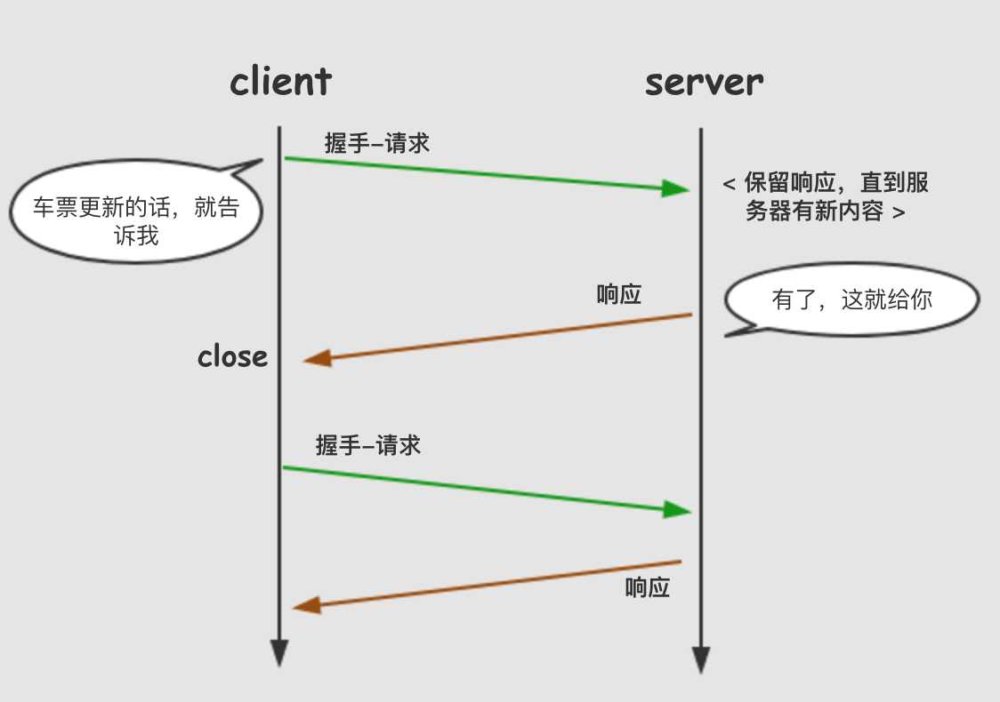
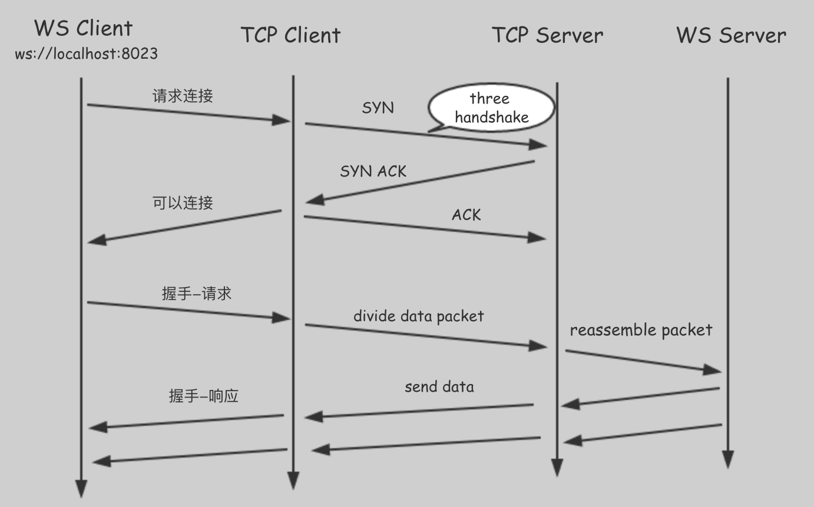

# HTML5的Websocket（理论篇 I）#

> ** 先请来TA的邻居：**

> **http**：无状态、基于**tcp**请求/响应模式的**应用层**协议 （A:哎呀，上次你请我吃饭了么? B:我想想, 上次请你吃了么）
> **tcp**：面向连接、保证高可靠性(数据无丢失、数据无失序、数据无错误、数据无重复到达) **传输层**协议。（看啊，大阅兵，如此规整有秩序）

## 为什么要引入Websocket：

> RFC开篇介绍：本协议的目的是为了解决基于浏览器的程序需要拉取资源时必须发起多个HTTP请求和长时间的轮询的问题。

long poll(长轮询): 客户端发送一个request后，服务器拿到这个连接，如果有消息，才返回response给客户端。没有消息，就一直不返回response。之后客户端再次发送request, 重复上次的动作。




从上可以看出，http协议的特点是服务器不能主动联系客户端，只能由客户端发起。它的被动性预示了在完成双向通信时需要不停的连接或连接一直打开，这就需要服务器快速的处理速度或高并发的能力，是非常消耗资源的。

这个时候，Websocket出现了。

## Websocket是什么：
> RFC中写到：WebSocket协议使在控制环境下运行不受信任代码的客户端和能够选择与那些代码通信的远程主机之间能够双向通信。

对，划重点：**双向通信**

Websocket在连接之后，客户端可以主动发送消息给服务器，服务器也可以**主动向客户端推送消息**。比如：预订车票信息，除了我们发请求询问车票如何，当然更希望如果有新消息，可以直接通知我们。

其特点：

（1）握手阶段采用 HTTP 协议，默认端口是80和443

（2）建立在TCP协议基础之上，和http协议同属于应用层

（4）可以发送文本，也可以发送二进制数据

（5）没有同源限制，客户端可以与任意服务器通信

（6）协议标识符是ws（如果加密，为wss），如ws://localhost:8023

简单来说，Websocket协议分为两部分：握手和数据传输。




## Websocket API：

 > 这里是指客户端 API。

#### WebSocket 构造函数
    通过调用WebSocket构造函数来创建一个WebSocket实例对象，建立客户端与服务器的连接。
```
 const ws = new WebSocket('ws://localhost:8023');

```

### Websocket事件
    WebSocket 是纯事件驱动，通过监听事件可以处理到来的数据和改变的连接状态。服务端发送数据后，消息和事件会异步到达。

 - open:

    服务端响应WebSocket连接请求，就会触发open事件。onopen是响应的回调函数。

    ```
    // 连接请求open事件处理：
        ws.onopen = e => {
            console.log('Connection success');
            ws.send(`Hello ${e}`);
        };

    ```

如果要指定多个回调函数，可以使用addEventListener方法。

```
ws.addEventListener('open', e => {
  ws.send(`Hello ${e}`);
});

```


 当open事件触发时，意味着握手阶段已结束。服务端已经处理了连接的请求，可以准备收发数据。

- Message:

    收到服务器数据，会触发消息事件，onmessage是响应的回调函数。如下：

```
// 接受文本消息的事件处理：
ws.onmessage = e => {
    const data = e.data;
    if (typeof data === "string") {
        console.log("Received string message ",data);
    } else if (data instanceof Blob) {
        console.log("Received blob message ", data);
    }
};
```


服务器数据可能是文本，也可能是二进制数据，有Blob和ArrayBuffer两种类型，在读取到数据之前需要决定好数据的类型。


- Error

    发生错误会触发error事件, onerror是响应的回调函数, 会导致连接关闭。

```
//异常处理
ws.onerror = e => {
    console.log("WebSocket Error: " , e);
    handleErrors(e);
};
```


- Close

    当连接关闭时触发close事件，对应onclose方法，连接关闭之后，服务端和客户端就不能再通信。

WebSocket 规范中定义了ping 帧 和pong 帧，可以用来做心跳重连，网络状态查询等，但是目前  浏览器只会自动发送pong帧，而不会发ping 帧。（有兴趣可详查ping和pong帧）

```
//关闭连接处理
ws.onclose = e => {
    const code = e.code;
    const reason = e.reason;
    console.log("Connection close", code, reason);
};
```


### WebSocket 方法：

 > WebSocket 对象有两个方法：send 和 close

 - send:

    客户端和服务器建立连接后，可以调用send方法去发送消息。


```
//发送一个文本消息
ws.send("this is websocket");
```

在open事件的回调中调用send()方法传送数据：


```
const ws = new WebSocket('ws://localhost:8023');
ws.onopen = e => {
    console.log('Connection success');
    ws.send(`Hello ${e}`);
};

```

如果想通过响应其他事件发送消息，可通过判断当前的Websocket的readyState属性。接下来会说到readyState.

- close

    close方法用来关闭连接。调用close方法后，将不能发送数据。close方法可以传入两个可选的参数，code 和reason, 以告诉服务端为什么终止连接。

```
ws.close();

//1000是状态码，代表正常结束。
ws.close(1000, "Closing normally");
```

#### WebSocket 属性

- readyState：

readyState值表示连接状态，是只读属性。它有以下四个值：

> WebSocket.CONNECTING ：连接正在进行，但还没有建立
> WebSocket.OPEN ：连接已经建立，可以发送消息
> WebSocket.CLOSING	：连接正在进行关闭握手
> WebSocket.CLOSED	：连接已经关闭或不能打开

除了在open事件回调中调用send方法，可通过判断readyState值来发送消息。

```
 function bindEventHandler(data) {
    if (ws.readyState === WebSocket.OPEN) {
        ws.send(data);
    } else {
        //do something
    }
}
```


- bufferedAmount：

    当客户端传输大量数据时，浏览器会缓存将要流出的数据，bufferedAmount属性可判断有多少字节的二进制数据没有发送出去，发送是否结束。

```
ws.onopen = function () {
    setInterval( function() {
        //缓存未满的时候发送
        if (ws.bufferedAmount < 1024 * 5) {
            ws.send(data);
        }
    }, 2000);
};
```
- protocol：

    protocol代表客户端使用的WebSocket协议。当握手协议未成功，这个属性是空。

** 接下来，我们说说握手阶段过程。**

当我们创建Websocket实例对象与服务器建立连接时，

```
 const ws = new WebSocket('ws://localhost:8023');
```

首先客户端向服务器发起一个握手请求，其请求报文的内容如下：

```
GET /game HTTP/1.1
Host: 10.242.17.102:8023
Cache-Control: no-cache
Upgrade: websocket
Connection: Upgrade
Sec-WebSocket-Key: dGhlIHNhbXBsZSBub25jZQ==
Sec-WebSocket-Protocol: game
Sec-WebSocket-Version: 10
Origin: http://192.168.185.16
Accept-Encoding: gzip, deflate, sdch
Accept-Language: zh-CN,zh;q=0.8
```

从请求头中可以看出，其实是一个基于http的握手请求。与通常的http请求不同的是，增加了一些头信息。

- Upgrade字段:
    通知服务器，现在要使用一个升级版协议 - Websocket。
- Sec-WebSocket-Key:
    是一个Base64编码的值，这个是浏览器随机生成,通知服务器，需要验证下是否可以进行Websocket通信
- Sec_WebSocket-Protocol: 是用户自定义的字符串，用来标识服务所需要的协议
- Sec-WebSocket-Version: 通知服务器所使用的协议版本

**服务器响应：**

    当服务器返回以下内容，就表示已经接受客户端请求啦，可以建立Websocket通信啦。

```
HTTP/1.1 101 Switching Protocols
Upgrade: websocket
Connection: Upgrade
Sec-WebSocket-Accept: SIEylb7zRYJAEgiqJXaOW3V+ZWQ=

```

- 101 状态码，表示要转换协议啦
- Upgrde:
    通知客户端将要升级成Websocket协议
- Sec-WebSocket-Accept：
    经过服务器确认，并且加密过后的 Sec-WebSocket-Key。用来证明客户端和服务器之间能进行通信了。


至此，客户端和服务器握手成功建立了Websocket连接，通信不再使用http数据帧，而采用Websocket独立的数据帧。


---------

以上是Websocket协议的基础理论篇I, 欢迎小伙伴儿们接力(理论篇II, 实战篇神马的), 一起学习一起积累~