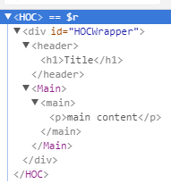
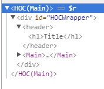

使用 `react`已经有不短的时间了，最近看到关于 `react`高阶组件的一篇文章，看了之后顿时眼前一亮，对于我这种还在新手村晃荡、一切朝着打怪升级看齐的小喽啰来说，像这种难度不是太高同时门槛也不是那么低的东西如今可不多见了啊，是个不可多得的 `zhuangbility`的利器，自然不可轻易错过，遂深入了解了一番。

---

## 概述

### 高阶组件的定义

[React](https://facebook.github.io/react/docs/higher-order-components.html) 官网上对高阶组件的定义：
>高阶部件是一种用于复用组件逻辑的高级技术，它并不是 React API的一部分，而是从`React` 演化而来的一种模式。
>具体地说，高阶组件就是一个接收一个组件并返回另外一个新组件的函数。
>相比于普通组件将 `props` 转化成界面UI，高阶组件将一个普通组件转化为另外一个组件。

大概意思就是说，  `HOC`并不是 `react``API`的一部分，而是一种实现的模式，有点类似于 `观察者模式`、`单例模式`之类的东西，本质还是函数。

---

### 功能
既然是能够拿来 `zhuangbility`的利器，那么不管怎么说，简单实用的招式必不可少，可以利用高阶组件来做的事情：

>1. 代码复用，逻辑抽象，抽离底层准备（`bootstrap`）代码
>2. `Props` 更改
>3. `State` 抽象和更改
>4. 渲染劫持

---

## 用法示例

### 基本用法

- 一个最简单的高阶组件(`HOC`) 示例如下：

```
// HOCComponent.js

import React from 'react'

export default PackagedComponent =>
  class HOC extends React.Component {
    render() {
      return (
        <div id="HOCWrapper">
          <header>
            <h1>Title</h1>
          </header>
          <PackagedComponent/>
        </div>
      )
    }
  }
```

此文件导出了一个函数，此函数返回经过一个经过处理的组件，它接受一个参数 `PackagedComponent`，此参数就是将要被 `HOC`包装的普通组件，接受一个普通组件，返回另外一个新的组件，很符合高阶组件的定义。

- 此高阶组件的简单使用如下：

```
// main.js
import React from 'react'
// (1)
import HOCComponent from './HOCComponent'

// (2)
@HOCComponent 
class Main extends React.Component {
  render() {
    return(
      <main>
        <p>main content</p>
      </main>
    )
  }
}
// (2)
// 也可以将上面的 @HOCComponent换成下面这句
//  const MainComponent = HOCComponent(Main)
export default MainComponent
```

想要使用高阶组件，首先`(1)`将高阶组件导入，然后`(2)`使用此组件包装需要被包装的普通组件 `Main`，这里的`@`符号是 `ES7`中的`decorator`，写过`Java`或者其他静态语言的同学应该并不陌生，这实际上就是一个语法糖，可以使用 [react-decorators](https://github.com/kriasoft/react-decorators) 进行转换， 在这里相当于下面这句代码：

```
const MainComponent = HOCComponent(Main)
```
`@HOCComponent`完全可以换成上面那句，只不过需要注意的是，类不具有提升的能力，所以若是觉得上面那句顺眼换一下，那么在换过之后，还要将这一句的位置移到类`Main`定义的后面。

最后，导出的是被高阶组件处理过的组件 `MainComponent`

- 这样，就完成了一个普通组件的包装，可以在页面上将被包装过的组件显示出来了：

```
import React from 'react'
import { render } from 'react-dom'

// 导入组件
import MainComponent from './main'

render(
  <MainComponent/>,
  document.getElementById('root')
)
```

页面显示如下：


可以使用 `React Developer Tools`查看页面结构：



可以看出，组件`Main`的外面包装了一层 `HOC`，有点类似于父组件和子组件，但很显然高阶组件并不等于父组件。

另外需要注意的一点， `HOC`这个高阶组件，我们可能会用到不止一次，功能技术上没什么关系，但是不利于调试，为了快速地区分出某个普通组件的所属的`HOC`到底是哪一个，我们可以给这些 `HOC`进行命名：

```
// 获取传入的被包装的组件名称，以便为 HOC 进行命名
let getDisplayName = component => {
  return component.displayName || component.name || 'Component'
}

export default PackagedComponent =>
  class HOC extends React.Component {
	// 这里的 displayName就指的是 HOC的显示名称，我们将它重新定义了一遍
	// static被 stage-0  stage-1 和 stage-2所支持
    static displayName = `HOC(${getDisplayName(PackagedComponent)})`
    render() {
      return (
        <div id="HOCWrapper">
          <header>
            <h1>Title</h1>
          </header>
          <PackagedComponent/>
        </div>
      )
    }
  }
```

现在的 DOM结构：



可以看到，原先的`HOC`已经变成了 `HOC(Main)`了，这么做主要是利于我们的调试开发。

这里的`HOC`，可以看做是一个简单的为普通组件增加`Title`的高阶组件，但是很明显并不是所有的页面都只使用同一个标题，标题必须要可定制化才符合实际情况。

想做到这一点也很简单，那就是再为`HOC`组件的高阶函数增加一个 `title`参数，另外考虑到 `柯里化 Curry`函数和函数式编程，我们修改后的 `HOC`代码如下：

```
// HOCComponent.js

// 增加了一个函数，这个函数存在一个参数，此参数就是要传入的`title`
export default PackagedComponent => componentTitle =>
  class HOC extends React.Component {
    static displayName = `HOC(${getDisplayName(PackagedComponent)})`
    render() {
      return (
        <div id="HOCWrapper">
          <header>
            <h1>{ componentTitle ? componentTitle : 'Title' }</h1>
          </header>
          <PackagedComponent/>
        </div>
      )
    }
  }
```

使用方式如下：

```
// main.js

// ...省略代码
const MainComponent = HOCComponent(Main)('首页')
export default MainComponent
```

然后在页面上就可以看到效果了：


---

## 属性代理

`HOC`是包裹在普通组件外面的一层高阶函数，任何要传入普通组件内的`props` 或者 `state` 首先都要经过 `HOC`。

`props`和 `state`等属性原本是要流向 目标组件的腰包的，但是却被 雁过拔毛的`HOC`拦路打劫，那么最终这些 `props`和 `states`数据到底还能不能再到达 目标组件，或者哪些能到达以及到达多少就全由 `HOC`说了算了，也就是说，`HOC`拥有了提前对这些属性进行修改的能力。

### 更改 `Props`

对 `Props` 的更改操作包括 **增、删、改、查**，在修改和删除 `Props`的时候需要注意，除非特殊要求，否则最好不要影响到原本传递给普通组件的 `Props`

```
class HOC extends React.Component {
    static displayName = `HOC(${getDisplayName(PackagedComponent)})`
    render() {
      // 向普通组件增加了一个新的 `Props`
      const newProps = {
        summary: '这是内容'
      }
      return (
        <div id="HOCWrapper">
          <header>
            <h1>{ componentTitle ? componentTitle : 'Title' }</h1>
          </header>
          <PackagedComponent {...this.props} {...newProps}/>
        </div>
      )
    }
  }
```

---

### 通过 `refs` 获取组件实例

普通组件如果带有一个 `ref`属性，当其通过 `HOC`的处理后，已经无法通过类似 `this.refs.component`的形式获取到这个普通组件了，只会得到一个被处理之后的组件，想要仍然获得原先的普通组件，需要对  `ref`进行处理，一种处理方法类似于 `react-readux` 中的 `connect`方法，如下：

```
// HOCComponnet.js
...
export default PackagedComponent => componentTitle =>
  class HOC extends React.Component {
    static displayName = `HOC(${getDisplayName(PackagedComponent)})`
    // 回调方法，当被包装组件渲染完毕后，调用被包装组件的 changeColor 方法
    propc(wrapperComponentInstance) {
      wrapperComponentInstance.changeColor()
    }
    render() {
	  // 改变 props，使用 ref 获取被包装组件的示例，以调用其中的方法
      const props = Object.assign({}, this.props, {ref: this.propc.bind(this)})
      return (
        <div id="HOCWrapper">
          <header>
            <h1>{ componentTitle ? componentTitle : 'Title' }</h1>
          </header>
          <PackagedComponent {...props}/>
        </div>
      )
    }
  }
```

使用：
```
// main.js
...
class Main extends React.Component {
  render() {
    return(
      <main>
        <p>main content</p>
        <span>{ this.props.summary }</span>
      </main>
    )
  }
  // main.js 中的changeColor 方法
  changeColor() {
    console.log(666);
    document.querySelector('p').style.color = 'greenyellow'
  }
}
...
```

---

## 反向继承(`Inheritance Inversion`)

相比于前面使用 `HOC`包装在 普通组件外面的情况，反向继承就是让`HOC`继承普通组件、打入普通组件的内部，这种更厉害，前面还只是拦路打劫，到了这里就变成暗中潜伏了，这种情况下，普通组件变成了基类，而`HOC`变成了子类，子类能够获得父类所有公开的方法和字段。

反向继承高阶组件的功能：
>1. 能够对普通组件生命周期内的所有钩子函数进行覆写
>2. 对普通组件的 `state`进行增删改查的操作。


```
// HOCInheritance.js

let getDisplayName = (component)=> {
  return component.displayName || component.name || 'Component'
}

// (1)
export default WrapperComponent =>
class Inheritance extends WrapperComponent {
  static displayName = `Inheritance(${getDisplayName(WrapperComponent)})`
  // (2)
  componentWillMount() {
    this.state.name = 'zhangsan'
    this.state.age = 18
  }
  render() {
    // (4)
    return super.render()
  }
  componentDidMount() {
	// 5
    super.componentDidMount()
    // 6
    document.querySelector('h1').style.color = 'indianred'
  }
}
```

上述代码中，让 `Inheritance` 继承 `WrapperComponent` (1)

并且覆写了` WrapperComponent` 中的 `componentWillMount`函数(2)

在这个方法中对 `WrapperComponent` 的 `state`进行操作(3)

在 `render`方法中，为了防止破坏` WrapperComponent `原有的 `render()`方法，使用 `super`将 `WrapperComponent` 中原有的 `render `方法实现了一次(4)

 在 `componentDidMount`同样是先将 ` WrapperComponent` 中的 `componentDidMount`方法实现了一次(5)

 并且在原有的基础上，又进行了一些额外的操作(6)

>`super`并不是必须使用，这取决于你是否需要实现普通组件中原有的对应函数，一般来说都是需要的，类似于 `mixin`，至于到底是原有钩子函数中的代码先执行，还是 `HOC`中另加的代码先执行，则取决于 `super`的位置，如果`super`在新增代码之上，则原有代码先执行，反之亦然。
>
另外，如果普通组件并没有显性实现某个钩子函数，然后在`HOC`中又添加了这个钩子函数，则 `super`不可用，因为并没有什么可以 `super`的，否则将报错。


使用：

```
// main2.js

import React from 'react'
import Inheritance from './HOCInheritance'

class Main2 extends React.Component {
  state = {
    name: 'wanger'
  }
  render() {
    return (
      <main>
        <h1>summary of </h1>
        <p>
          my name is {this.state.name},
          I'm {this.state.age}
        </p>
      </main>
    )
  }

  componentDidMount() {
    document.querySelector('h1').innerHTML += this.state.name
  }
}

const InheritanceInstace = Inheritance(Main2)
export default InheritanceInstace
```

页面效果：


可以看出，`HOC`为原有组件添加了 `componentWillMount`函数，在其中覆盖了  `Main2`中 `state`的 'name'属性，并且其上添加了一个`age`属性

`HOC`还将 `Main`的 `componentDidMount`方法实现了一次，并且在此基础上，实现了自己的 `componentDidMount`方法。

---

## 用法拓展

`HOC`的用处很多，例如代替简单的父组件传递`props`，修改组件的`props`数据等，除此之外，基于以上内容，我还想到了另外一种让  `HOC`配合 `redux`的使用技巧。

用过`vue`与 `vuex`的人都知道，这两个可谓是天作之合的一对好基友，后者基本上就是为前者量身定做，贴心的很，几乎不用多做什么事情，就能在 `vue`的任何组件中获取存储在 `vuex`中的数据，例如：

```
this.$store.state.data
```
只要 `vuex`中存储了 `data`这个值，那么一般情况下，在 `vue`的任何组件中，都是可以通过上面的一行代码获取到 `data`的。

至于，`react`和 `redux`，看起来似乎和 `vue`与`vuex`之间的关系差不多，用起来似乎也是二者搭配干活不累，`but`，实际上他们之间的关系并没有那么铁。

`redux`能够搭配的东西不仅是`react`，还有 `jquery`、`vue`、`Angular`、`Ember`等任意框架，原生 `js`也 `ok`，颇有种搭天搭地搭空气的倾向，所以，其与`react`之间肯定不可能像 `vue`与`vuex`那么融洽和谐。


因而，如果你想在`react`中像在 `vue`中那么毫不费力地通过类似于以下代码在任意 `react`组件中获取到 `redux`中的数据，那么我只能说，你大概又写了个 `bug`

```
this.$store.state.data
```

当然，如果你非要像这样获取到数据，也是可以的，但肯定要多费些手脚，一般在`react`中获取 `redux`中数据的方法都要像这样：

```
// 首先，导入相关文件
import { bindActionCreators } from 'redux'
import { connect } from 'react-redux'
import * as commonInfoActionsFromOtherFile from 'actions/commoninfo.js'

// ...

// 然后，传递数据和方法

let mapStateToProps = (state)=>{
  return {
    commonInfo: state.commonInfo
  }
}

let mapDispatchToProps = (dispatch)=>{
  return {
    commonInfoActions: bindActionCreators(commonInfoActionsFromOtherFile, dispatch)
  }
}
// 最终，将组件导出
export default connect(
  mapStateToProps,
  mapDispatchToProps
)(ExampleComponent)
```
代码其实也不是太多，但如果每次想要在一个组件获取 `redux`中的数据和方法都要将这段代码写一遍，实在是有些啰嗦。

一种解决方法就是将 `redux`中所有的数据和 `dispatch`方法全都暴露给根组件，让根组件往下传递到所有的子组件中，这确实是一种方法，但似乎有些冗余了， `redux`中的数据暴露在项目所有组件中，但有些组件根本用不到 `redux`中的数据，干嘛还非要塞给它？

而另外一种方法，就是要用到本文所说的 `HOC`了。
 

>既然高阶组件能够代理到 普通组件的`Props` 和 `state`等属性，那么在使用诸如 `redux`等库的时候，是不是可以让高阶组件来承接这些由 `redux`传递到全局的属性，然后再用高阶组件包装普通组件，将获得的属性传递给普通组件，这样普通组件就能获取到 这些全局属性了。
>
>相比于使用 `redux`一个个地初始化所有需要使用到全局属性的组件，使用高阶组件作为载体，虽然结构上多了一层，但是操作上明显方便简化了许多。

理论上可行，但无图无代码，嘴上说说可没用，我特地实验了一番，已用实践证实了其可行性。

一种封装 `HOC`，让其承载 `redux` 的示例代码如下：

```
// HocRedux.js

import { bindActionCreators } from 'redux'
import { connect } from 'react-redux'
import * as actionsLists from '../actions/actionsLists'

let getDisplayName = component=> {
  return component.displayName || component.name || 'Component'
}

let mapStateToProps = (state)=>{
  return {
    reduxState: state
  }
}
let mapDispatchToProps = (dispatch)=>{
  return {
    reduxActions: bindActionCreators(actionsLists, dispatch)
  }
}

export default ChildComponent =>
connect(
  mapStateToProps,
  mapDispatchToProps
)(class HocInheritance extends ChildComponent {
  static displayName = `HocInheritance(${getDisplayName(ChildComponent)})`
})
```

然后，普通组件被此`HOC`处理后，就可以轻松获取 `redux`中的数据了，想让哪个组件获取 `redux`，哪个组件就能获取到，不想获取的就获取不到，简单明了，使用方法和上面一样：

```
import HocRedux from 'HocRedux'
// 省略代码
const InheritanceInstace = Inheritance(Main2)
export default InheritanceInstace
```


---

## 注意事项

[react官网](http://www.css88.com/react/docs/higher-order-components.html) 上还给出了几条关于使用 `HOC` 时的注意事项。

- **不要在`render`函数中使用高阶组件**

例如，以下就是错误示范：

```
// 这是个 render 方法
render() {
  // 在 render 方法中使用了 HOC
  // 每一次render函数调用都会创建一个新的EnhancedComponent实例
  // EnhancedComponent1 !== EnhancedComponent2
  const EnhancedComponent = enhance(MyComponent);
  // 每一次都会使子对象树完全被卸载或移除
  return <EnhancedComponent />;
}
```

- **静态方法必须复制**

`HOC` 虽然可以自动获得 普通组件的 `props`和 `state`等属性，但静态方法必须要手动挂载。

```
// 定义静态方法
WrappedComponent.staticMethod = function() {/*...*/}
// 使用高阶组件
const EnhancedComponent = enhance(WrappedComponent);

// 增强型组件没有静态方法
typeof EnhancedComponent.staticMethod === 'undefined' // true
```

为了解决这个问题，在返回之前，可以向容器组件中复制原有的静态方法：

```
function enhance(WrappedComponent) {
  class Enhance extends React.Component {/*...*/}
  // 必须得知道要拷贝的方法
  Enhance.staticMethod = WrappedComponent.staticMethod;
  return Enhance;
}
```

或者使用 [hoist-non-react-statics](https://github.com/mridgway/hoist-non-react-statics)来自动复制这些静态方法

- **`Refs`不会被传递**
对于 `react`组件来说，`ref`其实不是一个属性，就像`key`一样，尽管向其他`props`一样传递到了组件中，但实际上在组件内时获取不到的，它是由`React`特殊处理的。如果你给高阶组件产生的组件的元素添加 `ref`,`ref`引用的是外层的容器组件的实例，而不是被包裹的组件。

想要解决这个问题，首先是尽量避免使用 `ref`，如果避免不了，那么可以参照本文上面提到过的方法。


