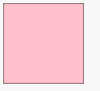

在一些现代的扁平化设计网站，特别是移动端网站，经常会包含许多简单而清晰的小图标，例如网站图标、用户的默认头像、移动端网页首页底部固定的切换栏等，这些小图标一般都是由美工做好，可能会放到精灵图上，前端再进行裁切展示。


而实际上，这些简单的小图标完全没必要让美工来做，前端完全可以通过 `svg`使用代码把这些简单的图标画出来，并且，因为这些图标是用代码描述出来的，所以如果想要修改这些图标，例如改变图标的颜色、图标的形状、大小等，都只是改几行代码的事情，非常简单，根本无需美工返工重做。

本文不是阐述如何利用 `svg` 来进行画图的，不了解 `svg`的可以前往 [这里查看](https://developer.mozilla.org/en-US/docs/Web/SVG)， 本文主要说一下如何在网站中使用 `svg`。

---

## SVG在一般网页中的使用

`svg`使用 `XML` 格式定义图像，你也可以把它看做是一般的 `HTML`标签，镶嵌在网页中呈现出某种效果，在网页中使用  `svg`的基本示例如下：

```html
<body>
	<svg width="100" height="100" version="1.1" xmlns="http://www.w3.org/2000/svg">
		<rect width="100%" height="100%" style="fill:pink;stroke-width:1;stroke:rgb(0,0,0)"/>
	</svg>
</body>
```

效果如下：



可以看到，普通网页中使用 `svg`是很简单的，只要你能把 `svg`图标画出来，在网页中的呈现完全不是问题。

---

## 在 Vue中使用 Svg

你完全可以像在 普通网页中使用 `svg`那样在`Vue`中使用，不过，既然已经是选择 `vue`来组件化开发项目了，那么在一堆组件中，穿插一大段的 `svg`毕竟有点不太好看。

一种解决方法是，利用 `svg`的 `use`标签，不直接在主页面中编写绘制`svg`图标的代码，而是把这一大段的代码放到另外的文件中，然后使用 `use`引用这段绘制图标的代码即可（好像饿了么移动端就是这么干的）。

例如，将所有绘制 `svg`的代码放到 `svg-icon.vue`文件中，所有图标的绘制代码使用 `symbol`标签分隔开并单独命名，避免错乱，然后将这个文件当做是一个组件导出，在主页面中引入此组件，接着，在需要 使用 `svg`图标的地方，通过 `use`标签将其引入。

`svg-draw.vue`代码示例如下：

```html
<template>
 <svg
   xmlns="http://www.w3.org/2000/svg"
   xmlnsXlink="http://www.w3.org/1999/xlink"
   style={{position:'absolute',width:0,height:0}}>
   <defs>
     <symbol viewBox="0 0 26 31" id="location">
       <path xmlns="http://www.w3.org/2000/svg" d="M512.571517 65.907059c-204.736964 0-370.715183 165.979242-370.715183 370.724393 0 94.440929 35.320437 180.625824 93.462648 246.083651 1.572822 2.690272 3.50994 5.225001 5.817496 7.531534l240.297878 251.597225c1.279133 1.864464 2.736321 3.64297 4.393054 5.298679 2.111081 2.111081 4.418636 3.90596 6.856152 5.402033 14.458293 10.06524 34.491559 8.658194 47.393403-4.242627 3.26537-3.263323 5.78782-6.987135 7.582699-10.960633L783.610536 690.24766c1.867534-1.866511 3.489474-3.88447 4.876054-6.010901 58.951647-65.640999 94.819552-152.431691 94.819552-247.604284C883.305119 231.886301 717.325877 65.907059 512.571517 65.907059zM512.390391 588.611865c-82.734306 0-149.814074-67.087954-149.814074-149.842727 0-82.753749 67.079768-149.833517 149.814074-149.833517 82.772168 0 149.851936 67.079768 149.851936 149.833517C662.242328 521.523911 595.161536 588.611865 512.390391 588.611865z" fill="#d81e06"/>
     </symbol>
   </defs>
  </svg>
</template>
```

整个 `vue`组件导出一个大的 `svg`，此`svg`中包含了许多小的图标，类似于精灵图，每个图标使用 `symbol`分隔，并单独命名以方便引用。

使用示例如下：

```html
// index.vue
...
<svg class="location-icon">
  <use xlink:href="#location"></use>
</svg>
...
```

然后，就可以看到网页中顺利出现对应的 `svg`图标了：


不过，还有个问题，如果当前网站需要用到的 `svg`图标很多，势必就造成 `svg-icon.vue`这个文件体积逐渐变大，当前网页命名只需要用到其中一个 `svg`图标，结果你把几百个图标的 `svg`代码，全部加载了进来，明显不太友好，最好是能够按需加载，当前网页需要哪些图标就加载哪些，甚至一些可能出现可能不出现的图标，也在该出现时再加载，如果没有机会出现，那么永远不加载。

`Github`上有很多此类的插件，我介绍一个我觉得很好用的插件：[vue-svg-icon](https://github.com/cenkai88/vue-svg-icon)，简单易用、快速上手。

首先，安装此插件，就不多说了，安装完成后，在项目的入口文件中注册此插件以方便全局调用：

```js
import Icon from 'vue-svg-icon/Icon.vue'
Vue.component('icon', Icon)
```

然后在根目录的 `/src`目录下新建一个 `svg`目录（目前这个路径只能是这样，不可配置为其他路径和目录），然后再这个目录中放入你想要使用的 `svg`图标的 `svg`文件即可。

例如一个微信图标的 `svg`如下：

```html
<?xml version="1.0" standalone="no"?><!DOCTYPE svg PUBLIC "-//W3C//DTD SVG 1.1//EN" "http://www.w3.org/Graphics/SVG/1.1/DTD/svg11.dtd"><svg t="1502683891821" class="icon" style="" viewBox="0 0 1024 1024" version="1.1" xmlns="http://www.w3.org/2000/svg" p-id="2885" xmlns:xlink="http://www.w3.org/1999/xlink" width="16" height="16"><defs><style type="text/css"></style></defs><path d="M282.6 363.8c-23.7 0-47-15.7-47-38.9 0-23.7 23.3-38.9 46.5-38.9 23.7 0 38.9 15.2 38.9 38.9 0.5 23.2-15.1 38.9-38.4 38.9zM500.4 286c23.7 0 38.9 15.2 38.9 38.9 0 23.3-15.2 38.9-38.9 38.9-23.3 0-47-15.7-47-38.9 0-23.7 23.7-38.9 47-38.9z m167.7 84.5c9.8 0 19.7 0.5 30 1.8-27.3-125.6-161.4-218.7-314.4-218.7C212.4 153.6 72 270.3 72 418.3c0 85.9 46.5 155.6 124.8 210.2l-31.3 93.9 109.1-54.6c38.9 7.6 70.2 15.7 109.1 15.7 9.4 0 19.2-0.5 29.1-1.3-6.3-20.6-9.8-42.9-9.8-65.3-0.1-136 116.6-246.4 265.1-246.4z" p-id="2886"></path><path d="M772.7 573.9c-15.2 0-30.9-15.2-30.9-30.9 0.5-15.7 15.7-31.3 30.9-31.3 23.7 0 39.4 15.7 39.4 31.3-0.1 15.7-15.7 30.9-39.4 30.9z m-171.3 0c-15.2 0-30.9-15.2-30.9-30.9s15.7-31.3 30.9-31.3c23.7 0 38.9 15.7 38.9 31.3 0.5 15.7-15.2 30.9-38.9 30.9zM952 613.3C952 488.5 827.2 387 687.3 387c-148 0-264.7 101.5-264.7 226.3 0 124.8 116.7 225.8 264.7 225.8 31.3 0 62.6-8.1 93.5-15.7l85.9 47-23.7-77.8c62.5-47 109-109.1 109-179.3z" p-id="2887"></path></svg>
```

将上述代码保存到一个 `.svg`的文件中，例如 `wx.svg`，放到 `/src/svg`目录中，这样就完成了准备工作。

接着，想要使用的话，很简单，直接在 `vue`组件中这么写：

```html
<template>
	<icon class="wx-icon" name="wx"></icon>
</template>
```


刷新页面时，打开控制台，可以看到页面中加载了这个 `wx.svg`文件，这样，就实现了 `svg`文件的按需引入。


---

## 在 React中使用 Svg

在 `React`中使用` Svg`和 `vue`一样，同样存在 3种方案，一种是直接在 `react`的 `reader`方法中写入 `svg`代码，第二种则是将所有 `svg`绘制代码放到一个文件中，然后将这个文件一次性载入，使用 `use`标签引用响应的 `svg`图案，第三种则是使用插件按需引入。

第一种直接在 渲染方法中写入 `svg`的方法就不多说了，第二种也很简单 ，和 `vue`一样，只不过写法上需要注意一下。

```jsx
render() {
    return (
      <svg
        xmlns="http://www.w3.org/2000/svg"
        xmlnsXlink="http://www.w3.org/1999/xlink"
        style={{position:'absolute',width:0,height:0}}>
        <defs>
          <symbol viewBox="0 0 26 31" id="location">
            <path fill="#FFF" fillRule="evenodd" d="M22.116 22.601c-2.329 2.804-7.669 7.827-7.669 7.827-.799.762-2.094.763-2.897-.008 0 0-5.26-4.97-7.643-7.796C1.524 19.8 0 16.89 0 13.194 0 5.908 5.82 0 13 0s13 5.907 13 13.195c0 3.682-1.554 6.602-3.884 9.406zM18 13a5 5 0 1 0-10 0 5 5 0 0 0 10 0z"></path>
          </symbol>
          <symbol viewBox="0 0 14 8" id="arrow">
            <path fill="#FFF" fillRule="evenodd" d="M5.588 6.588c.78.78 2.04.784 2.824 0l5.176-5.176c.78-.78.517-1.412-.582-1.412H.994C-.107 0-.372.628.412 1.412l5.176 5.176z"></path>
          </symbol>
        </svg>
      )
}
```

主要是需要注意，因为 `react`使用 `jsx`语法，不允许出现 `-` 连字符，所以像 `fill-rule`这样的属性，就必须写成 `fillRule`，引用的时候同样如此。

```html
// 引用的时候需要将 `xlink:href` 改写成 xlinkHref
<svg className="arrow-left">
   <use xlinkHref="#arrow-left"></use>
 </svg>
```


第三种按需引入，只加载当前需要的 `svg`形状，同样是将每一个 `svg`图片作为一个单独的文件保存，然后再需要使用的地方进行引用。
`Github`上有个项目 [react-svg](https://github.com/atomic-app/react-svg)，这个项目内部其实是对 [SVGInjector](https://github.com/iconic/SVGInjector)的包装，

安装 [react-svg](https://github.com/atomic-app/react-svg)之后，就可以像下面这样使用了：

```jsx
import ReactSVG from 'react-svg'

ReactDOM.render(
  <ReactSVG
    path="atomic.svg"
    callback={svg => console.log(svg)}
    className="example"
  />,
  document.querySelector('.Root')
)
```


一般都只是在使用小图标的时候才考虑 `svg`，而这些小图标一般都比较简约，绘制起来也没什么难度，不过大部分情况下没有必要自己来画，很多网站都提供`svg`的图标下载，例如阿里的 [iconfont](http://www.iconfont.cn/)，图标数量众多，基本可以满足绝大部分的需求，另外，类似的网站还有 [easyicon](http://www.easyicon.net/) 、 [icomoon](https://icomoon.io/)等。