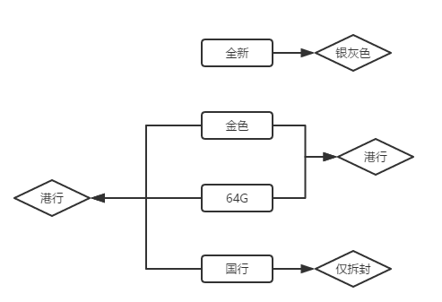
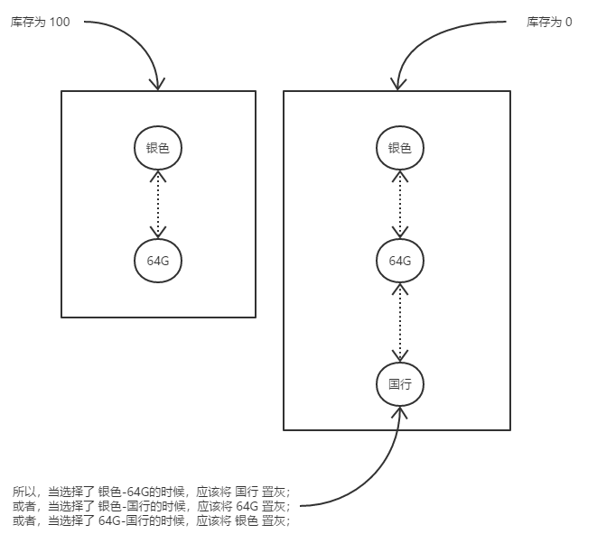
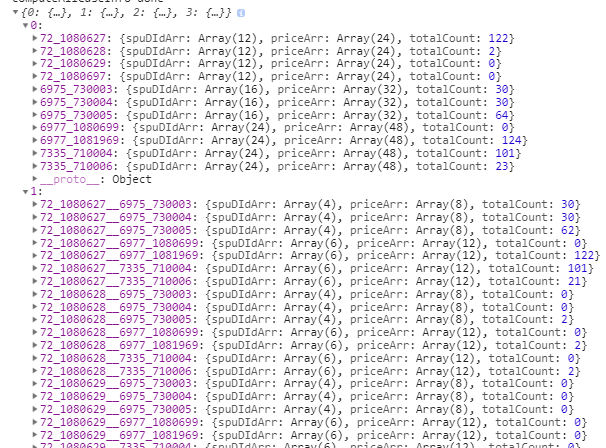
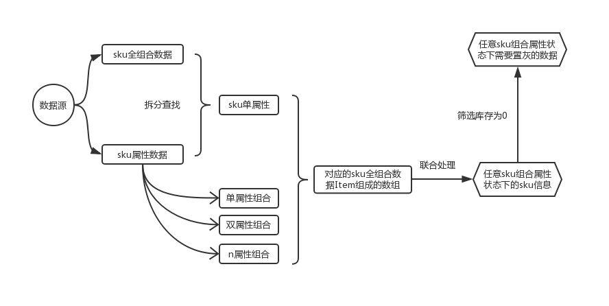
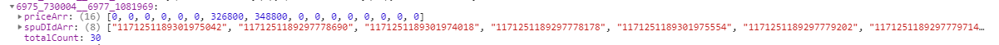
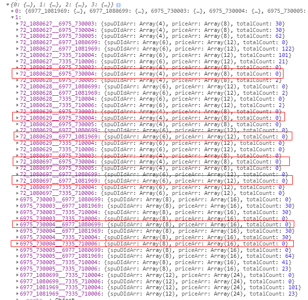
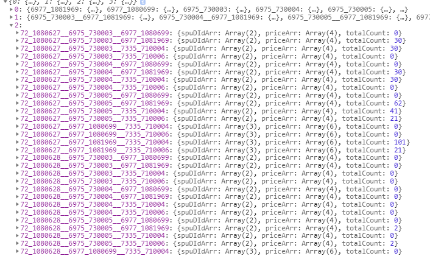

最近做到一个需求，需要做一个类似于京东或者淘宝等电商的商品详情页，其中有一个功能就是商品SKU的选择查询问题


如上图，网络类型、机身颜色、套餐类型、存储容量这些每一个都是一个 `SKU`属性，当选择好了所有的 `SKU`属性后，会组合成一个完整的 `SKU`，对应一个具体的商品，然后就可以给出这条 `SKU`对应的商品的库存和价格等信息

并且，当点选了某些 `SKU`属性后，会自动根据当前已经点选的 `SKU`属性，来计算出当前条件下库存为 `0` 的 `SKU`组合，给予按钮置灰不可选的交互

一开始接到这个需求的时候，评审需求的后端和同组合作的前端小伙伴都认为这是一个难点，需要好好调研考量一下，而我则是邪魅一笑，觉得这东西不就是一个组合嘛，算法能写就写，不能写大不了来个暴力循环查找，小场面啦

然而，当我开始着手做的时候才发现跟平常确实不一样，这些代码好像不能闭着眼睛写

## 实现思路

当我发现这个功能确实有点小难度的时候，我就开始在网上搜相关文章了，这才发现相关文章好像都写的比较煞有其事，跟什么《你绝对不知道的数组的十种用法》什么《原型链全场最佳分析》什么《我的函数式编程不可能那么可爱》什么《三年前端大厂面试经历》都不太一样，看起来居然需要带着脑子，而且相关文章较少，除去那些抄来抄去的以及我没搜到的之外，几篇真正有实用价值的：

- [电商平台商品 SKU 组合查询算法实现](https://hooray.github.io/posts/8b2bd6f8/)
- [sku 多维属性状态判断算法](https://keelii.com/2016/12/22/sku-multi-dimensional-attributes-state-algorithm/)
- [淘宝SKU组合查询算法实现](https://www.cnblogs.com/purediy/archive/2012/12/02/2798454.html)

我看完之后，顿时陷入了沉思


>既然塑料恐龙是塑料做的，而塑料来源于石油，石油又是远古恐龙尸体转化成的。
>那么是不是说，塑料恐龙就是真的恐龙？

这些文章描述得感觉不是很清楚，主要是没有完整可运行代码，无法自行验证，满篇文字看的云里雾里的，照着他们说的来做，还不如我自己重新写个，不过还是有些借鉴意义的

- 首先，给定几组 `SKU`的属性，那么根据这些属性组合出来的 `sku`肯定是可以被全部列举出来的，而且考虑到现实业务使用中，属性并不会太多，无需关心极端情况，所以哪怕全部穷举，对性能也没多大损耗；
- 然后，既然穷举出了所有的可能集合，那么就能计算出每一个组合对应的价格和存库等信息，这样一来自然就可以形成一个字典了，无论选择了哪些组合，都能从这个字典上快速查询到对应的价格和库存等信息，即以空间换时间，只要在开始时初始化好了这个包含所有可能的数据字典，后续 `sku`属性的切换无非是字典 `key`的变化

当然了，思路是这个思路，但是真正写代码的时候，需要考虑的点比较多，而且都要考虑到，无论少了哪一点，数据就会都不对了

## 数据准备

假设对于**手机**这个品类来说，它的 `sku`属性有成色、颜色、配置、版本，其中成色分为 全新、仅拆封，颜色分为深空灰、银色、金色，配置分为`64G`、`256G`，版本分为国行、港澳版、日韩、其他版本

每个 `sku`属性肯定都有自己独一无二的标识 `ID`，例如，对于颜色来说，它肯定有自己的 `ID`，称为 `paramId`，颜色下存在至少一个小属性，例如深空灰、银色、金色，每种颜色也都有自己的 `ID`，称为 `valueId`，结构如下：

```js
interface ISkuParamItem {
  paramId: string
  paramValue: string
  valueList: Array<{
    valueId: string
    valueValue: string
  }>
}
```
请求 `sku`数据的时候，后端会将当前商品`ID`(称为 `spuId`)对应的所有`sku`属性返回，称为 **`sku`属性数据集合**数据格式暂定如下：
```js
[{
    "paramId": "6977",
    "paramValue": "成色",
    "valueList": [{
        "valueId": "1081969",
        "valueValue": "全新"
    }, {
        "valueId": "1080699",
        "valueValue": "仅拆封"
    }]
}, {
    "paramId": "6975",
    "paramValue": "颜色",
    "valueList": [{
        "valueId": "730003",
        "valueValue": "深空灰色"
    }, {
        "valueId": "730004",
        "valueValue": "银色"
    }, {
        "valueId": "730005",
        "valueValue": "金色"
    }]
}, {
    "paramId": "7335",
    "paramValue": "配置",
    "valueList": [{
        "valueId": "710004",
        "valueValue": "64G"
    }, {
        "valueId": "710006",
        "valueValue": "256G"
    }]
}, {
    "paramId": "72",
    "paramValue": "版本",
    "valueList": [{
        "valueId": "1080627",
        "valueValue": "国行"
    }, {
        "valueId": "1080628",
        "valueValue": "港澳版"
    }, {
        "valueId": "1080697",
        "valueValue": "日韩"
    }, {
        "valueId": "1080629",
        "valueValue": "其他版本"
    }]
}]
```

当前商品`ID`(称为 `spuId`)对应的所有 `sku`数据返回，称为 **商品全`sku`数据集合** 数据格式暂定如下：
```js
[
  {
      count: 98,
      paramIdJoin: "72_1080697__6975_730004__6977_1081969__7335_710006",
      priceRange: [7000, 8978],
      spuDId: "98002993445"
  }
]
```
其中，`paramIdJoin`是 `sku`属性组合连接而成，可分为 `72_1080697、6975_730004、 6977_1081969、 7335_710006`这个四个单元，每个单元又由 `paramId` 和 `valueId` 连接而成，所以 `72_1080697__6975_730004__6977_1081969__7335_710006`的意思就是 **版本为日韩、颜色为银色、成色为全新、配置为256G**的 `sku`组合，对应的总库存 `count`为 `98`，价格范围为 `7000 ~ 8978`，即最低价是 `7000`，最高价是 `8978`（如果只有一个价格没有高、低价格之分，那数组中的项就是那一个价格就行了），`spu`的标识 `id` `spuDId`为 `98002993445`

>**需要注意的是**，`paramIdJoin` 的值，例如`72_1080697__6975_730004__6977_1081969__7335_710006`，必须是按照 `paramId`进行升序（或者降序也可以，这里按照升序处理）进行连接的，`72 < 6975 < 6977 < 7335`，所以才有 `72_1080697__6975_730004__6977_1081969__7335_710006`这个拼接方式
>
>这对于后续算法的优化有着显著的作用，不按照顺序也可以，但在数据量比较大的情况下，计算时间会比较长，很可能出现页面卡顿的情况

后端可能返回的数据结构和上面不一样，不过关系不大，无论后端返回的数据结构是什么样的，返回的数据肯定需要包括上面那些，因为这些都是必要数据，缺一不可，至于数据结构如果不一样，你只需要先行处理一下，处理成和上面一样的数据结构就行了，这是肯定可以做到的
有了上述数据，就可以开始写核心的处理代码了

## 分析思路

其实这里的功能就两个，那就是当选中或取消任意 `sku`属性的时候：

- 计算出此时 `sku`属性组合对应的价格和库存
例如当前选中了颜色：银色、内存：`64G`、运营商：移动，这一组 `sku`属性对应的商品的价格和库存

- 计算出在此时的 `sku`属性组合之下，需要置灰哪些 `sku`组合
例如当前选中了颜色：银色、内存：`64G`，这一组 `sku`属性的时候，剩下的哪些 `sku`属性与这两个已经选中的 `sku`组合后的组合库存为 `0`，则说明这些 `sku`属性应该要被置灰，也就是不让用户选中
例如，银色 + `64G`的库存为 `0`，则当选中`银色`的时候，就需要将 `64G`这个 `sku`属性置灰

对于第一点，比较简单，只需要拿到当前选中的 `sku`属性组合，然后在所有的 `sku`数据中去查找包含所选中的 `sku`属性的数据即可，就是一个遍历筛选操作，有难度的是第二点

无论当前选中了哪些 `sku`属性，都要从整个 `sku`数据中找到包含任意选中的 `sku`属性的数据，然后在这些数据中找出库存为 `0`的数据，再从这些数据中找到应该被置灰的 `sku`属性

例如，假设 `银色-64G-国行`这个 `sku`的库存为 `0`，则当你选中 `银色-64G`的时候，应该把`国行`置灰，当选中 `银色-国行`，应该把`64G`置灰，当选中 `国行-64G`，应该把`银色`置灰

这只是最简单的一种情况

复杂一点，假设 `银色-64G`这个 `sku`的库存为 `0`，则当你选择`银色`的时候，，应该把`64G`置灰，当你选择`64G`的时候，，应该把`银色`置灰，当你选择`深空灰-64G`的时候，，应该把`银色`置灰……等等

如果 `sku`属性项有很多种，例如颜色、内存、运营商、制式、成色、套餐类型、保险，那么这种可组合的项就更多了

随便想一下，就感觉头好大，似乎是好多需要计算的东西啊

不过，其实也是有据可循的

当选中 `n`个 `sku`属性的时候，应该被置灰的 `sku`属性实际上就是 当选中这 `n`个中任一个`sku`属性时应该被置灰的 `sku`属性，加上当选中这 `n`个中任两个`sku`属性时应该被置灰的 `sku`属性，加上……加上当选中这 `n`个中任 `n`个`sku`属性时应该被置灰的 `sku`属性 <del>头好像变得更大了</del>



例如上图

当选中了 `全新、金色、64G、国行`这四个 `sku`属性的时候，计算在此状态下需要置灰的 `sku`属性：

首先，先看这四个 `sku`属性中，当不选中任何  `sku`属性时，有哪些 `sku`的库存为 `0`，发现所有的商品中，都没有 `全新`这个属性，则说明 `全新`的库存为 `0`，将之记录下来；

 然后，再看这四个 `sku`属性中，每一个单独的 `sku`选中的时候应该置灰的 `sku`属性，例如当单独选中 `全新`这个 `sku`属性的时候，发现`全新-银灰色`这个组合的库存为 `0`，则将 `银灰色`置灰，将这个属性记录下来；当单独选中 `国行`这个 `sku`属性的时候，发现`国行-仅拆封`这个组合的库存为 `0`，则将 `仅拆封`置灰，将这个属性记录下来；当单独选中 `金色`或 `64G`的时候，其他任意一个`sku`属性与之组合皆有库存，则不记录任何 `sku`属性；

然后，再看这四个 `sku`属性中，当选中两个 `sku`的时候应该置灰的 `sku`属性，例如当同时选中 `金色、64G`这两个 `sku`属性的时候，发现`金色-64G-港行`这个组合的库存为 `0`，则将 `港行`置灰，将这个属性记录下来；当同时选中 `全新-金色` 或 `全新-64G` 或 `全新-国行` 或 `金色-国行` 或 `64G-国行`的时候，发现其他任一 `sku`与这些进行组合都有库存，则不记录任何  `sku`属性；

然后，再看这四个 `sku`属性中，当选中三个 `sku`的时候应该置灰的 `sku`属性，例如当同时选中 `金色、64G`这两个 `sku`属性的时候，发现`金色-64G-港行`这个组合的库存为 `0`，则将 `港行`置灰，将这个属性记录下来；当同时选中 `全新-金色` 或 `全新-64G` 或 `全新-国行` 或 `金色-国行` 或 `64G-国行`的时候，发现其他任一 `sku`与这些进行组合都有库存，则不记录任何 `sku`属性；



应该被置灰的意思就是对于当前 `sku`组合来说，如果再继续增加一个 `sku`属性，这个新的 `sku`组合对应的库存为 `0`，则说明最后增加的那个 `sku`属性应该被置灰

所以这里需要一个集合，这个集合包含当选择任意个数量 `sku`属性的时候，应该被置灰的 `sku`属性集合

想要得到这个集合，运算量会很大，而且绝大部分都是无用计算（计算出了一堆的结果，实际上用户只需要其中几个），所以简化一下，只需要得到一个集合，这个集合中包含了所有可能选择的 `sku`组合，还可以更加有序一点，将集合换成 `Map`，在 `js`中也就是对象，这个对象存在一些属性，这些属性的`key`值是数字 `1、2、3……n-1, n`，代表着选中 `1 到 n`个任意 `sku`属性，其值又是一个对象，这个小对象的 `key`就是 `1 到 n`个任意 `sku`属性的可能组合，其值包含这些组合的价格范围和库存等信息

代码层面的数据结构如下（部分）：



上述表示，对于选中了 `1`(下标为 `0`)个 `sku`属性的情况，共有 `11`种 `sku`选法，每种选法都有对应的 价格范围和总库存信息，例如 `72_1080627`表示，当选中了 `版本为国行` 这个 `sku`属性时，其价格范围数组 `priceArr` 和总库存 `totalCount`；对于选中了 `2`(下标为 `1`)个 `sku`属性的情况，共有 `44`种 `sku`选法，每种选法都有对应的 价格范围和总库存信息，例如 `72_1080627__6975_730003`表示，当选中了 `版本为国行，颜色为深空灰色` 这个 `sku`属性时，其价格范围数组 `priceArr` 和总库存 `totalCount`……等等

有了这个信息，后面就好办了

首先，你选中任意个 `sku`属性，我都能从这个集合里找出对应的总库存和价格范围，无需在原数据中多次筛选，这实现了第一个功能点；
对于第二个功能，当选中任意个 `sku`属性时(设为 `n`)，我只需要在这个对象中选取 `key`为从 `0`到 `n`的数据，并且找这些数据对应的 `sku`的总库存为 `0`的数据，这些数据中包含 `sku`属性就都是需要置灰的，这就实现了第二个功能点

所以，最关键的就是这个`Map`对象了，只要计算出这个`Map`对象，其他的就好办了，当然，说起来简单，真正用代码实现还是有很多需要注意的地方的



## 数据计算

### 计算单 `sku`属性所属下标集合

即从接口返回的包含了所有 `sku`属性组合及其对应的数据的数据源中（也就是前面所说的 **商品全`sku`数据集合**），计算出包含了每一个 `sku`属性的数据项的下标的集合

比如，对于 `颜色：黑色` 这个 `sku`属性，**商品全`sku`数据集合**数据中所有包含 `颜色：黑色`这个 `sku`属性的数据的下标的集合，就是其所属下标集合，以 `sku`属性的 `paramId`和  `valueId`为 `key`，以下标集合为值，则可以得到一个集合，数据结构如下：

```js
{
    "6977_1081969": [0, 4, 5, 6, 7, 11, 14, 15, 17, 19, 20, 23, 25, 31, 32, 34, 35, 36, 38, 39, 40, 42, 44, 47],
    "6977_1080699": [1, 2, 3, 8, 9, 10, 12, 13, 16, 18, 21, 22, 24, 26, 27, 28, 29, 30, 33, 37, 41, 43, 45, 46],
    "6975_730003": [4, 14, 17, 18, 22, 23, 28, 29, 32, 33, 37, 39, 43, 44, 45, 47],
    "6975_730004": [0, 2, 5, 7, 8, 10, 12, 16, 19, 20, 24, 31, 34, 40, 41, 46],
    "6975_730005": [1, 3, 6, 9, 11, 13, 15, 21, 25, 26, 27, 30, 35, 36, 38, 42],
    "7335_710004": [1, 3, 4, 5, 8, 9, 10, 11, 19, 24, 28, 30, 31, 32, 33, 34, 35, 36, 37, 39, 42, 43, 44, 46],
    "7335_710006": [0, 2, 6, 7, 12, 13, 14, 15, 16, 17, 18, 20, 21, 22, 23, 25, 26, 27, 29, 38, 40, 41, 45, 47],
    "72_1080627": [7, 12, 13, 18, 19, 23, 30, 33, 38, 42, 44, 46],
    "72_1080628": [3, 5, 6, 10, 16, 21, 36, 39, 40, 43, 45, 47],
    "72_1080697": [0, 8, 9, 11, 14, 22, 25, 26, 31, 32, 37, 41],
    "72_1080629": [1, 2, 4, 15, 17, 20, 24, 27, 28, 29, 34, 35]
}
```
例如，对于第一条数据 `"6977_1081969": [0, 4, 5, 6, 7, 11, 14, 15, 17, 19, 20, 23, 25, 31, 32, 34, 35, 36, 38, 39, 40, 42, 44, 47],`来说，它表示**商品全`sku`数据集合**数据中所有包含 `paramId`为 `6977`，`valueId`为 `1081969`这个`sku`属性，即 `成色：全新`的数据下标集合为 `[0, 4, 5, 6, 7, 11, 14, 15, 17, 19, 20, 23, 25, 31, 32, 34, 35, 36, 38, 39, 40, 42, 44, 47]`

此集合的计算过程没什么好说，就是遍历**商品全`sku`数据集合**数据创建数组而已，为了方便叙述，这里称此集合为 `keyRankMap`

### 计算 `Map`对象

有了上述 `keyRankMap`，计算我们想要的那个 `Map`对象 (称为`indexKeyInfoMap`)也就有了前提条件，

`indexKeyInfoMap`集合的组成前面已经说过了，类似于一个缓存数据，列举了所有任意个 `sku`组合的信息，所以那就涉及到一个算法了：

>现有 `m`个数组，数组都不为空，从这些数组中共取 `n`(`n <= m`)个数，共有多少种取法？规定，每个数组最多只能取一次，每次最多取一个项

这个算法实际上就是另外一个更加常见的算法的增强版，即 `从 m 个数中取 n 个数，共有多少种取法`，这里的 `m`个数可以看成是一个数组，也就是从一个长度为 `m`的数据中取 `n`个数，但是现在不是从一个数组中了，而是从 `m`个数组中取

这个算法实际上就是全排列，没什么难度，有很多种写法，只要能达到目的并且效率别太差就行

```js
/**
 * 给定 mArr长度个数组，从这些数组中取 n 个项，每个数组最多取一项，求所有的可能集合，其中，mArr的每个项的值代表这个数组的长度
 * 例如 composeMArrN(([1, 2, 3], 2))，表示给定了 3 个数组，第一个数组长度为 1，第二个数组长度为 2，第二个数组长度为 3，从这三个数组任意取两个数
 * example： composeMArrN(([1, 2, 3], 2))，返回：
 * [[0,0,-1],[0,1,-1],[0,-1,0],[0,-1,1],[0,-1,2],[-1,0,0],[-1,0,1],[-1,0,2],[-1,1,0],[-1,1,1],[-1,1,2]]
 * 返回的数组长度为 11，表示有 11 种取法，数组中每个子数组就是一个取值组合，子数组中的数据项就表示取值的规则
 * 例如，对于上述结果的第一个子数组 [0, 0, -1] 来说，表示第一种取法是 取第一个数组下标为 0 和 第二个数组下标为 0 的数，下标为 2 的数组项值为 -1 表示第三个数组不取任何数
 * @param mArr 数据源信息
 * @param n 取数的个数
 * @param arr 递归使用，外部调用不需要传此项
 * @param hasSeletedArr 递归使用，外部调用不需要传此项
 * @param rootArr 递归使用，外部调用不需要传此项
 */
function composeMArrN (mArr: Array<number>, n: number, arr = [], hasSeletedArr = [], rootArr = []): Array<Array<number>> {
  if (!n || n < 1 || mArr.length < n) {
    return arr
  }
  for (let i = 0; i < mArr.length; i++) {
    // 当前层级已经存在选中项了
    if (hasSeletedArr.includes(i)) continue
    hasSeletedArr = hasSeletedArr.slice()
    hasSeletedArr.push(i)
    for (let j = 0; j < mArr[i]; j++) {
      let arr1 = completeArr(arr, i - arr.length, -1)
      arr1.push(j)
      if (n === 1) {
        arr1 = completeArr(arr1, mArr.length - arr1.length, -1)
        rootArr.push(arr1)
      } else {
        composeMArrN(mArr, n - 1, arr1, hasSeletedArr, rootArr)
      }
    }
  }
  return rootArr
}
```
其中 `completeArr`是一个补全数组的辅助方法，比如，对于 `[1, 2]`这个数组来说，我想把它的长度再增加 `3`个单位，用 `-1`来填补多出来的位置，就是调用 `completeArr([1, 2], 3, -1)`，返回 `[1, 2, -1, -1, -1]`，这个逻辑跟算法本身没什么关系，主要是基于当前业务的考量，方便后续数据处理

以此类推，就能得到当任意取 `n`个 `sku`属性时，所组成的 `sku`组合对应的价格和库存等信息的数据，也就是 `indexKeyInfoMap`

### 根据 indexKeyInfoMap 计算出任意状态下 sku 组合对应的信息和置灰信息

`indexKeyInfoMap`只是一个缓存数据，需要实现的功能是，选中任意 `sku`数据时，对应的价格和库存等信息，以及应该置灰的 `sku`信息

例如，对于当选中了 `全新-银色`这个组合的时候

- 计算对应的价格和库存等信息

`全新-银色` 是两个 `sku`属性的组合，则直接在 `indexKeyInfoMap`中找 `key`为 `1`的属性，从其数组值中找匹配 `全新-银色`，也就是 子`key`为 `6975_730004__6977_1081969`的数据项：



其中，`priceArr`表示所有包含 `全新-银色`这个 `sku`组合的 `sku`数据的价格范围集合，`spuDIdArr`表示 `spuDId`集合，`totalCount`表示总库存

- 计算需要置灰的 `sku`属性

这才是关键

第一，计算当任何属性都不选的时候，库存为 `0`的属性；
第二，计算当单独选中 `全新` 和 单独选中 `银色` 的时候，分别与这两个属性组合的时候库存为 `0`的属性；
第三，计算当同时选中 `全新-银色`的时候，与 `全新-银色`进行组合的时候库存为 `0`的属性；

三种情况下应该被置灰的属性的并集就是 当选中 `全新-银色`的时候，应该被置灰的属性

计算的基础就是 `indexKeyInfoMap`， 比如对于 **第二，计算当单独选中 `全新` 和 单独选中 `银色` 的时候，分别与这两个属性组合的时候库存为 `0`的属性；**，其计算过程：

首先，任意一个 `sku`属性 与`全新`或 `银色`组成的组合，就是两个 `sku`属性链接，长度为 `2`，所以从 `indexKeyInfoMap`中选取 `key`为 `1`的数据，也就是 `indexKeyInfoMap[1]`，从此数据中分别找包含 `全新` 和 `银色`，也就是 `key`中包含 `6977_1081969` 或 `6975_730004`，并且库存为 `0`的数据项：



然后再对这被筛选出来的 `7`条数据进行出来，得到需要被置灰的 `sku`属性的集合，也就是这些数据的 `key`字符串中，去掉当前已经选中的 `sku`属性，即 `6977_1081969` 和 `6975_730004`后，还剩下的值的集合

例如，对于 `72_1080628__6975_730004`而言，其处理之后剩下 `72_1080628`，即 `paramId` 为 `72`， `valueId`为 `1080628`的 `sku`属性所对应的按钮应该被置灰，其他类似

这样就能得到一个数组（需要对数组进行去重），此数组中的每一项，就是在同时选中 `全新-银色`的时候，所需要置灰不可点的 `sku`属性按钮

概括成通用解决方案，其实又是一个算法，上面说到过：`从 m 个数据中取 n(n <= m) 个数，所有的可能取法`，然后再对每种取法进行处理，计算从剩下的 `sku`属性中取一个与每种取法的 `sku`组合进行组合时库存为 `0`的那些 `sku`属性

```js
/**
 * 从 m 个数字中取 n 个，所有可能的取法（不考虑顺序）
 * @param m 数据总数
 * @param n 取数个数
 * @param arr 递归使用，外部调用不需要传此项
 * @param hasSeletedArr 递归使用，外部调用不需要传此项
 * @param rootArr 递归使用，外部调用不需要传此项
 */
function composeMN (m: number, n: number, arr: number[] = [], hasSeletedArr: number[] = [], rootArr: number[][] = []): number[][] {
  for (let i = 0; i < m; i++) {
    if (hasSeletedArr.includes(i)) continue
    hasSeletedArr = hasSeletedArr.slice()
    hasSeletedArr.push(i)
    let arr1 = arr.slice()
    arr1.push(i)
    if (n !== 1) {
      composeMN(m, n - 1, arr1, hasSeletedArr, rootArr)
    } else {
      rootArr.push(arr1)
    }
  }
  return rootArr
}
```
当然，你也可以用自己觉得更好的算法，总之能解决问题并且效率及格就行

至此，流程结束，功能完成

## 算法优化

根据上述流程已经可以实现功能了，效率也不低，正常业务场景使用完全没问题，但还存在一些优化的空间

### 库存为 0 的单 sku数据缓存

对于一个正常的商品来说，特别是平台直营的商品，在绝大部分情况下，其每一条 `sku`都应该是有库存的，那么对于这种情况，无论你在什么情况下选中了哪些 `sku`属性，都不应该出现被置灰的 `sku`属性，因为所有的 `sku`都有库存，如果我能确定某个商品所有 `sku`都有库存，那就无需考虑按钮置灰的事情了，计算量最大的那一部分就完全可以省去了，一下子少了一大半的计算量

如果并不是所有 `sku`库存都为 `0`，其实也有优化的空间，可以精确到单个 `sku`属性，逻辑如下：
遍历所有**商品全`sku`数据集合**，找出所有库存为 `0`的 `sku`组合，从每个组合中分离出单个 `sku`属性，将所有的这些单个 `sku`属性放入一个集合中(称为 `emptySkuIncludeList`)，那么当用户选中任意 `sku`组合时，发现用户选中的这些 `sku`属性全都不在 `emptySkuIncludeList`这个集合中，那么就可以确定，无论下一个用户点选或取消哪个 `sku`属性，都不会有需要置灰的 `sku`属性

这很好理解，比如，现在库存为 `0`的 `sku`组合只有 `72_1080697__6975_730004__6977_1081969__7335_710006`这一条，也就是 **版本：日韩、颜色：银色、成色：全新、配置：256G**这个 `sku`组合库存是 `0`，那么 `emptySkuIncludeList`也就是 `['72_1080697', '6975_730004', '6977_1081969', '7335_710006']`， 当用户点选 `sku`属性的时候，选了 **版本：国行，颜色：金色**，对应 `id`组合也就是 `72_1080627` 和 `6975_730005`，发现这两个属性都不在 `emptySkuIncludeList`中，那么此时就无需预测用户下一步，因为无论用户下一步选中或是取消哪个 `sku`属性，肯定都不会存在需要置灰的 `sku`属性

也即，这种情况下，也无需进行置灰 `sku`属性的计算，同样是少了一大半的计算量

### 求数组交集

计算 `indexKeyInfoMap`的时候，比如计算 `72_1080627__6975_730003__6977_1080699`这个 `sku`组合对应的 `商品全sku数据集合`中数据的下标集合，就是从  `商品全sku数据集合` 中分别查找包含 `72_1080627`、`6975_730003`、`6977_1080699`的下标集合，然后三个集合求交集，就是包含 `72_1080627__6975_730003__6977_1080699`这个 `sku`组合的下标集合

一开始我求数组交集，直接就是依次两两比较，遍历其中一个数组，然后查找另外一个数组中有没有包含当前遍历的这个数组项，如果有，那说明就是交集项
```js
const resultArr = []
arr1.forEach(item => {
    if (arr2.includes(item)) {
        // 表明是交集项
        resultArr.push(item)
    }
})
```
这种算法时间复杂度大概是 `O(m * n)`，如果数据量较大，还是比较影响效率的，于是我又想到既然 `arr1`和  `arr2`中数据都是升序排列，那么完全可以将算法复杂度降到 `O(m)`啊，于是有了下面这算法
```js
function intersectionSortArr (...params: Array<Array<number>>): Array<number> {
  if (!params || params.length === 0) return []
  if (params.length === 1) {
    return params[0]
  }
  let arr1 = params[0]
  let arr2 = params[1]
  if (params.length > 2) {
    return intersectionSortArr(arr1, intersectionSortArr(arr2, ...params.slice(2)))
  }
  let arr = []
  if (!arr1.length || !arr2.length || arr1[0] > arr2.slice(-1)[0] || arr2[0] > arr1.slice(-1)[0]) {
    return arr
  }
  let j = 0
  let k = 0
  let arr1Len = arr1.length
  let arr2Len = arr2.length
  while (j < arr1Len && k < arr2Len) {
    if (arr1[j] < arr2[k]) {
      j++
    } else if (arr1[j] > arr2[k]) {
      k++
    } else {
      arr.push(arr1[j])
      j++
      k++
    }
  }
  return arr
}
```

### 避免使用模糊度较高的正则表达式

当用户选中一些 `sku`属性时，需要计算当前状态需要置灰的 `sku`属性，比如用户选中了 `72_1080627` 和  `6975_730005`这两个 `sku`属性时，按照上面说的，需要到 `indexKeyInfoMap[2]`里面去找同时包含这两个 `sku`属性的 `sku`组合数据

也就是到这些数据里面找：



那么如何从 `72_1080627__6975_730003__6977_1080699`这种格式的字符串里，找到同时包含 `72_1080627` 和  `6975_730005`的那些呢？
一般来说，你可能想到用正则进行匹配，比如我，一开始就拿这个正则表达式去匹配
```js
reg = /[0-9_]*72_1080627[0-9_]*6975_730005[0-9_]*/
```
为什么这么写呢？因为我只知道按照 `paramId`进行排序的话，`72_1080627`是排在 `6975_730005`前面的，但不清楚 `72_1080627`和 `6975_730005`都应该在第几位，前面和后面是否还有其他属性相连，所以写了个很宽泛的正则，一条正则搞定，简单省事

本来写完之后觉得还行，问题不大，后来后端进行极端情况测试的时候，每种商品发了上千条 `sku`，发现前端会卡十几秒才能动，我赶紧查了一下，发现这块正则耗费了太长时间，就是因为正则太模糊了

优化的方法也很多，比如，你对用户选择 `paramId`进行位置的确定，明确地知道 `72_1080627`肯定在第一位，`6975_730005`肯定在第二位， 并且肯定还有第三个，这样可以将正则精确为
```js
reg = /^72_1080627__6975_730005[0-9_]+/
```
相比于开始的那种模糊匹配，这种明显精确了很多，少了很多正则分支，但是呢这毕竟还要先确定位置，而且还是会有模糊匹配的情况，最好不用正则

既然选中的一组 `sku`属性肯定不会有重复的，并且数据都是有序的，也就是位置固定，那么其实就是一个字符串查找嘛，直接 `indexOf`或者 `includes`都行，不过呢，这种查找还是会存在一些无效查找，算法复杂度差不多是 `O(m * n)`这个量级

既然按照 `paramId`对用户选中的 `sku`属性进行升序排序，按照顺序组成一个数组，比如 `["72_1080627", "6975_730005"]`，然后取 `indexKeyInfoMap[2]`的每个字符串属性，也按照 `sku`属性分隔成数组形式，比如 `["72_1080627", "6975_730003", "6977_1080699"]`，然后对其遍历：
```js
const skuJoinArr = ["72_1080627", "6975_730003", "6977_1080699"]
const currentSkuArr = ["72_1080627", "6975_730005"]
let i = 0
skuJoinArr.forEach(item => {
    if (item === currentSkuArr[i]) i++
})
if (i === skuJoinArr.length) {
    // 说明匹配
}
```
无论用户选了哪些 `sku`属性，我需要查找的 `indexKeyInfoMap[index]`的属性字符串的长度都只比用户选中的多 `1`个，并且二者都按照 `paramId`进行了升序排序，那么只要两个数组按照条件同时步进，最后长度较短的 `currentSkuArr`能够步进到最后，就说明 `skuJoinArr` 包含 `currentSkuArr`

这样算法复杂度就降到了 `O(m)` 这个量级

当然，肯定还有其他可以优化的地方，我目前比较明显地就做了上面几个，优化这种事情，并不是精确到每一行每一段全项目无死角的彻底优化就是最好的，因为优化过的代码，往往跟按着正常思维写出来的不一样，业务代码讲求一个性价比，均衡发展才是最好的

加了上面的优化之后，再对接后端极限测试，在华为 `p30`上进行测试，`1000`多条 `sku`，只需要 `200~300 ms`即可完成初始化，`600`多条`sku`只需要 `70-80ms`左右，相比于开始时的十几秒，提升了几十倍

而在实际应用场景中，对于一个正常的商品来说，一般 `sku`数量不会超过 `100`条的，比如现在京东上的 `iphone XR`，也就不到 `60`条 `sku`，初始化用时大概 `20 ~ 30ms`，所以完全够用了

## 注意事项

上面说到，数据源需要按照 `paramId`进行排序，一般来说这个字段都会是数字类型（或者数字类型的字符串形式），这里是根据 `paramId`的大小进行排序的，但这里可能存在一个问题，那就是 `js`的大数运算
以下参考自 [MDN - Number.MAX_SAFE_INTEGER
](https://developer.mozilla.org/en-US/docs/Web/JavaScript/Reference/Global_Objects/Number/MAX_SAFE_INTEGER#Description)
>`Javascript`有个最大安全整数的概念，此值为 `Number.MAX_SAFE_INTEGER`，常量值为 `9007199254740991`，即 `2的53次方`，这个数字形成的原因是，`Javascript` 使用 `IEEE 754`中规定的 [double-precision floating-point format numbers](http://en.wikipedia.org/wiki/Double_precision_floating-point_format)，在这个规定中能安全地表示数字的范围在 <code>[-(2<sup>53</sup> - 1), 2<sup>53</sup> - 1]</code>。
>
>这里的安全（`Safe`）是指能够准确地表示整数和正确地比较整数。例如 `Number.MAX_SAFE_INTEGER + 1 === Number.MAX_SAFE_INTEGER + 2` 将返回 `true`，这在数学上并不正确。更多参见 [Number.isSafeInteger()](https://developer.mozilla.org/en-US/docs/Web/JavaScript/Reference/Global_Objects/Number/isSafeInteger)。

说得明白点，那就是如果 `js`运算的数字大于 `9007199254740991`，结果可能就是不准确的，我们这里以后端接口返回的 `paramsId` 的相互大小来有序化数据，如果 `paramsId`值的大小超过 `9007199254740991`，那么两个 `paramId`之间比较的结果就可能是不对的，如果你已经跟后端确认过了，此值肯定不会超过 `9007199254740991`，那最好不过，无需任何处理，但如果不能确定，那必然要处理一下的，根据你的实际场景来决定就行

## 总结

一开始在想思路的时候，我一时半会不知从何下手，因为似乎需要考虑的东西很多，考虑到了这个就忘了那个，但实际上静下心来仔细理清思路后，其实还是比较清晰的，思路有了，再将思路用代码实现出来即可，这个就比较简单了，只要自己不把自己绕晕就行

俗话说 `talk is cheap, show me the code`，文中一些表达可能还是不太清楚，还是代码最直接，所以我也做了一个在线 [Demo](https://accforgit.github.io/sku-manage/index.html)（最好在移动端查看），源代码也可以放到 [github](https://github.com/accforgit/blog-data/tree/master/%E7%94%B5%E5%95%86sku%E7%BB%84%E5%90%88%E7%8A%B6%E6%80%81%E6%9F%A5%E8%AF%A2) 上了，感兴趣的可以自己试下
